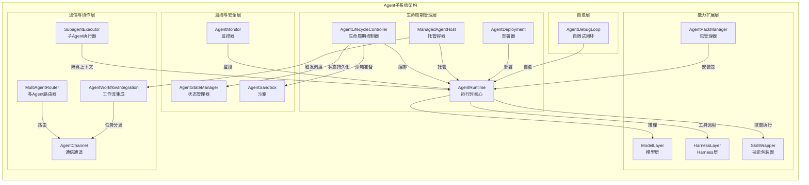
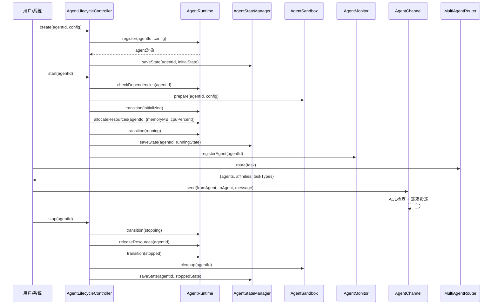
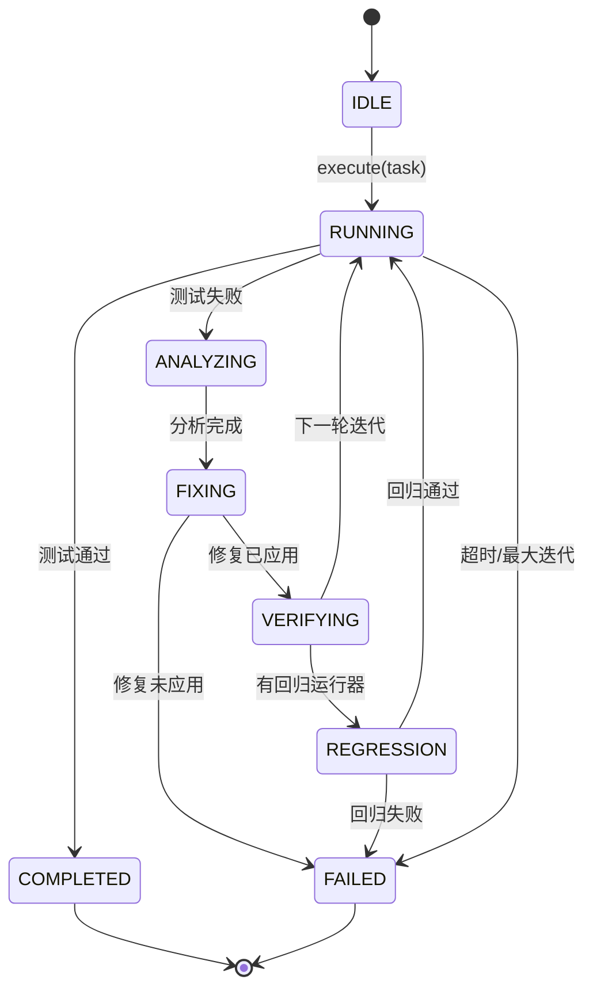
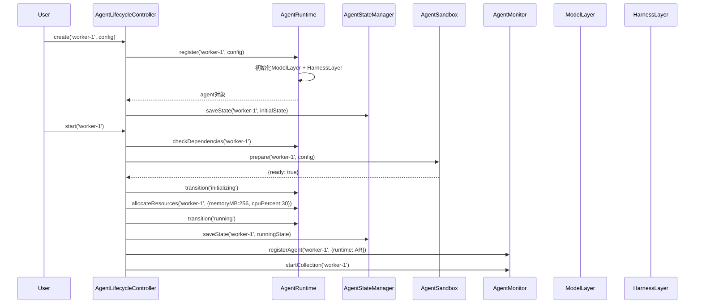
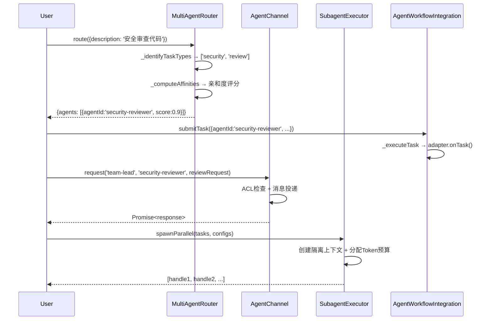
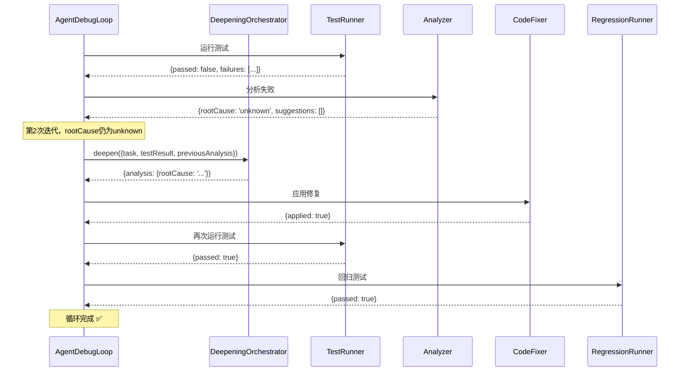
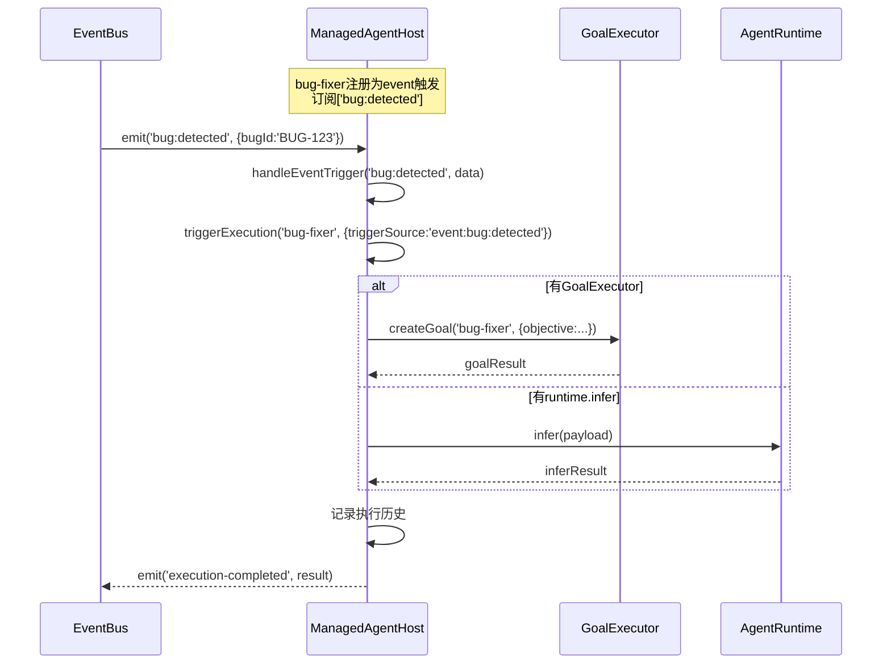

# 模块详解 — Agent子系统

> Harness Engineering 多Agent框架 2.73.4
> 子系统路径：`src/runtime/agent/`
> 模块数量：16个核心模块
> 文档版本：2.32.2 | 最后更新：2026-06-04

---

## 目录

- [1. 架构概览](#1-架构概览)
  - [1.1 子系统定位](#11-子系统定位)
  - [1.2 架构图](#12-架构图)
  - [1.3 数据流图](#13-数据流图)
  - [1.4 模块清单](#14-模块清单)
- [2. AgentRuntime — Agent运行时核心](#2-agentruntime--agent运行时核心)
- [3. AgentLifecycleController — Agent生命周期控制器](#3-agentlifecyclecontroller--agent生命周期控制器)
- [4. AgentMonitor — Agent监控器](#4-agentmonitor--agent监控器)
- [5. AgentDeployment — Agent部署器](#5-agentdeployment--agent部署器)
- [6. AgentChannel — Agent通信通道](#6-agentchannel--agent通信通道)
- [7. AgentPackManager — Agent包管理器](#7-agentpackmanager--agent包管理器)
- [8. AgentSandbox — Agent沙箱](#8-agentsandbox--agent沙箱)
- [9. AgentStateManager — Agent状态管理器](#9-agentstatemanager--agent状态管理器)
- [10. AgentWorkflowIntegration — Agent工作流集成](#10-agentworkflowintegration--agent工作流集成)
- [11. MultiAgentRouter — 多Agent路由器](#11-multiagentrouter--多agent路由器)
- [12. SubagentExecutor — 子Agent执行器](#12-subagentexecutor--子agent执行器)
- [13. AgentDebugLoop — Agent自调试闭环](#13-agentdebugloop--agent自调试闭环)
- [14. ManagedAgentHost — 托管Agent运行容器](#14-managedagenthost--托管agent运行容器)
- [15. ModelLayer — 模型层](#15-modellayer--模型层)
- [16. HarnessLayer — Harness层](#16-harnesslayer--harness层)
- [17. SkillWrapper — 技能包装器](#17-skillwrapper--技能包装器)
- [18. 跨模块协作模式](#18-跨模块协作模式)

---

## 1. 架构概览

### 1.1 子系统定位

Agent子系统是Harness Engineering多Agent框架的**核心执行层**，负责Agent的完整生命周期管理——从创建、初始化、运行到销毁，以及Agent间的通信、协作、调度和监控。该子系统实现了"Brain-Hands-Memory"分离原则：

- **Brain**：AgentRuntime + ModelLayer — Agent的推理和决策核心
- **Hands**：HarnessLayer + SkillWrapper — Agent与外部系统的交互能力
- **Memory**：AgentStateManager — Agent状态的持久化和恢复

关键设计理念：
- **状态机驱动**：Agent生命周期通过严格的状态机管理，所有状态转换必须符合预定义规则
- **资源池化**：内存和CPU资源通过共享池统一分配和回收
- **有界数据结构**：所有历史记录、缓存和队列均使用BoundedArray/BoundedMap，防止内存泄漏
- **原子持久化**：通过writeAtomic确保状态写入的原子性，防止崩溃导致数据损坏
- **优雅关闭**：所有模块通过withShutdown混入实现统一的优雅关闭协议

### 1.2 架构图



### 1.3 数据流图



### 1.4 模块清单

| 模块 | 文件 | 核心职责 |
|------|------|---------|
| AgentRuntime | agent-runtime.js | Agent运行时核心，生命周期管理、状态转换、资源分配 |
| AgentLifecycleController | agent-lifecycle-controller.js | 生命周期编排，操作锁、审计追踪 |
| AgentMonitor | agent-monitor.js | 实时监控、指标采集、反模式检测、推诿检测 |
| AgentDeployment | agent-deployment.js | 多环境部署、灰度发布、回滚机制 |
| AgentChannel | agent-channel.js | Agent间通信、消息路由、共享状态、提案投票 |
| AgentPackManager | agent-pack-manager.js | 能力包安装/卸载、依赖解析、版本兼容 |
| AgentSandbox | agent-sandbox.js | 资源隔离、权限限制、违规追踪 |
| AgentStateManager | agent-state-manager.js | 状态持久化、快照/恢复、校验和验证 |
| AgentWorkflowIntegration | agent-workflow-integration.js | 工作流集成、任务分发、反馈驱动重试 |
| MultiAgentRouter | multi-agent-router.js | 任务路由、亲和度评分、协作模式推荐 |
| SubagentExecutor | subagent-executor.js | 子Agent生成/取消、隔离上下文、Token预算 |
| AgentDebugLoop | agent-debug-loop.js | 自调试闭环、测试→分析→修复→验证循环 |
| ManagedAgentHost | managed-agent-host.js | 托管容器、4种触发模式、HMAC签名验证 |
| ModelLayer | model-layer.js | LLM模型调用抽象、领域提示词、Few-Shot注入 |
| HarnessLayer | harness-layer.js | 工具注册、安全护栏、审批门 |
| SkillWrapper | skill-wrapper.js | 技能谓词发明/桥接/验证 |

---

## 2. AgentRuntime — Agent运行时核心

### 概述

AgentRuntime是Agent子系统的**核心引擎**，管理Agent的完整生命周期——从注册到销毁。它维护一个共享资源池（内存/CPU），所有Agent的资源分配和回收都通过该池进行。Agent状态遵循严格的状态机规则，所有转换必须符合`VALID_TRANSITIONS`定义。

### 核心职责

- Agent注册/注销，最大200个Agent容量（超出自动淘汰最旧）
- 状态机驱动的状态转换（8种状态、严格转换规则）
- 共享资源池管理（内存/CPU分配与回收）
- 依赖检查（Agent间依赖关系验证）
- 防抖持久化到`.harness/agents-runtime/`
- 提示词构建器注入（attachPromptBuilder/buildPrompt）

### 类定义与接口

```javascript
const AgentRuntime = require('./src/runtime/agent/agent-runtime');

// 静态常量
AgentRuntime.STATES          // AGENT_STATES枚举
AgentRuntime.VALID_TRANSITIONS // 合法状态转换映射
AgentRuntime.DEFAULT_RESOURCE_LIMITS // {maxMemoryMB:512, maxCpuPercent:80, ...}
AgentRuntime.MAX_AGENTS      // 200

class AgentRuntime extends EventEmitter {
  constructor(projectRoot, options)
  // options: { totalMemoryMB, model, harness }

  // --- Agent管理 ---
  register(agentId, config)          // 注册新Agent
  unregister(agentId)                // 同步注销
  unregisterAsync(agentId)           // 异步注销
  get(agentId)                       // 获取Agent浅拷贝
  getStatus(agentId)                 // 轻量状态摘要
  listAgents(filter)                 // 列出Agent（支持state/version过滤）
  getStats()                         // 聚合统计

  // --- 状态转换 ---
  transition(agentId, newState, reason) // 状态转换（严格校验）

  // --- 资源管理 ---
  allocateResources(agentId, resources) // 分配{memoryMB, cpuPercent}
  releaseResources(agentId)             // 释放资源
  getResourcePool()                     // 资源池快照

  // --- 依赖与版本 ---
  checkDependencies(agentId)         // 检查依赖是否满足
  setVersion(agentId, version)       // 设置版本号
  incrementTaskCount(agentId)        // 递增任务计数

  // --- 错误处理 ---
  setError(agentId, errorInfo)       // 设置错误信息

  // --- 提示词 ---
  attachPromptBuilder(promptBuilder) // 注入PromptBuilder
  buildPrompt(agentId, context)      // 构建系统提示词

  // --- 持久化 ---
  flush()                            // 立即刷盘
}
```

### 关键方法详解

#### register(agentId, config)

注册新Agent到运行时。当Agent数量达到上限（200）时，自动淘汰最旧的`stopped`或`created`状态Agent。

```javascript
const agent = runtime.register('worker-1', {
  version: '1.0.0',
  dependencies: ['team-lead'],
  resourceLimits: { maxMemoryMB: 256, maxCpuPercent: 40 },
  metadata: { role: 'implementation' },
});
// 返回: { id, state:'created', config, version, dependencies, createdAt, ... }
```

#### transition(agentId, newState, reason)

状态转换，严格校验合法性。转换过程中使用`_transitionLocks`防止并发冲突。

```javascript
// 合法转换路径示例：
// created → initializing → running → paused → running → stopping → stopped
runtime.transition('worker-1', 'initializing', 'Starting agent');
runtime.transition('worker-1', 'running', 'Agent ready');
// 非法转换将抛出 AgentError('INVALID_TRANSITION')
```

#### allocateResources(agentId, resources)

从共享资源池分配内存和CPU。使用`_allocating`标志防止并发分配。

```javascript
runtime.allocateResources('worker-1', { memoryMB: 256, cpuPercent: 30 });
// 资源池自动更新: usedMemoryMB += deltaMem, usedCpuPercent += deltaCpu
// 超出池容量时抛出 AgentError('RESOURCE_EXHAUSTED')
```

### 配置选项

| 选项 | 类型 | 默认值 | 说明 |
|------|------|--------|------|
| totalMemoryMB | number | 4096 | 资源池总内存预算（MB） |
| model | Object | {} | ModelLayer配置 |
| harness | Object | {} | HarnessLayer配置 |

### 事件

| 事件名 | 载荷 | 说明 |
|--------|------|------|
| agent-registered | {agentId, agent} | Agent注册成功 |
| agent-unregistered | {agentId} | Agent注销完成 |
| agent-state-change | {agentId, from, to, reason} | 状态转换 |
| resource-allocated | {agentId, resources} | 资源分配 |
| version-changed | {agentId, version} | 版本变更 |
| persist-error | {agentId, error} | 持久化失败 |

### 错误处理

| 错误码 | 场景 |
|--------|------|
| INVALID_AGENT_ID | agentId格式无效 |
| AGENT_EXISTS | Agent已注册 |
| RESOURCE_EXHAUSTED | 资源池耗尽 |
| AGENT_NOT_FOUND | Agent不存在 |
| INVALID_TRANSITION | 非法状态转换 |
| TRANSITION_IN_PROGRESS | 并发转换冲突 |
| RESOURCE_BUSY | 并发资源分配 |

### 使用示例

```javascript
const AgentRuntime = require('./src/runtime/agent/agent-runtime');

const runtime = new AgentRuntime('/project/root', { totalMemoryMB: 8192 });

// 注册并启动Agent
const agent = runtime.register('code-reviewer', {
  version: '2.0.0',
  dependencies: ['team-lead'],
  resourceLimits: { maxMemoryMB: 512, maxCpuPercent: 60 },
});

runtime.transition('code-reviewer', 'initializing');
runtime.allocateResources('code-reviewer', { memoryMB: 256, cpuPercent: 30 });
runtime.transition('code-reviewer', 'running');

// 检查依赖
const deps = runtime.checkDependencies('code-reviewer');
// { satisfied: true/false, missing: [], unavailable: [] }

// 构建提示词
runtime.attachPromptBuilder(promptBuilder);
const prompt = runtime.buildPrompt('code-reviewer', { task: 'review PR #42' });

// 监听状态变更
runtime.on('agent-state-change', ({ agentId, from, to }) => {
  console.log(`${agentId}: ${from} → ${to}`);
});

// 优雅关闭
runtime.shutdown();
```

---

## 3. AgentLifecycleController — Agent生命周期控制器

### 概述

AgentLifecycleController是Agent生命周期的**编排层**，封装了AgentRuntime、AgentStateManager和AgentSandbox的协作逻辑。它通过操作锁（`_operationLocks`）防止并发生命周期操作，并通过`_operationHistory`（BoundedArray, 上限1000）记录完整操作审计追踪。

### 核心职责

- 编排Agent的7种生命周期操作（create/start/pause/resume/stop/destroy/restart）
- 操作锁防止并发生命周期冲突（超时自动释放）
- 重启时自动回滚（restart失败时恢复到之前状态）
- 操作历史审计追踪

### 类定义与接口

```javascript
const AgentLifecycleController = require('./src/runtime/agent/agent-lifecycle-controller');

AgentLifecycleController.OPERATIONS // LIFECYCLE_OPERATIONS枚举

class AgentLifecycleController extends EventEmitter {
  constructor(runtime, stateManager, sandbox)

  // --- 生命周期操作 ---
  create(agentId, config)    // 创建Agent
  start(agentId)             // 启动（检查依赖+沙箱+分配资源）
  pause(agentId)             // 暂停
  resume(agentId)            // 恢复
  stop(agentId, options)     // 停止（options.force跳过持久化）
  destroy(agentId)           // 销毁（先停止再注销）
  restart(agentId)           // 重启（失败自动回滚）

  // --- 查询 ---
  getStatus(agentId)         // Agent状态摘要
  getOperationHistory(agentId?, limit?) // 操作历史
}
```

### 关键方法详解

#### start(agentId)

启动Agent的完整流程：依赖检查 → 沙箱准备 → 状态转换(initializing) → 资源分配 → 状态转换(running)。任何步骤失败都会将Agent恢复到ERROR状态。

```javascript
const controller = new AgentLifecycleController(runtime, stateManager, sandbox);
controller.create('worker-1', { role: 'implementation' });

try {
  controller.start('worker-1');
  // 内部流程: checkDependencies → sandbox.prepare → transition(initializing)
  //           → allocateResources → transition(running)
} catch (err) {
  // 依赖不满足: AgentError('DEPENDENCY_UNSATISFIED')
  // 沙箱未就绪: AgentError('SANDBOX_NOT_READY')
}
```

#### restart(agentId)

重启Agent，先停止再启动。启动失败时自动回滚到之前状态（deepClone保存previousConfig）。

```javascript
controller.restart('worker-1');
// 内部: stop → start
// 失败回滚: transition(initializing) → allocateResources → transition(running)
// 回滚也失败: transition(error), emit('agent-restart-failed')
```

### 事件

| 事件名 | 说明 |
|--------|------|
| agent-created | Agent创建完成 |
| agent-started | Agent启动成功 |
| agent-paused | Agent暂停 |
| agent-resumed | Agent恢复运行 |
| agent-stopped | Agent停止 |
| agent-destroyed | Agent销毁 |
| agent-restarted | Agent重启成功 |
| agent-restart-rollback | 重启失败回滚 |
| agent-restart-failed | 重启和回滚均失败 |

### 使用示例

```javascript
const AgentLifecycleController = require('./src/runtime/agent/agent-lifecycle-controller');

const controller = new AgentLifecycleController(runtime, stateManager, sandbox);

// 完整生命周期
controller.create('analyst', { role: 'domain-analyst', version: '1.0.0' });
controller.start('analyst');
// ... Agent运行中 ...
controller.pause('analyst');
controller.resume('analyst');
controller.stop('analyst');
controller.destroy('analyst');

// 查询操作历史
const history = controller.getOperationHistory('analyst', 10);
// [{ agentId, operation, details, timestamp }, ...]
```

---

## 4. AgentMonitor — Agent监控器

### 概述

AgentMonitor提供Agent的**实时监控能力**，采集6类指标（CPU/内存/响应时间/任务数/错误率/吞吐量），检测阈值告警，并内置5条反模式规则引擎。还实现了推诿检测（defer率分析+循环推诿DFS检测），用于识别"甩锅"Agent。

### 核心职责

- 6类指标采集与阈值告警（warning/critical两级）
- 5条内置反模式规则（过度实现/重复搜索/跳过验证/过度重试/范围蔓延）
- 推诿检测（defer率分析+循环推诿DFS）
- 行为上下文追踪与反模式检测
- 定时自动采集（startCollection/stopCollection）
- 仪表盘数据聚合

### 类定义与接口

```javascript
const AgentMonitor = require('./src/runtime/agent/agent-monitor');

AgentMonitor.METRIC_TYPES      // {CPU, MEMORY, RESPONSE_TIME, TASK_COUNT, ERROR_RATE, THROUGHPUT, CUSTOM}
AgentMonitor.ALERT_LEVELS      // {INFO, WARNING, CRITICAL}
AgentMonitor.DEFAULT_THRESHOLDS // 默认告警阈值

class AgentMonitor extends EventEmitter {
  constructor(projectRoot, options)

  // --- Agent管理 ---
  registerAgent(agentId, options)  // 注册到监控（options.runtime用于自动采集）
  unregisterAgent(agentId)         // 注销

  // --- 指标采集 ---
  recordMetric(agentId, type, value, metadata) // 记录单条指标
  recordMetrics(agentId, metrics)               // 批量记录
  getMetrics(agentId, options)                  // 获取指标数据

  // --- 告警 ---
  setThreshold(metricName, warning, critical) // 设置阈值
  getThresholds()                             // 获取阈值配置
  getAlerts(options)                          // 获取告警列表

  // --- 日志 ---
  logEvent(agentId, level, message, data) // 记录日志事件
  getLogs(agentId, options)               // 获取日志

  // --- 反模式检测 ---
  recordBehavior(agentId, behaviorData)   // 记录行为数据
  getBehaviorContext(agentId)             // 获取行为上下文
  detectAntipatterns(agentId, behaviorContext?) // 检测反模式
  getAntipatternRules()                   // 获取规则列表

  // --- 推诿检测 ---
  detectShirking(interactionLog) // 检测推诿行为

  // --- 自动采集 ---
  startCollection(agentId)  // 启动定时采集
  stopCollection(agentId)   // 停止定时采集

  // --- 仪表盘 ---
  getDashboardData() // 仪表盘数据
  getStats()         // 统计摘要
}
```

### 内置反模式规则

| 规则ID | 名称 | 检测条件 | 严重度 | 建议 |
|--------|------|---------|--------|------|
| over-implementation | 过度实现 | newFileCount>3 或 addedLines>300 或 newAbstractions>3 | warning | 触发necessity-review |
| repeated-search | 重复搜索 | searchCount>=3 且 uniqueSearchTargets < searchCount*0.5 | info | 使用搜索缓存 |
| skip-verification | 跳过验证 | claimedComplete=true 且 verificationRan=false | critical | 必须执行verification |
| excessive-retries | 过度重试 | retryCount>3 | warning | 分析根因，考虑升级 |
| scope-creep | 范围蔓延 | filesModified>5 且 taskRelatedFiles < filesModified*0.5 | warning | 检查修改范围 |

### 配置选项

| 选项 | 类型 | 默认值 | 说明 |
|------|------|--------|------|
| thresholds | Object | DEFAULT_THRESHOLDS | 自定义告警阈值 |
| collectionIntervalMs | number | 5000 | 指标采集间隔 |
| orientCallbacks | Object | {} | 关键告警定向回调 |

### 默认告警阈值

```javascript
{
  cpuPercent:     { warning: 70, critical: 90 },
  memoryMB:       { warning: 400, critical: 480 },
  responseTimeMs: { warning: 5000, critical: 10000 },
  errorRate:      { warning: 0.05, critical: 0.1 },
}
```

### 事件

| 事件名 | 说明 |
|--------|------|
| alert | 告警触发 |
| critical-alert | 严重告警 |
| antipattern-detected | 反模式检测 |
| metric-recorded | 指标记录 |
| behavior-recorded | 行为记录 |
| collection-started/stopped | 采集启停 |

### 使用示例

```javascript
const AgentMonitor = require('./src/runtime/agent/agent-monitor');

const monitor = new AgentMonitor('/project/root', {
  thresholds: { cpuPercent: { warning: 60, critical: 85 } },
  orientCallbacks: {
    cpuPercent: (alert) => console.log('CPU告警:', alert),
  },
});

// 注册Agent并启动自动采集
monitor.registerAgent('worker-1', { runtime: agentRuntime });
monitor.startCollection('worker-1');

// 手动记录指标
monitor.recordMetric('worker-1', 'cpu', 75);
monitor.recordMetric('worker-1', 'memory', 300);
monitor.recordMetrics('worker-1', { error_rate: 0.03, throughput: 120 });

// 记录行为并检测反模式
monitor.recordBehavior('worker-1', {
  newFileCount: 5,
  addedLines: 400,
  claimedComplete: true,
  verificationRan: false,
});
const patterns = monitor.detectAntipatterns('worker-1');
// [{ id: 'over-implementation', severity: 'warning', ... },
//  { id: 'skip-verification', severity: 'critical', ... }]

// 推诿检测
const shirkingResult = monitor.detectShirking(interactionLog);
// { detected: true, shirkingAgents: [...], circularPatterns: [...] }
```

---

## 5. AgentDeployment — Agent部署器

### 概述

AgentDeployment管理Agent的**多环境部署**，支持4种部署策略（滚动更新/蓝绿部署/金丝雀发布/重建），4种环境（development/testing/staging/production），以及自动回滚机制。部署记录持久化到`.harness/deployments/`。

### 核心职责

- 多环境部署（development/testing/staging/production）
- 4种部署策略（rolling/blue-green/canary/recreate）
- 自动版本号递增
- 失败自动回滚（回滚深度限制为2层）
- 环境锁定/解锁
- 版本注册表管理

### 类定义与接口

```javascript
const AgentDeployment = require('./src/runtime/agent/agent-deployment');

AgentDeployment.ENVIRONMENTS  // {DEVELOPMENT, TESTING, STAGING, PRODUCTION}
AgentDeployment.STRATEGIES    // {ROLLING, BLUE_GREEN, CANARY, RECREATE}
AgentDeployment.STATES        // {PENDING, PREPARING, DEPLOYING, VERIFYING, COMPLETED, FAILED, ROLLED_BACK}

class AgentDeployment extends EventEmitter {
  constructor(projectRoot, options)

  deploy(agentId, targetEnv, options)  // 部署Agent到目标环境
  rollback(deploymentId, options)      // 回滚部署

  getDeployment(deploymentId)          // 获取部署记录
  listDeployments(filter)              // 列出部署记录

  getEnvironmentState(env)             // 获取环境状态
  lockEnvironment(env)                 // 锁定环境
  unlockEnvironment(env)               // 解锁环境

  registerVersion(agentId, version, info) // 注册版本
  getVersionHistory(agentId)              // 版本历史

  flush()    // 持久化所有记录
  getStats() // 统计摘要
}
```

### 部署策略对比

| 策略 | 说明 | 适用场景 |
|------|------|---------|
| rolling | 滚动更新，直接替换 | 常规更新 |
| blue-green | 蓝绿部署，标记active | 零停机切换 |
| canary | 金丝雀发布，指定流量百分比 | 渐进式发布 |
| recreate | 重建，先删除再创建 | 重大变更 |

### 部署选项

| 选项 | 类型 | 默认值 | 说明 |
|------|------|--------|------|
| strategy | string | 'rolling' | 部署策略 |
| version | string | 自动递增 | 版本号 |
| canaryPercent | number | 0 | 金丝雀流量百分比(0-100) |
| rollbackOnFailure | boolean | true | 失败自动回滚 |
| metadata | Object | {} | 部署元数据 |

### 事件

| 事件名 | 说明 |
|--------|------|
| deployment-completed | 部署成功 |
| deployment-failed | 部署失败 |
| deployment:rolled-back | 回滚完成 |
| deployment:rollback-failed | 回滚失败 |
| environment-locked/unlocked | 环境锁定/解锁 |
| version-registered | 版本注册 |

### 使用示例

```javascript
const AgentDeployment = require('./src/runtime/agent/agent-deployment');

const deployment = new AgentDeployment('/project/root');

// 金丝雀发布到生产环境
const record = deployment.deploy('code-reviewer', 'production', {
  strategy: 'canary',
  canaryPercent: 10,
  version: '2.1.0',
  rollbackOnFailure: true,
});

// 查看部署状态
deployment.getDeployment(record.id);
// { id, agentId, version, targetEnv, strategy, state, ... }

// 手动回滚
deployment.rollback(record.id, { reason: '性能回归' });

// 环境管理
deployment.lockEnvironment('production');
deployment.unlockEnvironment('production');
```

---

## 6. AgentChannel — Agent通信通道

### 概述

AgentChannel提供Agent间的**通信基础设施**，支持消息路由、结果发布、请求-响应通信、共享状态管理、通信ACL访问控制和提案-投票协商机制。所有数据结构均有界，防止内存泄漏。

### 核心职责

- 结果发布与查询（按Agent/技能/上游依赖）
- 消息发送与邮箱管理（优先级队列+溢出淘汰）
- 请求-响应通信（超时机制+容量限制）
- 共享状态管理（写锁串行化+乐观并发控制）
- 通信ACL（访问控制列表+通配符）
- 提案-投票协商机制
- 上下文包传递与新鲜度验证

### 类定义与接口

```javascript
const AgentChannel = require('./src/runtime/agent/agent-channel');
AgentChannel.MESSAGE_PRIORITIES // {HIGH, NORMAL, LOW}

class AgentChannel extends EventEmitter {
  constructor(options)

  // --- 结果管理 ---
  publishResult(agentId, skillId, result) // 发布执行结果
  getResult(agentId, skillId)             // 获取结果
  getResultsBySkill(skillId)              // 按技能查询
  getResultsByAgent(agentId)              // 按Agent查询
  getUpstreamResults(skillId, dependsOn)  // 获取上游依赖结果

  // --- 消息通信 ---
  send(fromAgentId, toAgentId, message, options) // 发送消息
  broadcast(agentId, message)                     // 广播
  onMessage(agentId, handler)                     // 注册消息处理器
  getMessages(agentId, limit)                     // 获取邮箱消息
  clearMessages(agentId)                          // 清空邮箱

  // --- 请求-响应 ---
  request(fromAgentId, toAgentId, message, timeout) // 发送请求（Promise）
  respond(requestId, fromAgentId, response)         // 响应请求

  // --- 共享状态 ---
  setShared(key, value, agentId)           // 设置共享状态
  getShared(key)                           // 获取共享状态
  setSharedWithVersion(key, value, agentId) // 乐观并发写入
  getSharedVersion(key)                    // 获取值和版本号
  getSharedKeys()                          // 获取所有键名
  removeShared(key)                        // 移除共享状态

  // --- ACL ---
  setCommunicationACL(agentId, allowedTargets) // 设置通信ACL
  removeCommunicationACL(agentId)              // 移除ACL

  // --- 提案投票 ---
  propose(agentId, topic, options) // 创建提案
  vote(proposalId, agentId, choice) // 投票
  closeProposal(proposalId)        // 关闭提案并统计
  getProposal(proposalId)          // 获取提案详情

  // --- 上下文 ---
  sendContext(fromAgentId, toAgentId, contextPacket) // 发送上下文包
  getContextMessages(agentId, limit)                  // 获取上下文消息
  createContextSnapshot(agentId, fields)              // 创建上下文快照
  validateContextFreshness(contextPacket, maxAgeMs)   // 验证上下文新鲜度

  // --- 管理 ---
  getStats() // 统计信息
  clear()    // 清空所有状态
}
```

### 使用示例

```javascript
const AgentChannel = require('./src/runtime/agent/agent-channel');

const channel = new AgentChannel({ maxResults: 200, maxShared: 100 });

// 设置通信ACL
channel.setCommunicationACL('worker-1', ['team-lead', 'analyst', '*']);

// 发布结果
channel.publishResult('worker-1', 'code-review', { issues: 3, approved: false });

// 请求-响应
const response = await channel.request('worker-1', 'analyst', {
  type: 'analysis_request', payload: { file: 'src/module.js' },
}, 30000);

// 共享状态（乐观并发控制）
const result = await channel.setSharedWithVersion('config', { debug: true }, 'worker-1');
// { success: true, version: 2 } 或 { success: false, reason: 'version_conflict' }

// 提案投票
const proposalId = channel.propose('team-lead', '部署策略', ['rolling', 'canary']);
channel.vote(proposalId, 'analyst', 'canary');
channel.vote(proposalId, 'worker-1', 'rolling');
const result = channel.closeProposal(proposalId);
// { proposalId, topic, tally: {canary:1, rolling:1}, winner: 'canary', totalVotes: 2 }
```

---

## 7. AgentPackManager — Agent包管理器

### 概述

AgentPackManager管理Agent**能力包**的安装、卸载和版本追踪。每个包包含agent定义（agent.md）、command定义（command.md）和skill模板（skills/），安装时自动部署到对应目录。支持SemVer版本兼容性检查。

### 核心职责

- 包发现与扫描（同步/异步）
- 包完整性校验（必需字段+版本格式）
- 依赖解析与版本兼容性检查（支持^/~/>=/<=等前缀）
- 安装/卸载/重安装
- 反向依赖检查（卸载时阻止被依赖的包）

### 类定义与接口

```javascript
const AgentPackManager = require('./src/runtime/agent/agent-pack-manager');

class AgentPackManager extends EventEmitter {
  constructor(projectRoot)

  discover()            // 同步扫描包目录
  discoverAsync()       // 异步扫描包目录
  list()                // 列出所有包
  listInstalled()       // 列出已安装包
  getPackInfo(packId)   // 获取包详情

  validatePack(packId)  // 验证包完整性
  install(packId)       // 安装包
  uninstall(packId)     // 卸载包
  reinstall(packId)     // 重新安装

  getStats()    // 统计信息
  isHealthy()   // 健康检查
}
```

### 包结构

```
.harness/agent-packs/my-pack/
├── pack.json          # 包清单 {id, name, version, description, dependencies}
├── agent.md           # Agent定义
├── command.md         # 命令定义
└── skills/            # 技能模板目录
    ├── review.md
    └── debug.md
```

### 事件

| 事件名 | 说明 |
|--------|------|
| pack-installed | 包安装成功 |
| pack-uninstalled | 包卸载 |
| pack-updated | 包更新 |

### 使用示例

```javascript
const AgentPackManager = require('./src/runtime/agent/agent-pack-manager');

const packManager = new AgentPackManager('/project/root');
packManager.discover();

// 查看可用包
const packs = packManager.list();
// [{ id, name, version, description, installed, ... }]

// 验证并安装
const validation = packManager.validatePack('code-review-pack');
if (validation.valid) {
  const result = packManager.install('code-review-pack');
  // { success: true, packId, version, installedAt }
}
```

---

## 8. AgentSandbox — Agent沙箱

### 概述

AgentSandbox提供Agent的**执行沙箱**，通过三级隔离策略（strict/moderate/permissive）控制文件系统、网络、子进程和模块访问。支持路径校验、违规追踪与自动撤销（达到违规上限后沙箱自动revoke）。

### 核心职责

- 三级隔离策略（strict/moderate/permissive）
- 资源访问权限检查（filesystem/network/child_process/env/module）
- 文件路径安全校验（阻止访问受限路径）
- 违规追踪与自动撤销
- 自定义策略覆盖
- 访问日志记录

### 类定义与接口

```javascript
const AgentSandbox = require('./src/runtime/agent/agent-sandbox');

AgentSandbox.LEVELS          // {STRICT, MODERATE, PERMISSIVE}
AgentSandbox.DEFAULT_POLICIES // 三级默认策略

class AgentSandbox extends EventEmitter {
  constructor(projectRoot, options)

  prepare(agentId, config)                    // 准备沙箱环境
  cleanup(agentId)                            // 清理沙箱
  checkAccess(agentId, resource, action)      // 检查访问权限
  validatePath(agentId, filePath)             // 验证文件路径
  setCustomPolicy(agentId, policyOverrides)   // 设置自定义策略

  getSandbox(agentId)   // 获取沙箱实例
  getPolicy(agentId)    // 获取当前策略
  getAccessLog(agentId, options) // 获取访问日志
  getStats()            // 统计信息
}
```

### 三级隔离策略

| 维度 | strict | moderate | permissive |
|------|--------|----------|------------|
| allowFileSystem | ❌ | ✅ | ✅ |
| allowNetwork | ❌ | ❌ | ✅ |
| allowChildProcess | ❌ | ❌ | ✅ |
| allowEnvAccess | ❌ | ✅ | ✅ |
| allowReadFiles | ❌ | ✅ | ✅ |
| allowWriteFiles | ❌ | ❌ | ✅ |
| maxMemoryMB | 128 | 256 | 512 |
| maxCpuPercent | 30 | 50 | 80 |
| blockedModules | child_process,fs,net,... | child_process,cluster | (无) |

### 事件

| 事件名 | 说明 |
|--------|------|
| sandbox-prepared | 沙箱准备完成 |
| access-denied | 访问被拒绝 |
| sandbox-violation-limit | 违规次数达到上限 |
| policy-updated | 策略更新 |
| sandbox-evicted | 沙箱被淘汰 |

### 使用示例

```javascript
const AgentSandbox = require('./src/runtime/agent/agent-sandbox');

const sandbox = new AgentSandbox('/project/root', { defaultLevel: 'moderate' });

// 为Agent准备strict级别沙箱
sandbox.prepare('security-agent', {
  sandboxLevel: 'strict',
  maxViolations: 5,
});

// 检查访问权限
const result = sandbox.checkAccess('security-agent', 'filesystem', 'write');
// { allowed: false, reason: 'File write access denied by sandbox policy' }

// 验证文件路径
const pathResult = sandbox.validatePath('security-agent', '/project/root/.env');
// { valid: false, reason: 'Access to restricted path' }

// 动态调整策略
sandbox.setCustomPolicy('security-agent', { allowReadFiles: true, maxMemoryMB: 256 });
```

---

## 9. AgentStateManager — Agent状态管理器

### 概述

AgentStateManager提供Agent状态的**持久化与恢复**能力，支持SHA-256校验和验证、快照创建/恢复、异步周期性持久化、状态同步/合并。状态数据持久化到`.harness/agent-states/`，快照到`.harness/agent-snapshots/`。

### 核心职责

- 状态保存与加载（SHA-256校验和验证）
- 快照创建/恢复/删除（每Agent最多50个快照）
- 异步周期性持久化（可配置间隔）
- 状态同步/合并（远程数据合并，过滤危险键）
- 状态大小限制（1MB per Agent）

### 类定义与接口

```javascript
const AgentStateManager = require('./src/runtime/agent/agent-state-manager');

class AgentStateManager extends EventEmitter {
  constructor(projectRoot, options)

  saveState(agentId, stateData, options)   // 保存状态
  loadState(agentId)                       // 加载状态
  deleteState(agentId)                     // 删除状态（含快照）
  hasState(agentId)                        // 检查状态是否存在

  createSnapshot(agentId, label)           // 创建快照
  restoreSnapshot(agentId, snapshotId)     // 从快照恢复
  listSnapshots(agentId)                   // 列出快照
  deleteSnapshot(agentId, snapshotId)      // 删除快照

  syncState(agentId, remoteData)           // 同步远程状态
  listAgents()                             // 列出所有Agent
  getStateInfo(agentId)                    // 状态元信息
  getStats()                               // 统计信息
  flush()                                  // 立即持久化
}
```

### 使用示例

```javascript
const AgentStateManager = require('./src/runtime/agent/agent-state-manager');

const stateManager = new AgentStateManager('/project/root', { persistInterval: 10000 });

// 保存状态
const entry = stateManager.saveState('worker-1', {
  state: 'running',
  config: { role: 'implementation' },
  progress: 75,
}, { immediate: true });
// { agentId, data, checksum, updatedAt, createdAt, size }

// 创建快照
const snapshot = stateManager.createSnapshot('worker-1', 'before-refactor');
// { id, agentId, label, data, checksum, createdAt }

// 从快照恢复
stateManager.restoreSnapshot('worker-1', snapshot.id);

// 同步远程状态（合并）
stateManager.syncState('worker-1', { remoteConfig: { timeout: 30000 } });
```

---

## 10. AgentWorkflowIntegration — Agent工作流集成

### 概述

AgentWorkflowIntegration是Agent与工作流系统的**桥接层**，注册Agent适配器用于任务处理、事件响应和定时调度。管理任务生命周期（submit→queue→execute→feedback），支持5种触发类型、优先级队列处理和反馈驱动重试。

### 核心职责

- Agent适配器注册/注销
- 任务提交与执行（5种触发类型）
- 优先级队列处理
- 事件订阅与分发
- 定时调度管理
- 反馈驱动重试（success/partial/failure/timeout）

### 类定义与接口

```javascript
const AgentWorkflowIntegration = require('./src/runtime/agent/agent-workflow-integration');

AgentWorkflowIntegration.TRIGGER_TYPES  // {MANUAL, EVENT, SCHEDULE, DEPENDENCY, WEBHOOK}
AgentWorkflowIntegration.TASK_STATES    // {PENDING, QUEUED, RUNNING, COMPLETED, FAILED, CANCELLED, RETRYING}
AgentWorkflowIntegration.FEEDBACK_TYPES // {SUCCESS, PARTIAL, FAILURE, TIMEOUT}

class AgentWorkflowIntegration extends EventEmitter {
  constructor(projectRoot, options)

  // --- 适配器管理 ---
  registerAdapter(agentId, adapter)   // 注册适配器
  unregisterAdapter(agentId)          // 注销适配器
  getAdapter(agentId)                 // 获取适配器

  // --- 任务管理 ---
  submitTask(task)                    // 提交任务
  cancelTask(taskId)                  // 取消任务
  getTask(taskId)                     // 获取任务
  listTasks(filter)                   // 列出任务

  // --- 事件管理 ---
  subscribeEvent(agentId, eventType, handler) // 订阅事件
  emitEvent(eventType, data)                   // 分发事件

  // --- 调度管理 ---
  addSchedule(agentId, scheduleConfig) // 添加定时调度
  removeSchedule(scheduleId)           // 移除调度

  // --- 反馈 ---
  submitFeedback(taskId, feedback)     // 提交反馈
  getFeedbackHistory(filter)           // 反馈历史

  getStats() // 统计信息
}
```

### 使用示例

```javascript
const AgentWorkflowIntegration = require('./src/runtime/agent/agent-workflow-integration');

const workflow = new AgentWorkflowIntegration('/project/root');

// 注册适配器
workflow.registerAdapter('worker-1', {
  onTask: (task) => ({ success: true, data: processTask(task) }),
  onEvent: (event) => handleEvent(event),
  capabilities: ['implementation', 'debugging'],
  priority: 5,
});

// 提交任务
const task = workflow.submitTask({
  agentId: 'worker-1',
  type: 'code-review',
  payload: { file: 'src/module.js' },
  priority: 10,
  trigger: 'manual',
  maxRetries: 3,
});

// 提交反馈
workflow.submitFeedback(task.id, {
  type: 'success',
  result: { issues: 0, approved: true },
  message: 'Code review passed',
});

// 添加定时调度
workflow.addSchedule('worker-1', {
  intervalMs: 3600000,
  taskType: 'health-check',
  payload: { check: 'all' },
});
```

---

## 11. MultiAgentRouter — 多Agent路由器

### 概述

MultiAgentRouter是**任务到Agent的路由引擎**，基于能力亲和度评分、学习型亲和度更新和负载均衡调整选择最合适的Agent。内置16种Agent能力定义和10种任务类型信号映射，支持5种协作模式推荐和3种模型层级选择。

### 核心职责

- 基于能力的亲和度评分与Top-K选择
- 学习型亲和度更新（从执行反馈中学习）
- 负载均衡调整（1/(1+load)权重）
- 协作模式推荐（solo/hierarchical/pipeline/parallel/generator-verifier）
- 模型层级选择（high/medium/low）
- 动态Agent注册

### 类定义与接口

```javascript
const MultiAgentRouter = require('./src/runtime/agent/multi-agent-router');

MultiAgentRouter.AGENT_CAPABILITIES // 16种Agent能力定义
MultiAgentRouter.TASK_TYPE_SIGNALS  // 10种任务类型信号
MultiAgentRouter.AGENT_TIERS        // {CEO, SPECIALIST, WORKER}
MultiAgentRouter.MODEL_TIERS        // {HIGH, MEDIUM, LOW}

class MultiAgentRouter extends EventEmitter {
  constructor(options)

  route(task, availableAgents)                    // 路由任务到Agent
  registerAgent(agentId, capabilities)            // 注册动态Agent
  unregisterAgent(agentId)                        // 注销动态Agent
  getCapabilitiesForAgent(agentId)                // 获取Agent能力

  suggestCollaborationMode(task, availableAgents) // 推荐协作模式
  selectModelForTask(agentId, taskComplexity)     // 选择模型层级

  updateAffinity(agentId, taskType, delta) // 更新学习亲和度
  getAffinity(agentId, taskType)           // 获取亲和度

  recordAgentLoad(agentId, activeTaskCount) // 记录Agent负载
  getRoutingHistory(limit)                   // 路由历史
  getStats()                                 // 统计信息
}
```

### 内置Agent能力

**核心开发Agent（17个）：**

| Agent | 能力标签 | 层级 | 模型层级 |
|-------|---------|------|---------|
| team-lead | coordination, planning, dispatching | ceo | high |
| domain-analyst | analysis, design, review, architecture | specialist | high |
| task-worker | implementation, coding, debugging, testing | worker | medium |
| quality-assurance | testing, review, security, verification | specialist | medium |
| devops-engineer | deployment, infrastructure, monitoring | specialist | medium |
| technical-writer | documentation, knowledge, communication | specialist | low |
| code-reviewer | review, quality, standards | specialist | medium |
| security-reviewer | security, audit, compliance | specialist | medium |
| build-error-solver | debugging, build, dependency | worker | low |
| planner | planning, decomposition, estimation | specialist | medium |
| test-writer | testing, tdd, coverage | worker | low |
| typescript-reviewer | review, typescript, type-safety | specialist | low |
| python-reviewer | review, python, idiomatic | specialist | low |
| go-reviewer | review, go, concurrency | specialist | low |
| rust-reviewer | review, rust, safety | specialist | low |
| java-reviewer | review, java, enterprise | specialist | low |
| system-designer | architecture, design, review | specialist | high |

**业务领域Agent（8个，v2.29.0新增）：**

| Agent | 能力标签 | 作用域 | 模型层级 |
|-------|---------|--------|---------|
| data-analyst | analysis, statistics, visualization, pattern-recognition | data | medium |
| product-manager | planning, analysis, communication, prioritization | product | medium |
| ux-designer | design, empathy, creativity, usability | design | medium |
| seo-specialist | analysis, optimization, research, strategy | marketing | low |
| marketing-strategist | strategy, creativity, analysis, communication | marketing | medium |
| frontend-engineer | implementation, design, performance, testing | task | medium |
| backend-engineer | architecture, implementation, performance, security | task | medium |
| research-specialist | research, analysis, synthesis, critical-thinking | research | medium |

### 协作模式推荐逻辑

```javascript
// 1个Agent → solo
// CEO + Specialist/Worker → hierarchical
// Specialist + Worker → pipeline
// 3+ Agents → parallel
// review/security任务 → generator-verifier
// 默认 → pipeline
```

### 使用示例

```javascript
const MultiAgentRouter = require('./src/runtime/agent/multi-agent-router');

const router = new MultiAgentRouter({ topK: 3, minAffinity: 0.3 });

// 路由任务
const result = router.route({
  description: '审查代码安全漏洞',
  goal: 'security audit',
});
// { agents: [{agentId, score, capabilities}], affinities, taskTypes: ['security', 'review'] }

// 推荐协作模式
const mode = router.suggestCollaborationMode({ description: '实现新功能并审查代码' });
// 'pipeline' 或 'hierarchical'

// 学习型亲和度更新
router.updateAffinity('security-reviewer', 'security', 0.1);

// 负载感知路由
router.recordAgentLoad('task-worker', 5);
```

---

## 12. SubagentExecutor — 子Agent执行器

### 概述

SubagentExecutor管理子Agent的**完整执行生命周期**，支持隔离上下文创建、Token预算追踪、并发限制、并行执行和验证重试循环。通过7个attach*()方法注入依赖，实现灵活的组件组合。

### 核心职责

- 子Agent生成与取消（最大并发数限制）
- 隔离上下文创建（IsolatedContextManager）
- Token预算追踪与报告
- 并行执行（spawnParallel/executeParallel）
- 验证重试循环（executeWithVerification）
- 模型选择链（RBAC → ModelSelector → 默认模型）
- 搜索结果缓存（TTL过期+容量淘汰）
- Git工作树隔离（可选）

### 类定义与接口

```javascript
const SubagentExecutor = require('./src/runtime/agent/subagent-executor');

SubagentExecutor.STATUS         // {PENDING, RUNNING, COMPLETED, FAILED, CANCELLED}
SubagentExecutor.DEFAULT_CONFIG // 默认配置

class SubagentExecutor extends EventEmitter {
  constructor(options)

  // --- 依赖注入 ---
  attachSessionManager(sessionManager)   // Token预算追踪
  attachModelSelector(modelSelector)     // 模型选择
  attachRBACEnforcer(rbacEnforcer)       // RBAC模型覆盖
  attachAgentRuntime(agentRuntime)       // Agent运行时
  attachWorktreeManager(worktreeManager) // Git工作树隔离
  attachFoldProtocol(foldProtocol)       // 上下文折叠
  attachContextManager(contextManager)   // 上下文管理器

  // --- 执行 ---
  spawn(task, agentConfig)                          // 生成子Agent
  spawnParallel(tasks, agentConfigs)                // 批量生成
  executeParallel(tasks, agentConfigs, executeFn)   // 并行执行
  executeWithVerification(task, agentConfig, executeFn, verifyFn) // 验证重试

  // --- 控制 ---
  cancel(handleId)    // 取消子Agent
  cancelAll()         // 取消所有

  // --- 查询 ---
  getHandle(handleId)     // 获取句柄状态
  getActiveHandles()      // 获取所有活跃句柄
  getStats()              // 统计信息
  getTokenBudgetReport()  // Token预算报告

  // --- 缓存 ---
  cacheSearchResult(query, result)     // 缓存搜索结果
  getCachedSearchResult(query)         // 获取缓存

  isHealthy() // 健康检查
}
```

### 默认配置

```javascript
{
  maxConcurrent: 5,              // 最大并发子Agent数
  defaultTimeout: 120000,        // 默认超时(ms)
  maxSubagentsPerTask: 5,        // 单任务最大子Agent数
  tokenBudgetPerSubagent: 50000, // 每个子Agent Token预算
  enableResultStreaming: true,   // 结果流式传输
  enableAutoRetry: true,         // 自动重试
  maxRetries: 1,                 // 最大重试次数
  enableWorktreeIsolation: false, // Git工作树隔离
}
```

### 事件

| 事件名 | 说明 |
|--------|------|
| subagent-spawned | 子Agent生成 |
| subagent-started | 子Agent开始执行 |
| subagent-completed | 子Agent执行完成 |
| subagent-failed | 子Agent执行失败 |
| subagent-cancelled | 子Agent被取消 |
| subagent-retry | 子Agent重试 |
| spawn-rejected | 生成被拒绝 |

### 使用示例

```javascript
const SubagentExecutor = require('./src/runtime/agent/subagent-executor');

const executor = new SubagentExecutor({ maxConcurrent: 3 });
executor.attachSessionManager(sessionManager);
executor.attachModelSelector(modelSelector);
executor.attachRBACEnforcer(rbacEnforcer);

// 生成子Agent
const handle = await executor.spawn(
  { description: 'Review code for security vulnerabilities', sessionId: 'sess-1' },
  { agentId: 'security-reviewer', skillId: 'security-audit', tokenBudget: 30000 },
);

// 并行执行
const { results, errors } = await executor.executeParallel(
  [
    { description: 'Review module A' },
    { description: 'Review module B' },
  ],
  { agentId: 'code-reviewer' },
  async (task, handle) => performReview(task),
);

// 验证重试循环
const result = await executor.executeWithVerification(
  { description: 'Fix bug in parser' },
  { agentId: 'task-worker' },
  async (task) => fixBug(task),
  (output, task) => ({
    passed: runTests().allPassed,
    feedback: runTests().failures,
  }),
);
```

---

## 13. AgentDebugLoop — Agent自调试闭环

### 概述

AgentDebugLoop实现了**自主调试闭环**：运行测试 → 分析失败 → 修复代码 → 验证结果 → 回归测试。集成DeepeningOrchestrator进行复杂根因分析，强制超时保护，追踪完整迭代历史。

### 核心职责

- 自主调试循环（test→analyze→fix→verify→regression）
- DeepeningOrchestrator集成（第2次迭代后触发深度分析）
- 超时保护（默认5分钟）
- 迭代历史追踪（BoundedArray, 上限200）
- 回归测试防止修复引入新Bug

### 类定义与接口

```javascript
const { AgentDebugLoop, LOOP_STATES } = require('./src/runtime/agent/agent-debug-loop');

// LOOP_STATES: {IDLE, RUNNING, ANALYZING, FIXING, VERIFYING, REGRESSION, COMPLETED, FAILED}

class AgentDebugLoop extends EventEmitter {
  constructor(options)

  attachDeepeningOrchestrator(orchestrator) // 附加深化推理编排器

  execute(task) // 执行调试循环
  reset()       // 重置到空闲状态

  get state()     // 当前状态
  get iteration() // 当前迭代次数
  get history()   // 迭代历史
  getStats()      // 统计信息
}
```

### 配置选项

| 选项 | 类型 | 默认值 | 说明 |
|------|------|--------|------|
| maxIterations | number | 5 | 最大调试迭代次数 |
| timeoutMs | number | 300000 | 总超时时间(ms) |
| testRunner | Function | null | 测试运行器 |
| codeFixer | Function | null | 代码修复器 |
| analyzer | Function | null | 失败分析器 |
| regressionRunner | Function | null | 回归测试运行器 |
| deepeningOrchestrator | Object | null | DeepeningOrchestrator实例 |

### 调试循环流程



### 事件

| 事件名 | 说明 |
|--------|------|
| loop:start | 循环开始 |
| loop:complete | 循环成功完成 |
| loop:failed | 循环失败 |
| iteration:start | 迭代开始 |
| iteration:end | 迭代结束 |
| deepening:applied | 深化分析已应用 |
| deepening:failed | 深化分析失败 |

### 使用示例

```javascript
const { AgentDebugLoop } = require('./src/runtime/agent/agent-debug-loop');

const debugLoop = new AgentDebugLoop({
  maxIterations: 5,
  timeoutMs: 300000,
  testRunner: async (task) => {
    const result = await runNpmTest();
    return { passed: result.exitCode === 0, failures: result.failures };
  },
  analyzer: async (testResult, task) => {
    return { rootCause: testResult.failures[0].message, suggestions: [...] };
  },
  codeFixer: async (analysis, task) => {
    const fixApplied = await applyFix(analysis);
    return { applied: fixApplied };
  },
  regressionRunner: async (task) => {
    const result = await runFullTestSuite();
    return { passed: result.allPassed, failures: result.failures };
  },
});

debugLoop.attachDeepeningOrchestrator(deepeningOrchestrator);

const result = await debugLoop.execute({ description: 'Fix parser bug' });
// { success: true/false, iterations: 3, testResult, history }
```

---

## 14. ManagedAgentHost — 托管Agent运行容器

### 概述

ManagedAgentHost是**托管Agent运行容器**，融合自Claude Managed Agents的"托管服务"概念。支持4种触发模式（事件/定时/Webhook/即发即忘），HMAC-SHA256签名验证，执行超时保护，心跳监控，BoundedArray执行历史。

### 核心职责

- 4种触发模式（event/schedule/webhook/fire-and-forget）
- HMAC-SHA256签名验证（timingSafeEqual防时序攻击）
- 执行超时保护
- 心跳监控
- GoalExecutor/EventBus依赖注入
- 回溯事件订阅（attachEventBus后自动订阅已注册Agent）

### 类定义与接口

```javascript
const ManagedAgentHost = require('./src/runtime/agent/managed-agent-host');

ManagedAgentHost.TRIGGER_MODES    // {EVENT, SCHEDULE, WEBHOOK, FIRE_AND_FORGET}
ManagedAgentHost.HOST_STATES      // {IDLE, RUNNING, PAUSED, STOPPED, ERROR}
ManagedAgentHost.MAX_HOSTED_AGENTS // 50

class ManagedAgentHost extends EventEmitter {
  constructor(projectRoot, options)

  // --- Agent管理 ---
  registerAgent(agentId, config)  // 注册托管Agent
  unregisterAgent(agentId)        // 注销托管Agent
  startAgent(agentId)             // 启动Agent
  pauseAgent(agentId)             // 暂停Agent
  resumeAgent(agentId)            // 恢复Agent
  stopAgent(agentId)              // 停止Agent

  // --- 触发执行 ---
  triggerExecution(agentId, context)       // 触发执行
  handleWebhook(webhookPath, payload, signature, rawBody) // Webhook触发
  handleEventTrigger(eventType, eventData) // 事件触发

  // --- 查询 ---
  getAgentStatus(agentId)       // Agent状态
  listAgents()                  // 列出所有Agent
  getExecutionHistory(agentId, limit) // 执行历史
  getStats()                    // 统计信息

  // --- 依赖注入 ---
  attachGoalExecutor(executor)  // 注入GoalExecutor
  attachEventBus(bus)           // 注入EventBus
}
```

### 注册配置

| 字段 | 类型 | 必填 | 说明 |
|------|------|------|------|
| runtime | Object | ✅ | AgentRuntime实例 |
| triggerMode | string | 默认'event' | 触发模式 |
| schedule | Object | 定时模式必填 | {cron, intervalMs} |
| eventSubscriptions | string[] | 事件模式推荐 | 订阅的事件类型 |
| webhookPath | string | Webhook模式必填 | Webhook路径 |
| executionTimeoutMs | number | 默认300000 | 执行超时(ms) |
| metadata | Object | 可选 | 附加元数据 |

### Webhook签名验证

```javascript
// 服务端配置密钥
const host = new ManagedAgentHost('/project/root', {
  webhookSecret: 'my-secret-key',
});

// 客户端发送Webhook时计算签名
const crypto = require('crypto');
const signature = crypto.createHmac('sha256', 'my-secret-key')
  .update(JSON.stringify(payload))
  .digest('hex');

// 验证使用timingSafeEqual防止时序攻击
const result = await host.handleWebhook('/webhook/deploy', payload, signature, rawBody);
```

### 事件

| 事件名 | 说明 |
|--------|------|
| agent-registered/unregistered | Agent注册/注销 |
| agent-started/stopped/paused | Agent状态变更 |
| trigger-fired | 触发执行 |
| execution-completed | 执行完成 |
| execution-failed | 执行失败 |

### 使用示例

```javascript
const ManagedAgentHost = require('./src/runtime/agent/managed-agent-host');

const host = new ManagedAgentHost('/project/root', {
  maxHostedAgents: 20,
  executionTimeoutMs: 120000,
  webhookSecret: 'my-webhook-secret',
});

host.attachGoalExecutor(goalExecutor);
host.attachEventBus(eventBus);

// 注册事件触发Agent
host.registerAgent('bug-fixer', {
  runtime: agentRuntime,
  triggerMode: 'event',
  eventSubscriptions: ['bug:detected', 'ci:failed'],
});

// 注册定时Agent
host.registerAgent('health-checker', {
  runtime: agentRuntime,
  triggerMode: 'schedule',
  schedule: { intervalMs: 300000 },
});

// 注册Webhook Agent
host.registerAgent('deployer', {
  runtime: agentRuntime,
  triggerMode: 'webhook',
  webhookPath: '/webhook/deploy',
});

// 启动所有Agent
host.startAgent('bug-fixer');
host.startAgent('health-checker');
host.startAgent('deployer');

// 事件触发
eventBus.emit('bug:detected', { bugId: 'BUG-123', severity: 'high' });
```

---

## 15. ModelLayer — 模型层

### 概述

ModelLayer是AgentRuntime的**LLM模型调用抽象层**，管理LLM客户端连接、领域系统提示词注册、Few-Shot示例注入和推理调用。将消息与领域提示词和Few-Shot示例组装为完整请求序列，委托LLM客户端执行推理。

### 核心职责

- LLM客户端连接管理
- 领域系统提示词注册（最多50个领域）
- Few-Shot示例注入（最多50个领域）
- 推理调用（chat接口）
- 消息序列组装

### 类定义与接口

```javascript
const ModelLayer = require('./src/runtime/agent/model-layer');

class ModelLayer extends EventEmitter {
  constructor(config)

  attachLlmClient(client)                    // 附加LLM客户端
  registerDomainPrompt(domain, prompt)        // 注册领域提示词
  registerFewShots(domain, examples)          // 注册Few-Shot示例
  infer(messages, options)                    // 执行推理
  shutdown()                                  // 关闭
}
```

### 事件

| 事件名 | 说明 |
|--------|------|
| llm-client-attached | LLM客户端附加 |
| domain-prompt-registered | 领域提示词注册 |
| few-shots-registered | Few-Shot示例注册 |
| infer-completed | 推理完成 |
| infer-error | 推理错误 |

### 使用示例

```javascript
const ModelLayer = require('./src/runtime/agent/model-layer');

const modelLayer = new ModelLayer();
modelLayer.attachLlmClient(openaiClient);
modelLayer.registerDomainPrompt('code-review', 'You are an expert code reviewer...');
modelLayer.registerFewShots('code-review', [
  { role: 'user', content: 'Review this code...' },
  { role: 'assistant', content: 'I found 3 issues...' },
]);

const result = await modelLayer.infer(
  [{ role: 'user', content: 'Review src/module.js' }],
  { domain: 'code-review' },
);
```

---

## 16. HarnessLayer — Harness层

### 概述

HarnessLayer是AgentRuntime的**框架核心集成层**，管理工具注册、上下文读取器、安全护栏和审批门，作为Agent与外部系统交互的统一控制面。执行动作前依次通过护栏检查和审批门验证。

### 核心职责

- 工具注册表管理（最多100个工具）
- 上下文读取器（最多20个）
- 安全护栏链（最多20个）
- 审批门
- 动作执行（护栏→审批→工具调用）

### 类定义与接口

```javascript
const HarnessLayer = require('./src/runtime/agent/harness-layer');

class HarnessLayer extends EventEmitter {
  constructor(config)

  registerTool(name, tool)                    // 注册工具
  addContextReader(reader)                     // 添加上下文读取器
  addGuardrail(guardrail)                      // 添加安全护栏
  setApprovalGate(gate)                        // 设置审批门
  executeAction(action, params, context)       // 执行动作
  readContext(query)                           // 读取上下文
  shutdown()                                   // 关闭
}
```

### 事件

| 事件名 | 说明 |
|--------|------|
| tool-registered | 工具注册 |
| context-reader-added | 上下文读取器添加 |
| guardrail-added | 护栏添加 |
| approval-gate-set | 审批门设置 |
| action-blocked | 动作被护栏阻止 |
| action-denied | 动作被审批门拒绝 |
| action-completed | 动作完成 |
| action-error | 动作错误 |
| tool-not-found | 工具未找到 |

### 使用示例

```javascript
const HarnessLayer = require('./src/runtime/agent/harness-layer');

const harness = new HarnessLayer();

// 注册工具
harness.registerTool('file-read', { execute: (params) => fs.readFileSync(params.path, 'utf8') });
harness.registerTool('file-write', { execute: (params) => fs.writeFileSync(params.path, params.content) });

// 添加安全护栏
harness.addGuardrail({
  check: (action, params) => {
    if (action === 'file-write' && params.path.includes('.env')) {
      return { allowed: false, reason: 'Cannot write to .env files' };
    }
    return { allowed: true };
  },
});

// 设置审批门
harness.setApprovalGate({
  approve: (action, params) => {
    if (action === 'file-write') return requireHumanApproval(params);
    return true;
  },
});

// 执行动作
const result = await harness.executeAction('file-read', { path: 'src/module.js' }, context);
```

---

## 17. SkillWrapper — 技能包装器

### 概述

SkillWrapper是**技能谓词包装器**，从视觉输入和任务上下文中发明、桥接和验证谓词（空间/属性/关系/时间/存在性），为深化推理管道提供结构化谓词提取和推理链生成。维护谓词缓存以加速重复输入处理。

### 核心职责

- 谓词发明（从视觉输入提取元素/空间/描述谓词）
- 谓词桥接（连接不同类型谓词形成推理链）
- 谓词验证（检查一致性和置信度）
- 谓词缓存（加速重复输入处理）

### 类定义与接口

```javascript
const SkillWrapper = require('./src/runtime/agent/skill-wrapper');

// PREDICATE_TYPES: {SPATIAL, ATTRIBUTE, RELATIONAL, TEMPORAL, EXISTENTIAL}

class SkillWrapper extends EventEmitter {
  constructor(options)

  inventPredicates(visualInput, taskContext)  // 发明谓词
  bridgePredicates(predicates, targetSchema)  // 桥接谓词
  validatePredicates(predicates)              // 验证谓词
  getStats()                                  // 统计信息
}
```

### 配置选项

| 选项 | 类型 | 默认值 | 说明 |
|------|------|--------|------|
| maxPredicates | number | 20 | 最大谓词数量 |
| minConfidence | number | 0.5 | 最低置信度阈值 |
| maxBridgeDepth | number | 3 | 最大桥接深度 |

### 事件

| 事件名 | 说明 |
|--------|------|
| predicates-invented | 谓词发明完成 |
| predicates-bridged | 谓词桥接完成 |
| predicates-validated | 谓词验证完成 |

---

## 18. 跨模块协作模式

### 18.1 Agent完整启动流程



### 18.2 多Agent协作流程



### 18.3 自调试闭环流程



### 18.4 托管Agent触发流程



---

## 附录A：Agent状态机完整转换表

| 当前状态 | 可转换到 | 说明 |
|---------|---------|------|
| created | initializing, destroyed | 新创建，等待初始化 |
| initializing | running, error, destroyed | 初始化中 |
| running | paused, stopping, error | 运行中 |
| paused | running, stopping, error | 已暂停 |
| stopping | stopped, error | 停止中 |
| stopped | initializing, destroyed | 已停止 |
| error | initializing, destroyed | 错误状态 |
| destroyed | (无) | 已销毁（终态） |

## 附录B：错误码速查表

| 错误码 | 来源模块 | 说明 |
|--------|---------|------|
| INVALID_AGENT_ID | AR, AM, AS, ASM | Agent ID格式无效 |
| AGENT_EXISTS | AR | Agent已注册 |
| AGENT_NOT_FOUND | AR, ALC | Agent不存在 |
| INVALID_TRANSITION | AR | 非法状态转换 |
| TRANSITION_IN_PROGRESS | AR | 并发转换冲突 |
| RESOURCE_EXHAUSTED | AR | 资源池耗尽 |
| RESOURCE_BUSY | AR | 并发资源分配 |
| DEPENDENCY_UNSATISFIED | ALC | 依赖不满足 |
| SANDBOX_NOT_READY | ALC | 沙箱未就绪 |
| OPERATION_IN_PROGRESS | ALC | 操作锁冲突 |
| INVALID_SANDBOX_LEVEL | AS | 无效沙箱级别 |
| INVALID_POLICY | AS | 无效策略覆盖 |
| STATE_TOO_LARGE | ASM | 状态数据过大 |
| STATE_NOT_FOUND | ASM | 状态不存在 |
| SNAPSHOT_NOT_FOUND | ASM | 快照不存在 |
| INVALID_TASK | AWI | 无效任务 |
| ADAPTER_NOT_FOUND | AWI | 适配器不存在 |
| TASK_NOT_FOUND | AWI | 任务不存在 |
| INVALID_ENVIRONMENT | AD | 无效环境 |
| ENVIRONMENT_LOCKED | AD | 环境已锁定 |
| INVALID_STRATEGY | AD | 无效部署策略 |
| DEPLOYMENT_NOT_FOUND | AD | 部署不存在 |
| NO_PREVIOUS_VERSION | AD | 无前版本可回滚 |
| AGENT_TIMEOUT | AC, SE | Agent超时 |
| AGENT_CAPACITY_EXCEEDED | AC | 容量超限 |

## 附录C：容量限制速查表

| 资源 | 限制 | 来源模块 |
|------|------|---------|
| 最大Agent数 | 200 | AgentRuntime |
| 资源池总内存 | 4096MB (可配) | AgentRuntime |
| 资源池总CPU | 100% | AgentRuntime |
| 操作历史 | 1000条 | AgentLifecycleController |
| 监控Agent数 | 200 | AgentMonitor |
| 指标历史/Agent | DEFAULT_MAX_ENTRIES | AgentMonitor |
| 告警上限 | 1000 | AgentMonitor |
| 日志/Agent | 500条 | AgentMonitor |
| 部署记录 | 500 | AgentDeployment |
| 版本注册表 | 1000 | AgentDeployment |
| 版本/Agent | 100 | AgentDeployment |
| 结果缓存 | 500 | AgentChannel |
| 共享状态 | 200 | AgentChannel |
| 邮箱/Agent | 100条 | AgentChannel |
| 挂起请求 | 1000 | AgentChannel |
| 提案 | 100 | AgentChannel |
| ACL条目 | 200 | AgentChannel |
| 沙箱数 | 50 | AgentSandbox |
| 自定义策略 | 100 | AgentSandbox |
| 访问日志 | 5000 | AgentSandbox |
| 状态/Agent | 1MB | AgentStateManager |
| 快照/Agent | 50 | AgentStateManager |
| 总状态数 | 500 | AgentStateManager |
| 适配器 | 200 | AgentWorkflowIntegration |
| 任务 | 5000 | AgentWorkflowIntegration |
| 调度 | 500 | AgentWorkflowIntegration |
| 子Agent并发 | 5 (可配) | SubagentExecutor |
| 托管Agent | 50 | ManagedAgentHost |
| 执行历史/Agent | 200 | ManagedAgentHost |
| 领域提示词 | 50 | ModelLayer |
| Few-Shot领域 | 50 | ModelLayer |
| 工具 | 100 | HarnessLayer |
| 上下文读取器 | 20 | HarnessLayer |
| 护栏 | 20 | HarnessLayer |
