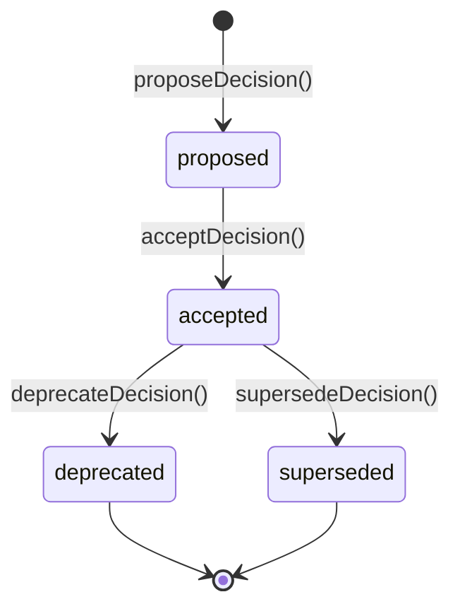

# 模块详解 — ArchitectureDecisionRecord 架构决策记录

> 所属子系统：[[SDD规范驱动子系统]] | 融合自：ADR最佳实践 | 版本：2.73.4

## 模块概述

`architecture-decision-record.js` 是框架的架构决策追踪模块，是SDD规范驱动开发子系统的设计决策管理组件。它记录、追踪和管理架构决策的完整生命周期，确保每个重要设计选择都有据可查、可追溯、可回溯。内置决策状态机（proposed → accepted → deprecated/superseded），支持决策搜索、统计和与SDD合约的集成。

**源码位置**：`src/runtime/sdd/architecture-decision-record.js`

## 核心能力

| 能力 | 说明 |
|------|------|
| 决策生命周期管理 | proposed → accepted → deprecated/superseded 完整状态机 |
| 决策记录 | 结构化记录标题、上下文、决策内容和后果 |
| 决策追踪 | 按状态筛选、关键词搜索、统计信息 |
| 决策替代 | 新决策替代旧决策，自动建立关联关系 |
| 事件通知 | 决策状态变更时触发事件，支持与SDD合约集成 |
| 容量保护 | 有界容器防止决策记录无限增长 |

## 决策状态机



**状态说明**：

| 状态 | 说明 |
|------|------|
| `proposed` | 已提出但尚未接受的决策，处于评审阶段 |
| `accepted` | 已被团队接受并生效的决策 |
| `deprecated` | 已废弃的决策，不再推荐使用 |
| `superseded` | 已被新决策替代的决策，指向替代决策ID |

## 决策记录结构

```javascript
{
  id: 'ADR-001',                        // 唯一决策ID
  title: '使用JWT进行身份认证',           // 决策标题
  status: 'accepted',                    // 当前状态
  context: '当前系统使用Session认证...',   // 决策上下文（为什么需要做决策）
  decision: '采用JWT + Refresh Token...', // 决策内容（做出了什么决策）
  consequences: '需要处理Token刷新...',    // 决策后果（决策带来的影响）
  proposedAt: '2026-06-04T...',          // 提出时间
  acceptedAt: '2026-06-05T...',          // 接受时间
  deprecatedAt: null,                    // 废弃时间
  deprecatedReason: null,                // 废弃原因
  supersededBy: null,                    // 替代决策ID
  supersedes: [],                        // 被此决策替代的决策ID列表
}
```

## API 参考

### 构造函数

#### `new ArchitectureDecisionRecord(options)`

| 参数 | 类型 | 必填 | 说明 |
|------|------|------|------|
| `options` | object | 否 | 配置选项 |
| `options.maxDecisions` | number | 否 | 最大决策记录数（默认200） |

### 核心方法

| 方法 | 参数 | 返回 | 说明 |
|------|------|------|------|
| `proposeDecision(title, context, decision, consequences)` | string, string, string, string | `{ id, status }` | 提出新决策 |
| `acceptDecision(id)` | string | `{ id, status }` | 接受决策 |
| `deprecateDecision(id, reason)` | string, string | `{ id, status, reason }` | 废弃决策 |
| `supersedeDecision(oldId, newId)` | string, string | `{ oldId, newId, status }` | 用新决策替代旧决策 |
| `getDecision(id)` | string | object\|null | 获取决策详情 |
| `listDecisions(status?)` | string | object[] | 列出决策（可按状态筛选） |
| `searchDecisions(keyword)` | string | object[] | 搜索决策（标题/上下文/决策内容） |
| `getStats()` | — | object | 获取统计信息 |

### 方法详解

#### `proposeDecision(title, context, decision, consequences)`

提出新的架构决策。决策初始状态为 `proposed`。

```javascript
const adr = new ArchitectureDecisionRecord();

const result = adr.proposeDecision(
  '使用JWT进行身份认证',
  '当前系统使用Session认证，不支持分布式部署，移动端体验差，存在CSRF风险',
  '采用JWT + Refresh Token双令牌机制，支持OAuth2.0授权码模式',
  '需要处理Token刷新逻辑，需要考虑Token撤销策略，需要额外的密钥管理'
);

// 返回: { id: 'ADR-1709123456789', status: 'proposed' }
```

**参数说明**：

| 参数 | 类型 | 说明 |
|------|------|------|
| title | string | 决策标题，简明扼要描述决策内容 |
| context | string | 决策上下文，描述为什么需要做这个决策 |
| decision | string | 决策内容，描述做出了什么决策 |
| consequences | string | 决策后果，描述决策带来的影响和权衡 |

#### `acceptDecision(id)`

接受已提出的决策。仅 `proposed` 状态的决策可被接受。

```javascript
const result = adr.acceptDecision('ADR-1709123456789');
// 返回: { id: 'ADR-1709123456789', status: 'accepted' }
```

#### `deprecateDecision(id, reason)`

废弃已接受的决策。仅 `accepted` 状态的决策可被废弃。

```javascript
const result = adr.deprecateDecision('ADR-1709123456789', '已迁移至OAuth2.0 PKCE方案');
// 返回: { id: 'ADR-1709123456789', status: 'deprecated', reason: '已迁移至OAuth2.0 PKCE方案' }
```

#### `supersedeDecision(oldId, newId)`

用新决策替代旧决策。旧决策状态变为 `superseded`，并记录替代关系。

```javascript
// 先提出新决策
const newDecision = adr.proposeDecision(
  '使用OAuth2.0 PKCE进行身份认证',
  'JWT方案在公共客户端存在安全风险...',
  '采用OAuth2.0 PKCE流程...',
  '需要实现PKCE挑战-应答机制...'
);
adr.acceptDecision(newDecision.id);

// 用新决策替代旧决策
const result = adr.supersedeDecision('ADR-1709123456789', newDecision.id);
// 返回: { oldId: 'ADR-1709123456789', newId: 'ADR-1709123456800', status: 'superseded' }
```

#### `getDecision(id)`

获取指定ID的决策详情。

```javascript
const decision = adr.getDecision('ADR-1709123456789');
// 返回完整的决策对象，包含所有字段
```

#### `listDecisions(status?)`

列出决策记录。可按状态筛选，不传参则返回全部。

```javascript
// 列出所有已接受的决策
const acceptedDecisions = adr.listDecisions('accepted');

// 列出全部决策
const allDecisions = adr.listDecisions();
```

#### `searchDecisions(keyword)`

在决策的标题、上下文和决策内容中搜索关键词。

```javascript
const results = adr.searchDecisions('JWT');
// 返回包含"JWT"关键词的所有决策
```

#### `getStats()`

获取决策统计信息。

```javascript
const stats = adr.getStats();
// 返回: { total: 15, proposed: 3, accepted: 8, deprecated: 2, superseded: 2 }
```

### 事件

| 事件名 | 触发时机 | 数据 |
|--------|---------|------|
| `decision-proposed` | 新决策提出 | `{ id, title, status }` |
| `decision-accepted` | 决策被接受 | `{ id, title, status }` |
| `decision-deprecated` | 决策被废弃 | `{ id, title, reason }` |
| `decision-superseded` | 决策被替代 | `{ oldId, newId }` |

## 配置选项

```javascript
const DEFAULT_CONFIG = {
  maxDecisions: 200,  // 最大决策记录数
};
```

| 配置项 | 类型 | 默认值 | 说明 |
|--------|------|--------|------|
| `maxDecisions` | number | 200 | 最大决策记录数，超出后自动清理最旧记录 |

## 使用示例

### 完整决策生命周期

```javascript
const ArchitectureDecisionRecord = require('./src/runtime/sdd/architecture-decision-record');

const adr = new ArchitectureDecisionRecord({ maxDecisions: 200 });

// 监听事件
adr.on('decision-proposed', ({ id, title }) => {
  console.log(`新决策提出: [${id}] ${title}`);
});
adr.on('decision-accepted', ({ id, title }) => {
  console.log(`决策已接受: [${id}] ${title}`);
});
adr.on('decision-deprecated', ({ id, reason }) => {
  console.log(`决策已废弃: [${id}] 原因: ${reason}`);
});
adr.on('decision-superseded', ({ oldId, newId }) => {
  console.log(`决策已替代: ${oldId} → ${newId}`);
});

// 1. 提出决策
const { id: adrId } = adr.proposeDecision(
  '采用微服务架构',
  '单体应用已无法支撑业务增长，部署周期长，团队协作冲突频繁',
  '将核心业务拆分为独立微服务，采用事件驱动通信',
  '需要引入服务发现、配置中心、分布式追踪等基础设施'
);

// 2. 接受决策
adr.acceptDecision(adrId);

// 3. 搜索决策
const results = adr.searchDecisions('微服务');
console.log(`找到 ${results.length} 条相关决策`);

// 4. 查看统计
const stats = adr.getStats();
console.log(`总决策数: ${stats.total}, 已接受: ${stats.accepted}`);

// 5. 废弃决策
adr.deprecateDecision(adrId, '业务规模回归，微服务成本过高');

// 6. 决策替代
const { id: newId } = adr.proposeDecision(
  '采用模块化单体架构',
  '微服务运维成本过高...',
  '采用模块化单体，保留未来拆分能力',
  '需要严格的模块边界管理'
);
adr.acceptDecision(newId);
adr.supersedeDecision(adrId, newId);
```

### 与 SDD 合约管理器集成

```javascript
const SddContractManager = require('./src/runtime/sdd/sdd-contract-manager');
const ArchitectureDecisionRecord = require('./src/runtime/sdd/architecture-decision-record');

const manager = new SddContractManager({ strictMode: true });
const adr = new ArchitectureDecisionRecord();

// 在合约推进过程中记录架构决策
manager.on('stage-advanced', ({ contractId, from, to }) => {
  if (to === 'design') {
    // 设计阶段推进时，自动记录关键决策
    console.log('设计阶段已推进，建议在此阶段记录架构决策');
  }
});

// 创建合约并推进到设计阶段
const { contractId } = manager.createContract('/project/root');
manager.advanceStage(contractId, proposeDoc);
manager.advanceStage(contractId, specDoc);

// 在设计阶段记录决策
const { id } = adr.proposeDecision(
  '数据库选型',
  '需要支持高并发读写，数据量预计达到TB级',
  '选择PostgreSQL作为主数据库，Redis作为缓存层',
  '需要DBA团队维护，需要考虑数据迁移方案'
);
adr.acceptDecision(id);

// 继续推进合约
manager.advanceStage(contractId, designDoc);

// 查看项目所有决策
const allDecisions = adr.listDecisions('accepted');
console.log(`项目已接受 ${allDecisions.length} 条架构决策`);
```

## 与其他模块的关系

```
ArchitectureDecisionRecord
  ├── SddContractManager — 合约管理器（合约推进过程中产生的决策可通过ADR记录）
  ├── IronRuleEngine — 铁律引擎（决策记录可参考铁律规则）
  ├── SddDocumentValidator — 文档验证器（设计文档中的决策可追溯至ADR）
  ├── SddPhaseBridge — 阶段桥接器（设计阶段推进时触发决策记录建议）
  └── SDD规范驱动子系统 — 所属子系统
```

## 相关文档

- [[模块详解-SDD规范驱动子系统]] — SDD规范驱动开发总览
- [[模块详解-IronRuleEngine铁律引擎]] — 铁律引擎
- [[模块详解-SddContractManager]] — SDD合约管理器
- [[模块详解-SddDocumentValidator]] — 文档验证器
