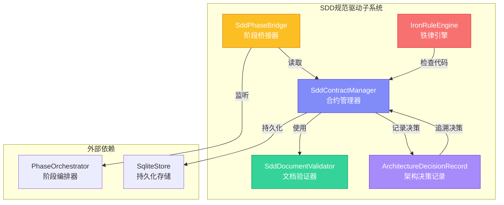
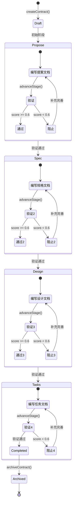
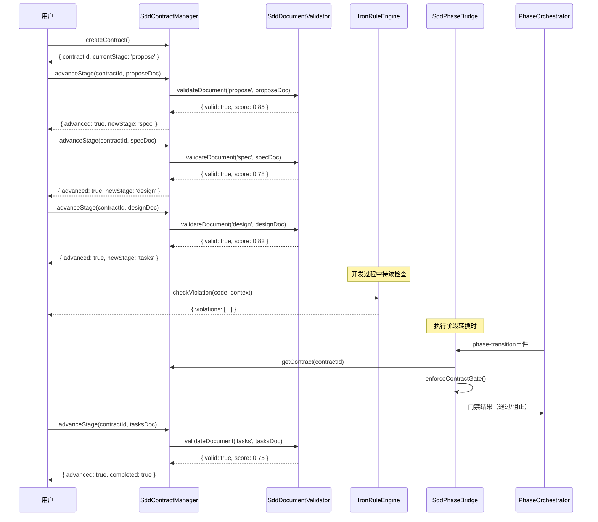
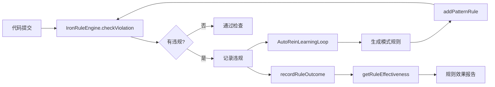

# 模块详解 — SDD规范驱动子系统

> 源码路径：`src/runtime/sdd/` | 文件数：7 | 版本：2.73.4

---

## 目录

- [1. 概述](#1-概述)
- [2. 架构总览](#2-架构总览)
- [3. SddContractManager — SDD合约管理器](#3-sddcontractmanager--sdd合约管理器)
  - [3.1 核心职责](#31-核心职责)
  - [3.2 类定义与接口](#32-类定义与接口)
  - [3.3 关键方法详解](#33-关键方法详解)
  - [3.4 配置选项](#34-配置选项)
  - [3.5 事件](#35-事件)
  - [3.6 错误处理](#36-错误处理)
  - [3.7 使用示例](#37-使用示例)
- [4. IronRuleEngine — 铁律引擎](#4-ironruleengine--铁律引擎)
  - [4.1 核心职责](#41-核心职责)
  - [4.2 类定义与接口](#42-类定义与接口)
  - [4.3 内置铁律清单](#43-内置铁律清单)
  - [4.4 关键方法详解](#44-关键方法详解)
  - [4.5 配置选项](#45-配置选项)
  - [4.6 事件](#46-事件)
  - [4.7 错误处理](#47-错误处理)
  - [4.8 使用示例](#48-使用示例)
- [5. SddDocumentValidator — 文档验证器](#5-sdddocumentvalidator--文档验证器)
  - [5.1 核心职责](#51-核心职责)
  - [5.2 类定义与接口](#52-类定义与接口)
  - [5.3 质量门禁体系](#53-质量门禁体系)
  - [5.4 关键方法详解](#54-关键方法详解)
  - [5.5 配置选项](#55-配置选项)
  - [5.6 使用示例](#56-使用示例)
- [6. SddPhaseBridge — 阶段桥接器](#6-sddphasebridge--阶段桥接器)
  - [6.1 核心职责](#61-核心职责)
  - [6.2 类定义与接口](#62-类定义与接口)
  - [6.3 关键方法详解](#63-关键方法详解)
  - [6.4 配置选项](#64-配置选项)
  - [6.5 事件](#65-事件)
  - [6.6 错误处理](#66-错误处理)
  - [6.7 使用示例](#67-使用示例)
- [7. ArchitectureDecisionRecord — 架构决策记录](#7-architectureddecisionrecord--架构决策记录)
  - [7.1 核心职责](#71-核心职责)
  - [7.2 决策状态机](#72-决策状态机)
  - [7.3 关键方法详解](#73-关键方法详解)
  - [7.4 配置选项](#74-配置选项)
  - [7.5 事件](#75-事件)
  - [7.6 与SddContractManager的集成](#76-与sddcontractmanager的集成)
  - [7.7 使用示例](#77-使用示例)
- [8. 子系统协作流程](#8-子系统协作流程)
- [9. 设计决策与权衡](#9-设计决策与权衡)

---

## 1. 概述

SDD（Specification-Driven Development，规范驱动开发）子系统是Harness框架中"文档先行"原则的核心执行引擎。它通过四文档合约（propose → spec → design → tasks）的渐进式推进机制，确保任何编码行为都有前置规范约束，从源头杜绝"先写代码后补文档"的反模式。

SDD子系统的设计哲学是：**合约即代码，规范即门禁**。每个阶段的文档必须通过质量门禁验证后才能推进到下一阶段，未通过验证的文档将阻止阶段推进，强制开发者补充完善规范内容。

### 核心价值

| 价值维度 | 实现方式 |
|---------|---------|
| 文档先行 | 四文档合约强制编码前完成规范 |
| 质量门禁 | 12项质量门禁 + 0.6分阈值验证 |
| 铁律约束 | 10+内置铁律自动检测架构/安全/风格违规 |
| 可追溯性 | 需求→设计→实现的完整追踪矩阵 |
| 阶段桥接 | SDD阶段与执行六阶段流程的双向映射 |

---

## 2. 架构总览



### 四文档合约推进流程



---

## 3. SddContractManager — SDD合约管理器

**源文件**：`src/runtime/sdd/sdd-contract-manager.js`

### 3.1 核心职责

SddContractManager是SDD子系统的核心协调者，负责：

1. **合约生命周期管理**：创建、推进、归档四文档合约
2. **阶段推进验证**：在推进前调用SddDocumentValidator验证文档质量
3. **追踪矩阵管理**：注册和更新需求→实现的追踪条目
4. **持久化支持**：通过SqliteStore实现合约的持久化存储与恢复
5. **历史记录**：记录合约的每次状态变更

### 3.2 类定义与接口

```javascript
class SddContractManager extends EventEmitter {
  constructor(config)

  // 合约管理
  createContract(projectRoot, options)
  getContract(contractId)
  advanceStage(contractId, documentContent)
  validateContract(contractId)
  getContractStatus(contractId)
  listContracts()
  archiveContract(contractId)

  // 阶段信息
  getStageRequirements(stage)
  getContractStages()

  // 追踪矩阵
  registerTraceItem(contractId, itemId, spec, options)
  updateTraceStatus(contractId, itemId, status, evidence)
  getTraceMatrix(contractId)
  checkSpecCoverage(contractId)

  // 持久化
  attachPersistStore(sqliteStore)
  persistContract(contractId)
  restoreContract(contractId)
}
```

### 3.3 关键方法详解

#### `createContract(projectRoot, options)`

创建新的SDD合约。合约初始状态为`draft`，初始阶段为`propose`。

```javascript
const manager = new SddContractManager();
const result = manager.createContract('/path/to/project', { strictMode: true });
// 返回: { contractId: 'sdd-1709123456789', status: 'draft', currentStage: 'propose' }
```

**参数说明**：

| 参数 | 类型 | 说明 |
|------|------|------|
| projectRoot | string | 项目根目录路径 |
| options | Object | 合约选项（可选） |

**返回值**：`{ contractId, status, currentStage }`

#### `advanceStage(contractId, documentContent)`

推进合约到下一阶段。在strictMode下，文档必须通过验证才能推进。

```javascript
const result = manager.advanceStage('sdd-1709123456789', proposeDocumentContent);
if (result.advanced) {
  console.log('推进到:', result.newStage);
} else {
  console.log('推进被阻止:', result.reason);
  if (result.validation) {
    console.log('验证详情:', result.validation.errors);
  }
}
```

**推进逻辑**：

1. 获取合约对象，校验合约存在且未归档/完成
2. 调用`SddDocumentValidator.validateDocument()`验证当前阶段文档
3. strictMode下验证失败则阻止推进，触发`stage-advance-blocked`事件
4. 验证通过则保存文档、推进阶段、记录历史
5. 最后一个阶段(tasks)通过后，合约状态变为`completed`

**返回值**：

| 字段 | 类型 | 说明 |
|------|------|------|
| advanced | boolean | 是否成功推进 |
| completed | boolean | 合约是否已完成（仅最后阶段） |
| contractId | string | 合约ID |
| newStage | string | 新阶段名称 |
| reason | string | 阻止原因（仅失败时） |
| validation | Object | 验证结果（仅失败时） |

#### `validateContract(contractId)`

对合约所有阶段的文档进行全量验证。

```javascript
const result = manager.validateContract('sdd-1709123456789');
// 返回: { valid: false, contractId, stageResults: { propose: {...}, spec: {...}, ... } }
```

#### `registerTraceItem(contractId, itemId, spec, options)`

注册追踪条目，建立需求→实现的追踪关系。

```javascript
manager.registerTraceItem('sdd-1709123456789', 'REQ-001', {
  description: '用户登录功能',
  priority: 'high',
}, { status: 'pending', implementation: 'src/auth/login.js' });
```

#### `checkSpecCoverage(contractId)`

计算规格覆盖率。已实现(implemented)计100%，部分实现(partial)计50%。

```javascript
const coverage = manager.checkSpecCoverage('sdd-1709123456789');
// { contractId, totalItems: 10, implemented: 5, partial: 2, pending: 3,
//   deviated: 0, stale: 0, coveragePercent: 60 }
```

#### `attachPersistStore(sqliteStore)` / `persistContract(contractId)` / `restoreContract(contractId)`

持久化三部曲：附加存储 → 保存合约 → 恢复合约。

```javascript
const SqliteStore = require('../infrastructure/sqlite-store');
const store = new SqliteStore({ dbPath: './data/sdd.db' });

manager.attachPersistStore(store);
manager.persistContract('sdd-1709123456789');
// 应用重启后
manager.restoreContract('sdd-1709123456789');
```

### 3.4 配置选项

```javascript
const DEFAULT_CONFIG = {
  maxContracts: 100,          // 最大合约数量
  maxHistoryPerContract: 50,  // 每个合约最大历史记录数
  strictMode: true,           // 严格模式：验证失败阻止推进
};
```

### 3.5 事件

| 事件名 | 触发时机 | 数据 |
|--------|---------|------|
| `contract-created` | 合约创建 | `{ contractId, projectRoot }` |
| `stage-advanced` | 阶段推进成功 | `{ contractId, from, to }` |
| `stage-advance-blocked` | 阶段推进被阻止 | `{ contractId, stage, validation }` |
| `contract-completed` | 合约完成 | `{ contractId }` |
| `contract-archived` | 合约归档 | `{ contractId }` |
| `trace-registered` | 追踪条目注册 | `{ contractId, itemId }` |
| `trace-status-updated` | 追踪状态更新 | `{ contractId, itemId, previousStatus, newStatus }` |

### 3.6 错误处理

- 所有公共方法通过`safeExecute`包装，异常不会外泄
- `advanceStage`返回`{ advanced: false, reason }`而非抛出异常
- `getContract`对无效ID返回`null`而非报错
- `persistContract`/`restoreContract`对存储失败返回描述性原因

### 3.7 使用示例

#### 完整合约生命周期

```javascript
const SddContractManager = require('./src/runtime/sdd/sdd-contract-manager');

const manager = new SddContractManager({ strictMode: true });

// 监听事件
manager.on('stage-advanced', ({ from, to }) => {
  console.log(`阶段推进: ${from} → ${to}`);
});
manager.on('stage-advance-blocked', ({ stage, validation }) => {
  console.warn(`阶段 ${stage} 推进被阻止:`);
  validation.errors.forEach(e => console.warn(`  - ${e}`));
});

// 1. 创建合约
const { contractId } = manager.createContract('/project/root');

// 2. 推进 propose 阶段
const proposeDoc = `
# Proposal Document
## Problem
当前系统缺乏用户认证机制，存在安全风险。
## Solution
引入JWT认证方案，支持OAuth2.0集成。
## Scope
### In Scope
- 用户登录/注册
- Token刷新
### Out of Scope
- 第三方SSO集成
## Stakeholders
- 产品团队
- 安全团队
`;

const r1 = manager.advanceStage(contractId, proposeDoc);
// { advanced: true, newStage: 'spec' }

// 3. 推进 spec 阶段
const specDoc = `
# Specification Document
## Functional Requirements
- FR-001: 用户可通过邮箱/密码登录
- FR-002: 系统支持Token自动刷新
## Non-Functional Requirements
- 响应时间 < 200ms
- 支持 10,000 并发用户
## Constraints
- 必须兼容现有API格式
## Acceptance Criteria
- 登录成功率达 99.9%
- Token刷新延迟 < 100ms
`;

const r2 = manager.advanceStage(contractId, specDoc);

// 4. 注册追踪条目
manager.registerTraceItem(contractId, 'FR-001', {
  description: '用户登录功能',
}, { implementation: 'src/auth/login.js' });

// 5. 检查覆盖率
const coverage = manager.checkSpecCoverage(contractId);
console.log('规格覆盖率:', coverage.coveragePercent + '%');

// 6. 归档
manager.archiveContract(contractId);
```

---

## 4. IronRuleEngine — 铁律引擎

**源文件**：`src/runtime/sdd/iron-rule-engine.js`

### 4.1 核心职责

IronRuleEngine是SDD子系统的规则执行引擎，负责：

1. **内置铁律执行**：10+条内置铁律覆盖架构/安全/风格/性能四个维度
2. **自定义规则管理**：支持动态添加、移除、启用/禁用规则
3. **模式规则生成**：从正则表达式自动生成检查规则（`addPatternRule`）
4. **违规追踪**：记录所有违规事件，按规则/类别/严重度统计
5. **规则效果评估**：追踪每条规则的触发次数和阻止次数

### 4.2 类定义与接口

```javascript
class IronRuleEngine extends EventEmitter {
  constructor(config)

  // 规则管理
  addRule(rule)
  addPatternRule(pattern, description, solution, options)
  removeRule(ruleId)
  loadRules(rulesPath)
  enableRule(ruleId)
  disableRule(ruleId)
  getRules()

  // 检查
  checkViolation(code, context)

  // 统计
  getViolations(limit)
  getRuleStats()
  getRuleEffectiveness(ruleId)
  recordRuleOutcome(ruleId, preventedViolation)
}
```

### 4.3 内置铁律清单

| # | ID | 名称 | 严重度 | 类别 | 检测目标 |
|---|-----|------|--------|------|---------|
| 1 | `no-cross-layer-calls` | 禁止跨层调用 | CRITICAL | architecture | Interaction层直接导入Domain/Infrastructure层 |
| 2 | `no-direct-db-access` | 禁止直接DB访问 | CRITICAL | architecture | Business层直接使用better-sqlite3或SQL方法 |
| 3 | `no-hardcoded-secrets` | 禁止硬编码密钥 | CRITICAL | security | password/api_key/secret/token赋值 |
| 4 | `no-untyped-parameters` | 禁止无类型参数 | WARNING | style | 公共API函数参数缺少类型注解 |
| 5 | `no-sync-io` | 禁止同步I/O | WARNING | performance | readFileSync/writeFileSync等同步方法 |
| 6 | `no-global-mutation` | 禁止全局变异 | CRITICAL | architecture | global.xxx=/Object.prototype.xxx= |
| 7 | `no-circular-dependencies` | 禁止循环依赖 | CRITICAL | architecture | 模块间循环引用（DFS检测） |
| 8 | `require-error-handling` | 要求错误处理 | WARNING | style | async函数缺少try/catch |
| 9 | `require-input-validation` | 要求输入验证 | WARNING | security | 公共API缺少参数校验 |
| 10 | `require-shutdown-cleanup` | 要求关闭清理 | WARNING | architecture | 资源持有类缺少shutdown/close方法 |

**严重度定义**：

```javascript
const SEVERITY_LEVELS = {
  CRITICAL: 'critical',  // 必须修复，阻止合并
  WARNING: 'warning',    // 建议修复，不阻止合并
  INFO: 'info',          // 信息提示
};
```

**类别定义**：

```javascript
const CATEGORY_TYPES = {
  ARCHITECTURE: 'architecture',  // 架构规则
  SECURITY: 'security',          // 安全规则
  STYLE: 'style',               // 风格规则
  PERFORMANCE: 'performance',    // 性能规则
};
```

### 4.4 关键方法详解

#### `checkViolation(code, context)`

对所有启用的规则执行违规检查。这是铁律引擎的核心方法。

```javascript
const engine = new IronRuleEngine();
const result = engine.checkViolation(sourceCode, {
  filePath: 'src/business/user-service.js',
  dependencies: [
    { from: 'user-service', to: 'database' },
    { from: 'database', to: 'user-service' },
  ],
});

// 返回:
// {
//   violations: [
//     { ruleId: 'no-direct-db-access', ruleName: 'No Direct DB Access',
//       severity: 'critical', category: 'architecture',
//       evidence: 'Business layer contains direct DB access',
//       timestamp: '...' },
//     { ruleId: 'no-circular-dependencies', ruleName: 'No Circular Dependencies',
//       severity: 'critical', category: 'architecture',
//       evidence: 'Circular dependency detected',
//       timestamp: '...' }
//   ],
//   checkedRules: 10
// }
```

**上下文对象**：

| 字段 | 类型 | 说明 |
|------|------|------|
| code | string | 待检查的源代码 |
| filePath | string | 文件路径（部分规则依赖路径判断层级） |
| dependencies | Array | 依赖关系列表（循环依赖检测使用） |

#### `addPatternRule(pattern, description, solution, options)`

从正则表达式自动生成检查规则。这是与`AutoReinLearningLoop`闭环集成的关键方法。

```javascript
// 从自学习闭环中自动注册的模式规则
engine.addPatternRule(
  /parseFloat\([^)]*\)\s*\.\s*toFixed\(/,
  '避免对parseFloat结果直接调用toFixed，可能产生NaN',
  '先检查isNaN再调用toFixed',
  { severity: 'warning', category: 'style', id: 'pattern-parsefloat-tofixed' }
);
```

**安全防护**：
- 模式长度限制200字符
- ReDoS危险正则检测（嵌套量词模式）
- 无效正则自动降级为空检查函数

#### `addRule(rule)`

添加自定义规则。规则对象必须包含`id`和`check`函数。

```javascript
engine.addRule({
  id: 'no-console-log',
  name: 'No Console Log',
  description: 'Prohibit console.log in production code',
  severity: 'warning',
  category: 'style',
  check: function(ctx) {
    if (/console\.log/.test(ctx.code)) {
      return { violated: true, evidence: 'console.log detected' };
    }
    return { violated: false, evidence: '' };
  },
  solution: 'Use structured logger instead',
});
```

#### `getRuleEffectiveness(ruleId)` / `recordRuleOutcome(ruleId, preventedViolation)`

规则效果追踪，用于评估铁律的实际防护价值。

```javascript
// 记录规则效果
engine.recordRuleOutcome('no-hardcoded-secrets', true);  // 阻止了一次违规

// 查询效果
const effectiveness = engine.getRuleEffectiveness('no-hardcoded-secrets');
// { ruleId, triggered: 5, prevented: 4, rate: 0.8 }
```

#### `loadRules(rulesPath)`

从JSON文件批量加载规则。

```javascript
const result = engine.loadRules('./config/custom-iron-rules.json');
// { loaded: 3 }
```

### 4.5 配置选项

```javascript
const DEFAULT_CONFIG = {
  maxRules: 200,           // 最大规则数量
  maxViolations: 1000,     // 最大违规记录数
  enabledByDefault: true,  // 新规则默认启用
};
```

### 4.6 事件

| 事件名 | 触发时机 | 数据 |
|--------|---------|------|
| `violations-detected` | 检测到违规 | `{ count, violations }` |
| `rule-added` | 规则添加 | `{ ruleId }` |
| `rule-removed` | 规则移除 | `{ ruleId }` |
| `rules-loaded` | 规则批量加载 | `{ count, path }` |

### 4.7 错误处理

- `checkViolation`中单条规则检查异常不影响其他规则
- 异常通过`debug`日志记录，不中断检查流程
- `addPatternRule`对危险正则自动降级（返回空检查函数）
- `loadRules`对无效JSON返回`{ loaded: 0, reason }`

### 4.8 使用示例

#### 与SddContractManager集成

```javascript
const SddContractManager = require('./src/runtime/sdd/sdd-contract-manager');
const IronRuleEngine = require('./src/runtime/sdd/iron-rule-engine');

const engine = new IronRuleEngine();
const manager = new SddContractManager();

// 在合约推进前检查代码
manager.on('stage-advanced', async ({ contractId, to }) => {
  if (to === 'tasks') {
    // 任务阶段开始前，检查已有代码是否违反铁律
    const sourceCode = await readProjectSource('/project/root');
    const result = engine.checkViolation(sourceCode, {
      filePath: '/project/root/src/business/user-service.js',
    });

    if (result.violations.some(v => v.severity === 'critical')) {
      console.error('发现严重违规，建议修复后再继续开发:');
      result.violations.forEach(v => {
        console.error(`  [${v.severity}] ${v.ruleName}: ${v.evidence}`);
      });
    }
  }
});
```

#### 自定义规则生命周期

```javascript
const engine = new IronRuleEngine();

// 1. 添加自定义规则
engine.addRule({
  id: 'require-javadoc',
  name: 'Require JSDoc',
  description: 'Public functions must have JSDoc comments',
  severity: 'warning',
  category: 'style',
  check: (ctx) => {
    const hasPublic = /@public|module\.exports/.test(ctx.code);
    const hasJSDoc = /\/\*\*[\s\S]*?\*\//.test(ctx.code);
    if (hasPublic && !hasJSDoc) {
      return { violated: true, evidence: 'Public API without JSDoc' };
    }
    return { violated: false, evidence: '' };
  },
});

// 2. 检查代码
const result = engine.checkViolation(code, { filePath: 'src/api.js' });

// 3. 评估效果
engine.recordRuleOutcome('require-javadoc', result.violations.length === 0);
const eff = engine.getRuleEffectiveness('require-javadoc');
console.log(`规则触发${eff.triggered}次，阻止${eff.prevented}次，有效率${(eff.rate * 100).toFixed(1)}%`);

// 4. 禁用规则（临时）
engine.disableRule('require-javadoc');

// 5. 移除规则
engine.removeRule('require-javadoc');
```

---

## 5. SddDocumentValidator — 文档验证器

**源文件**：`src/runtime/sdd/sdd-document-validator.js`

### 5.1 核心职责

SddDocumentValidator是SDD子系统的质量把关者，负责：

1. **必需章节检查**：验证文档是否包含当前阶段要求的章节
2. **质量门禁执行**：12项质量门禁检查，评估文档质量
3. **模板提供**：为每个阶段提供标准文档模板
4. **歧义检测**：识别文档中的模糊表述和矛盾
5. **澄清问题生成**：自动生成引导完善文档的提问

### 5.2 类定义与接口

```javascript
class SddDocumentValidator {
  constructor(config)

  // 验证
  validateDocument(stage, content)
  checkRequiredSections(stage, content)
  runQualityGates(stage, content)

  // 报告
  getValidationReport(contractId)
  setValidationReport(contractId, report)

  // 模板与需求
  getStageTemplate(stage)
  getStageRequirements(stage)

  // 智能辅助
  generateClarificationQuestions(stage, content)
  detectAmbiguity(stage, content)
}
```

### 5.3 质量门禁体系

12项质量门禁按阶段分布，每项门禁返回`{ passed, score }`：

#### Propose阶段（3项）

| 门禁ID | 检查内容 | 评分规则 |
|--------|---------|---------|
| `problemClarity` | 问题描述清晰度 | 有problem(0.5) + 有context(0.5) |
| `scopeBoundedness` | 范围有界性 | 有scope(0.6) + 有exclusion(0.4) |
| `stakeholderAlignment` | 利益相关者对齐 | 有stakeholder(1.0) |

#### Spec阶段（3项）

| 门禁ID | 检查内容 | 评分规则 |
|--------|---------|---------|
| `requirementCompleteness` | 需求完整性 | 有functional(0.5) + 有non-functional(0.5) |
| `constraintClarity` | 约束清晰度 | 有constraint(1.0) |
| `criteriaMeasurability` | 验收标准可度量性 | 有criteria(0.6) + 有量化指标(0.4) |

#### Design阶段（3项）

| 门禁ID | 检查内容 | 评分规则 |
|--------|---------|---------|
| `architectureConsistency` | 架构一致性 | 有architecture(0.6) + 有pattern(0.4) |
| `interfaceCompleteness` | 接口完整性 | 有interface(1.0) |
| `errorCoverage` | 错误处理覆盖 | 有error(0.5) + 有handling(0.5) |

#### Tasks阶段（3项）

| 门禁ID | 检查内容 | 评分规则 |
|--------|---------|---------|
| `taskGranularity` | 任务粒度 | 有task(0.6) + 有detail(0.4) |
| `dependencyOrdering` | 依赖排序 | 有dependency(0.6) + 有ordering(0.4) |
| `riskCoverage` | 风险覆盖 | 有risk(0.5) + 有mitigation(0.5) |

### 5.4 关键方法详解

#### `validateDocument(stage, content)`

综合验证文档质量。章节检查权重60%，质量门禁权重40%。

```javascript
const validator = new SddDocumentValidator();
const result = validator.validateDocument('propose', documentContent);

// 返回:
// {
//   valid: true,
//   score: 0.85,
//   errors: [],
//   warnings: ['Quality gate not fully met: scopeBoundedness'],
//   sectionCheck: { present: ['problem', 'solution'], missing: [], weak: ['scope'], score: 0.875 },
//   gateCheck: { passed: ['problemClarity', 'stakeholderAlignment'], failed: ['scopeBoundedness'],
//                scores: { problemClarity: 1.0, scopeBoundedness: 0.6, stakeholderAlignment: 1.0 },
//                score: 0.867 }
// }
```

**验证逻辑**：

1. 检查必需章节是否存在且内容充实（>20字符）
2. 运行质量门禁，计算各项得分
3. 综合评分 = 章节分 × 0.6 + 门禁分 × 0.4
4. `valid = score >= 0.6 && errors.length === 0`

#### `checkRequiredSections(stage, content)`

检查文档是否包含所有必需章节。

```javascript
const result = validator.checkRequiredSections('spec', content);
// { present: ['functionalRequirements', 'constraints'],
//   missing: ['nonFunctionalRequirements', 'acceptanceCriteria'],
//   weak: [],
//   score: 0.5 }
```

**章节检测策略**：

1. 使用`SECTION_KEYWORDS`关键词表进行模糊匹配
2. 匹配到关键词后，提取章节内容
3. 内容长度>20字符为`present`，≤20字符为`weak`，未匹配为`missing`

#### `runQualityGates(stage, content)`

运行指定阶段的所有质量门禁。

```javascript
const result = validator.runQualityGates('design', content);
// { passed: ['architectureConsistency', 'interfaceCompleteness'],
//   failed: ['errorCoverage'],
//   scores: { architectureConsistency: 0.6, interfaceCompleteness: 1.0, errorCoverage: 0.5 },
//   score: 0.7 }
```

#### `generateClarificationQuestions(stage, content)`

智能生成澄清问题，引导用户完善文档。

```javascript
const questions = validator.generateClarificationQuestions('spec', content);
// [
//   { section: 'acceptanceCriteria', type: 'non-measurable',
//     question: 'Acceptance criteria lack quantifiable metrics. What specific numbers or thresholds define success?',
//     severity: 'high' },
//   { section: 'cross-cutting', type: 'contradiction',
//     question: 'Conflicting timing requirements: real-time vs batch. Which requirement takes precedence?',
//     severity: 'high' }
// ]
```

**问题类型**：

| 类型 | 说明 |
|------|------|
| `missing-detail` | 章节内容不足（<30字符） |
| `boundary-ambiguity` | 范围缺少排除定义 |
| `non-measurable` | 验收标准缺少量化指标 |
| `missing-recovery` | 错误处理缺少恢复策略 |
| `ordering-ambiguity` | 依赖缺少执行顺序 |
| `missing-mitigation` | 风险缺少缓解策略 |
| `vague-interface` | 接口描述不够具体 |
| `incomplete-requirements` | 功能需求条目不足 |
| `contradiction` | 跨章节矛盾 |

#### `detectAmbiguity(stage, content)`

检测文档中的模糊表述。

```javascript
const ambiguities = validator.detectAmbiguity('spec', content);
// [
//   { term: 'should\\s+be\\s+fast', suggestion: 'Define specific latency threshold (e.g., "response time < 200ms")' },
//   { term: 'user.friendly', suggestion: 'Define measurable UX criteria (e.g., "task completion in < 3 clicks")' },
//   { term: 'tbd|todo|fixme|\\?\\?\\?', suggestion: 'Replace placeholder with actual specification' }
// ]
```

**检测的模糊术语**：

| 模式 | 建议 |
|------|------|
| `should be fast` | 定义具体延迟阈值 |
| `should be scalable` | 定义目标规模 |
| `user-friendly` | 定义可度量UX标准 |
| `reasonable` / `appropriate` | 替换为具体值 |
| `etc.` / `and so on` | 替换为明确枚举 |
| `if needed` / `as needed` | 定义具体触发条件 |
| `TBD` / `TODO` / `FIXME` | 替换占位符为实际规格 |

#### `getStageTemplate(stage)`

获取阶段文档模板。

```javascript
const template = validator.getStageTemplate('propose');
// 返回Markdown模板字符串，包含所有必需章节的占位注释
```

### 5.5 配置选项

```javascript
const DEFAULT_CONFIG = {
  maxReports: 200,            // 最大验证报告数
  threshold: 0.6,             // 验证通过阈值
};
```

### 5.6 使用示例

#### 文档验证与改进循环

```javascript
const validator = new SddDocumentValidator({ threshold: 0.7 });

let doc = `
# Proposal Document
## Problem
需要一个新的认证系统。
## Solution
使用JWT。
`;

// 第一次验证
let result = validator.validateDocument('propose', doc);
console.log('初始评分:', result.score);  // 较低

// 获取澄清问题
const questions = validator.generateClarificationQuestions('propose', doc);
questions.forEach(q => console.log(`[${q.severity}] ${q.question}`));

// 检测歧义
const ambiguities = validator.detectAmbiguity('propose', doc);
ambiguities.forEach(a => console.log(`模糊: ${a.term} → ${a.suggestion}`));

// 根据反馈改进文档
doc = `
# Proposal Document
## Problem
当前系统使用Session认证，存在以下问题：
1. 不支持分布式部署
2. 移动端体验差
3. 安全性不足（CSRF风险）

## Solution
引入JWT认证方案：
- Access Token + Refresh Token双令牌机制
- 支持OAuth2.0授权码模式
- Token自动刷新，用户无感知

## Scope
### In Scope
- 用户登录/注册
- Token签发与刷新
- 权限验证中间件

### Out of Scope
- 第三方SSO集成（二期）
- 生物识别认证（三期）

## Stakeholders
- 产品团队（需求方）
- 安全团队（审计方）
- 后端团队（实现方）
`;

result = validator.validateDocument('propose', doc);
console.log('改进后评分:', result.score);  // 显著提升
console.log('是否通过:', result.valid);
```

---

## 6. SddPhaseBridge — 阶段桥接器

**源文件**：`src/runtime/sdd/sdd-phase-bridge.js`

### 6.1 核心职责

SddPhaseBridge是SDD子系统与执行流程的桥梁，负责：

1. **阶段映射**：SDD四阶段 ↔ 执行六阶段的双向映射
2. **合约门禁执行**：在执行阶段转换时检查SDD合约完成情况
3. **自动执行**：监听PhaseOrchestrator的阶段转换事件，自动执行门禁检查
4. **阻断控制**：合约未完成时阻止执行阶段推进

### 6.2 类定义与接口

```javascript
class SddPhaseBridge extends EventEmitter {
  constructor(config)

  // 依赖注入
  attachToPhaseOrchestrator(phaseOrchestrator)
  attachSddContractManager(contractManager)

  // 映射
  mapStageToPhase(sddStage)
  mapPhaseToStage(phase)

  // 门禁
  enforceContractGate(contractId, phase)

  // 状态
  getBridgeStatus()
  getEnforcedContracts()

  // 生命周期
  detach()
}
```

### 6.3 关键方法详解

#### `attachToPhaseOrchestrator(phaseOrchestrator)`

附加到阶段编排器，建立自动门禁执行。当配置了`autoEnforce`和`blockOnGateFailure`时，阶段转换会自动触发合约门禁检查。

```javascript
const bridge = new SddPhaseBridge({
  autoEnforce: true,
  blockOnGateFailure: true,
});

bridge.attachToPhaseOrchestrator(phaseOrchestrator);
// 当PhaseOrchestrator触发phase-transition事件时，
// bridge自动检查所有活跃合约的门禁状态
```

**自动执行流程**：

1. PhaseOrchestrator触发`phase-transition`事件
2. Bridge获取所有活跃合约（draft/active状态）
3. 对每个合约执行`enforceContractGate()`
4. 门禁失败且`blockOnGateFailure=true`时，调用`phaseOrchestrator.pausePhase()`

#### `enforceContractGate(contractId, phase)`

执行合约门禁检查。判断执行阶段对应的SDD阶段是否已完成。

```javascript
const result = bridge.enforceContractGate('sdd-1709123456789', 'architecture-design');
// 可能返回:
// { enforced: true, passed: true, contractId, sddStage: 'design' }
// 或:
// { enforced: true, passed: false, contractId, sddStage: 'design',
//   reason: 'SDD stage not yet completed: design' }
```

**门禁逻辑**：

1. 将执行阶段映射为SDD阶段（`architecture-design` → `design`）
2. 检查SDD阶段是否在已完成阶段列表中
3. 若当前阶段正在进行且已有文档，视为通过
4. 否则检查已完成阶段数量是否达到该阶段要求

#### `mapStageToPhase(sddStage)` / `mapPhaseToStage(phase)`

双向阶段映射。

```javascript
// SDD → 执行阶段
bridge.mapStageToPhase('propose');   // 'brainstorming'
bridge.mapStageToPhase('spec');      // 'requirement-analysis'
bridge.mapStageToPhase('design');    // 'architecture-design'
bridge.mapStageToPhase('tasks');     // 'module-development'

// 执行阶段 → SDD
bridge.mapPhaseToStage('brainstorming');         // 'propose'
bridge.mapPhaseToStage('requirement-analysis');   // 'spec'
bridge.mapPhaseToStage('architecture-design');    // 'design'
bridge.mapPhaseToStage('module-development');     // 'tasks'
```

**完整映射表**：

| SDD阶段 | 执行阶段 |
|---------|---------|
| propose | brainstorming |
| spec | requirement-analysis |
| design | architecture-design |
| tasks | module-development |

### 6.4 配置选项

```javascript
const DEFAULT_CONFIG = {
  maxEnforcedContracts: 100,   // 最大门禁合约数
  autoEnforce: false,          // 是否自动执行门禁（需在attachToPhaseOrchestrator时配置）
  blockOnGateFailure: false,   // 门禁失败时是否阻止阶段推进
};
```

### 6.5 事件

| 事件名 | 触发时机 | 数据 |
|--------|---------|------|
| `attached` | 附加到编排器 | `{ hasPhaseOrchestrator, autoEnforce }` |
| `detached` | 从编排器分离 | 无 |
| `contract-gate-enforced` | 门禁通过 | `{ contractId, phase, sddStage, passed: true }` |
| `contract-gate-blocked` | 门禁阻止 | `{ contractId, phase, sddStage, completedStages }` |

### 6.6 错误处理

- `enforceContractGate`对未附加ContractManager返回`{ enforced: false, reason }`
- 自动执行中的异常被静默捕获，不影响其他合约
- `detach()`和`_onShutdown()`中清理事件监听器，防止内存泄漏

### 6.7 使用示例

#### SDD门禁与执行流程集成

```javascript
const SddContractManager = require('./src/runtime/sdd/sdd-contract-manager');
const SddPhaseBridge = require('./src/runtime/sdd/sdd-phase-bridge');
const PhaseOrchestrator = require('./src/runtime/workflow/phase-orchestrator');

// 初始化组件
const contractManager = new SddContractManager({ strictMode: true });
const phaseOrchestrator = new PhaseOrchestrator();
const bridge = new SddPhaseBridge({
  autoEnforce: true,
  blockOnGateFailure: true,
});

// 建立连接
bridge.attachSddContractManager(contractManager);
bridge.attachToPhaseOrchestrator(phaseOrchestrator);

// 创建合约并推进
const { contractId } = contractManager.createContract('/project');
contractManager.advanceStage(contractId, proposeDoc);
contractManager.advanceStage(contractId, specDoc);
contractManager.advanceStage(contractId, designDoc);
// tasks阶段尚未完成

// 当执行流程尝试推进到module-development时
// bridge自动检查design阶段是否已完成
// 如果design阶段已完成 → 允许推进
// 如果design阶段未完成 → 阻止推进

// 监听门禁事件
bridge.on('contract-gate-blocked', ({ contractId, sddStage }) => {
  console.warn(`合约 ${contractId} 的 ${sddStage} 阶段未完成，执行流程被阻止`);
});

bridge.on('contract-gate-enforced', ({ contractId, sddStage }) => {
  console.log(`合约 ${contractId} 的 ${sddStage} 阶段已通过门禁`);
});
```

---

## 7. ArchitectureDecisionRecord — 架构决策记录

**源文件**：`src/runtime/sdd/architecture-decision-record.js`

### 7.1 核心职责

ArchitectureDecisionRecord是SDD子系统的设计决策追踪模块，负责：

1. **决策记录**：结构化记录架构决策的标题、上下文、决策内容和后果
2. **生命周期管理**：管理决策从提出到接受、废弃或替代的完整状态机
3. **决策搜索**：支持按状态筛选和关键词搜索决策记录
4. **决策替代**：支持新决策替代旧决策，自动建立关联关系
5. **统计报告**：提供决策数量和状态分布的统计信息

### 7.2 决策状态机

决策遵循 `proposed → accepted → deprecated/superseded` 状态流转：

| 状态 | 说明 | 可转换至 |
|------|------|---------|
| `proposed` | 已提出但尚未接受 | `accepted` |
| `accepted` | 已被团队接受并生效 | `deprecated`, `superseded` |
| `deprecated` | 已废弃，不再推荐使用 | —（终态） |
| `superseded` | 已被新决策替代 | —（终态） |

### 7.3 关键方法详解

| 方法 | 参数 | 返回 | 说明 |
|------|------|------|------|
| `proposeDecision(title, context, decision, consequences)` | string, string, string, string | `{ id, status }` | 提出新决策 |
| `acceptDecision(id)` | string | `{ id, status }` | 接受决策 |
| `deprecateDecision(id, reason)` | string, string | `{ id, status, reason }` | 废弃决策 |
| `supersedeDecision(oldId, newId)` | string, string | `{ oldId, newId, status }` | 用新决策替代旧决策 |
| `getDecision(id)` | string | object\|null | 获取决策详情 |
| `listDecisions(status?)` | string | object[] | 列出决策（可按状态筛选） |
| `searchDecisions(keyword)` | string | object[] | 搜索决策 |
| `getStats()` | — | object | 获取统计信息 |

### 7.4 配置选项

```javascript
const DEFAULT_CONFIG = {
  maxDecisions: 200,  // 最大决策记录数
};
```

### 7.5 事件

| 事件名 | 触发时机 | 数据 |
|--------|---------|------|
| `decision-proposed` | 新决策提出 | `{ id, title, status }` |
| `decision-accepted` | 决策被接受 | `{ id, title, status }` |
| `decision-deprecated` | 决策被废弃 | `{ id, title, reason }` |
| `decision-superseded` | 决策被替代 | `{ oldId, newId }` |

### 7.6 与SddContractManager的集成

ArchitectureDecisionRecord与SddContractManager紧密集成，合约推进过程中产生的设计决策可通过ADR记录和追踪：

- **设计阶段决策记录**：合约推进到`design`阶段时，设计文档中的架构选择可通过ADR正式记录
- **决策可追溯性**：每个ADR记录关联到产生该决策的合约，确保决策有据可查
- **决策变更联动**：当决策被废弃或替代时，相关合约可收到通知并评估影响

```javascript
const manager = new SddContractManager({ strictMode: true });
const adr = new ArchitectureDecisionRecord();

// 合约推进到设计阶段时记录决策
manager.on('stage-advanced', ({ contractId, to }) => {
  if (to === 'design') {
    console.log(`合约 ${contractId} 进入设计阶段，建议记录关键架构决策`);
  }
});

// 创建合约并推进
const { contractId } = manager.createContract('/project');
manager.advanceStage(contractId, proposeDoc);
manager.advanceStage(contractId, specDoc);

// 在设计阶段记录决策
const { id } = adr.proposeDecision(
  '数据库选型',
  '需要支持高并发读写，数据量预计达到TB级',
  '选择PostgreSQL作为主数据库，Redis作为缓存层',
  '需要DBA团队维护，需要考虑数据迁移方案'
);
adr.acceptDecision(id);
```

### 7.7 使用示例

```javascript
const ArchitectureDecisionRecord = require('./src/runtime/sdd/architecture-decision-record');

const adr = new ArchitectureDecisionRecord({ maxDecisions: 200 });

// 提出并接受决策
const { id } = adr.proposeDecision(
  '采用微服务架构',
  '单体应用已无法支撑业务增长',
  '将核心业务拆分为独立微服务',
  '需要引入服务发现等基础设施'
);
adr.acceptDecision(id);

// 搜索决策
const results = adr.searchDecisions('微服务');

// 查看统计
const stats = adr.getStats();
// { total: 1, proposed: 0, accepted: 1, deprecated: 0, superseded: 0 }

// 废弃决策
adr.deprecateDecision(id, '业务规模回归，微服务成本过高');

// 决策替代
const { id: newId } = adr.proposeDecision(
  '采用模块化单体架构',
  '微服务运维成本过高',
  '采用模块化单体，保留未来拆分能力',
  '需要严格的模块边界管理'
);
adr.acceptDecision(newId);
adr.supersedeDecision(id, newId);
```

---

## 8. 子系统协作流程

### 完整SDD工作流



### 铁律引擎与自学习闭环



---

## 9. 设计决策与权衡

### 9.1 为什么选择四文档合约而非单一文档

| 方案 | 优势 | 劣势 |
|------|------|------|
| 单一文档 | 简单 | 信息密度低，难以分阶段验证 |
| **四文档合约** | **渐进式验证，每阶段聚焦特定关注点** | **文档数量多，维护成本高** |

选择四文档合约的原因：
- 每个阶段的关注点不同（问题→需求→设计→任务）
- 渐进式验证允许早期发现问题
- 与执行六阶段流程自然映射

### 9.2 为什么验证阈值设为0.6

0.6阈值是"最低可行质量"与"过度文档负担"的平衡点：
- 低于0.6意味着文档缺少关键章节或质量门禁大面积不通过
- 高于0.8可能导致过度文档化，增加开发负担
- 0.6确保"文档先行"的同时不过度阻碍开发节奏

### 9.3 铁律引擎的ReDoS防护

`addPatternRule`方法实现了三层防护：
1. 模式长度限制（200字符）
2. 危险量词嵌套检测（`REDOS_DANGEROUS_RE`）
3. 无效正则降级为空检查函数

这确保了从自学习闭环自动生成的规则不会引入正则表达式拒绝服务漏洞。

### 9.4 BoundedMap/BoundedArray的使用

所有内存集合使用有界容器，防止：
- 合约数量无限增长（`maxContracts: 100`）
- 历史记录无限增长（`maxHistoryPerContract: 50`）
- 违规记录无限增长（`maxViolations: 1000`）
- 追踪条目无限增长（`BoundedMap(500)`）

---

> **相关文档**：
> - [[模块详解-TDD门禁执行器]] — TDD强制门禁与SDD合约的协作
> - [[模块详解-PhaseOrchestrator阶段编排器]] — 执行六阶段流程
> - [[模块详解-FrameworkComplianceChecker]] — 框架合规检查
> - [[模块详解-AutoReinLearningLoop]] — 自增强学习闭环与铁律引擎的集成
> - [[模块详解-ArchitectureDecisionRecord架构决策记录]] — 架构决策记录模块详解
