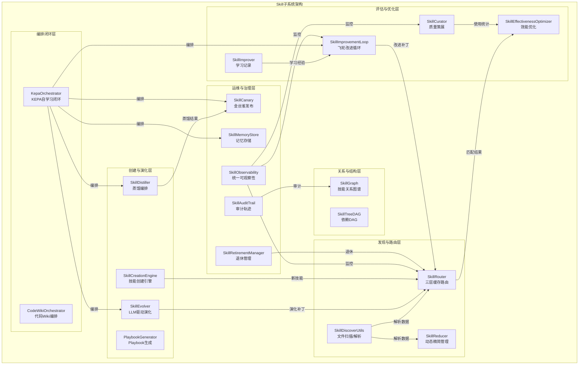
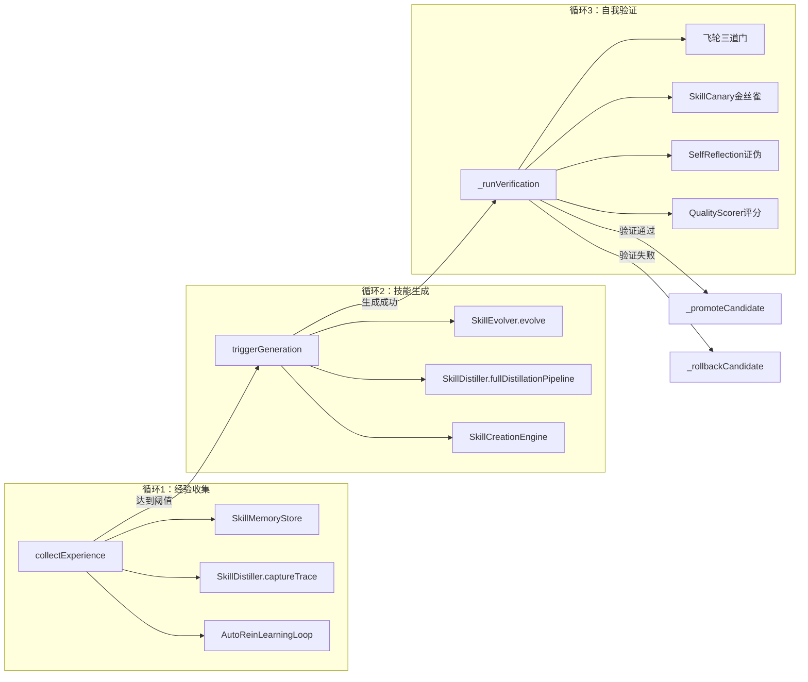

# 模块详解 — Skill子系统

> 版本：2.73.4
> 路径：`src/runtime/skill/`
> 文件数：20
> 核心职责：Skill全生命周期管理——发现、路由、创建、评估、优化、演化、精简、金丝雀发布、可观察性、审计、记忆、退休、蒸馏、效能优化、KEPA自学习闭环、代码Wiki编排

---

## 目录

- [1. 概述](#1-概述)
- [2. 架构图](#2-架构图)
- [3. 核心组件详解](#3-核心组件详解)
  - [3.1 SkillRouter — 技能路由核心](#31-skillrouter--技能路由核心)
  - [3.2 SkillCreationEngine — 技能创建引擎](#32-skillcreationengine--技能创建引擎)
  - [3.3 SkillCurator — 技能策展人](#33-skillcurator--技能策展人)
  - [3.4 SkillImprover — 技能改进器](#34-skillimprover--技能改进器)
  - [3.5 SkillImprovementLoop — 技能改进循环](#35-skillimprovementloop--技能改进循环)
  - [3.6 SkillReducer — 技能精简器](#36-skillreducer--技能精简器)
  - [3.7 SkillDiscoverUtils — 技能发现工具](#37-skilldiscoverutils--技能发现工具)
  - [3.8 SkillGraph — 技能图谱](#38-skillgraph--技能图谱)
  - [3.9 SkillTreeDAG — 技能树DAG](#39-skilltreedag--技能树dag)
  - [3.10 PlaybookGenerator — Playbook生成器](#310-playbookgenerator--playbook生成器)
  - [3.11 SkillEvolver — 技能演化器](#311-skillevolver--技能演化器)
  - [3.12 SkillCanary — 技能金丝雀追踪](#312-skillcanary--技能金丝雀追踪)
  - [3.13 SkillObservability — 技能统一可观察性](#313-skillobservability--技能统一可观察性)
  - [3.14 SkillAuditTrail — 技能审计轨迹](#314-skillaudittrail--技能审计轨迹)
  - [3.15 SkillMemoryStore — 技能记忆存储](#315-skillmemorystore--技能记忆存储)
  - [3.16 SkillRetirementManager — 技能退休管理器](#316-skillretirementmanager--技能退休管理器)
  - [3.17 SkillDistiller — 技能蒸馏编排](#317-skilldistiller--技能蒸馏编排)
  - [3.18 SkillEffectivenessOptimizer — 技能效能优化器](#318-skilleffectivenessoptimizer--技能效能优化器)
  - [3.19 KepaOrchestrator — KEPA自学习编排器](#319-kepaorchestrator--kepa自学习编排器)
  - [3.20 CodeWikiOrchestrator — 代码Wiki编排器](#320-codewikiorchestrator--代码wiki编排器)
- [4. 配置说明](#4-配置说明)
- [5. 使用示例](#5-使用示例)
- [6. 交叉引用](#6-交叉引用)

---

## 1. 概述

Skill子系统（Skill Subsystem）是 Harness Engineering 多Agent框架的核心知识驱动引擎，位于 `src/runtime/skill/` 目录，包含20个核心模块。该子系统负责 Skill 的全生命周期管理——从发现、路由匹配、创建、质量评估，到反馈学习、持续优化、演化改进、精简压缩、金丝雀发布、可观察性监控、审计追踪、记忆存储、退休归档、蒸馏提炼、效能优化、KEPA自学习闭环和代码Wiki编排。

### 设计哲学

- **Skill即知识**：每个Skill不仅是可执行的工作流程，更是团队知识的载体
- **闭环自学习**：经验收集→技能生成→自我验证的KEPA三环闭环，确保知识库随项目演进而持续进化
- **分层缓存**：三层渐进式缓存（L1摘要/L2指令/L3资源），按需加载，控制Token消耗
- **金丝雀发布**：新技能或变更技能按比例放量，自动评估并决定全量晋升或回滚
- **生命周期管理**：从创建到退休的完整生命周期，包含评估、归档、重新激活

### 模块清单

| 模块 | 源文件 | 核心职责 |
|------|--------|----------|
| SkillRouter | skill-router.js | Skill自动发现、语义匹配、三层缓存路由、否定模式检测、内容去重 |
| SkillCreationEngine | skill-creation-engine.js | 从需求/执行经验自动生成新Skill定义，模板化创建、验证、注册 |
| SkillCurator | skill-curator.js | 质量评估、冗余检测、推荐优化、使用统计、归档标记、快照管理 |
| SkillImprover | skill-improver.js | 基于使用反馈记录学习经验（tips/avoidances），应用学习到技能 |
| SkillImprovementLoop | skill-improvement-loop.js | 持续迭代优化循环，飞轮三道门验证，蒸馏-eval闭环 |
| SkillReducer | skill-reducer.js | 动态技能管理：三层缓存、动态分层、Top-K选择、任务驱动激活/卸载、过载检测 |
| SkillDiscoverUtils | skill-discover-utils.js | 文件扫描、元数据提取、基础条目构建 |
| SkillGraph | skill-graph.js | 技能关系建模、依赖可视化、影响范围分析、最短路径、环检测 |
| SkillTreeDAG | skill-tree-dag.js | 技能依赖DAG图、拓扑排序执行、种子技能自生长、循环依赖检测 |
| PlaybookGenerator | playbook-generator.js | 从DreamEngine模式自动生成结构化Playbook、版本追踪、持续精化 |
| SkillEvolver | skill-evolver.js | LLM驱动三阶段演化（摘要→聚合→执行）、变异/交叉、适应度评估 |
| SkillCanary | skill-canary.js | 金丝雀追踪：灰度发布、按比例放量、自动晋升/回滚、成功率与延迟评估 |
| SkillObservability | skill-observability.js | 统一可观察性：跨模块指标聚合、执行链路追踪、健康仪表盘、告警规则引擎 |
| SkillAuditTrail | skill-audit-trail.js | 审计轨迹：变更记录、历史查询、影响分析、审计报告、持久化存储 |
| SkillMemoryStore | skill-memory-store.js | Per-skill持久化经验存储，tips/avoidances/patterns按技能分类，经验迁移，自动修剪 |
| SkillRetirementManager | skill-retirement-manager.js | 生命周期管理（active/retired/archived），退休条件评估，reactivation重新激活 |
| SkillDistiller | skill-distiller.js | 蒸馏编排：trace→pattern→distillation→rewrite→eval→canary管道 |
| SkillEffectivenessOptimizer | skill-effectiveness-optimizer.js | 技能选择优化、自适应Top-K、放置策略、精确度/召回率追踪 |
| KepaOrchestrator | kepa-orchestrator.js | KEPA三环自学习闭环：经验收集→技能生成→自我验证 |
| CodeWikiOrchestrator | code-wiki-orchestrator.js | 代码Wiki编排：5阶段编译管线、Mermaid架构图、AI聊天查询、上下文文件生成 |

---

## 2. 架构图



### 数据流架构

```
.harness/skills/ ──扫描──→ SkillDiscoverUtils ──解析──→ SkillRouter(L1)
                                                        │
                                          ┌─────────────┼─────────────┐
                                          ▼             ▼             ▼
                                    SkillReducer    SkillCurator    SkillGraph
                                    (L1/L2/L3)     (质量评估)      (关系建模)
                                          │             │             │
                                          ▼             ▼             ▼
                                    matchL1()     recordUsage()   buildFromSkills()
                                    matchTopK()   assessQuality() getExecutionOrder()
                                          │             │             │
                                          └──────┬──────┘─────────────┘
                                                 ▼
                                          SkillEffectivenessOptimizer
                                          (选择优化/放置策略)
                                                 │
                                                 ▼
                                           执行结果反馈
                                                 │
                                    ┌────────────┼────────────┐
                                    ▼            ▼            ▼
                              SkillImprover  SkillCanary  SkillAuditTrail
                              (学习记录)     (金丝雀)     (审计轨迹)
                                    │            │            │
                                    ▼            ▼            ▼
                           SkillImprovementLoop  promote()   recordChange()
                           (飞轮改进循环)       rollback()   generateAuditReport()
                                    │
                                    ▼
                           SkillEvolver / SkillDistiller
                           (LLM演化 / 蒸馏)
                                    │
                                    ▼
                           KepaOrchestrator
                           (KEPA三环闭环)
```

---

## 3. 核心组件详解

### 3.1 SkillRouter — 技能路由核心

**文件**：[skill-router.js](file:///e:/Harness_V1_0429/src/runtime/skill/skill-router.js) | **行数**：~1100行 | **核心类**：`SkillRouter extends EventEmitter`

SkillRouter 是技能子系统的核心枢纽，承担三大职责：**发现**（discover）、**匹配**（match）、**加载**（loadL2/loadL3）。

#### 三层缓存架构

| 层级 | 存储 | 内容 | 加载时机 | 缓存实现 |
|------|------|------|---------|---------|
| **L1 摘要层** | `this.skills` / `this.registry` | skill_id、name、summary、phase、priority 等元数据 | `discover()` 时全量加载 | 内存常驻 |
| **L2 指令层** | `this._l2Cache` (Map) | Skill Markdown文件的Body部分（完整指令内容） | `loadL2(skillId)` 按需加载 | Map + TTL淘汰 + LRU重排 |
| **L3 资源层** | `this._l3Cache` (Map) | Skill关联资源文件（如references/index.md） | `loadL3(skillId, resourcePath)` 按需加载 | Map + TTL淘汰 + LRU重排 |

**缓存淘汰策略**：
- 容量上限：`_cacheMax`（默认 `DEFAULT_CACHE_MAX`）
- TTL过期：`_cacheTTL`（默认 `DEFAULT_CACHE_TTL`）
- 淘汰算法：FIFO（最旧条目优先淘汰）+ LRU访问重排
- 统计追踪：`l2Hits`、`l2Misses`、`l2Evictions`、`l3Hits`、`l3Misses`、`l3Evictions`

#### 语义匹配

`match(context)` 执行流程：

1. 路由缓存查询 → 命中则直接返回
2. `_findMatchingSkills()` → 遍历候选Skill
   - Agent过滤：仅匹配当前Agent适用的Skill
   - 因果输入检查：`_checkCausalInputs()`
   - 触发条件检查：`_checkTriggerConditions()`
     - 否定模式检测：`_isNegated()` → 用户明确拒绝则跳过
     - 关键词匹配：`_matchKeywordsInConditions()`
     - 语义匹配：`_semanticMatch()` → 基于SEMANTIC_GROUPS（17个语义分组）
     - 依赖满足：depends_on全部在completedSet中
     - 自动触发：`_checkAutoTrigger()`
3. Spec Boost排序：`_applySpecBoost()`
4. 阶段+优先级排序：phase升序 → priority升序
5. 依赖检查+学习增强：`checkDependencies()` + `_enrichWithLearnings()`

#### 否定模式检测

```javascript
const NEGATION_PATTERN = /不需要\s*|不要\s*|跳过\s*|不使用\s*|不用\s*|no\s+|don'?t\s+|skip\s+|without\s*|not\s+/i;
```

#### 内容去重

`_buildDeduplicationIndex()` 在discover时构建去重索引，`getDeduplicationReport()` 返回重复内容统计供 SkillReducer 消费。

#### 文件监听与热加载

`watchForChanges()` 支持三级降级策略：
1. **首选**：`fs.watch()` 原生文件监听
2. **降级1**：`_startMtimeFallbackPolling()` — 基于mtime的轮询
3. **降级2**：`_startAccessFallbackPolling()` — 基于access的轮询

#### 模型分级过滤

SkillRouter 支持 `MODEL_TIERS`（small/medium/large）过滤，根据当前模型层级筛选适用的Skill，避免小模型加载大模型专用的复杂技能。

#### API参考

| 方法 | 签名 | 说明 |
|------|------|------|
| `discover` | `() → void` | 扫描.harness/skills/，构建L1注册表 |
| `discoverAsync` | `() → Promise<void>` | 异步扫描 |
| `match` | `(context) → Skill[]` | 语义匹配，返回排序后的Skill列表 |
| `loadL2` | `(skillId) → L2Entry` | 加载L2指令层 |
| `loadL3` | `(skillId, resourcePath) → L3Entry` | 加载L3资源层 |
| `attachSkillImprover` | `(improver) → void` | 绑定SkillImprover，match时自动注入学习经验 |
| `getDeduplicationReport` | `() → Object` | 获取内容去重报告 |
| `getContextEstimate` | `() → Object` | Token占用量估算 |
| `getLayerStats` | `() → Object` | 缓存命中率统计 |

---

### 3.2 SkillCreationEngine — 技能创建引擎

**文件**：[skill-creation-engine.js](file:///e:/Harness_V1_0429/src/runtime/skill/skill-creation-engine.js) | **行数**：~284行 | **核心类**：`SkillCreationEngine extends EventEmitter`

SkillCreationEngine 实现了"从执行经验中提炼知识"的闭环——当任务执行足够复杂或包含错误恢复经验时，自动生成新的Skill定义。

#### 任务评估逻辑

`evaluateTask(executionTrace)` 根据三个维度判断是否应创建新Skill：

| 维度 | 判断条件 | 含义 |
|------|---------|------|
| **isComplex** | `toolCalls >= COMPLEXITY_THRESHOLD (5)` | 任务复杂度足够 |
| **hasRecovery** | `hadError && recovered` | 包含错误恢复经验 |
| **hasCorrection** | `userCorrection === true` | 包含用户纠正 |

#### Skill文件生成

- 存储路径：`.harness/skills/auto-created/{skillName}.md`
- 安全检查：路径遍历防护（`isPathWithinDir`）、字符白名单校验
- 创建后自动触发 `skillRouter.discoverAsync()` 重新发现

#### 容量控制

- 最大自动创建Skill数：`MAX_AUTO_CREATED_SKILLS = 10000`
- `isHealthy()` 检查：`created < 10000`

#### API参考

| 方法 | 签名 | 说明 |
|------|------|------|
| `createFromRequirement` | `(requirement) → Promise` | 从需求描述自动生成新Skill定义 |
| `createFromTemplate` | `(templateId, overrides) → Promise` | 基于模板创建Skill |
| `validateDefinition` | `(definition) → {valid, errors}` | 验证Skill定义的完整性和合规性 |
| `registerSkill` | `(definition) → {success, skillName}` | 注册Skill到SkillRouter |
| `evaluateTask` | `(executionTrace) → {shouldCreate, ...}` | 评估任务是否应创建新Skill |
| `createSkill` | `(evaluation, content) → Promise` | 创建Skill文件 |
| `getCreationHistory` | `() → Array` | 获取历史创建记录 |

---

### 3.3 SkillCurator — 技能策展人

**文件**：[skill-curator.js](file:///e:/Harness_V1_0429/src/runtime/skill/skill-curator.js) | **行数**：~347行 | **核心类**：`SkillCurator extends EventEmitter`

#### 来源分类

| 来源 | 说明 | 质量阈值 |
|------|------|---------|
| `builtin` | 框架内置Skill | 0.15 |
| `user` | 用户自定义Skill | 0.30 |
| `generated` | 自动生成的Skill | 0.30 |
| `evolved` | 经演化改进的Skill | 0.30 |

#### Pin机制

`pinSkill(skillId, reason)` 将Skill标记为"钉住"状态，策展流程跳过被钉住的Skill，防止误归档。

#### 使用统计追踪

```javascript
{
  calls: number,        // 总调用次数
  successes: number,    // 成功次数
  failures: number,     // 失败次数
  lastUsed: timestamp,  // 最后使用时间
  totalDuration: number // 总耗时(ms)
}
```

容量限制：`MAX_USAGE_ENTRIES = 500`，超出时FIFO淘汰最旧条目。

#### 快照管理

`createSnapshot()` 创建策展状态的完整快照，支持回滚：
- 备份路径：`.harness/skills/.snapshots/{id}.json`
- 最大快照数：`MAX_SNAPSHOTS_DEFAULT = 10`

#### API参考

| 方法 | 签名 | 说明 |
|------|------|------|
| `assessQuality` | `(skillId) → {score, details}` | 评估单个Skill的质量 |
| `detectRedundancy` | `() → Array<{group, skills}>` | 检测功能重叠的Skill组 |
| `recommendOptimizations` | `(skillId) → Array` | 推荐优化方案 |
| `classifySkill` | `(skillId, category) → void` | 标记来源分类 |
| `pinSkill` | `(skillId, reason) → void` | 钉住Skill |
| `unpinSkill` | `(skillId) → void` | 取消钉住 |
| `recordUsage` | `(skillId, result) → void` | 记录使用结果 |
| `runCuration` | `() → {archived, stale}` | 执行策展检查 |
| `dryRunCuration` | `() → {wouldFlag}` | 预览模式 |
| `createSnapshot` | `() → {id, data}` | 创建快照 |
| `rollbackToSnapshot` | `(id) → boolean` | 回滚到快照 |

---

### 3.4 SkillImprover — 技能改进器

**文件**：[skill-improver.js](file:///e:/Harness_V1_0429/src/runtime/skill/skill-improver.js) | **行数**：~131行 | **核心类**：`SkillImprover extends EventEmitter`

SkillImprover 是轻量级的学习记录器，专注于收集和检索Skill执行中的经验教训。

#### 学习记录结构

```javascript
{
  id: 'generated-id',
  skillId: 'tdd-implement',
  phase: 'module-development',
  approach: '先写失败测试再实现',
  whatWorked: ['测试先行确保了接口设计'],
  whatFailed: ['跳过RED阶段导致后续返工'],
  tips: ['始终先运行测试确认RED状态'],
  context: '实现用户认证模块',
  agentId: 'task-worker',
  createdAt: '2026-05-25T10:00:00.000Z',
}
```

#### 持久化

- 存储路径：`.harness/skills-learned/learnings.json`
- 使用 `JsonStoreRestorer` 支持损坏检测和自动修复
- 容量限制：`MAX_LEARNINGS = 200`

#### 与SkillRouter集成

SkillRouter通过 `attachSkillImprover(improver)` 绑定，在 `match()` 返回结果时通过 `_enrichWithLearnings(skill)` 自动注入学习经验。

#### API参考

| 方法 | 签名 | 说明 |
|------|------|------|
| `recordLearning` | `(learning) → record` | 记录一条学习经验 |
| `applyLearnings` | `(skillId) → {applied, count}` | 将学习经验应用到Skill |
| `getLearnings` | `(filter) → Learning[]` | 获取学习记录 |
| `getTips` | `(skillId) → string[]` | 获取去重后的成功技巧 |
| `getAvoidances` | `(skillId) → string[]` | 获取去重后的避坑指南 |

---

### 3.5 SkillImprovementLoop — 技能改进循环

**文件**：[skill-improvement-loop.js](file:///e:/Harness_V1_0429/src/runtime/skill/skill-improvement-loop.js) | **行数**：~344行 | **核心类**：`SkillImprovementLoop extends EventEmitter`

SkillImprovementLoop 实现了"学习→积累→审批→应用"的完整闭环，将学习经验自动写入Skill Markdown文件。

#### 自动改进触发

`_checkAutoImprove(skillId)` 在每次记录学习后检查：学习记录数 ≥ `AUTO_IMPROVE_THRESHOLD (3)` 时触发。

#### 补丁应用流程

1. 获取已审批/待处理的补丁
2. `_backupSkill()` → 备份原文件到 `.harness/skills/.backups/`
3. 读取Skill Markdown文件
4. `_splitFrontmatter()` → 分离Frontmatter和Body
5. 查找 `IMPROVEMENT_MARKER`（`<!-- auto-improvement-section -->`）
6. `_buildImprovementSection()` → 构建改进内容
7. `writeAtomicTextAsync()` → 原子写入
8. `skillRouter.discoverAsync()` → 重新发现

#### 飞轮四门禁

| 门禁 | 阈值 | 说明 |
|------|------|------|
| Gate 1: 成功阈值 | `FLYWHEEL_SUCCESS_THRESHOLD = 5` | 学习记录数≥5条才进入回测 |
| Gate 2: 回测通过率 | `FLYWHEEL_BACKTEST_MIN_RATE = 0.6` | 近10条学习中含whatWorked的比例≥60% |
| Gate 3: AB测试改进率 | `FLYWHEEL_AB_MIN_IMPROVEMENT = 0.1` | AB测试中改进比例≥10% |
| Gate 4: 推广确认 | 人工确认 | 通过三道自动门禁后需人工确认 |

#### API参考

| 方法 | 签名 | 说明 |
|------|------|------|
| `runCycle` | `(skills) → {improved, skipped, errors}` | 执行完整改进循环 |
| `checkGates` | `(skillId) → {passed, gate, reason}` | 检查飞轮四门禁 |
| `recordImprovement` | `(skillId, result) → void` | 记录改进结果 |
| `applyPatch` | `(skillId) → Promise` | 应用补丁到Skill文件 |
| `getFlywheelState` | `(skillId) → Object` | 获取飞轮状态 |
| `getSharedTipsForContext` | `(skillId) → string[]` | 合并本地和共享学习 |

---

### 3.6 SkillReducer — 技能精简器

**文件**：[skill-reducer.js](file:///e:/Harness_V1_0429/src/runtime/skill/skill-reducer.js) | **行数**：~900行 | **核心类**：`SkillReducer extends EventEmitter`

SkillReducer 实现了"按需加载，用完即藏"范式，独立于SkillRouter实现了自己的三层缓存架构，并在此基础上提供动态分层、Top-K选择、任务驱动激活/卸载、过载检测和注意力压缩能力。

#### 动态技能分层

| 层级 | 常量 | 加载策略 | 说明 |
|------|------|---------|------|
| 核心层 | `SKILL_LAYER_CORE` | 常驻L2 | 15个核心技能，discover后自动预加载 |
| 领域层 | `SKILL_LAYER_DOMAIN` | 按需加载 | 非核心非基础设施技能 |
| 基础设施层 | `SKILL_LAYER_INFRASTRUCTURE` | 排除匹配 | skill-router等，不参与matchL1匹配 |

#### Top-K技能选择

`matchTopK(context, k)` 从L1匹配结果中选择最相关的K个技能，核心技能优先占位。默认 K=3。

#### 任务驱动激活与自动卸载

1. **任务解析**：`activateForTask(taskSignature, context)` 自动匹配Top-K技能并加载L2
2. **执行与卸载**：`deactivateAfterTask(taskSignature, immediate)` 卸载领域技能（核心技能保留）
3. **事件驱动**：`attachEventSource(emitter)` 监听 `task:completed`/`task:failed` 事件

#### 技能过载检测

`detectOverload(tokenBudget)` 综合评估L2缓存占用率和Token预算消耗率：

| 级别 | 条件 | 说明 |
|------|------|------|
| none | 有效比率 < overloadThreshold | 正常运行 |
| warning | 有效比率 >= 0.7 | 建议清理缓存 |
| critical | 有效比率 >= 0.95 | 必须立即清理 |

#### 注意力压缩

`compressSkillSummary(summary)` 将技能摘要压缩为核心关键词，自动检测中英文，去除标点符号和停用词，压缩后最大长度40字符。

#### 导出常量

```javascript
SkillReducer.LAYER_METADATA = 1;
SkillReducer.LAYER_INSTRUCTION = 2;
SkillReducer.LAYER_RESOURCES = 3;
SkillReducer.SKILL_LAYER_CORE = 'core';
SkillReducer.SKILL_LAYER_DOMAIN = 'domain';
SkillReducer.SKILL_LAYER_INFRASTRUCTURE = 'infrastructure';
SkillReducer.DEFAULT_TOP_K = 3;
SkillReducer.DEFAULT_OVERLOAD_THRESHOLD = 0.7;
SkillReducer.DEFAULT_COMPRESSED_SUMMARY_MAX_LENGTH = 40;
SkillReducer.DEFAULT_AUTO_UNLOAD_DELAY_MS = 5000;
```

#### API参考

| 方法 | 签名 | 说明 |
|------|------|------|
| `discover` | `() → L1Entry[]` | 扫描构建L1注册表，预加载核心技能 |
| `matchL1` | `(context) → L1Entry[]` | L1关键词匹配 |
| `matchTopK` | `(context, k?) → L1Entry[]` | Top-K选择 |
| `loadL2` | `(skillId) → L2Entry` | 加载L2指令层 |
| `unloadL2` | `(skillId) → boolean` | 卸载L2缓存（核心技能不可卸载） |
| `activateForTask` | `(taskSignature, context) → string[]` | 任务驱动激活 |
| `deactivateAfterTask` | `(taskSignature, immediate?) → string[]` | 任务完成后卸载 |
| `detectOverload` | `(tokenBudget?) → Object` | 过载检测 |
| `compressSkillSummary` | `(summary) → string` | 注意力压缩摘要 |
| `classifySkillLayer` | `(skillId) → string` | 查询技能层级 |

---

### 3.7 SkillDiscoverUtils — 技能发现工具

**文件**：[skill-discover-utils.js](file:///e:/Harness_V1_0429/src/runtime/skill/skill-discover-utils.js) | **行数**：~106行 | **类型**：纯函数工具模块

SkillDiscoverUtils 是技能子系统的共享工具层，被 SkillRouter 和 SkillReducer 共同依赖。

#### 文件扫描

| 函数 | 说明 |
|------|------|
| `scanSkillFilesSync(skillsDir, moduleLabel, emitter)` | 同步扫描目录下所有.md文件 |
| `scanSkillFilesAsync(skillsDir, moduleLabel, emitter)` | 异步扫描 |

#### 基础条目构建

`buildBaseSkillEntry(file, fm, content, filePath, summaryMaxLength)` 构建Skill的L1基础条目：

```javascript
{
  skill_id: resolvedId,
  name: fm.name || skillId,
  summary: fm.summary || generateSkillSummary(fm, content, summaryMaxLength),
  phase: fm.phase || '',
  priority: parseInt(fm.priority, 10) || 0,
  enforcement: fm.enforcement || 'recommended',
  applicable_agents: [],
  infrastructure: isInfra,
  _filePath: filePath,
  _fullContentLength: content.length,
}
```

**基础设施判定**：`fm.component_id !== undefined || fm.type === 'infrastructure'`

---

### 3.8 SkillGraph — 技能图谱

**文件**：[skill-graph.js](file:///e:/Harness_V1_0429/src/runtime/skill/skill-graph.js) | **行数**：~739行 | **核心类**：`SkillGraph extends EventEmitter`

SkillGraph 以有向图建模技能间的依赖、阻塞、因果与语义关系，提供节点/边的增删、批量构建、拓扑排序、最小技能集发现、最短路径查询、环检测等能力。

#### 四种边类型

| 边类型 | 权重 | 说明 |
|--------|------|------|
| `dependency` | 1.0 | 依赖关系（A依赖B才能执行） |
| `blocking` | 0.8 | 阻塞关系（A阻塞B的执行） |
| `causal` | 0.9 | 因果关系（A的输出是B的输入） |
| `semantic` | 0.5 | 语义关系（同属一个语义分组） |

#### 节点结构

```javascript
{
  skillId: string,
  phase: string,           // 执行阶段
  priority: number,        // 优先级
  agents: string[],        // 适用Agent列表
  depends_on: string[],    // 依赖技能列表
  blocks: string[],        // 阻塞技能列表
  semantic_group: string|null, // 语义分组
}
```

#### 批量构建

`buildFromSkills(skills)` 从技能定义数组批量构建图谱：
1. `_addSkillNodes(skills)` — 批量添加节点
2. `_addSkillEdges(skills)` — 添加依赖、阻塞、因果边
3. `_buildSemanticEdges()` — 为同一语义分组内的技能对建立双向semantic边

#### 最小技能集发现

`findMinimalSkillSet(taskDescription, requiredSkills)` 使用BFS遍历传递依赖，若提供taskDescription则通过语义分组过滤，仅保留与任务语义相关的技能及其必要依赖。

#### 环检测

`detectCycles()` 使用三色DFS算法（WHITE/GRAY/BLACK），忽略semantic类型边，返回所有循环路径。

#### 配置选项

| 选项 | 类型 | 默认值 | 说明 |
|------|------|--------|------|
| `maxNodes` | number | 200 | 节点数量上限 |
| `maxEdges` | number | 1000 | 边数量上限 |
| `semanticMatchThreshold` | number | 0.5 | 语义匹配阈值 |

#### API参考

| 方法 | 签名 | 说明 |
|------|------|------|
| `addNode` | `(skillId, metadata) → SkillGraph` | 添加节点 |
| `addEdge` | `(fromId, toId, edgeType, weight?) → SkillGraph` | 添加有向边 |
| `buildFromSkills` | `(skills) → SkillGraph` | 批量构建图谱 |
| `getExecutionOrder` | `(skillIds) → string[]` | 拓扑排序 |
| `findMinimalSkillSet` | `(taskDescription, requiredSkills) → string[]` | 最小技能集发现 |
| `getShortestPath` | `(fromId, toId) → string[]|null` | BFS最短路径 |
| `detectCycles` | `() → Array<string[]>` | 三色DFS环检测 |
| `getDependents` | `(skillId) → string[]` | 获取下游依赖方 |
| `getDependencies` | `(skillId) → string[]` | 获取上游依赖 |
| `getStats` | `() → Object` | 图谱统计（节点数/边数/平均度/连通分量数） |

---

### 3.9 SkillTreeDAG — 技能树DAG

**文件**：[skill-tree-dag.js](file:///e:/Harness_V1_0429/src/runtime/skill/skill-tree-dag.js) | **行数**：~147行 | **核心类**：`SkillTreeDAG`

SkillTreeDAG 以有向无环图（DAG）建模Skill之间的依赖关系，支持拓扑排序执行、种子技能自生长和循环依赖检测。与 SkillGraph 的关系建模定位不同，SkillTreeDAG 专注于执行顺序和演化树结构。

#### 节点结构

```javascript
{
  id: skillId,
  category: metadata.category ?? 'general',
  level: metadata.level ?? 0,
  status: metadata.status ?? 'active',
  seed: metadata.seed ?? false,
  createdAt: Date.now(),
  updatedAt: Date.now(),
}
```

#### 拓扑排序

`topologicalSort()`（即 `getExecutionOrder()`）使用DFS后序遍历实现，返回 `{ order, cyclicNodes, hasCycle }`。

#### 循环依赖检测

`detectCycles()` 通过 `_wouldCreateCycle(skillId, dependsOnId)` 在添加边时实时检测：从 `dependsOnId` 开始BFS遍历，如果遍历到 `skillId`，说明添加该边会形成环。

#### 种子技能自生长

```javascript
const dag = new SkillTreeDAG();
dag.addNode('tdd-implement', { seed: true, category: 'core' });
dag.evolveFromSeed('tdd-implement', 'tdd-advanced', { category: 'advanced' });
// tdd-advanced 自动依赖 tdd-implement，level = seed.level + 1
```

#### API参考

| 方法 | 签名 | 说明 |
|------|------|------|
| `addNode` | `(skillId, metadata) → Node` | 添加节点 |
| `addEdge` | `(from, to, type) → boolean` | 添加依赖边，自动检测循环依赖 |
| `topologicalSort` | `() → {order, cyclicNodes, hasCycle}` | 拓扑排序 |
| `detectCycles` | `() → boolean` | 检测DAG中是否存在环 |
| `growFromSeeds` | `() → Node[]` | 从种子Skill触发自生长 |
| `evolveFromSeed` | `(seedId, newSkillId, metadata) → Node` | 从种子派生新Skill |
| `getDependencies` | `(skillId) → string[]` | 获取直接依赖 |
| `getDependents` | `(skillId) → string[]` | 获取直接被依赖 |
| `getRoots` | `() → string[]` | 获取无依赖的根节点 |
| `getLeaves` | `() → string[]` | 获取无后继的叶节点 |
| `getSubtree` | `(skillId) → string[]` | 获取完整子树 |
| `getDepth` | `() → number` | DAG最大深度 |

---

### 3.10 PlaybookGenerator — Playbook生成器

**文件**：[playbook-generator.js](file:///e:/Harness_V1_0429/src/runtime/skill/playbook-generator.js) | **行数**：~151行 | **核心类**：`PlaybookGenerator extends EventEmitter`

PlaybookGenerator 从 DreamEngine 的离线经验模式中自动生成结构化 Playbook，支持版本追踪和持续精化。

#### DreamEngine集成

| DreamEngine类别 | 映射后类别 | 说明 |
|----------------|-----------|------|
| `best-practice` | `best_practice` | 最佳实践模式 |
| `error-avoidance` | `error_prevention` | 错误预防模式 |
| `workflow-optimization` | `workflow_optimization` | 工作流优化模式 |

过滤条件：`confidence >= _minConfidence && frequency >= _minPatternFrequency`

#### Playbook结构

```javascript
{
  id: 'pb-xxxxxxxxx',
  category: 'best_practice',
  title: 'TDD最佳实践',
  steps: ['先写失败测试', '实现最小代码通过', '重构优化'],
  version: 1,
  sourceNotes: 5,
  createdAt: '2026-05-27T10:00:00.000Z',
  errorPatterns: [  // 仅 error-avoidance 类别
    { pattern: '跳过RED阶段', solution: '强制运行测试确认失败', confidence: 0.85 }
  ],
}
```

#### 人类工作流提取

`generateFromHumanWorkflow(workflowDoc)` 支持从人类工作流文档直接提取Playbook，将非结构化的操作手册转化为可执行的结构化步骤。

#### API参考

| 方法 | 签名 | 说明 |
|------|------|------|
| `generate` | `(skillId, patterns) → Playbook[]` | 从DreamEngine模式生成Playbook |
| `generateFromDreams` | `() → Playbook[]` | 从DreamEngine提取模式并生成 |
| `refine` | `(playbookId, feedback) → Playbook` | 基于反馈精化，自动版本递增 |
| `getPlaybook` | `(playbookId) → Playbook` | 获取指定Playbook |
| `listPlaybooks` | `() → Playbook[]` | 列出所有Playbook |

---

### 3.11 SkillEvolver — 技能演化器

**文件**：[skill-evolver.js](file:///e:/Harness_V1_0429/src/runtime/skill/skill-evolver.js) | **行数**：~379行 | **核心类**：`SkillEvolver extends EventEmitter`

SkillEvolver 通过LLM驱动的三阶段流程（摘要→聚合→执行）实现Skill的自我改进。

#### 三阶段演化流程

```
evolve() 执行流程：
  1. 前置检查
     ├── 关闭状态检查
     ├── LLM客户端检查
     ├── SkillRouter检查
     ├── 演化健康检查（evolutions < 10000）
     └── Token预算检查（remaining/total >= 0.3）

  2. _summarize(skillId, traces)
     ├── 构建LLM Prompt：分析session traces提取成功/失败模式
     └── 返回 { patterns, failures }

  3. _aggregate(skillId, summary)
     ├── 构建LLM Prompt：识别不变量和修改目标
     └── 返回 { invariants, modificationTargets }

  4. _execute(skillId, aggregation)
     ├── 构建LLM Prompt：基于聚合结果生成改进指令
     └── 返回 { refinedBody, newSkills }

  5. 补丁处理
     ├── 有 patchApproval → 提交审批流
     └── 无 patchApproval → 暂存到 _pendingEvolvedPatches
```

#### 演化内容格式

```markdown
> Evolved based on LLM analysis (2026-05-27)

[refinedBody内容]

### Invariants
- 保持TDD门禁的强制性

### Modification Targets
- 优化错误恢复步骤的描述
```

#### Token预算保护

- 最低预算比例：`MIN_TOKEN_BUDGET_RATIO = 0.3`
- 剩余预算低于30%时跳过演化

#### API参考

| 方法 | 签名 | 说明 |
|------|------|------|
| `evolve` | `(skillId, sessionTraces) → {success, summary, aggregation, execution}` | 执行完整演化流程 |
| `mutate` | `(skillId, strategy) → {refinedBody}` | 变异操作 |
| `crossover` | `(parentA, parentB) → {offspring}` | 交叉两个Skill |
| `select` | `(fitness) → skillId` | 基于适应度选择 |
| `applyEvolvedPatch` | `(skillId, options) → Promise` | 应用演化补丁 |
| `getEvolutionHistory` | `() → Array` | 获取演化历史 |

---

### 3.12 SkillCanary — 技能金丝雀追踪

**文件**：[skill-canary.js](file:///e:/Harness_V1_0429/src/runtime/skill/skill-canary.js) | **行数**：~403行 | **核心类**：`SkillCanary extends EventEmitter`

SkillCanary 实现了技能的金丝雀发布模式——新技能或变更技能按比例放量发布，收集成功率与延迟指标，自动评估并决定全量晋升或回滚。

#### 五阶段生命周期

| 阶段 | 常量 | 说明 |
|------|------|------|
| 初始化 | `PHASE_INITIALIZING` | 刚启用金丝雀，等待数据采集 |
| 预热 | `PHASE_WARMING` | 样本数达到warmupSamples，进入预热 |
| 评估 | `PHASE_EVALUATING` | 样本数达到minSamples，开始评估 |
| 晋升 | `PHASE_PROMOTED` | 评估通过，全量发布 |
| 回滚 | `PHASE_ROLLED_BACK` | 评估失败，回滚到旧版本 |

#### 金丝雀配置

```javascript
enableCanary(skillId, {
  trafficPercent: 10,          // 流量百分比（0-100）
  minSamples: 20,              // 最小样本数
  successRateThreshold: 0.8,   // 成功率阈值
  latencyMultiplier: 1.5,      // 延迟倍数阈值
  warmupSamples: 10,           // 预热样本数
  baseline: {
    successRate: 1,            // 基线成功率
    avgLatency: 0,             // 基线平均延迟
  },
});
```

#### 评估逻辑

`evaluateCanary(skillId)` 评估条件：
- 成功率 >= `successRateThreshold`
- 平均延迟 <= `baseline.avgLatency * latencyMultiplier`（基线延迟为0时跳过延迟检查）
- 连续评估失败 `MAX_EVAL_FAILURES (3)` 次自动回滚

#### 指标计算

`getCanaryMetrics(skillId)` 返回：
```javascript
{
  successRate: number,      // 成功率
  avgLatency: number,       // 平均延迟
  sampleCount: number,      // 样本总数
  p50Latency: number|null,  // P50延迟
  p95Latency: number|null,  // P95延迟
}
```

#### 自动评估

`startAutoEvaluation(interval)` 启动定时自动评估，遍历所有处于 `PHASE_EVALUATING` 阶段的金丝雀，自动执行评估并决定晋升或回滚。

#### 容量控制

- 最大金丝雀数：`MAX_CANARIES = 50`，超出时FIFO淘汰最旧
- 延迟记录上限：`MAX_LATENCIES = 100`

#### 事件

| 事件名 | 载荷 | 说明 |
|--------|------|------|
| `canary-enabled` | `{skillId, trafficPercent}` | 金丝雀已启用 |
| `canary-disabled` | `{skillId}` | 金丝雀已禁用 |
| `canary-activated` | `{skillId, activated}` | 请求是否激活金丝雀版本 |
| `canary-promoted` | `{skillId}` | 金丝雀已晋升 |
| `canary-rolled-back` | `{skillId}` | 金丝雀已回滚 |
| `canary-evaluation-passed` | `{skillId, successRate, avgLatency}` | 评估通过 |
| `canary-evaluation-failed` | `{skillId, reasons, successRate, avgLatency}` | 评估失败 |

#### API参考

| 方法 | 签名 | 说明 |
|------|------|------|
| `enableCanary` | `(skillId, options?) → boolean` | 启用金丝雀模式 |
| `disableCanary` | `(skillId) → boolean` | 禁用金丝雀模式 |
| `isCanaryEnabled` | `(skillId) → boolean` | 查询是否启用 |
| `shouldActivate` | `(skillId) → boolean` | 基于流量百分比判断是否激活 |
| `promote` | `(skillId) → boolean` | 全量晋升 |
| `rollback` | `(skillId) → boolean` | 回滚 |
| `recordResult` | `(skillId, {success, latency}) → void` | 记录执行结果 |
| `evaluateCanary` | `(skillId) → {passed, reason, metrics}` | 评估金丝雀 |
| `getCanaryMetrics` | `(skillId) → Object` | 获取指标 |
| `getCanaryStatus` | `(skillId) → Object` | 获取状态 |
| `startAutoEvaluation` | `(interval) → void` | 启动自动评估 |
| `stopAutoEvaluation` | `() → void` | 停止自动评估 |

---

### 3.13 SkillObservability — 技能统一可观察性

**文件**：[skill-observability.js](file:///e:/Harness_V1_0429/src/runtime/skill/skill-observability.js) | **行数**：~381行 | **核心类**：`SkillObservability extends EventEmitter`

SkillObservability 聚合技能子系统各模块的指标，提供执行追踪、健康仪表盘和告警规则引擎。

#### 模块挂载

`attachModule(name, module)` 挂载技能子系统模块，支持的模块名称：

```
router, curator, improver, evolver, creationEngine,
improvementLoop, graph, canary, reducer, devMetricsCollector
```

模块实例需提供 `getStats()` 方法。

#### 执行链路追踪

```javascript
const traceId = observability.startTrace('tdd-implement', { agent: 'task-worker' });
// ... 执行技能 ...
observability.endTrace(traceId, { success: true, duration: 5000 });
```

- 最大活跃追踪：`MAX_ACTIVE_TRACES = 200`
- 最大完成追踪：`MAX_COMPLETED_TRACES = 500`

#### 健康仪表盘

`getHealthDashboard()` 返回综合健康数据：

```javascript
{
  healthy: boolean,
  moduleHealth: { router: true, curator: true, ... },
  skills: { total: 60, active: 55, stale: 5 },
  cacheHitRate: 0.85,
  flywheel: { patches: 3, learnings: 42 },
  canary: { ... },
  recentErrors: [...],
  activeTraces: 5,
  completedTraces: 120,
  alertRules: 8,
  activeAlerts: 1,
}
```

#### 告警规则引擎

```javascript
observability.addAlertRule({
  name: 'low-cache-hit-rate',
  condition: (metrics) => metrics.router?.l2HitRate < 0.5,
  severity: 'warning',  // 'warning' | 'critical'
});
```

- 最大告警规则：`MAX_ALERT_RULES = 100`
- `evaluateAlerts()` 评估所有规则，触发/清除告警事件

#### 事件

| 事件名 | 说明 |
|--------|------|
| `metrics-collected` | 指标收集完成 |
| `trace-started` | 追踪开始 |
| `trace-completed` | 追踪完成 |
| `alert-triggered` | 告警触发 |
| `alert-cleared` | 告警清除 |

#### API参考

| 方法 | 签名 | 说明 |
|------|------|------|
| `attachModule` | `(name, module) → SkillObservability` | 挂载模块 |
| `collectMetrics` | `() → Object` | 从所有模块收集getStats()数据 |
| `getAggregatedMetrics` | `() → Object` | 获取上次收集结果 |
| `startTrace` | `(skillId, context?) → string` | 开始追踪，返回traceId |
| `endTrace` | `(traceId, result?) → void` | 结束追踪 |
| `getTrace` | `(traceId) → Object` | 获取单条追踪 |
| `getActiveTraces` | `() → Object[]` | 获取所有活跃追踪 |
| `getRecentTraces` | `(limit?) → Object[]` | 获取最近完成的追踪 |
| `getHealthDashboard` | `() → Object` | 综合健康仪表盘 |
| `addAlertRule` | `(rule) → void` | 添加告警规则 |
| `removeAlertRule` | `(name) → void` | 移除告警规则 |
| `evaluateAlerts` | `() → Object[]` | 评估所有告警规则 |
| `getActiveAlerts` | `() → Object[]` | 获取活跃告警 |

---

### 3.14 SkillAuditTrail — 技能审计轨迹

**文件**：[skill-audit-trail.js](file:///e:/Harness_V1_0429/src/runtime/skill/skill-audit-trail.js) | **行数**：~396行 | **核心类**：`SkillAuditTrail extends EventEmitter`

SkillAuditTrail 记录技能文件的所有变更操作，提供变更历史查询、影响分析、审计报告生成等能力。

#### 合法动作类型

```javascript
VALID_ACTIONS = Set {
  'created', 'modified', 'deleted', 'classified', 'pinned', 'unpinned',
  'evolved', 'improved', 'promoted', 'rolled_back',
  'canary_enabled', 'canary_disabled',
}
```

#### 合法操作者类型

```javascript
VALID_ACTORS = Set {
  'system', 'user', 'agent', 'evolver', 'improver', 'curator', 'canary',
}
```

#### 变更条目结构

```javascript
{
  id: 'audit-xxxxxxxxx',
  skillId: 'tdd-implement',
  action: 'evolved',
  actor: 'evolver',
  details: 'LLM驱动三阶段演化',
  before: null,          // 变更前状态
  after: null,           // 变更后状态
  timestamp: 1685184000000,
}
```

#### 影响分析

`getImpactAnalysis(skillId)` 返回：

```javascript
{
  skillId: 'tdd-implement',
  changeCount: 15,
  lastChange: { ... },
  dependents: ['integration-testing', 'code-review'],  // 依赖该技能的技能
  riskLevel: 'medium',  // 'low' | 'medium' | 'high'
}
```

风险等级判定：
- 最近7天变更 > 10次 或 核心技能变更 > 5次 → `high`
- 最近7天变更 > 5次 或 核心技能有任何变更 → `medium`
- 其他 → `low`

核心技能判定：phase为 `brainstorming`、`requirement-analysis`、`architecture-design` 的技能。

#### 审计报告

`generateAuditReport(options)` 生成审计报告：

```javascript
{
  period: { since: null, until: null },
  totalChanges: 150,
  byAction: { modified: 80, evolved: 30, ... },
  byActor: { evolver: 30, improver: 50, ... },
  topChangedSkills: [{ skillId: 'tdd-implement', changeCount: 25 }, ...],
  highRiskSkills: [{ skillId: 'tdd-implement', riskLevel: 'high', changeCount: 25 }, ...],
  impactSummaries: [...],
}
```

#### 持久化

- 存储路径：`.harness/skills/.audit/audit-trail.json`
- 使用 `DebouncedPersister` 防抖持久化
- 启动时通过 `JsonStoreRestorer` 恢复
- 最大条目数：`MAX_ENTRIES = 5000`

#### API参考

| 方法 | 签名 | 说明 |
|------|------|------|
| `recordChange` | `(entry) → record` | 记录变更条目 |
| `getHistory` | `(skillId, options?) → Object[]` | 查询变更历史（支持多维度过滤） |
| `getRecentChanges` | `(limit?) → Object[]` | 获取最近变更 |
| `getChangesByActor` | `(actor, limit?) → Object[]` | 按操作者查询 |
| `getChangesByAction` | `(action, limit?) → Object[]` | 按动作类型查询 |
| `getChangeCount` | `(skillId?) → number` | 获取变更计数 |
| `getImpactAnalysis` | `(skillId) → Object` | 影响分析 |
| `generateAuditReport` | `(options?) → Object` | 生成审计报告 |
| `attachSkillGraph` | `(graph) → SkillAuditTrail` | 挂载SkillGraph用于影响分析 |
| `attachSkillRouter` | `(router) → SkillAuditTrail` | 挂载SkillRouter用于技能信息查询 |

---

### 3.15 SkillMemoryStore — 技能记忆存储

**文件**：[skill-memory-store.js](file:///e:/Harness_V1_0429/src/runtime/skill/skill-memory-store.js) | **行数**：~330行 | **核心类**：`SkillMemoryStore extends EventEmitter`

SkillMemoryStore 提供Per-skill持久化经验存储，支持tips/avoidances/patterns按技能分类、相似技能间经验迁移和效果追踪与自动修剪。

#### 经验类型

```javascript
EXPERIENCE_TYPES = { TIP: 'tip', AVOIDANCE: 'avoidance', PATTERN: 'pattern' };
```

#### 经验条目结构

```javascript
{
  id: 'sme-xxxxxxxxx',
  type: 'tip',
  content: '先写失败测试确认接口设计',
  context: '实现用户认证模块',
  confidence: 0.85,
  timestamp: 1685184000000,
  effectiveness: { triggered: 5, effective: 4 },
}
```

#### 经验迁移

`transferExperiences(sourceSkillId, targetSkillId, similarityScore)` 将源技能的经验迁移到目标技能：
- 相似度分数必须 >= `minTransferSimilarity (0.5)`
- 迁移后的经验置信度 = `min(原始置信度, 相似度分数)`
- 迁移后的经验上下文追加 `[transferred from {sourceSkillId}]` 标记

`autoTransfer(skillGraph)` 基于SkillGraph的相似度自动迁移所有技能间的经验。

#### 效果追踪

`recordOutcome(skillId, experienceId, effective)` 记录经验的应用效果：
- `triggered` 计数递增
- `effective` 计数在有效时递增

`getEffectivenessReport(skillId)` 返回效果报告：

```javascript
{
  skillId: 'tdd-implement',
  totalExperiences: 25,
  totalTriggered: 80,
  totalEffective: 65,
  overallEffectiveness: 0.8125,
  byType: {
    tip: { count: 10, triggered: 40, effective: 35 },
    avoidance: { count: 8, triggered: 25, effective: 20 },
    pattern: { count: 7, triggered: 15, effective: 10 },
  },
}
```

#### 自动修剪

`pruneLowEffectiveness(threshold)` 移除效果低于阈值的经验：
- 效果计算：`triggered > 0 ? effective/triggered : confidence`
- 默认阈值：`lowEffectivenessThreshold = 0.3`

#### 配置选项

| 选项 | 类型 | 默认值 | 说明 |
|------|------|--------|------|
| `maxSkills` | number | 500 | 最大技能数 |
| `maxExperiencesPerSkill` | number | 200 | 每技能最大经验数 |
| `maxTransferIndex` | number | 1000 | 最大迁移索引数 |
| `minTransferSimilarity` | number | 0.5 | 迁移最低相似度 |
| `defaultConfidence` | number | 0.7 | 默认置信度 |
| `lowEffectivenessThreshold` | number | 0.3 | 低效果修剪阈值 |

#### API参考

| 方法 | 签名 | 说明 |
|------|------|------|
| `storeExperience` | `(skillId, experience) → {id, skillId}` | 存储经验 |
| `getExperiences` | `(skillId, options?) → Experience[]` | 获取经验（支持类型/置信度过滤） |
| `getTips` | `(skillId) → Experience[]` | 获取技巧 |
| `getAvoidances` | `(skillId) → Experience[]` | 获取避坑指南 |
| `getPatterns` | `(skillId) → Experience[]` | 获取模式 |
| `transferExperiences` | `(source, target, similarity) → {transferred}` | 经验迁移 |
| `autoTransfer` | `(skillGraph) → {transferred}` | 自动迁移 |
| `recordOutcome` | `(skillId, experienceId, effective) → boolean` | 记录效果 |
| `getEffectivenessReport` | `(skillId) → Object` | 效果报告 |
| `pruneLowEffectiveness` | `(threshold?) → number` | 修剪低效果经验 |

---

### 3.16 SkillRetirementManager — 技能退休管理器

**文件**：[skill-retirement-manager.js](file:///e:/Harness_V1_0429/src/runtime/skill/skill-retirement-manager.js) | **行数**：~351行 | **核心类**：`SkillRetirementManager extends EventEmitter`

SkillRetirementManager 管理技能生命周期终止阶段：评估技能健康度、退役低效技能、归档技能文件、支持从归档中重新激活。

#### 退休原因

```javascript
RETIREMENT_REASONS = {
  LOW_SUCCESS_RATE: 'low_success_rate',
  OBSOLESCENCE: 'obsolescence',
  REDUNDANCY: 'redundancy',
  MANUAL: 'manual',
};
```

#### 评估逻辑

`evaluateSkill(skillId, metrics)` 评估两个维度：

| 维度 | 条件 | 权重 |
|------|------|------|
| 低成功率 | `success_rate < 0.5 && execution_count >= 20` | +0.4 |
| 过时 | `last_used距今 > 90天` | +0.3 |

评估结果：`{ shouldRetire, reasons, score }`

#### 退役流程

`retireSkill(skillId, reason)` 执行：
1. 归档技能文件到 `archive/retired-skills/{skillId}.md`
2. 删除原技能文件
3. 标记为已退役
4. 触发 `skillRouter.discoverAsync()` 重新发现
5. 发出 `skill-retired` 事件

#### 重新激活

`reactivateSkill(skillId)` 执行：
1. 从归档目录读取技能文件
2. 复制回 `.harness/skills/` 目录
3. 删除归档文件
4. 触发 `skillRouter.discoverAsync()` 重新发现
5. 发出 `skill-reactivated` 事件

安全检查：使用 `isPathWithinDir()` 防止路径遍历攻击。

#### 配置选项

| 选项 | 类型 | 默认值 | 说明 |
|------|------|--------|------|
| `evaluationWindowMs` | number | 604800000 (7天) | 评估窗口 |
| `minExecutionsForEvaluation` | number | 20 | 评估所需最小执行次数 |
| `lowSuccessThreshold` | number | 0.5 | 低成功率阈值 |
| `obsolescenceDays` | number | 90 | 过时天数阈值 |
| `retirementArchiveDir` | string | 'archive/retired-skills' | 归档目录 |

#### API参考

| 方法 | 签名 | 说明 |
|------|------|------|
| `evaluateSkill` | `(skillId, metrics) → {shouldRetire, reasons, score}` | 评估是否应退役 |
| `retireSkill` | `(skillId, reason?) → Promise` | 退役技能 |
| `reactivateSkill` | `(skillId) → Promise` | 重新激活 |
| `getRetirementCandidates` | `() → Array` | 获取退役候选列表 |
| `getRetiredSkills` | `() → Array` | 获取已退役技能列表 |
| `attachProjectRoot` | `(projectRoot) → SkillRetirementManager` | 挂载项目根路径 |
| `attachSkillRouter` | `(router) → SkillRetirementManager` | 挂载SkillRouter |

---

### 3.17 SkillDistiller — 技能蒸馏编排

**文件**：[skill-distiller.js](file:///e:/Harness_V1_0429/src/runtime/skill/skill-distiller.js) | **行数**：~838行 | **核心类**：`SkillDistiller extends EventEmitter`

SkillDistiller 连接6个现有Harness模块形成统一的蒸馏管道：session-trace → pattern-mining → distillation → LLM-rewrite → eval → canary-deploy。

#### 蒸馏管道流程

```
captureTrace() → _executionTraces
       │
       ▼ (traces >= MIN_TRACES_FOR_DISTILLATION)
distillSkill()
       │
       ├── _extractCommonPatterns(traces)     → 模式挖掘
       ├── extractDecisionTree(traces)         → 决策树提取
       ├── extractErrorRecoveryPaths(traces)   → 错误恢复路径提取
       │
       ▼
_buildDistilledProcedure() → 蒸馏后的结构化步骤
       │
       ▼
_writeDistilledFile() → .harness/skills-distilled/{skillId}-distilled.md
       │
       ▼
rewriteSkillSteps() → 将蒸馏结果写回原Skill文件
       │
       ▼
evaluateDistillation() → 评估蒸馏效果（成功率改进）
       │
       ▼
canaryDeployDistilled() → 金丝雀部署蒸馏结果
```

#### 模式挖掘

`_extractCommonPatterns(traces)` 从执行追踪中提取常见操作序列：
- 提取长度2-5的连续操作子序列
- 频率≥2的子序列作为模式
- 按频率降序排列，最多返回20个

#### 决策树提取

`extractDecisionTree(traces)` 从步骤的 `decision` 字段提取分支点：
- 每个分支点包含条件、分支（success/failure）和后续步骤
- 按频率降序排列

#### 错误恢复路径提取

`extractErrorRecoveryPaths(traces)` 提取失败步骤后的恢复操作：
- 记录失败步骤、错误信息、恢复操作及其成功率
- 按出现次数降序排列

#### 完整蒸馏管道

`fullDistillationPipeline(skillId, options)` 执行迭代蒸馏：
- 最多迭代 `maxIterations (3)` 次
- 每次迭代：蒸馏 → 重写 → 评估
- 收敛后可选金丝雀部署
- 未收敛发出 `distillation-not-converged` 事件

#### 蒸馏文件格式

蒸馏后的Markdown文件包含：
- Core Steps（核心步骤，带频率和置信度）
- Decision Trees（决策树）
- Error Recovery Paths（错误恢复路径）
- Model Tier标记为 `small`（蒸馏后可由小模型执行）

#### API参考

| 方法 | 签名 | 说明 |
|------|------|------|
| `initialize` | `() → Promise` | 初始化蒸馏器 |
| `captureTrace` | `(traceData) → {traceId, totalTraces}` | 捕获执行追踪 |
| `distillSkill` | `(skillId, options?) → Promise` | 蒸馏技能 |
| `rewriteSkillSteps` | `(skillId, distilledProcedure) → Promise` | 重写技能步骤 |
| `evaluateDistillation` | `(skillId, options?) → Promise` | 评估蒸馏效果 |
| `canaryDeployDistilled` | `(skillId, options?) → Promise` | 金丝雀部署 |
| `fullDistillationPipeline` | `(skillId, options?) → Promise` | 完整蒸馏管道 |
| `extractDecisionTree` | `(traces) → Promise` | 提取决策树 |
| `extractErrorRecoveryPaths` | `(traces) → Promise` | 提取错误恢复路径 |
| `getDistillationHistory` | `(skillId?) → Array` | 获取蒸馏历史 |

---

### 3.18 SkillEffectivenessOptimizer — 技能效能优化器

**文件**：[skill-effectiveness-optimizer.js](file:///e:/Harness_V1_0429/src/runtime/skill/skill-effectiveness-optimizer.js) | **行数**：~733行 | **核心类**：`SkillEffectivenessOptimizer extends EventEmitter`

SkillEffectivenessOptimizer 提供技能选择优化、自适应Top-K、放置策略和精确度/召回率追踪能力。

#### 相关性评分

`_computeRelevanceScore(skill, context)` 综合五个维度计算相关性：

| 维度 | 权重 | 说明 |
|------|------|------|
| 阶段相关性 | 0.30 | Skill阶段与当前阶段匹配 |
| 使用频率 | 0.20 | 归一化的调用频率 |
| 时效性 | 0.20 | 指数衰减的最近使用时间 |
| 依赖满足度 | 0.15 | 已完成依赖占比 |
| 语义匹配度 | 0.15 | 关键词匹配率 |

#### 自适应Top-K

`computeAdaptiveTopK(context)` 根据任务复杂度动态调整Top-K：

| 复杂度 | Top-K | 判定条件 |
|--------|-------|---------|
| simple | minTopK (3) | 复杂度评分 < 2 |
| medium | (minTopK + maxTopK) / 2 | 复杂度评分 2-4 |
| high | maxTopK (8) | 复杂度评分 ≥ 5 |

复杂度信号分析：
- 主题数量（topicCount）
- 多阶段指示词（hasMultiPhase）
- 约束条件数量（constraintCount）
- 涉及领域数量（domainCount）

#### 放置策略

| 策略 | 说明 |
|------|------|
| `relevance-first` | 按相关性评分降序排列 |
| `phase-ordered` | 按与当前阶段的距离排列 |
| `attention-weighted` | 交替放置高低相关性技能（首尾交替法） |

#### 精确度/召回率追踪

`recordInvocation(skillId, invoked, relevant)` 记录技能调用结果：
- `precision` = 被调用且相关的 / 被调用的
- `recall` = 被调用且相关的 / 匹配且相关的
- `f1` = 2 * precision * recall / (precision + recall)

#### 完整优化管道

`fullOptimizationPipeline(matchedSkills, context)` 执行：
1. `computeAdaptiveTopK()` → 确定Top-K
2. `optimizeSkillSelection()` → 选择技能
3. `optimizePlacement()` → 排列顺序
4. `generateExplicitGuidance()` → 生成引导文本
5. `detectOverload()` → 过载检测

#### API参考

| 方法 | 签名 | 说明 |
|------|------|------|
| `optimizeSkillSelection` | `(matchedSkills, context) → {selectedSkills, truncated, scores}` | 技能选择优化 |
| `computeAdaptiveTopK` | `(context) → {topK, complexity, signals}` | 自适应Top-K |
| `optimizePlacement` | `(skills, context) → {orderedSkills, strategy}` | 放置策略优化 |
| `generateExplicitGuidance` | `(selectedSkills, context) → {guidance, skillCount}` | 生成引导文本 |
| `recordInvocation` | `(skillId, invoked, relevant) → {precision, recall}` | 记录调用结果 |
| `getAccuracyMetrics` | `() → {precision, recall, f1, ...}` | 获取精确度指标 |
| `detectOverload` | `(activeSkillCount, tokenEstimate?) → Object` | 过载检测 |
| `fullOptimizationPipeline` | `(matchedSkills, context) → Promise` | 完整优化管道 |

---

### 3.19 KepaOrchestrator — KEPA自学习编排器

**文件**：[kepa-orchestrator.js](file:///e:/Harness_V1_0429/src/runtime/skill/kepa-orchestrator.js) | **行数**：~908行 | **核心类**：`KepaOrchestrator extends EventEmitter`

KepaOrchestrator 将Hermes Agent的KEPA（Knowledge-Evolved Progressive Architecture）自学习进化思想融入Harness工具编排体系，实现经验收集→技能生成→自我验证的自动化闭环循环。

#### 三环闭环架构



#### KEPA阶段

| 阶段 | 常量 | 说明 |
|------|------|------|
| 空闲 | `KEPA_PHASES.IDLE` | 等待触发 |
| 收集 | `KEPA_PHASES.COLLECT` | 经验收集阶段 |
| 生成 | `KEPA_PHASES.GENERATE` | 技能生成阶段 |
| 验证 | `KEPA_PHASES.VERIFY` | 自我验证阶段 |

#### 经验收集

`collectExperience(experience)` — KEPA循环的统一经验入口：
- 将经验分发到SkillMemoryStore、SkillDistiller追踪缓冲区
- 失败经验同步到AutoReinLearningLoop
- 经验积累达到 `minExperiencesForGeneration (5)` 时自动触发生成

`syncFromDreamEngine(category, minConfidence)` 从DreamEngine同步经验笔记。

#### 技能生成

`triggerGeneration(skillId, options)` 支持四种策略：

| 策略 | 说明 |
|------|------|
| `auto` | 优先evolve，失败回退distill |
| `evolve` | 通过SkillEvolver三阶段演化 |
| `distill` | 通过SkillDistiller蒸馏管道 |
| `create` | 通过SkillCreationEngine创建新技能 |

#### 自我验证

`_runVerification(generationId)` 依次执行四步验证：
1. **飞轮三道门**：成功率 + 通过率 + 最小轮次
2. **金丝雀验证**：查询金丝雀状态
3. **自反思证伪**：SelfReflection检查是否建议回滚
4. **质量评分**：QualityScorer评分 >= 0.6

#### 心跳循环

`start()` 启动定时心跳，每个周期执行：
1. 从DreamEngine同步经验
2. 自动触发生成
3. 处理待验证候选
4. 清理过期经验

#### 依赖注入（14个attach点）

```javascript
attachDreamEngine(engine)
attachSkillDistiller(distiller)
attachSkillEvolver(evolver)
attachSkillMemoryStore(store)
attachSkillImprovementLoop(loop)
attachSkillCanary(canary)
attachSkillRouter(router)
attachSelfReflection(reflection)
attachQualityScorer(scorer)
attachAutoReinLearningLoop(loop)
attachSelfEvolutionGovernor(governor)
attachSkillCreationEngine(engine)
attachSkillPatchApproval(approval)
attachLlmClient(client)
```

#### API参考

| 方法 | 签名 | 说明 |
|------|------|------|
| `collectExperience` | `(experience) → {id, skillId, phase, generationTriggered}` | 收集经验 |
| `collectExperiencesBatch` | `(experiences) → {collected, triggered}` | 批量收集 |
| `syncFromDreamEngine` | `(category?, minConfidence?) → Promise` | 从DreamEngine同步 |
| `triggerGeneration` | `(skillId, options?) → Promise` | 触发技能生成 |
| `verifyCandidate` | `(generationId) → Promise` | 手动触发验证 |
| `start` | `() → void` | 启动心跳循环 |
| `stop` | `() → void` | 停止心跳循环 |
| `forceCycle` | `() → Promise` | 强制执行一次完整循环 |
| `getStats` | `() → Object` | 获取统计信息 |
| `getExperiences` | `(skillId) → Array` | 获取指定技能的经验 |
| `getVerifyingCandidates` | `() → Array` | 获取验证中的候选 |
| `getPromotedSkills` | `() → Array` | 获取已晋升技能 |

---

### 3.20 CodeWikiOrchestrator — 代码Wiki编排器

**文件**：[code-wiki-orchestrator.js](file:///e:/Harness_V1_0429/src/runtime/skill/code-wiki-orchestrator.js) | **行数**：~1044行 | **核心类**：`CodeWikiOrchestrator extends EventEmitter`

CodeWikiOrchestrator 融合Google Code Wiki理念，将现有代码理解基础设施统一编排为6大核心能力。

#### 六大核心能力

| 能力 | 说明 |
|------|------|
| 自动更新实时同步 | 代码变更时自动重新扫描和索引 |
| 智能上下文感知 | 跨模块联合查询，深度理解代码库 |
| 高度集成可操作 | 文档直接链接到文件/函数/类 |
| 自动生成可视化图表 | 架构图、依赖图（Mermaid格式） |
| 内置AI聊天 | 回答代码库具体问题 |
| AI编码助手上下文生成 | copilot-instructions风格文件 |

#### 5阶段编译管线

```
compile() 执行流程：
  1. SCANNING → 扫描代码库（CodeGraph + GraphifyCompiler）
  2. PARSING → 解析AST和语义
  3. INDEXING → 索引到知识库（LlmWiki + RAGPipeline + GraphRAG）
  4. GENERATING → 生成文档和图表
  5. COMPLETED → 生成AI助手上下文文件
```

编译状态枚举：

```javascript
WIKI_COMPILE_STATUS = {
  IDLE, SCANNING, PARSING, INDEXING, GENERATING, COMPLETED, FAILED,
}
```

#### 依赖注入（10个attach点）

```javascript
attachGraphifyCompiler(compiler)   // 7阶段图谱编译管线
attachCodeGraph(codeGraph)         // 代码依赖图
attachLlmWiki(wiki)               // 结构化知识库
attachRagPipeline(pipeline)        // 向量检索管道
attachGraphRag(graphRag)          // 图谱检索引擎
attachDocFreshnessGuard(guard)     // 文档新鲜度守卫
attachKnowledgeBasePipeline(pipeline) // 知识库管道
attachAutoVersionTracker(tracker)  // 版本追踪器
attachEmbeddingService(service)    // 嵌入服务
attachEventBus(eventBus)          // 事件总线（自动重编译）
```

#### 四源联合查询

`query(queryText, options)` 跨四个数据源联合检索：

| 来源 | 优先级 | 模块 | 说明 |
|------|--------|------|------|
| graph | 10 | GraphifyCompiler | 图谱查询 |
| wiki | 8 | LlmWiki | 结构化知识查询 |
| rag | 6 | RAGPipeline | 向量检索 |
| memory | 4 | GraphRAG | 图谱推理 |

结果按优先级和相关性排序，支持深度链接（`includeLinks`）。

#### Mermaid架构图生成

`generateArchitectureDiagram(options)` 生成Mermaid格式的架构图：
- 按节点类型分组为subgraph
- 每组最多展示10个节点
- 支持mermaid/json/dot三种输出格式

`generateDependencyDiagram(filePath, options)` 生成依赖图：
- 基于CodeGraph的 `getDependencyGraph()`
- 支持最大依赖深度控制

#### AI聊天

`chat(question, options)` 与代码库对话：
1. 调用 `query()` 多源检索
2. 构建上下文回答
3. 记录聊天历史（BoundedArray，上限50）

#### 上下文文件生成

`getContextFile()` 生成AI编码助手上下文文件（Markdown格式），包含：
- Project Overview（项目概览）
- Architecture Modules（架构模块）
- Key Dependencies（关键依赖）
- Coding Conventions（编码约定）

#### 自动重编译

`attachEventBus(eventBus)` 监听文件变更事件（`file-modified`/`file-created`/`file-deleted`），自动触发增量编译。

#### API参考

| 方法 | 签名 | 说明 |
|------|------|------|
| `compile` | `(options?) → Promise` | 执行完整编译管线 |
| `handleCodeChange` | `(filePath, changeType) → Promise` | 处理代码变更 |
| `query` | `(queryText, options?) → Promise` | 四源联合查询 |
| `chat` | `(question, options?) → Promise` | AI聊天 |
| `generateArchitectureDiagram` | `(options?) → Object` | 生成架构图 |
| `generateDependencyDiagram` | `(filePath, options?) → Object` | 生成依赖图 |
| `getContextFile` | `() → string` | 获取上下文文件 |
| `getStaleDocs` | `() → Array` | 获取过时文档 |
| `validateFreshness` | `() → Object` | 验证文档新鲜度 |
| `getChatHistory` | `(limit?) → Array` | 获取聊天历史 |
| `getStats` | `() → Object` | 获取统计信息 |
| `getCompileStatus` | `() → string` | 获取编译状态 |

---

## 4. 配置说明

### SkillRouter配置

```json
{
  "runtime_config": {
    "skill_router": {
      "discovery_path": ".harness/skills/",
      "auto_discover": true,
      "conflict_resolution": "phase_priority"
    }
  }
}
```

| 配置项 | 类型 | 默认值 | 说明 |
|--------|------|--------|------|
| `discovery_path` | string | `.harness/skills/` | Skill文件扫描目录 |
| `auto_discover` | boolean | `true` | 启动时自动发现 |
| `conflict_resolution` | string | `phase_priority` | 冲突解决策略 |

**SkillRouter构造函数选项**：

| 选项 | 类型 | 默认值 | 说明 |
|------|------|--------|------|
| `cacheMax` | number | `DEFAULT_CACHE_MAX` | L2/L3缓存最大条目数 |
| `cacheTTL` | number | `DEFAULT_CACHE_TTL` | 缓存TTL（毫秒） |
| `summaryMaxLength` | number | `DEFAULT_SUMMARY_MAX_LENGTH` | L1摘要最大长度 |

### SkillReducer配置

| 选项 | 类型 | 默认值 | 说明 |
|------|------|--------|------|
| `cacheMax` | number | `DEFAULT_CACHE_MAX` | LRU缓存最大容量 |
| `cacheTTL` | number | `DEFAULT_CACHE_TTL` | 缓存TTL |
| `summaryMaxLength` | number | `DEFAULT_SUMMARY_MAX_LENGTH` | 摘要最大长度 |
| `topK` | number | 3 | Top-K选择数 |

### SkillGraph配置

| 选项 | 类型 | 默认值 | 说明 |
|------|------|--------|------|
| `maxNodes` | number | 200 | 节点数量上限 |
| `maxEdges` | number | 1000 | 边数量上限 |
| `semanticMatchThreshold` | number | 0.5 | 语义匹配阈值 |

### SkillTreeDAG配置

| 选项 | 类型 | 默认值 | 说明 |
|------|------|--------|------|
| `maxDepth` | number | 10 | DAG最大允许深度 |
| `maxChildren` | number | 20 | 每节点最大子节点数 |

### PlaybookGenerator配置

| 选项 | 类型 | 默认值 | 说明 |
|------|------|--------|------|
| `dreamEngine` | DreamEngine | null | DreamEngine实例 |
| `minPatternFrequency` | number | 2 | 模式最低频率阈值 |
| `minConfidence` | number | 0.6 | 模式最低置信度 |
| `maxPlaybooks` | number | 50 | 最大Playbook数量 |

### SkillEvolver配置

| 选项 | 类型 | 默认值 | 说明 |
|------|------|--------|------|
| `llmClient` | Object | null | LLM客户端（需提供 `chat(prompt)` 方法） |
| `tokenManager` | TokenManager | null | Token预算管理器 |
| `patchApproval` | SkillPatchApproval | null | 补丁审批流 |
| `projectRoot` | string | '' | 项目根目录 |

### SkillCanary常量

| 常量 | 值 | 说明 |
|------|---|------|
| `MAX_CANARIES` | 50 | 最大金丝雀数 |
| `MAX_LATENCIES` | 100 | 延迟记录上限 |
| `DEFAULT_MIN_SAMPLES` | 20 | 最小样本数 |
| `DEFAULT_SUCCESS_RATE_THRESHOLD` | 0.8 | 成功率阈值 |
| `DEFAULT_LATENCY_MULTIPLIER` | 1.5 | 延迟倍数阈值 |
| `DEFAULT_WARMUP_SAMPLES` | 10 | 预热样本数 |
| `MAX_EVAL_FAILURES` | 3 | 最大评估失败次数 |

### SkillMemoryStore配置

| 选项 | 类型 | 默认值 | 说明 |
|------|------|--------|------|
| `maxSkills` | number | 500 | 最大技能数 |
| `maxExperiencesPerSkill` | number | 200 | 每技能最大经验数 |
| `maxTransferIndex` | number | 1000 | 最大迁移索引数 |
| `minTransferSimilarity` | number | 0.5 | 迁移最低相似度 |
| `defaultConfidence` | number | 0.7 | 默认置信度 |
| `lowEffectivenessThreshold` | number | 0.3 | 低效果修剪阈值 |

### SkillRetirementManager配置

| 选项 | 类型 | 默认值 | 说明 |
|------|------|--------|------|
| `evaluationWindowMs` | number | 604800000 | 评估窗口（7天） |
| `minExecutionsForEvaluation` | number | 20 | 评估所需最小执行次数 |
| `lowSuccessThreshold` | number | 0.5 | 低成功率阈值 |
| `obsolescenceDays` | number | 90 | 过时天数阈值 |
| `retirementArchiveDir` | string | 'archive/retired-skills' | 归档目录 |

### SkillEffectivenessOptimizer常量

| 常量 | 值 | 说明 |
|------|---|------|
| `MAX_ACTIVE_SKILLS` | 12 | 最大活跃技能数 |
| `ADAPTIVE_TOP_K` | true | 启用自适应Top-K |
| `MIN_TOP_K` | 3 | 最小Top-K |
| `MAX_TOP_K` | 8 | 最大Top-K |
| `RELEVANCE_DECAY_FACTOR` | 0.9 | 相关性衰减因子 |
| `PLACEMENT_STRATEGY` | 'attention-weighted' | 默认放置策略 |
| `CONTEXT_TOKEN_BUDGET` | 8000 | 上下文Token预算 |

### KepaOrchestrator配置

| 选项 | 类型 | 默认值 | 说明 |
|------|------|--------|------|
| `heartbeatMs` | number | 60000 | 心跳间隔（毫秒） |
| `minExperiencesForGeneration` | number | 5 | 触发生成的最小经验数 |
| `minVerifyRounds` | number | 3 | 最小验证轮次 |
| `verifyPassRate` | number | 0.6 | 验证通过率阈值 |
| `experienceTtlMs` | number | 604800000 | 经验过期时间（7天） |
| `autoStart` | boolean | false | 是否自动启动循环 |

### CodeWikiOrchestrator配置

| 选项 | 类型 | 默认值 | 说明 |
|------|------|--------|------|
| `projectRoot` | string | (必须) | 项目根目录 |
| `maxWikiEntries` | number | 5000 | Wiki条目上限 |
| `maxQueryResults` | number | 100 | 查询结果上限 |
| `maxChatHistory` | number | 50 | 聊天历史上限 |
| `autoRecompile` | boolean | true | 代码变更时自动重编译 |
| `generateContextFile` | boolean | true | 生成AI助手上下文文件 |

---

## 5. 使用示例

### 5.1 基础路由与三层加载

```javascript
const SkillRouter = require('./src/runtime/skill/skill-router');

const router = new SkillRouter(projectRoot, {
  cacheMax: 200,
  cacheTTL: 3600000,
});
router.discover();

const matches = router.match({
  userMessage: '我需要实现一个新模块，先写测试',
  agent: 'task-worker',
  completedSkills: ['requirement-analysis', 'architecture-design'],
});

// 三层渐进加载
const l1Skills = router.skills;                    // L1摘要
const l2Entry = router.loadL2('tdd-implement');    // L2指令
const l3Entry = router.loadL3('tdd-implement');    // L3资源
console.log('Token预算:', router.getContextEstimate());
```

### 5.2 学习经验集成

```javascript
const SkillImprover = require('./src/runtime/skill/skill-improver');
const SkillRouter = require('./src/runtime/skill/skill-router');

const improver = new SkillImprover(projectRoot);
await improver.ready;

improver.recordLearning({
  skillId: 'tdd-implement',
  whatWorked: ['先写失败测试确认接口设计'],
  whatFailed: ['跳过RED阶段导致返工'],
  tips: ['始终运行测试确认RED状态'],
});

const router = new SkillRouter(projectRoot);
router.attachSkillImprover(improver);
router.discover();

const matches = router.match({ userMessage: '实现新功能', agent: 'task-worker' });
const tddSkill = matches.find(s => s.skill_id === 'tdd-implement');
console.log('学习到的技巧:', tddSkill.learnedTips);
```

### 5.3 SkillReducer精简与任务驱动

```javascript
const { SkillReducer } = require('./src/runtime/skill/skill-reducer');

const reducer = new SkillReducer(projectRoot, { topK: 5 });
reducer.discover();

// 任务驱动激活
const activatedIds = reducer.activateForTask('refactor-auth', {
  userMessage: '需要重构认证模块',
  agent: 'task-worker',
});

// 任务完成后卸载（领域技能卸载，核心技能保留）
const unloadedIds = reducer.deactivateAfterTask('refactor-auth', false);

// 过载检测
const overload = reducer.detectOverload(8000);
if (overload.level === 'critical') {
  reducer.unloadAllL2();
}
```

### 5.4 SkillGraph关系建模

```javascript
const { SkillGraph } = require('./src/runtime/skill/skill-graph');

const graph = new SkillGraph({ maxNodes: 200, maxEdges: 1000 });

// 从技能数组批量构建
graph.buildFromSkills(router.skills);

// 查询执行顺序
const order = graph.getExecutionOrder(['tdd-implement', 'code-review', 'integration-testing']);

// 最小技能集发现
const minimal = graph.findMinimalSkillSet('实现新功能并测试', ['tdd-implement']);

// 环检测
const cycles = graph.detectCycles();

// 最短路径
const path = graph.getShortestPath('requirement-analysis', 'integration-testing');
```

### 5.5 SkillCanary金丝雀发布

```javascript
const SkillCanary = require('./src/runtime/skill/skill-canary');

const canary = new SkillCanary();

// 启用金丝雀
canary.enableCanary('tdd-implement-v2', {
  trafficPercent: 20,
  minSamples: 30,
  successRateThreshold: 0.85,
  latencyMultiplier: 1.3,
  baseline: { successRate: 0.9, avgLatency: 2000 },
});

// 判断是否激活金丝雀版本
if (canary.shouldActivate('tdd-implement-v2')) {
  // 使用新版本
}

// 记录结果
canary.recordResult('tdd-implement-v2', { success: true, latency: 1800 });

// 评估
const evalResult = canary.evaluateCanary('tdd-implement-v2');
if (evalResult.passed) {
  canary.promote('tdd-implement-v2');  // 全量发布
} else {
  canary.rollback('tdd-implement-v2'); // 回滚
}

// 启动自动评估
canary.startAutoEvaluation(60000); // 每分钟评估一次
```

### 5.6 SkillObservability监控

```javascript
const SkillObservability = require('./src/runtime/skill/skill-observability');

const observability = new SkillObservability();
observability.attachModule('router', router);
observability.attachModule('curator', curator);
observability.attachModule('canary', canary);

// 收集指标
const metrics = observability.collectMetrics();

// 执行追踪
const traceId = observability.startTrace('tdd-implement', { agent: 'task-worker' });
// ... 执行技能 ...
observability.endTrace(traceId, { success: true });

// 健康仪表盘
const dashboard = observability.getHealthDashboard();

// 告警规则
observability.addAlertRule({
  name: 'low-success-rate',
  condition: (m) => m.curator?.staleCount > 10,
  severity: 'warning',
});
const alerts = observability.evaluateAlerts();
```

### 5.7 SkillAuditTrail审计

```javascript
const SkillAuditTrail = require('./src/runtime/skill/skill-audit-trail');

const audit = new SkillAuditTrail({ projectRoot });
audit.attachSkillGraph(graph);
audit.attachSkillRouter(router);

// 记录变更
audit.recordChange({
  skillId: 'tdd-implement',
  action: 'evolved',
  actor: 'evolver',
  details: 'LLM驱动三阶段演化',
  before: { version: 1 },
  after: { version: 2 },
});

// 查询历史
const history = audit.getHistory('tdd-implement', {
  action: 'evolved',
  limit: 10,
});

// 影响分析
const impact = audit.getImpactAnalysis('tdd-implement');
console.log('风险等级:', impact.riskLevel);

// 审计报告
const report = audit.generateAuditReport({ includeImpact: true });
```

### 5.8 SkillMemoryStore记忆管理

```javascript
const SkillMemoryStore = require('./src/runtime/skill/skill-memory-store');

const memory = new SkillMemoryStore({ maxSkills: 500 });

// 存储经验
memory.storeExperience('tdd-implement', {
  type: 'tip',
  content: '先写失败测试确认接口设计',
  context: '实现用户认证模块',
  confidence: 0.9,
});

memory.storeExperience('tdd-implement', {
  type: 'avoidance',
  content: '跳过RED阶段导致返工',
  confidence: 0.85,
});

// 经验迁移
memory.transferExperiences('tdd-implement', 'tdd-advanced', 0.8);

// 效果追踪
memory.recordOutcome('tdd-implement', experienceId, true);

// 效果报告
const report = memory.getEffectivenessReport('tdd-implement');

// 自动修剪
const pruned = memory.pruneLowEffectiveness(0.3);
```

### 5.9 SkillRetirementManager退休管理

```javascript
const SkillRetirementManager = require('./src/runtime/skill/skill-retirement-manager');

const retirement = new SkillRetirementManager({
  projectRoot,
  skillRouter: router,
  obsolescenceDays: 60,
});

// 评估技能
const evaluation = retirement.evaluateSkill('old-skill', {
  success_rate: 0.3,
  execution_count: 25,
  last_used: Date.now() - 100 * 86400000, // 100天前
});

if (evaluation.shouldRetire) {
  // 退役技能
  const result = await retirement.retireSkill('old-skill', evaluation.reasons[0]);
  console.log('归档路径:', result.archivePath);
}

// 获取退役候选
const candidates = retirement.getRetirementCandidates();

// 重新激活
const reactivated = await retirement.reactivateSkill('old-skill');
```

### 5.10 SkillDistiller蒸馏

```javascript
const SkillDistiller = require('./src/runtime/skill/skill-distiller');

const distiller = new SkillDistiller({
  skillImprover: improver,
  skillImprovementLoop: improvementLoop,
  skillCanary: canary,
  skillCurator: curator,
});

await distiller.initialize();

// 捕获执行追踪
distiller.captureTrace({
  skillId: 'tdd-implement',
  sessionId: 'session-001',
  steps: [
    { action: 'write-test', success: true, decision: '先写失败测试' },
    { action: 'implement', success: true },
    { action: 'refactor', success: true },
  ],
  outcome: { success: true },
});

// 蒸馏技能
const distillResult = await distiller.distillSkill('tdd-implement');

// 完整蒸馏管道
const pipelineResult = await distiller.fullDistillationPipeline('tdd-implement', {
  maxIterations: 3,
  skipCanary: false,
});
```

### 5.11 SkillEffectivenessOptimizer效能优化

```javascript
const SkillEffectivenessOptimizer = require('./src/runtime/skill/skill-effectiveness-optimizer');

const optimizer = new SkillEffectivenessOptimizer({
  skillRouter: router,
  skillCurator: curator,
  maxActiveSkills: 10,
  placementStrategy: 'attention-weighted',
});

// 完整优化管道
const result = await optimizer.fullOptimizationPipeline(matchedSkills, {
  userMessage: '需要重构认证模块并添加测试',
  phase: 'module-development',
});

console.log('选择技能:', result.selectedSkills.length);
console.log('引导文本:', result.guidance);
console.log('过载状态:', result.overload.level);
console.log('精确度:', result.metrics.precision);
```

### 5.12 KepaOrchestrator自学习闭环

```javascript
const { KepaOrchestrator } = require('./src/runtime/skill/kepa-orchestrator');

const kepa = new KepaOrchestrator({
  heartbeatMs: 120000,
  minExperiencesForGeneration: 5,
  verifyPassRate: 0.7,
});

// 依赖注入
kepa.attachDreamEngine(dreamEngine)
    .attachSkillDistiller(distiller)
    .attachSkillEvolver(evolver)
    .attachSkillMemoryStore(memoryStore)
    .attachSkillImprovementLoop(improvementLoop)
    .attachSkillCanary(canary)
    .attachSkillRouter(router)
    .attachSelfReflection(selfReflection)
    .attachQualityScorer(qualityScorer);

// 收集经验
kepa.collectExperience({
  skillId: 'tdd-implement',
  type: 'success',
  description: 'RED-GREEN-REFACTOR循环有效',
  confidence: 0.9,
  context: { sessionId: 'session-001', steps: [...] },
  outcome: { success: true },
});

// 手动触发生成
const genResult = await kepa.triggerGeneration('tdd-implement', {
  strategy: 'auto',
  requireApproval: false,
});

// 启动自动循环
kepa.start();
```

### 5.13 CodeWikiOrchestrator代码Wiki

```javascript
const CodeWikiOrchestrator = require('./src/runtime/skill/code-wiki-orchestrator');

const wiki = new CodeWikiOrchestrator({
  projectRoot: '/path/to/project',
  autoRecompile: true,
  generateContextFile: true,
});

wiki.attachGraphifyCompiler(compiler)
    .attachCodeGraph(codeGraph)
    .attachLlmWiki(llmWiki)
    .attachRagPipeline(ragPipeline)
    .attachGraphRag(graphRag)
    .attachDocFreshnessGuard(guard)
    .attachEventBus(eventBus);

// 编译
const compileResult = await wiki.compile({ force: true });
console.log('编译耗时:', compileResult.compileTimeMs, 'ms');
console.log('Wiki条目:', compileResult.entryCount);

// 查询
const queryResult = await wiki.query('How does session management work?');
console.log('匹配数:', queryResult.totalMatches);

// AI聊天
const chatResult = await wiki.chat('What modules handle authentication?');
console.log('回答:', chatResult.answer);

// 架构图
const archDiagram = wiki.generateArchitectureDiagram({ format: 'mermaid' });
console.log('Mermaid图:', archDiagram.diagram);

// 上下文文件
const contextFile = wiki.getContextFile();
```

---

## R60 Skills Refiner 增强记录

R60 为技能子系统引入 Skills Refiner 增强，扩展了 SkillObservability、SkillDiscoverUtils 和 SkillCanary 三个模块的能力，覆盖技能作用域评估、可移植性分析、合并精简、技能赞赏、断裂符号链接检测和金丝雀令牌注入六大功能。

### 1. Skill Scope Assessment — 技能作用域评估

**模块**：`skill-observability.js` | **方法**：`assessSkillScope(skillId)`

评估技能的作用域范围，识别过度窄化或宽化的技能定义：

| 作用域级别 | 常量 | 说明 |
|-----------|------|------|
| `local` | SCOPE_LOCAL | 仅适用于当前项目特定场景 |
| `project` | SCOPE_PROJECT | 适用于项目级别的通用场景 |
| `organization` | SCOPE_ORGANIZATION | 适用于组织内多项目共享 |
| `ecosystem` | SCOPE_ECOSYSTEM | 适用于整个生态系统 |

评估维度：触发条件通用性、依赖项可替换性、适用Agent范围、语义分组覆盖度。过度窄化的技能（仅1个Agent适用+1个触发条件）建议扩展；过度宽化的技能（5+语义分组+3+Agent）建议拆分。

### 2. Skill Portability Assessment — 技能可移植性评估

**模块**：`skill-observability.js` | **方法**：`assessSkillPortability(skillId)`

评估技能跨项目可移植性，分析依赖项和耦合度，生成移植建议：

```javascript
{
  skillId: 'tdd-implement',
  portabilityScore: 0.85,       // 0-1，越高越易移植
  dependencies: {
    total: 3,
    portable: 2,                // 可移植依赖数
    blocking: ['project-specific-config'],  // 阻塞移植的依赖
  },
  couplingScore: 0.15,          // 0-1，越低越松耦合
  suggestions: ['将project-specific-config参数化', '提取通用触发条件'],
}
```

耦合度分析维度：硬编码路径引用、项目特定配置依赖、Agent绑定数量、因果数据耦合。

### 3. Skill Consolidation — 技能合并精简

**模块**：`skill-observability.js` | **方法**：`findConsolidationCandidates()` + `_suggestConsolidatedName(group)`

检测功能重叠的技能组，生成合并建议，支持技能精简决策：

- `findConsolidationCandidates()` 基于触发条件重叠度、语义分组交集、适用Agent重叠度三个维度计算相似度
- 相似度 >= `CONSOLIDATION_SIMILARITY_THRESHOLD (0.6)` 的技能对归为候选组
- `_suggestConsolidatedName(group)` 从组内技能名称中提取公共前缀/语义核心，生成合并建议名称
- 返回结果包含每组候选的合并理由、预计Token节省量和风险评估

### 4. Skills Appreciation — 技能赞赏

**模块**：`skill-observability.js` | **方法**：`appreciateSkill(skillId, reason?)`

识别高价值技能并标记赞赏，激励技能贡献者，提升技能生态健康度：

```javascript
appreciateSkill('tdd-implement', '核心门禁技能，质量评分持续0.9+');
// → { appreciated: true, skillId, reason, appreciatedAt, totalAppreciations }
```

赞赏条件自动检测：
- 成功率 >= 0.9 且调用次数 >= 50 → 高可靠性赞赏
- 被依赖次数 >= 5 → 高影响力赞赏
- 学习记录 >= 20 条 → 高活跃度赞赏

赞赏数据纳入 `getHealthDashboard()` 的健康评分计算，被赞赏技能的策展优先级降低（防止误归档）。

### 5. Broken Symlink Detection — 断裂符号链接检测

**模块**：`skill-discover-utils.js` | **函数**：`detectBrokenSymlinks(skillsDir)`

扫描技能目录检测断裂符号链接，防止技能发现遗漏和路由失败：

```javascript
const result = detectBrokenSymlinks('.harness/skills/');
// → {
//     broken: [
//       { path: '.harness/skills/tdd-advanced.md', target: '../skills-archive/tdd-advanced.md' },
//     ],
//     totalScanned: 65,
//     brokenCount: 1,
//   }
```

- 仅扫描 `.md` 文件的符号链接
- 使用 `fs.lstatSync()` + `fs.existsSync()` 检测链接目标是否存在
- 集成到 `scanSkillFilesSync/Async` 流程，发现断裂链接时发出 `broken-symlink-detected` 事件
- 断裂链接文件不纳入技能发现结果，避免路由异常

### 6. Canary Token Injection — 金丝雀激活令牌注入

**模块**：`skill-canary.js` | **方法**：`injectActivationCanary(skillId, token)` / `checkActivationCanary(skillId, token)` / `recordCanaryActivation(skillId, token, result)`

实现金丝雀激活令牌的注入、验证和记录，确保金丝雀发布链路完整性：

- `injectActivationCanary(skillId, token)` — 向金丝雀配置注入激活令牌，令牌用于标识和追踪金丝雀激活来源
- `checkActivationCanary(skillId, token)` — 验证令牌有效性，返回 `{ valid, expired, usedCount }`，防止令牌重放和伪造
- `recordCanaryActivation(skillId, token, result)` — 记录令牌激活结果，关联令牌与执行结果，支持金丝雀效果按令牌维度分析

令牌结构：

```javascript
{
  id: 'ct-xxxxxxxxx',
  skillId: 'tdd-implement-v2',
  injectedAt: Date.now(),
  expiresAt: Date.now() + 86400000,  // 默认24小时过期
  maxUses: 100,                       // 最大使用次数
  usedCount: 0,
}
```

安全机制：令牌过期自动失效、使用次数耗尽自动失效、令牌与skillId绑定不可跨技能使用。

---

## 6. 交叉引用

- [[模块详解-SkillRouter模块]] — SkillRouter单模块详解
- [[模块详解-技能图谱]] — SkillGraph单模块详解
- [[模块详解-技能生命周期模块群]] — 生命周期相关模块群
- [[模块详解-SessionManager会话管理器]] — 会话管理与Skill状态持久化
- [[模块详解-PhaseOrchestrator阶段编排器]] — 六阶段流程中的Skill门禁
- [[模块详解-RBACEnforcer模块]] — Skill执行权限控制
- [[模块详解-TDDGate模块]] — TDD门禁与Skill的enforcement级别
- [[模块详解-EvidenceVerifier模块]] — Skill完成证据验证
- [[模块详解-CommandRouter模块]] — 斜杠命令与Skill链的映射
- [[模块详解-CausalDataBus因果数据总线]] — 因果数据总线与SkillImprovementLoop的集成
- [[模块详解-DreamEngine做梦引擎]] — DreamEngine与PlaybookGenerator/KEPA的集成
- [[模块详解-TokenManager模块]] — Token预算管理与SkillEvolver的预算保护
- [[模块详解-Graphify模块]] — GraphifyCompiler与CodeWikiOrchestrator的集成
- [[模块详解-工具层辅助模块]] — fs-utils、constants等工具层依赖
- [[模块详解-QualityScorer质量评分器]] — QualityScorer与KEPA验证的集成
