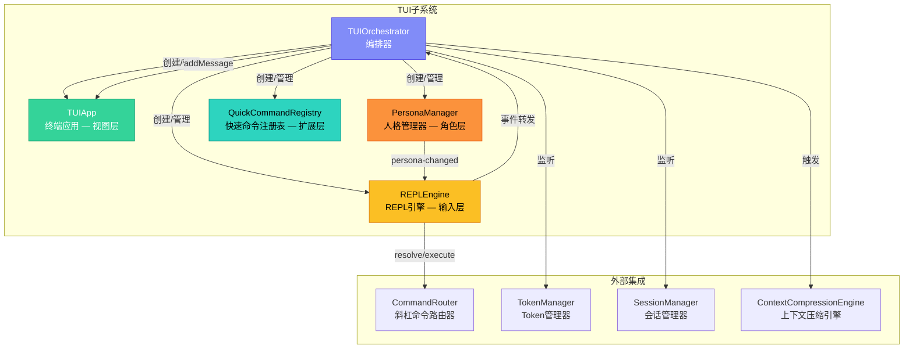
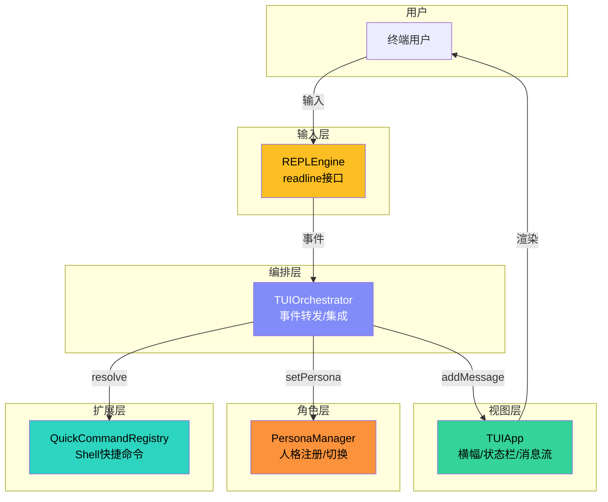
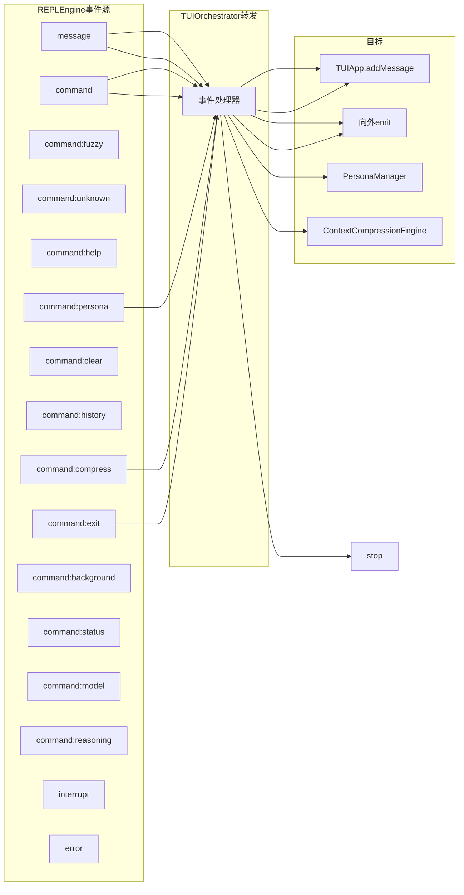
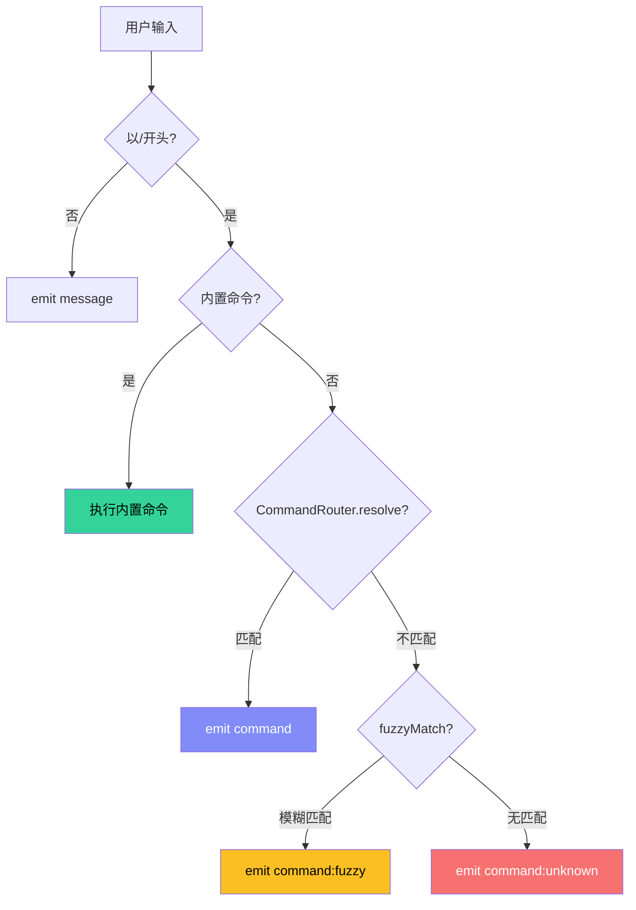
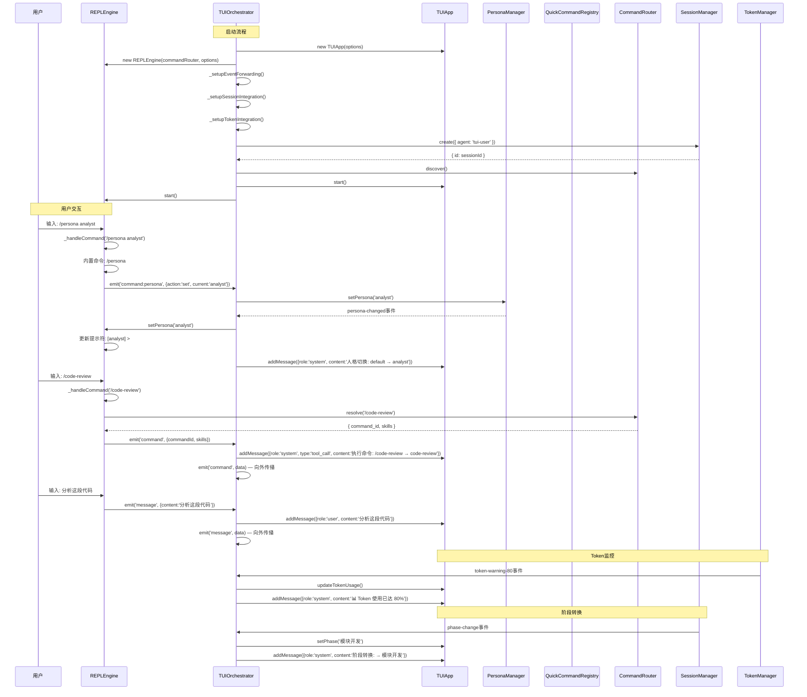
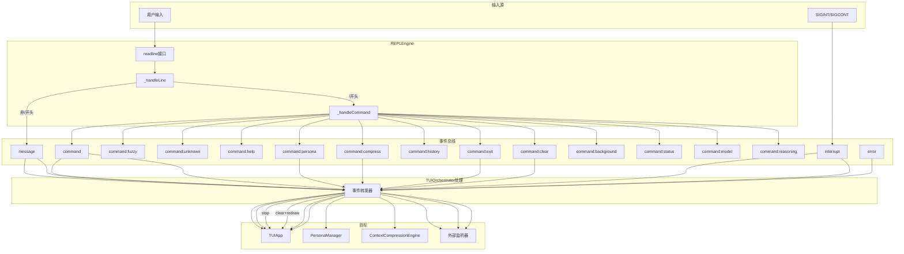

# 模块详解 — TUI子系统

> 源码路径：`src/runtime/tui/` | 文件数：5 | 版本：2.73.4

---

## 目录

- [1. 概述](#1-概述)
- [2. 架构总览](#2-架构总览)
- [3. TUIApp — TUI终端应用](#3-tuiapp--tui终端应用)
  - [3.1 核心职责](#31-核心职责)
  - [3.2 类定义与接口](#32-类定义与接口)
  - [3.3 四区域布局详解](#33-四区域布局详解)
  - [3.4 ANSI颜色方案](#34-ansi颜色方案)
  - [3.5 关键方法详解](#35-关键方法详解)
  - [3.6 配置选项](#36-配置选项)
  - [3.7 事件](#37-事件)
  - [3.8 错误处理](#38-错误处理)
  - [3.9 使用示例](#39-使用示例)
- [4. TUIOrchestrator — TUI编排器](#4-tuiorchestrator--tui编排器)
  - [4.1 核心职责](#41-核心职责)
  - [4.2 类定义与接口](#42-类定义与接口)
  - [4.3 事件转发体系](#43-事件转发体系)
  - [4.4 关键方法详解](#44-关键方法详解)
  - [4.5 配置选项](#45-配置选项)
  - [4.6 事件](#46-事件)
  - [4.7 错误处理](#47-错误处理)
  - [4.8 使用示例](#48-使用示例)
- [5. REPLEngine — REPL引擎](#5-replengine--repl引擎)
  - [5.1 核心职责](#51-核心职责)
  - [5.2 类定义与接口](#52-类定义与接口)
  - [5.3 内置命令体系](#53-内置命令体系)
  - [5.4 关键方法详解](#54-关键方法详解)
  - [5.5 配置选项](#55-配置选项)
  - [5.6 事件](#56-事件)
  - [5.7 错误处理](#57-错误处理)
  - [5.8 使用示例](#58-使用示例)
- [6. PersonaManager — 人格管理器](#6-personamanager--人格管理器)
  - [6.1 核心职责](#61-核心职责)
  - [6.2 类定义与接口](#62-类定义与接口)
  - [6.3 内置人格与Agent角色映射](#63-内置人格与agent角色映射)
  - [6.4 关键方法详解](#64-关键方法详解)
  - [6.5 配置选项](#65-配置选项)
  - [6.6 事件](#66-事件)
  - [6.7 使用示例](#67-使用示例)
- [7. QuickCommandRegistry — 快速命令注册表](#7-quickcommandregistry--快速命令注册表)
  - [7.1 核心职责](#71-核心职责)
  - [7.2 类定义与接口](#72-类定义与接口)
  - [7.3 危险模式检测](#73-危险模式检测)
  - [7.4 关键方法详解](#74-关键方法详解)
  - [7.5 配置选项](#75-配置选项)
  - [7.6 事件](#76-事件)
  - [7.7 使用示例](#77-使用示例)
- [8. 子系统协作流程](#8-子系统协作流程)
- [9. 设计决策与权衡](#9-设计决策与权衡)

---

## 1. 概述

TUI（Terminal User Interface，终端用户界面）子系统是Harness框架的人机交互入口，提供基于ANSI转义序列的彩色终端界面、交互式REPL命令循环、人格上下文管理和Shell快捷命令扩展。它将AI Agent的强大能力以直观的终端交互方式呈现给用户。

TUI子系统的设计遵循"分层分责"原则，将输入层（REPLEngine）、视图层（TUIApp）、角色上下文层（PersonaManager）和命令扩展层（QuickCommandRegistry）通过编排器（TUIOrchestrator）组合为完整系统。

### 核心价值

| 价值维度 | 实现方式 |
|---------|---------|
| 实时可视化 | 四区域TUI布局，Token进度条实时刷新 |
| 交互式控制 | REPL循环 + 11个内置命令 + 斜杠命令路由 |
| 角色切换 | 14个内置人格，映射28个Agent角色 |
| 安全防护 | 11种危险Shell模式检测 |
| 运行时集成 | SessionManager/TokenManager/CommandRouter无缝集成 |

---

## 2. 架构总览



### 组件分层架构



---

## 3. TUIApp — TUI终端应用

**源文件**：`src/runtime/tui/tui-app.js`

### 3.1 核心职责

TUIApp是TUI子系统的视图层组件，负责所有终端可视输出：

1. **四区域布局渲染**：横幅区、状态栏区、消息流区、提示符区
2. **Token进度条**：实时显示Token用量，颜色随使用率变化
3. **消息格式化**：按角色（user/assistant/system/tool）添加颜色前缀
4. **ANSI能力检测**：自动检测终端ANSI支持，不支持时降级为纯文本
5. **定时刷新**：状态栏按配置间隔自动刷新

### 3.2 类定义与接口

```javascript
class TUIApp extends EventEmitter {
  constructor(options)

  // 生命周期
  start()
  stop()

  // 消息
  addMessage(msg)
  getMessages()

  // 状态更新
  updateTokenUsage(usage)
  setModel(model)
  getModel()
  setPhase(phase)
  setSkillCount(count)
  setCommandCount(count)
  setToolCount(count)

  // 状态查询
  isRunning()
  getStats()
}
```

### 3.3 四区域布局详解

```
╔═══════════════════════════════════════════════════════════╗
║          Harness Engineering TUI — AI 操作中心           ║  ← 横幅区
╚═══════════════════════════════════════════════════════════╝
  模型: gpt-4  |  技能: 60  |  命令: 24  |  工具: 15        ← 横幅统计
────────────────────────────────────────────────────────────
模型: gpt-4  |  Token: [████████░░░░░░░░░░░░] 40%  |  时长: 5m 30s  |  阶段: 模块开发  |  成本: $0.0042
────────────────────────────────────────────────────────────  ← 状态栏区
  你 > 你好，请帮我分析这段代码                                    ← 消息流区
  AI > 我来分析一下这段代码的结构...                               （user/assistant/
  系统 > 阶段转换: → 模块开发                                      system/tool）
  工具[grep] > 调用 grep...
[analyst] > _                                                    ← 提示符区（REPLEngine管理）
```

#### 横幅区（Banner）

显示项目标题框和运行时统计信息：
- 项目标题：`Harness Engineering TUI — AI 操作中心`
- 模型名称
- 技能数量
- 命令数量
- 工具数量

#### 状态栏区（Status Bar）

显示运行时状态信息，定时刷新：
- 当前模型
- Token进度条（颜色随使用率变化）
- 运行时长
- 当前阶段
- 累计成本

#### 消息流区（Message Stream）

显示用户/AI/系统/工具消息：
- user消息：紫色前缀 `你 >`
- assistant消息：绿色前缀 `AI >`
- system消息：灰色前缀 `系统 >`
- tool消息：黄色前缀 `工具[toolName] >`

#### 提示符区（Prompt）

由REPLEngine管理，显示当前人格和输入提示符。

### 3.4 ANSI颜色方案

TUIApp使用24位真彩色ANSI转义序列：

| 颜色名 | RGB | 用途 |
|--------|-----|------|
| GREEN | `#34D399` | Token用量 < 50% |
| YELLOW | `#FBBF24` | Token用量 50%-80% |
| ORANGE | `#FB923C` | Token用量 80%-95% |
| RED | `#F87171` | Token用量 >= 95% |
| PRIMARY | `#818CF8` | 标题和强调 |
| MUTED | `#94A3B8` | 次要信息 |

**Token进度条颜色变化**：


**ANSI能力检测**：
- Unix TTY：默认支持
- Windows：检测`TERM_PROGRAM`或`WT_SESSION`环境变量
- 非TTY：检测`TERM`环境变量（非`dumb`）
- 不支持时：所有ANSI转义序列返回空字符串

### 3.5 关键方法详解

#### `start()`

启动TUI渲染。绘制初始横幅和状态栏，启动定时刷新周期。

```javascript
const tui = new TUIApp({ tokenManager, sessionManager, model: 'gpt-4' });
tui.start();
// 终端显示横幅和状态栏，开始定时刷新
```

**启动流程**：
1. 设置`_running = true`，记录启动时间
2. 调用`_renderBanner()`绘制横幅
3. 调用`_renderStatusBar()`绘制状态栏
4. 启动定时器，按`renderInterval`间隔刷新状态栏
5. 定时器调用`unref()`避免阻止进程退出
6. 触发`started`事件

#### `addMessage(msg)`

添加消息到消息流并立即渲染。消息存储在BoundedArray中（上限200条）。

```javascript
tui.addMessage({ role: 'user', content: '你好' });
tui.addMessage({ role: 'assistant', content: '分析完成', type: 'text' });
tui.addMessage({ role: 'tool', content: '...', type: 'tool_call', toolName: 'grep' });
tui.addMessage({ role: 'system', content: '阶段转换: → 模块开发' });
```

**消息对象**：

| 字段 | 类型 | 说明 |
|------|------|------|
| role | string | 消息角色：`user` / `assistant` / `system` / `tool` |
| content | string | 消息内容 |
| type | string | 消息类型：`text` / `tool_call` / `tool_result` |
| toolName | string | 工具名称（role为`tool`时） |
| timestamp | number | 时间戳（默认`Date.now()`） |

**内容格式化**：
- `tool_call`类型：显示`调用 toolName...`
- `tool_result`类型：超过5行截断，显示`... (N more lines)`
- 控制字符过滤：移除0x00-0x1F和0x7F范围的控制字符

#### `updateTokenUsage(usage)`

更新Token用量显示数据。下次状态栏刷新时将反映新数据。

```javascript
tui.updateTokenUsage({ used: 80000, budget: 100000, ratio: 0.8, cost: 0.42 });
// 状态栏Token进度条变为黄色
```

**Token用量对象**：

| 字段 | 类型 | 说明 |
|------|------|------|
| used | number | 已使用Token数 |
| budget | number | Token预算总量 |
| ratio | number | 使用比率（0-1） |
| cost | number | 累计成本（美元） |

#### `getStats()`

获取TUI应用运行统计信息。

```javascript
const stats = tui.getStats();
// {
//   running: true,
//   model: 'gpt-4',
//   phase: '模块开发',
//   messageCount: 42,
//   skillCount: 60,
//   commandCount: 24,
//   toolCount: 15,
//   elapsed: 330000,  // 毫秒
//   cost: 0.42,
//   ansiSupport: true
// }
```

### 3.6 配置选项

```javascript
// 构造函数选项
const options = {
  tokenManager: null,          // TokenManager实例
  sessionManager: null,        // SessionManager实例
  commandRouter: null,         // CommandRouter实例
  modelSelector: null,         // ModelSelector实例
  model: 'default',            // 初始模型名称
  renderInterval: 1000,        // 状态栏刷新间隔（毫秒）
};
```

**内部常量**：

| 常量 | 值 | 说明 |
|------|-----|------|
| MAX_MESSAGES | 200 | 消息存储上限 |
| PROGRESS_BAR_WIDTH | 20 | 进度条宽度（字符数） |
| TOKEN_THRESHOLDS.GREEN | 0.5 | 绿色阈值 |
| TOKEN_THRESHOLDS.YELLOW | 0.8 | 黄色阈值 |
| TOKEN_THRESHOLDS.ORANGE | 0.95 | 橙色阈值 |
| TOKEN_THRESHOLDS.RED | 1.0 | 红色阈值 |

### 3.7 事件

| 事件名 | 触发时机 | 数据 |
|--------|---------|------|
| `started` | TUI启动 | 无 |
| `stopped` | TUI停止 | 无 |

### 3.8 错误处理

- `_write()`方法写入stdout失败时通过debug日志记录，不抛出异常
- `_detectAnsiSupport()`检测异常时默认返回`false`
- `addMessage()`对无效消息（无role）静默忽略
- `updateTokenUsage()`对无效数据静默忽略

### 3.9 使用示例

#### 基本使用

```javascript
const TUIApp = require('./src/runtime/tui/tui-app');

const tui = new TUIApp({
  tokenManager: tokenManager,
  sessionManager: sessionManager,
  model: 'gpt-4',
  renderInterval: 2000,
});

tui.on('started', () => console.log('TUI已启动'));

// 启动TUI
tui.start();

// 设置统计信息
tui.setSkillCount(60);
tui.setCommandCount(24);
tui.setToolCount(15);

// 添加消息
tui.addMessage({ role: 'user', content: '请分析这段代码' });
tui.addMessage({ role: 'assistant', content: '我来分析代码结构...' });
tui.addMessage({ role: 'system', content: '阶段转换: → 模块开发' });
tui.addMessage({ role: 'tool', content: '搜索结果...', type: 'tool_result', toolName: 'grep' });

// 更新Token用量
tui.updateTokenUsage({ used: 50000, budget: 100000, ratio: 0.5, cost: 0.25 });

// 切换模型
tui.setModel('claude-3');

// 切换阶段
tui.setPhase('集成测试');

// 获取统计
console.log('消息数量:', tui.getStats().messageCount);

// 停止TUI
tui.stop();
```

---

## 4. TUIOrchestrator — TUI编排器

**源文件**：`src/runtime/tui/tui-orchestrator.js`

### 4.1 核心职责

TUIOrchestrator是TUI子系统的顶层编排器，负责：

1. **组件编排**：创建和管理TUIApp、REPLEngine、PersonaManager、QuickCommandRegistry
2. **事件转发**：将REPLEngine事件转发到TUIApp消息流
3. **会话集成**：与SessionManager集成，管理会话创建/恢复/终止
4. **Token集成**：与TokenManager集成，监控Token用量
5. **上下文压缩**：通过`/compress`命令触发ContextCompressionEngine
6. **生命周期管理**：统一管理所有TUI组件的启动和关闭

### 4.2 类定义与接口

```javascript
class TUIOrchestrator extends EventEmitter {
  constructor(projectRoot, options)

  // 生命周期
  start()
  stop()

  // 会话
  resumeSession(sessionId)
  continueLastSession()

  // 访问器
  getPersonaManager()
  getQuickCommandRegistry()
  getTUIApp()
  getREPLEngine()
  isRunning()
  getStats()
}
```

### 4.3 事件转发体系

TUIOrchestrator建立了从REPLEngine到TUIApp的完整事件转发链：



**完整事件转发映射**：

| REPLEngine事件 | TUIApp操作 | 向外emit |
|---------------|-----------|---------|
| `message` | addMessage(user) | `message` |
| `command` | addMessage(system, tool_call) | `command` |
| `command:fuzzy` | addMessage(system) | — |
| `command:unknown` | addMessage(system) | — |
| `command:help` | addMessage(system) — 帮助文本 | — |
| `command:exit` | orchestrator.stop() | — |
| `command:clear` | 清屏 + 重绘横幅 | — |
| `command:history` | addMessage(system) — 历史记录 | — |
| `command:persona` | PersonaManager.setPersona + addMessage(system) | — |
| `command:compress` | addMessage(system) | `compress` |
| `command:background` | addMessage(system) | `background` |
| `command:status` | addMessage(system) — 运行状态 | — |
| `command:model` | TUIApp.setModel + addMessage(system) | — |
| `command:reasoning` | addMessage(system) | — |
| `interrupt` | addMessage(system) | `interrupt` |
| `error` | addMessage(system) | — |

### 4.4 关键方法详解

#### `start()`

启动TUI编排器。依次创建子组件、建立事件转发、创建会话、发现命令、启动渲染和输入循环。

```javascript
const orchestrator = new TUIOrchestrator('/project/root', {
  commandRouter: router,
  tokenManager: tokenMgr,
  sessionManager: sessionMgr,
  contextCompressionEngine: compressionEngine,
  theme: 'dark',
  model: 'gpt-4',
  quickCommands: { quick_commands: [...] },
});

await orchestrator.start();
```

**启动流程**：

1. 创建TUIApp实例（注入TokenManager/SessionManager/CommandRouter）
2. 创建REPLEngine实例（注入CommandRouter/Persona/SessionId）
3. 建立事件转发（`_setupEventForwarding`）
4. 建立会话集成（`_setupSessionIntegration`）
5. 建立Token集成（`_setupTokenIntegration`）
6. 创建新会话（通过SessionManager）
7. 发现命令（通过CommandRouter）
8. 启动TUIApp渲染
9. 启动REPLEngine输入循环
10. 触发`started`事件

**并发控制**：同一时刻只允许一个启动过程运行（通过`_startPromise`互斥）。

#### `stop()`

停止TUI编排器。依次停止子组件、终止会话。

```javascript
orchestrator.stop();
```

**停止流程**：
1. 清理外部事件监听器（`_cleanupExternalListeners`）
2. 停止REPLEngine
3. 停止TUIApp
4. 终止关联会话（通过SessionManager）
5. 触发`stopped`事件

#### `resumeSession(sessionId)`

恢复指定会话。

```javascript
if (orchestrator.resumeSession('sess-abc123')) {
  console.log('会话已恢复');
}
```

**恢复操作**：
1. 通过SessionManager获取会话数据
2. 更新REPLEngine的会话ID
3. 更新TUIApp的阶段显示
4. 刷新Token用量显示

#### `continueLastSession()`

恢复最近的活跃会话。

```javascript
if (orchestrator.continueLastSession()) {
  console.log('已恢复最近会话');
}
```

### 4.5 配置选项

```javascript
const options = {
  commandRouter: null,                  // CommandRouter实例
  tokenManager: null,                   // TokenManager实例
  sessionManager: null,                 // SessionManager实例
  contextCompressionEngine: null,       // ContextCompressionEngine实例
  theme: 'dark',                        // TUI主题：'dark' | 'light' | 'highcontrast'
  model: 'default',                     // 初始模型名称
  quickCommands: null,                  // 快速命令配置
};
```

**主题定义**：

| 主题 | ID | 说明 |
|------|-----|------|
| 暗色 | `dark` | 默认主题 |
| 亮色 | `light` | 浅色背景 |
| 高对比度 | `highcontrast` | 无障碍主题 |

### 4.6 事件

| 事件名 | 触发时机 | 数据 |
|--------|---------|------|
| `started` | 编排器启动 | 无 |
| `stopped` | 编排器停止 | 无 |
| `message` | 用户消息 | `{ content, sessionId }` |
| `command` | 斜杠命令 | `{ commandId, name, skills, args, plan }` |
| `compress` | 压缩命令 | 无 |
| `background` | 后台任务 | `{ task }` |
| `interrupt` | 中断操作 | 无 |

### 4.7 错误处理

- 会话创建失败时静默跳过（debug日志记录）
- 命令发现失败时静默跳过
- 会话终止失败时静默跳过
- Token用量获取失败时静默跳过
- 所有外部管理器操作使用try-catch包装

### 4.8 使用示例

#### 完整TUI生命周期

```javascript
const TUIOrchestrator = require('./src/runtime/tui/tui-orchestrator');

const orchestrator = new TUIOrchestrator('/project/root', {
  commandRouter: commandRouter,
  tokenManager: tokenManager,
  sessionManager: sessionManager,
  contextCompressionEngine: compressionEngine,
  theme: 'dark',
  model: 'gpt-4',
  quickCommands: {
    quick_commands: [
      { id: 'build', command: 'npm run build', description: '构建项目' },
      { id: 'test', command: 'npm test', alias: 't', confirmRequired: true },
    ],
  },
});

// 监听事件
orchestrator.on('message', (data) => {
  // 处理用户输入（发送到AI模型）
  aiModel.sendMessage(data.content);
});

orchestrator.on('command', (data) => {
  // 执行技能链
  skillChain.execute(data.skills);
});

orchestrator.on('compress', () => {
  // 触发上下文压缩
  compressionEngine.compress();
});

// 启动
await orchestrator.start();

// 恢复会话
orchestrator.resumeSession('sess-abc123');

// 获取统计
const stats = orchestrator.getStats();
console.log('运行状态:', stats.running);
console.log('当前人格:', stats.persona);
console.log('消息数量:', stats.messageCount);

// 停止
orchestrator.stop();
// 或调用 shutdown()（由withShutdown混入提供）
```

---

## 5. REPLEngine — REPL引擎

**源文件**：`src/runtime/tui/repl-engine.js`

### 5.1 核心职责

REPLEngine是TUI子系统的输入层组件，负责：

1. **REPL循环**：基于Node.js readline的读取-求值-输出循环
2. **命令路由**：斜杠命令解析与CommandRouter集成
3. **内置命令**：11个内置命令的解析与执行
4. **命令历史**：RingBuffer存储的命令历史记录
5. **人格管理**：当前人格状态维护与提示符更新

### 5.2 类定义与接口

```javascript
class REPLEngine extends EventEmitter {
  constructor(commandRouter, options)

  // 生命周期
  start()
  stop()

  // 命令
  completeCommand(partial)

  // 人格
  setPersona(persona)
  getPersona()

  // 会话
  setSessionId(sessionId)
  getSessionId()

  // 输出
  writeOutput(text)

  // 状态
  isRunning()
  getHistory()
  getStats()
}
```

### 5.3 内置命令体系

REPLEngine提供11个内置命令，无需CommandRouter即可使用：

| 命令 | 参数 | 说明 | 触发事件 |
|------|------|------|---------|
| `/help` | 无 | 显示帮助信息 | `command:help` |
| `/exit` | 无 | 退出REPL | `command:exit` |
| `/quit` | 无 | 退出REPL（别名） | `command:exit` |
| `/clear` | 无 | 清屏 | `command:clear` |
| `/history` | 无 | 显示命令历史 | `command:history` |
| `/persona` | `[id]` | 查看/切换人格 | `command:persona` |
| `/compress` | 无 | 触发上下文压缩 | `command:compress` |
| `/background` | `<task>` | 后台任务 | `command:background` |
| `/status` | 无 | 显示状态 | `command:status` |
| `/model` | `[name]` | 查看/切换模型 | `command:model` |
| `/reasoning` | `[level]` | 设置推理强度 | `command:reasoning` |

**命令处理优先级**：



### 5.4 关键方法详解

#### `start()`

启动REPL循环。创建readline接口并绑定事件。

```javascript
const repl = new REPLEngine(commandRouter, { persona: 'analyst' });
repl.start();
// 提示符显示: [analyst] >
```

**readline配置**：

```javascript
{
  input: process.stdin,
  output: process.stdout,
  prompt: this._getPrompt(),
  historySize: 100,
  removeHistoryDuplicates: true,
  crlfDelay: Infinity,
}
```

**事件绑定**：
- `line` → `_handleLine(line)` 处理用户输入
- `close` → 设置running=false，触发close事件
- `SIGINT` → 触发interrupt事件（Ctrl+C）
- `SIGCONT` → 重新显示提示符（后台恢复）

#### `_handleLine(line)`

处理用户输入的一行文本。

```javascript
// 内部处理逻辑
_handleLine(line) {
  const trimmed = line.trim();

  // 空行忽略
  if (trimmed.length === 0) return;

  // 超长输入检查
  if (trimmed.length > MAX_INPUT_LENGTH) {
    this.emit('error', { type: 'input_too_long', length: trimmed.length });
    return;
  }

  // 记录历史
  this._history.push({ input: trimmed, timestamp: Date.now() });

  // 路由
  if (trimmed.startsWith('/')) {
    this._handleCommand(trimmed);  // 斜杠命令
  } else {
    this.emit('message', { content: trimmed, sessionId: this._sessionId });  // 普通消息
  }
}
```

**输入限制**：
- 最大输入长度：4096字符
- 命令历史上限：500条（RingBuffer）
- 历史去重：readline内置`removeHistoryDuplicates`

#### `setPersona(persona)`

切换当前人格并更新提示符。

```javascript
repl.setPersona('analyst');
// 提示符从 "> " 变为 "[analyst] > "
```

**提示符格式**：
- 默认人格：`> `
- 非默认人格：`[persona] > `

#### `completeCommand(partial)`

基于部分输入补全斜杠命令。委托给CommandRouter的complete方法。

```javascript
const matches = repl.completeCommand('/co');
// 可能返回: [{ command_id: '/code-review', name: '代码审查', ... }]
```

### 5.5 配置选项

```javascript
const options = {
  persona: 'default',    // 初始人格标识
  sessionId: null,       // 关联的会话ID
};
```

**内部常量**：

| 常量 | 值 | 说明 |
|------|-----|------|
| MAX_HISTORY | 500 | 命令历史上限 |
| MAX_INPUT_LENGTH | 4096 | 最大输入长度 |
| PROMPT_SUFFIX | `> ` | 提示符后缀 |
| SLASH_PREFIX | `/` | 斜杠命令前缀 |

### 5.6 事件

| 事件名 | 触发时机 | 数据 |
|--------|---------|------|
| `started` | REPL启动 | 无 |
| `stopped` | REPL停止 | 无 |
| `close` | readline关闭 | 无 |
| `interrupt` | Ctrl+C | 无 |
| `message` | 用户消息 | `{ content, sessionId }` |
| `command` | 斜杠命令 | `{ commandId, name, skills, args, plan }` |
| `command:fuzzy` | 模糊匹配 | `{ input, matched, name }` |
| `command:unknown` | 未知命令 | `{ input, args }` |
| `command:help` | 帮助命令 | `{}` |
| `command:exit` | 退出命令 | `{}` |
| `command:clear` | 清屏命令 | `{}` |
| `command:history` | 历史命令 | `{ entries }` |
| `command:persona` | 人格命令 | `{ action, previous, current }` |
| `command:compress` | 压缩命令 | `{}` |
| `command:background` | 后台命令 | `{ task }` |
| `command:status` | 状态命令 | `{}` |
| `command:model` | 模型命令 | `{ model }` |
| `command:reasoning` | 推理命令 | `{ level }` |
| `error` | 错误 | `{ type, ... }` |
| `persona-changed` | 人格变更 | `{ previous, current }` |

### 5.7 错误处理

- 超长输入触发`error`事件（`input_too_long`类型）
- CommandRouter异常触发`error`事件（`commandRouter`来源）
- 无error监听器时使用`safe-error`事件避免未捕获异常
- readline关闭时自动停止REPL

### 5.8 使用示例

#### 基本REPL使用

```javascript
const REPLEngine = require('./src/runtime/tui/repl-engine');

const repl = new REPLEngine(commandRouter, {
  persona: 'analyst',
  sessionId: 'sess-001',
});

// 监听事件
repl.on('message', (data) => {
  console.log('用户输入:', data.content);
});

repl.on('command', (data) => {
  console.log('执行命令:', data.commandId, '→', data.skills.join(' → '));
});

repl.on('command:unknown', (data) => {
  console.log('未知命令:', data.input);
});

repl.on('interrupt', () => {
  console.log('用户中断');
});

// 启动
repl.start();

// 切换人格
repl.setPersona('qa');
// 提示符变为: [qa] >

// 获取统计
const stats = repl.getStats();
console.log('运行中:', stats.running);
console.log('当前人格:', stats.persona);
console.log('历史记录:', stats.historySize);
```

---

## 6. PersonaManager — 人格管理器

**源文件**：`src/runtime/tui/persona-manager.js`

### 6.1 核心职责

PersonaManager是TUI子系统的角色上下文层，负责：

1. **内置人格管理**：14个内置人格的注册与查询
2. **自定义人格管理**：动态添加/移除自定义人格
3. **人格切换**：切换当前激活人格，触发事件通知
4. **Agent角色映射**：内置人格映射到Harness 28个Agent角色

### 6.2 类定义与接口

```javascript
class PersonaManager extends EventEmitter {
  constructor(options)

  getPersona(id)
  getCurrentPersona()
  getCurrentPersonaData()
  setPersona(id)
  addPersona(id, persona)
  removePersona(id)
  listPersonas()
  getPersonaPrompt(id)
  getStats()
}
```

### 6.3 内置人格与Agent角色映射

| 人格ID | 名称 | 对应Agent角色 | 系统提示词摘要 |
|--------|------|--------------|--------------|
| `default` | 默认 | 标准专业模式 | （空） |
| `analyst` | 分析师 | Domain Analyst | 需求分析、架构设计、代码审核 |
| `worker` | 执行者 | Task Worker | 编码实现、工具调用 |
| `qa` | 质量保证 | Quality Assurance | 测试设计、缺陷管理 |
| `lead` | 负责人 | Team Lead | 项目拆解、任务分配、进度监控 |
| `devops` | 运维 | DevOps Engineer | 基础设施、构建部署、系统监控 |
| `writer` | 文档 | Technical Writer | 文档编写、知识管理 |
| `reviewer` | 审查员 | Code Reviewer | 代码质量审查、反模式检测 |
| `security` | 安全员 | Security Reviewer | 安全审计、漏洞检测 |
| `planner` | 规划师 | Planner | 需求探索、任务拆解 |
| `tester` | 测试员 | Test Writer | TDD测试编写、覆盖率优化 |
| `concise` | 极简 | 风格模式 | 最简洁方式回复 |
| `detailed` | 详细 | 风格模式 | 详尽解释 |
| `pirate` | 海盗 | 风格模式 | 海盗风格 |
| `kawaii` | 可爱 | 风格模式 | 可爱友好风格 |

### 6.4 关键方法详解

#### `setPersona(id)`

切换当前激活人格。仅当目标人格已注册时才切换。

```javascript
const pm = new PersonaManager();

pm.setPersona('analyst');  // true — 切换成功
pm.setPersona('unknown');  // false — 未知人格
```

**切换逻辑**：
1. 检查目标人格是否已注册
2. 更新`_currentPersona`
3. 触发`persona-changed`事件

#### `addPersona(id, persona)`

注册自定义人格。内置人格ID不可覆盖。

```javascript
pm.addPersona('mentor', {
  name: '导师',
  description: '教学指导模式',
  prompt: '你是一位耐心的导师，用苏格拉底式提问引导学习。',
});
// true — 注册成功

pm.addPersona('analyst', { ... });  // false — 内置人格不可覆盖
pm.addPersona('bad id!', { ... });  // false — ID格式不合法
pm.addPersona('a'.repeat(65), { ... });  // false — ID过长
```

**ID校验规则**：
- 必须匹配`/^[a-zA-Z0-9_-]+$/`
- 长度不超过64
- 不得与内置人格ID冲突
- 总数不超过50

#### `removePersona(id)`

移除自定义人格。内置人格不可移除。若移除的是当前激活人格，自动回退到default。

```javascript
pm.addPersona('mentor', { name: '导师', ... });
pm.setPersona('mentor');

pm.removePersona('mentor');  // true — 移除成功，自动回退到default
pm.removePersona('analyst'); // false — 内置人格不可移除
```

#### `listPersonas()`

列出所有已注册人格（内置+自定义），包含激活状态标记。

```javascript
const personas = pm.listPersonas();
// [
//   { id: 'default', name: '默认', description: '标准专业模式', builtin: true, active: false },
//   { id: 'analyst', name: '分析师', description: 'Domain Analyst 角色模式', builtin: true, active: true },
//   { id: 'mentor', name: '导师', description: '教学指导模式', builtin: false, active: false },
//   ...
// ]
```

#### `getPersonaPrompt(id)`

获取指定人格的系统提示词。未指定ID时返回当前人格的提示词。

```javascript
pm.setPersona('analyst');
const prompt = pm.getPersonaPrompt();
// '你是一位领域分析师，专注于需求分析、架构设计和代码审核。'

const qaPrompt = pm.getPersonaPrompt('qa');
// '你是一位质量保证专家，专注于测试设计和缺陷管理。'
```

### 6.5 配置选项

```javascript
// 构造函数选项（当前未使用，保留扩展）
const options = {};

// 内部常量
const MAX_PERSONAS = 50;  // 最大人格数（内置+自定义）
```

### 6.6 事件

| 事件名 | 触发时机 | 数据 |
|--------|---------|------|
| `persona-changed` | 人格切换 | `{ previous, current, data }` |
| `persona-added` | 自定义人格添加 | `{ id, data }` |
| `persona-removed` | 自定义人格移除 | `{ id }` |

### 6.7 使用示例

```javascript
const PersonaManager = require('./src/runtime/tui/persona-manager');

const pm = new PersonaManager();

// 监听人格切换
pm.on('persona-changed', ({ previous, current, data }) => {
  console.log(`人格切换: ${previous} → ${current}`);
  console.log(`提示词: ${data.prompt}`);
});

// 列出所有人格
pm.listPersonas().forEach(p => {
  const marker = p.active ? ' *' : '';
  const type = p.builtin ? '内置' : '自定义';
  console.log(`${p.id} (${p.name})${marker} [${type}]`);
});

// 切换到分析师模式
pm.setPersona('analyst');
// 输出: 人格切换: default → analyst

// 添加自定义人格
pm.addPersona('mentor', {
  name: '导师',
  description: '教学指导模式',
  prompt: '你是一位耐心的导师，用苏格拉底式提问引导学习。',
});

// 切换到自定义人格
pm.setPersona('mentor');

// 获取当前提示词
const prompt = pm.getPersonaPrompt();
console.log('当前提示词:', prompt);

// 移除自定义人格
pm.removePersona('mentor');
// 自动回退到default

// 统计信息
const stats = pm.getStats();
console.log(`总人格: ${stats.totalPersonas}, 内置: ${stats.builtinCount}, 自定义: ${stats.customCount}`);
```

---

## 7. QuickCommandRegistry — 快速命令注册表

**源文件**：`src/runtime/tui/quick-command-registry.js`

### 7.1 核心职责

QuickCommandRegistry是TUI子系统的命令扩展层，负责：

1. **Shell命令注册**：注册非斜杠命令的Shell快捷入口
2. **别名映射**：命令ID到别名的双向映射
3. **危险模式检测**：11种危险Shell模式自动检测与拒绝
4. **自动补全**：基于部分输入的命令补全
5. **批量加载**：从配置文件批量加载命令

### 7.2 类定义与接口

```javascript
class QuickCommandRegistry extends EventEmitter {
  constructor(options)

  register(id, command, options)
  unregister(id)
  resolve(input)
  isQuickCommand(input)
  listCommands()
  loadFromConfig(config)
  complete(partial)
  getStats()
}
```

### 7.3 危险模式检测

QuickCommandRegistry内置11种危险Shell模式检测，注册时自动检查：

| # | 模式 | 检测正则 | 检测目标 |
|---|------|---------|---------|
| 1 | `rm -rf /` | `/rm\s+-rf\s+\//` | 递归强制删除根目录 |
| 2 | `del /S C:\` | `/del\s+\/[sS]\s+[cC]:\\/i` | Windows递归删除 |
| 3 | `format C:` | `/format\s+[cC]:/i` | Windows格式化磁盘 |
| 4 | `> /dev/` | `/>\s*\/dev\//` | 重定向到设备文件 |
| 5 | `\| sh` | `/\|\s*sh\b/` | 管道注入Shell |
| 6 | `\| bash` | `/\|\s*bash\b/` | 管道注入Bash |
| 7 | `curl ... \| sh` | `/curl\s+.*\|\s*sh/` | 远程代码执行（curl管道） |
| 8 | `wget ... \| sh` | `/wget\s+.*\|\s*sh/` | 远程代码执行（wget管道） |
| 9 | `mkfs` | `/mkfs/` | 文件系统格式化 |
| 10 | `dd if=` | `/dd\s+if=/` | 磁盘镜像写入 |
| 11 | `:(){ :\|:& }` | `/:\(\)\{\s*:\|:\&\s*\}/` | Fork炸弹 |

**检测时机**：在`register()`方法中，命令字符串与所有DANGEROUS_PATTERNS逐一匹配。匹配到任何模式则拒绝注册并触发`command:rejected`事件。

### 7.4 关键方法详解

#### `register(id, command, options)`

注册快速命令。执行ID安全校验和命令危险模式检测。

```javascript
const registry = new QuickCommandRegistry();

// 正常注册
registry.register('build', 'npm run build', {
  description: '构建项目',
  alias: 'b',
  confirmRequired: false,
});
// true — 注册成功

// 危险命令被拒绝
registry.register('danger', 'rm -rf /');
// false — 触发 command:rejected 事件

// 不合法ID被拒绝
registry.register('/slash', 'echo hello');
// false — ID不得以/开头

registry.register('bad id!', 'echo hello');
// false — ID不匹配安全正则
```

**ID校验规则**：
- 必须匹配`/^[a-zA-Z0-9_][a-zA-Z0-9_.\- ]*$/`
- 长度不超过64
- 不得以`/`开头（与斜杠命令命名空间隔离）
- 总数不超过50

**注册选项**：

| 字段 | 类型 | 默认值 | 说明 |
|------|------|--------|------|
| description | string | `''` | 命令描述 |
| alias | string | `null` | 命令别名 |
| confirmRequired | boolean | `false` | 是否需要执行前确认 |

#### `resolve(input)`

解析输入为已注册的命令。先按ID精确匹配，再按别名匹配。

```javascript
registry.register('test', 'npm test', { alias: 't' });

registry.resolve('test');  // { id: 'test', command: 'npm test', alias: 't', ... }
registry.resolve('t');     // 同上（通过别名解析）
registry.resolve('unknown');  // null
```

#### `loadFromConfig(config)`

从配置对象批量加载快速命令。

```javascript
const loaded = registry.loadFromConfig({
  quick_commands: [
    { id: 'build', command: 'npm run build', description: '构建项目' },
    { id: 'test', command: 'npm test', alias: 't', confirmRequired: true },
    { id: 'deploy', command: 'npm run deploy', description: '部署', confirmRequired: true },
    { id: 'danger', command: 'rm -rf /' },  // 被拒绝
  ],
});
console.log(`加载了 ${loaded} 个命令`);  // 3（danger被拒绝）
```

**配置格式**：支持`quick_commands`（snake_case）和`quickCommands`（camelCase）两种键名。

#### `complete(partial)`

基于部分输入自动补全命令。同时匹配ID和别名的前缀。

```javascript
registry.register('build', 'npm run build', { description: '构建' });
registry.register('test', 'npm test', { alias: 't', description: '测试' });

registry.complete('bu');
// [{ id: 'build', command: 'npm run build', description: '构建' }]

registry.complete('t');
// [{ id: 'test', command: 'npm test', alias: 't', description: '测试' }]
```

### 7.5 配置选项

```javascript
// 构造函数选项（当前未使用，保留扩展）
const options = {};

// 内部常量
const MAX_COMMANDS = 50;                          // 最大命令数
const SAFE_COMMAND_RE = /^[a-zA-Z0-9_][a-zA-Z0-9_.\- ]*$/;  // 安全ID正则
```

### 7.6 事件

| 事件名 | 触发时机 | 数据 |
|--------|---------|------|
| `command:registered` | 命令注册成功 | `{ id, command }` |
| `command:unregistered` | 命令注销 | `{ id }` |
| `command:rejected` | 命令被拒绝 | `{ id, reason }` |

**拒绝原因**：

| reason | 说明 |
|--------|------|
| `capacity_exceeded` | 命令数量已达上限 |
| `dangerous_pattern` | 匹配危险Shell模式 |

### 7.7 使用示例

```javascript
const QuickCommandRegistry = require('./src/runtime/tui/quick-command-registry');

const registry = new QuickCommandRegistry();

// 监听拒绝事件
registry.on('command:rejected', ({ id, reason }) => {
  console.warn(`命令 ${id} 被拒绝: ${reason}`);
});

// 注册命令
registry.register('build', 'npm run build', { description: '构建项目', alias: 'b' });
registry.register('test', 'npm test', { alias: 't', confirmRequired: true });
registry.register('lint', 'npx eslint src/', { description: '代码检查' });
registry.register('deploy', 'npm run deploy', {
  description: '部署到生产环境',
  confirmRequired: true,
});

// 尝试注册危险命令
registry.register('nuke', 'rm -rf /');
// 输出: 命令 nuke 被拒绝: dangerous_pattern

// 解析命令
const cmd = registry.resolve('b');  // 通过别名解析
console.log(`执行: ${cmd.command}`);  // 执行: npm run build

// 自动补全
const matches = registry.complete('l');
// [{ id: 'lint', command: 'npx eslint src/', description: '代码检查' }]

// 列出所有命令
registry.listCommands().forEach(cmd => {
  const confirm = cmd.confirmRequired ? ' [需确认]' : '';
  const alias = cmd.alias ? ` (别名: ${cmd.alias})` : '';
  console.log(`  ${cmd.id}${alias}: ${cmd.command}${confirm}`);
});

// 从配置批量加载
registry.loadFromConfig({
  quick_commands: [
    { id: 'start', command: 'node server.js', description: '启动服务器' },
    { id: 'clean', command: 'npm run clean', description: '清理构建产物' },
  ],
});

// 注销命令
registry.unregister('lint');

// 统计
const stats = registry.getStats();
console.log(`已注册 ${stats.totalCommands}/${stats.maxCommands} 个命令`);
```

---

## 8. 子系统协作流程

### TUI完整交互时序



### 事件流全景图



---

## 9. 设计决策与权衡

### 9.1 为什么选择原生ANSI而非ncurses/blessed

| 方案 | 优势 | 劣势 |
|------|------|------|
| ncurses/blessed | 丰富的TUI组件 | 重依赖，安装复杂，体积大 |
| **原生ANSI** | **零依赖，轻量，跨平台** | **功能有限，无复杂布局** |

选择原生ANSI的原因：
- Harness TUI需求简单（横幅+状态栏+消息流），不需要复杂组件
- 零依赖确保在任何Node.js环境都能运行
- ANSI降级策略确保不支持时也能正常显示纯文本

### 9.2 为什么消息存储使用BoundedArray

- 防止长时间运行会话中消息无限增长导致内存泄漏
- 上限200条消息足够回溯最近的交互历史
- 超出上限时自动丢弃最旧的消息

### 9.3 为什么REPLEngine使用readline而非自定义输入

- readline是Node.js内置模块，零依赖
- 自动处理行编辑、历史导航、Ctrl+C等
- 支持自定义提示符和补全
- 跨平台兼容（Windows/Unix）

### 9.4 为什么危险模式检测在注册时而非执行时

- 注册时检测可以提前阻止危险命令进入系统
- 避免运行时检测的性能开销
- 用户在注册时就能得到反馈，而不是执行时才发现被阻止
- 与"安全左移"原则一致——尽早发现安全问题

### 9.5 为什么人格ID不得以/开头

- `/`前缀是斜杠命令的命名空间
- 快速命令和斜杠命令必须隔离，避免命名冲突
- 用户输入`/xxx`时，REPLEngine优先识别为斜杠命令
- 快速命令通过REPLEngine的`message`事件或QuickCommandRegistry的`resolve`方法触发

### 9.6 事件监听器清理策略

TUIOrchestrator在`stop()`和`_onShutdown()`中主动清理所有外部事件监听器：
- REPLEngine上的16个事件监听器
- PersonaManager上的1个事件监听器
- SessionManager上的3个事件监听器
- TokenManager上的3个事件监听器

这防止了重复`start()`时产生重复监听器导致的内存泄漏和重复处理。

---

> **相关文档**：
> - [[模块详解-CommandRouter模块]] — 斜杠命令路由器
> - [[模块详解-SessionManager会话管理器]] — 会话状态管理
> - [[模块详解-TokenManager模块]] — Token用量追踪
> - [[模块详解-上下文压缩引擎]] — 上下文压缩
> - [[模块详解-SkillRouter模块]] — 技能路由引擎
