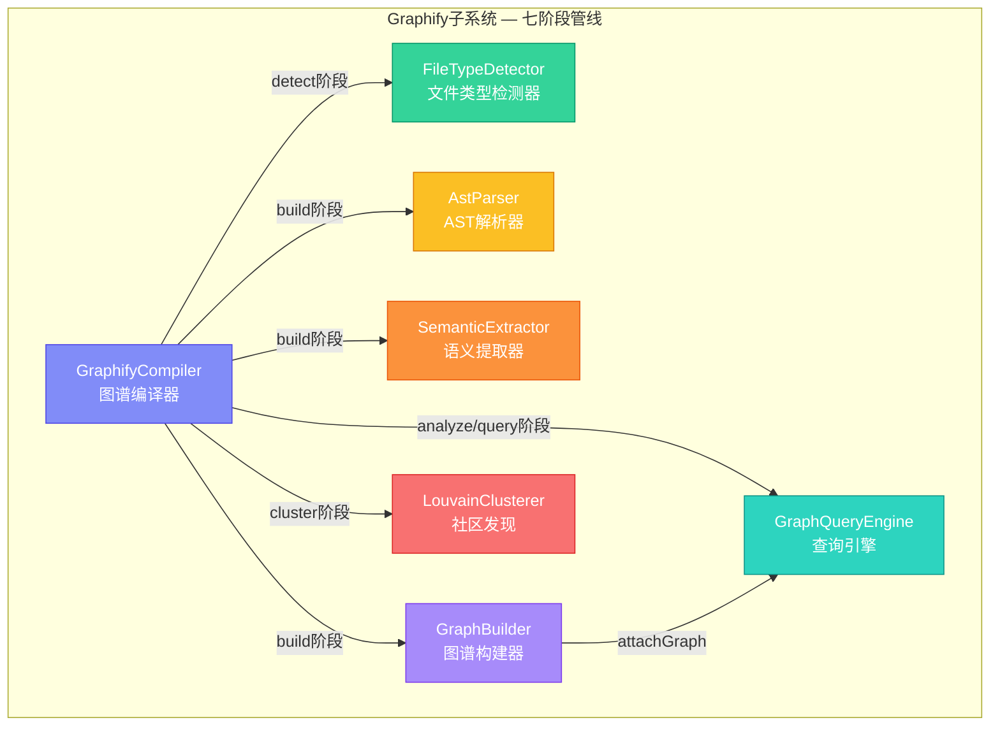
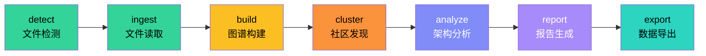
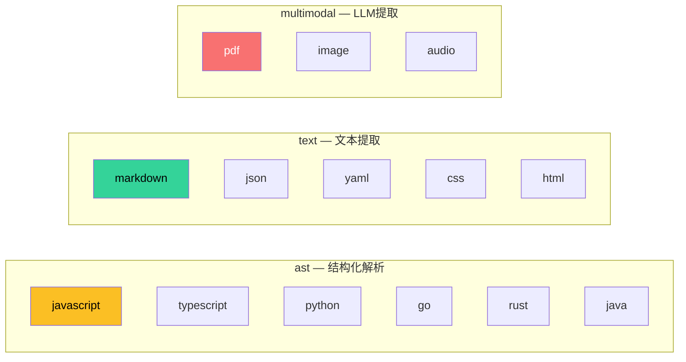
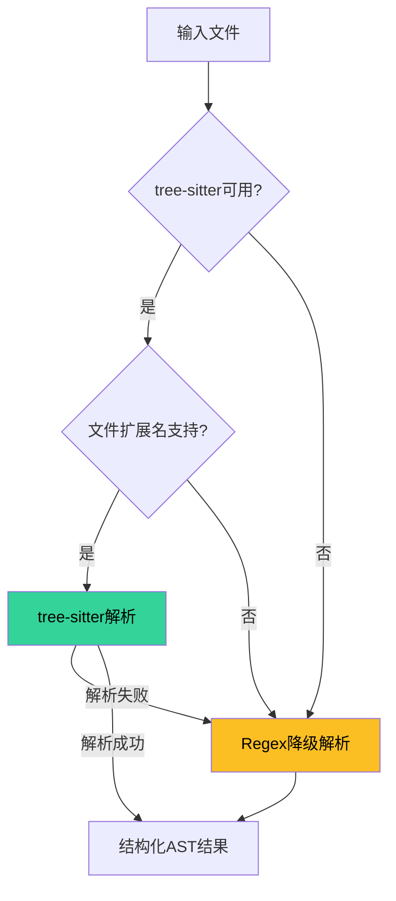
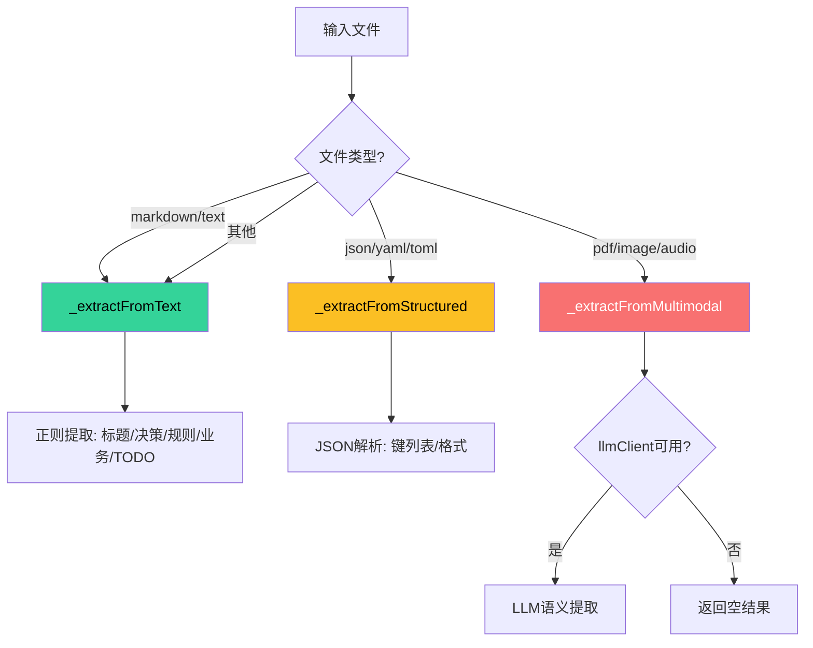
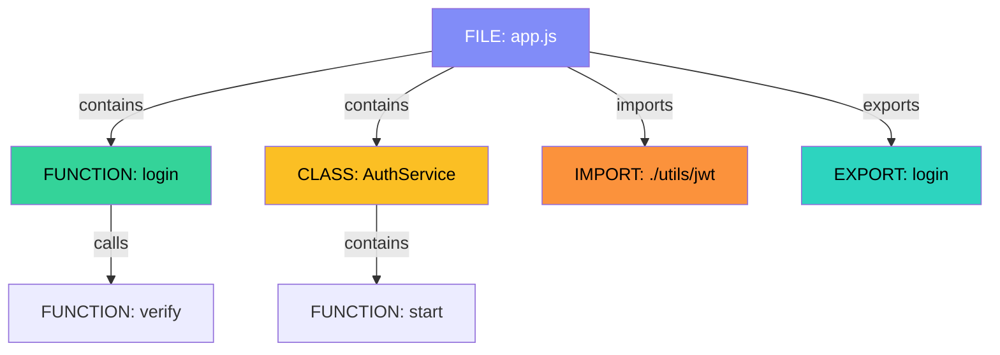
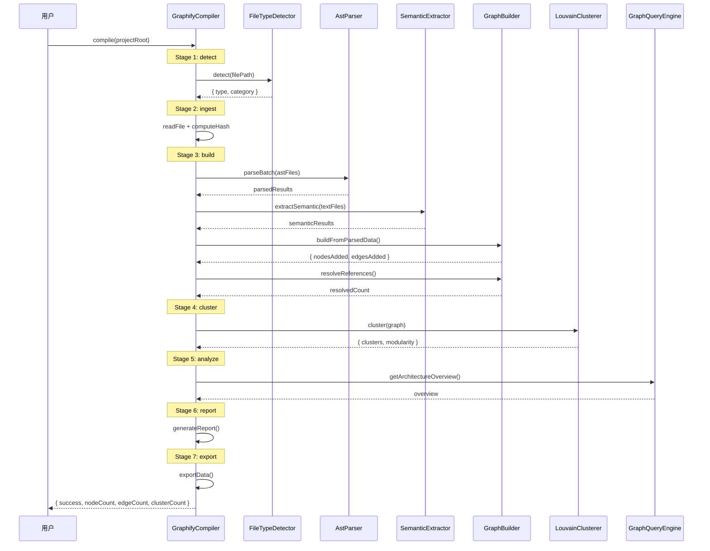
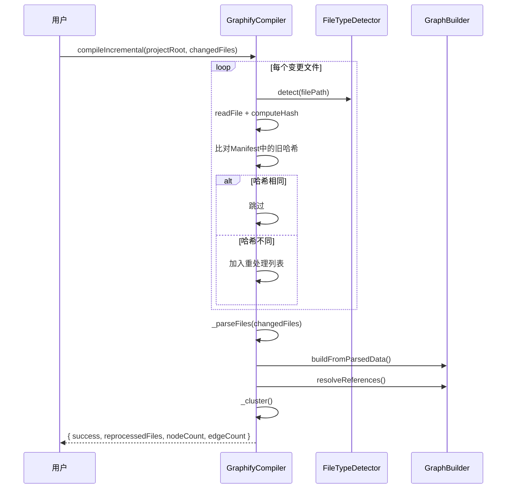

# 模块详解 — 图谱编译子系统（Graphify）

> 源码路径：`src/runtime/graphify/` | 文件数：7 | 版本：2.73.4

---

## 目录

- [1. 概述](#1-概述)
- [2. 架构总览](#2-架构总览)
- [3. GraphifyCompiler — 图谱编译器](#3-graphifycompiler--图谱编译器)
  - [3.1 核心职责](#31-核心职责)
  - [3.2 类定义与接口](#32-类定义与接口)
  - [3.3 七阶段管线详解](#33-七阶段管线详解)
  - [3.4 增量编译](#34-增量编译)
  - [3.5 Mermaid导出](#35-mermaid导出)
  - [3.6 关键方法详解](#36-关键方法详解)
  - [3.7 配置选项](#37-配置选项)
  - [3.8 事件](#38-事件)
  - [3.9 错误处理](#39-错误处理)
  - [3.10 使用示例](#310-使用示例)
- [4. FileTypeDetector — 文件类型检测器](#4-filetypedetector--文件类型检测器)
  - [4.1 核心职责](#41-核心职责)
  - [4.2 类定义与接口](#42-类定义与接口)
  - [4.3 文件类型映射表](#43-文件类型映射表)
  - [4.4 解析器类别体系](#44-解析器类别体系)
  - [4.5 关键方法详解](#45-关键方法详解)
  - [4.6 配置选项](#46-配置选项)
  - [4.7 使用示例](#47-使用示例)
- [5. AstParser — AST解析器](#5-astparser--ast解析器)
  - [5.1 核心职责](#51-核心职责)
  - [5.2 类定义与接口](#52-类定义与接口)
  - [5.3 双模式解析策略](#53-双模式解析策略)
  - [5.4 关键方法详解](#54-关键方法详解)
  - [5.5 配置选项](#55-配置选项)
  - [5.6 使用示例](#56-使用示例)
- [6. SemanticExtractor — 语义提取器](#6-semanticextractor--语义提取器)
  - [6.1 核心职责](#61-核心职责)
  - [6.2 类定义与接口](#62-类定义与接口)
  - [6.3 多类型提取策略](#63-多类型提取策略)
  - [6.4 关键方法详解](#64-关键方法详解)
  - [6.5 配置选项](#65-配置选项)
  - [6.6 使用示例](#66-使用示例)
- [7. LouvainClusterer — Louvain社区发现](#7-louvainclusterer--louvain社区发现)
  - [7.1 核心职责](#71-核心职责)
  - [7.2 类定义与接口](#72-类定义与接口)
  - [7.3 算法原理](#73-算法原理)
  - [7.4 关键方法详解](#74-关键方法详解)
  - [7.5 配置选项](#75-配置选项)
  - [7.6 使用示例](#76-使用示例)
- [8. GraphBuilder — 图谱构建器](#8-graphbuilder--图谱构建器)
  - [8.1 核心职责](#81-核心职责)
  - [8.2 类定义与接口](#82-类定义与接口)
  - [8.3 节点与边类型体系](#83-节点与边类型体系)
  - [8.4 关键方法详解](#84-关键方法详解)
  - [8.5 配置选项](#85-配置选项)
  - [8.6 使用示例](#86-使用示例)
- [9. GraphQueryEngine — 图谱查询引擎](#9-graphqueryengine--图谱查询引擎)
  - [9.1 核心职责](#91-核心职责)
  - [9.2 类定义与接口](#92-类定义与接口)
  - [9.3 四种查询策略](#93-四种查询策略)
  - [9.4 关键方法详解](#94-关键方法详解)
  - [9.5 配置选项](#95-配置选项)
  - [9.6 使用示例](#96-使用示例)
- [10. 子系统协作流程](#10-子系统协作流程)
- [11. 设计决策与权衡](#11-设计决策与权衡)

---

## 1. 概述

Graphify子系统是Harness框架的代码图谱编译引擎，负责将项目源代码转化为结构化的知识图谱。它通过七阶段管线（detect → ingest → build → cluster → analyze → report → export）实现从源码到图谱的完整编译流程，支持增量编译、社区发现、多策略查询和Mermaid架构图导出。

Graphify的核心价值在于：**让代码结构可视化、可查询、可分析**。它为"架构图先行"原则提供技术基础——开发前先画架构图，再让AI写代码。

### 核心能力

| 能力 | 实现方式 |
|------|---------|
| 多语言解析 | tree-sitter（可选）+ regex降级，支持JS/TS/Python |
| 多模态提取 | 文本/结构化/多模态三种提取策略 |
| 社区发现 | Louvain算法自动识别代码模块聚类 |
| 增量编译 | MD5哈希比对，仅重处理变更文件 |
| 架构图导出 | Mermaid流程图格式，支持聚类分组 |
| 多策略查询 | 分类索引/选择性优先/双向搜索/缓存物化 |

---

## 2. 架构总览



### 七阶段管线流程



---

## 3. GraphifyCompiler — 图谱编译器

**源文件**：`src/runtime/graphify/graphify-compiler.js`

### 3.1 核心职责

GraphifyCompiler是Graphify子系统的入口和编排器，负责：

1. **七阶段管线编排**：按序执行detect → ingest → build → cluster → analyze → report → export
2. **增量编译**：基于MD5哈希比对，仅重处理变更文件
3. **成本追踪**：追踪LLM调用的Token消耗
4. **Manifest管理**：维护文件哈希索引，支持增量编译
5. **Mermaid导出**：将编译后的图谱导出为Mermaid流程图

### 3.2 类定义与接口

```javascript
class GraphifyCompiler extends EventEmitter {
  constructor(config)

  // 编译
  compile(projectRoot, options)
  compileIncremental(projectRoot, changedFiles)

  // 查询
  query(querySpec)
  getNode(nodeId)
  getEdges(nodeId)
  getCluster(clusterId)

  // 报告
  getReport()
  getStats()
  getCostReport()
  getManifest()

  // Mermaid导出
  exportMermaid(options)
}
```

### 3.3 七阶段管线详解

#### Stage 1: detect — 文件检测

递归扫描项目目录，使用FileTypeDetector识别文件类型和解析器类别。

```javascript
// 内部实现
async _detect(projectRoot, options) {
  const files = [];
  const scanDir = async (dir) => {
    const entries = await fs.promises.readdir(dir, { withFileTypes: true });
    for (const entry of entries) {
      if (entry.isDirectory()) {
        if (this._shouldIgnoreDir(entry.name)) continue;
        await scanDir(path.join(dir, entry.name));
      } else {
        const detection = this._fileDetector.detect(fullPath);
        if (detection.type === 'unknown') continue;
        files.push({ filePath, type: detection.type, category: detection.category });
      }
    }
  };
  await scanDir(projectRoot);
  return { success: true, files, fileCount: files.length };
}
```

**忽略目录**：`node_modules`, `.git`, `dist`, `build`, `.next`, `coverage`, `__pycache__`, `.cache`, `vendor`，以及所有以`.`开头的目录。

#### Stage 2: ingest — 文件读取

读取检测到的文件内容，计算MD5哈希，跳过超大文件。

```javascript
async _ingest(files) {
  for (const fileInfo of files) {
    const content = await fs.promises.readFile(fileInfo.filePath, 'utf-8');
    if (content.length > this._config.maxFileSize) continue;  // 跳过超大文件
    const hash = this._computeHash(content);
    this._manifest.fileHashes[fileInfo.filePath] = hash;
    parsedFiles.push({ filePath, content, type, category });
  }
  return { success: true, parsedFiles, fileCount: parsedFiles.length };
}
```

#### Stage 3: build — 图谱构建

将解析后的数据构建为节点和边的图谱。

```javascript
async _build(parsedFiles) {
  const results = await this._parseFiles(parsedFiles);
  for (const result of results) {
    this._graphBuilder.buildFromParsedData(result);
  }
  this._graphBuilder.resolveReferences();
  return { success: true, totalNodes, totalEdges, resolvedReferences };
}
```

**文件分类处理**：
- `ast`类别 → AstParser解析
- `text`类别 → SemanticExtractor语义提取
- `multimodal`类别 → SemanticExtractor + LLM提取

#### Stage 4: cluster — 社区发现

使用Louvain算法对图谱节点进行社区发现聚类。

```javascript
_cluster() {
  const graph = this._graphBuilder.getGraph();
  const result = this._clusterer.cluster(graph);
  // 将聚类结果存入clusterIndex
  for (const [clusterId, cluster] of result.clusters) {
    this._clusterIndex.set(clusterId, cluster);
  }
  // 将图谱和聚类附加到查询引擎
  this._queryEngine.attachGraph(graph, result.clusters);
  return { success: true, clusterCount, modularity };
}
```

#### Stage 5: analyze — 架构分析

通过GraphQueryEngine获取架构概览。

```javascript
_analyze() {
  const overview = this._queryEngine.getArchitectureOverview();
  return { success: true, analysis: { totalNodes, totalEdges, totalClusters, nodeTypes, edgeTypes, avgClusterSize } };
}
```

#### Stage 6: report — 报告生成

生成Markdown格式的编译报告。

```javascript
_report(analyzeResult) {
  // 生成包含Overview、Node Types、Edge Types、Clusters的Markdown报告
  return { success: true, report };
}
```

#### Stage 7: export — 数据导出

将图谱数据导出为结构化JSON。

```javascript
_export() {
  return {
    success: true,
    graph: { nodes, edges },
    clusters,
    manifest: { ...this._manifest },
  };
}
```

### 3.4 增量编译

`compileIncremental(projectRoot, changedFiles)`方法实现增量编译：

1. 遍历变更文件列表
2. 使用FileTypeDetector检测文件类型
3. 读取文件内容，计算MD5哈希
4. 与Manifest中的旧哈希比对，跳过未变更文件
5. 仅对变更文件重新解析和构建
6. 重新执行聚类和引用解析

```javascript
const result = await compiler.compileIncremental('/project/root', [
  '/project/root/src/auth/login.js',
  '/project/root/src/utils/helper.js',
]);
// { success: true, reprocessedFiles: 2, nodeCount: 150, edgeCount: 320 }
```

### 3.5 Mermaid导出

`exportMermaid(options)`方法将编译后的图谱导出为Mermaid流程图格式，支持"先画架构图再让AI写代码"的文档先行门禁。

```javascript
const result = compiler.exportMermaid({
  showClusters: true,     // 显示聚类分组
  showEdgeLabels: false,  // 显示边标签
  maxNodes: 50,           // 最大显示节点数
});
// result.mermaid: 'graph TD\n  N0["login"]\n  N1["auth"]\n  N0 --> N1\n  ...'
```

**导出逻辑**：
1. 按边数量降序排列节点，取前`maxNodes`个
2. 生成节点定义（文件名去扩展名作为标签）
3. 若`showClusters=true`，生成subgraph分组
4. 生成边连接（仅包含两端节点都在显示范围内的边）

### 3.6 关键方法详解

#### `compile(projectRoot, options)`

执行完整的七阶段编译。编译过程中同一时刻只允许一个编译任务运行。

```javascript
const compiler = new GraphifyCompiler({
  enableSemanticExtraction: true,
  enableClustering: true,
  enableReport: true,
});

const result = await compiler.compile('/project/root');
// { success: true, nodeCount: 200, edgeCount: 450, clusterCount: 8, report: '...', manifest: {...} }
```

**并发控制**：若已有编译任务运行，后续调用返回同一个Promise。

#### `query(querySpec)`

委托给GraphQueryEngine执行查询。

```javascript
const result = await compiler.query({
  type: 'function',
  name: 'login',
  strategy: 'classified-index',
});
// { results: [...], strategy: 'classified-index' }
```

#### `getStats()`

获取编译器运行统计。

```javascript
const stats = compiler.getStats();
// { pipelineState: 'completed', nodeCount: 200, edgeCount: 450,
//   fileCount: 50, clusterCount: 8, stages: { detect: {status, duration}, ... } }
```

#### `getCostReport()`

获取LLM调用成本报告。

```javascript
const cost = compiler.getCostReport();
// { totalTokens: 15000, totalCalls: 5, stages: { semantic: { totalTokens: 15000, totalCalls: 5 } } }
```

### 3.7 配置选项

```javascript
const DEFAULT_CONFIG = {
  maxFileIndexSize: 5000,       // 最大文件索引数
  maxClusterIndexSize: 500,     // 最大聚类索引数
  maxReportHistorySize: 50,     // 最大报告历史数
  maxConcurrency: 4,            // 最大并发数
  maxFileSize: 1024 * 1024,     // 最大文件大小（1MB）
  ignorePatterns: ['node_modules', '.git', 'dist', 'build', '.next', 'coverage', '__pycache__', '.cache', 'vendor'],
  fileExtensions: ['.js', '.jsx', '.ts', '.tsx', '.mjs', '.cjs', '.py', '.md', '.json', '.yaml', '.yml'],
  enableSemanticExtraction: true,  // 启用语义提取
  enableClustering: true,          // 启用社区发现
  enableReport: true,              // 启用报告生成
  reportOutputDir: null,           // 报告输出目录
};
```

### 3.8 事件

| 事件名 | 触发时机 | 数据 |
|--------|---------|------|
| `stage-started` | 阶段开始 | `{ stage }` |
| `stage-completed` | 阶段完成 | `{ stage, duration }` |
| `stage-failed` | 阶段失败 | `{ stage, error }` |
| `compile-completed` | 编译完成 | `{ nodeCount, edgeCount, clusterCount }` |
| `error` | 编译异常 | Error对象 |

### 3.9 错误处理

- 每个阶段通过`_runStage`包装，自动捕获异常
- 阶段失败时管线终止，返回`{ success: false, failedStage }`
- 文件读取失败静默跳过（`safeExecuteAsync`返回空字符串）
- 编译任务互斥，同一时刻只运行一个

### 3.10 使用示例

#### 完整编译与查询

```javascript
const GraphifyCompiler = require('./src/runtime/graphify/graphify-compiler');

const compiler = new GraphifyCompiler({
  enableSemanticExtraction: true,
  enableClustering: true,
});

compiler.on('stage-completed', ({ stage, duration }) => {
  console.log(`阶段 ${stage} 完成，耗时 ${duration}ms`);
});

// 1. 全量编译
const result = await compiler.compile('/project/root');
console.log(`编译完成: ${result.nodeCount}节点, ${result.edgeCount}边, ${result.clusterCount}聚类`);

// 2. 查询函数节点
const functions = await compiler.query({ type: 'function', limit: 20 });
console.log('函数节点:', functions.results.map(n => n.name));

// 3. 查找路径
const path = await compiler.query({
  strategy: 'bidirectional-search',
  fromId: 'gn_1',
  toId: 'gn_50',
});
if (path.path) {
  console.log(`路径长度: ${path.path.length}`);
}

// 4. 导出Mermaid架构图
const mermaid = compiler.exportMermaid({ showClusters: true, maxNodes: 30 });
console.log(mermaid.mermaid);

// 5. 增量编译
const incResult = await compiler.compileIncremental('/project/root', [
  '/project/root/src/auth/login.js',
]);
console.log(`增量编译: 重处理${incResult.reprocessedFiles}个文件`);
```

---

## 4. FileTypeDetector — 文件类型检测器

**源文件**：`src/runtime/graphify/file-type-detector.js`

### 4.1 核心职责

FileTypeDetector负责将文件路径映射为文件类型和解析器类别，是管线的第一道关卡：

1. **扩展名映射**：40+扩展名到文件类型的映射
2. **解析器分类**：将文件类型分为ast/text/multimodal三类
3. **自定义映射**：支持通过配置扩展文件类型映射
4. **结果缓存**：避免重复检测同一文件

### 4.2 类定义与接口

```javascript
class FileTypeDetector extends EventEmitter {
  constructor(config)

  detect(filePath)
  detectBatch(filePaths)
  getSupportedTypes()
  getSupportedExtensions()
  getCategoryForType(type)
  isAstType(type)
  isMultimodalType(type)
}
```

### 4.3 文件类型映射表

| 扩展名 | 文件类型 | 解析器类别 |
|--------|---------|-----------|
| `.js` `.jsx` `.mjs` `.cjs` | javascript | ast |
| `.ts` `.tsx` | typescript | ast |
| `.py` `.pyw` | python | ast |
| `.go` | go | ast |
| `.rs` | rust | ast |
| `.java` | java | ast |
| `.rb` | ruby | ast |
| `.php` | php | ast |
| `.c` `.h` | c | ast |
| `.cpp` `.hpp` | cpp | ast |
| `.md` `.mdx` | markdown | text |
| `.json` | json | text |
| `.yaml` `.yml` | yaml | text |
| `.toml` | toml | text |
| `.css` `.scss` `.less` | css | text |
| `.html` `.htm` | html | text |
| `.txt` `.csv` `.xml` | text/csv/xml | text |
| `.sh` `.bash` `.zsh` | shell | text |
| `.sql` | sql | text |
| `.graphql` `.gql` | graphql | text |
| `.proto` | protobuf | text |
| `.pdf` | pdf | multimodal |
| `.png` `.jpg` `.jpeg` `.gif` `.svg` `.webp` | image | multimodal |
| `.mp3` `.wav` `.ogg` `.flac` | audio | multimodal |

### 4.4 解析器类别体系



### 4.5 关键方法详解

#### `detect(filePath)`

检测单个文件的类型和解析器类别。

```javascript
const detector = new FileTypeDetector();

detector.detect('src/app.js');
// { type: 'javascript', category: 'ast', extension: '.js' }

detector.detect('docs/README.md');
// { type: 'markdown', category: 'text', extension: '.md' }

detector.detect('assets/logo.png');
// { type: 'image', category: 'multimodal', extension: '.png' }

detector.detect('unknown.xyz');
// { type: 'unknown', category: 'unknown', extension: '.xyz' }
```

**检测优先级**：
1. 检查缓存
2. 检查自定义映射
3. 检查内置映射
4. 返回unknown

#### `detectBatch(filePaths)`

批量检测文件类型。

```javascript
const results = detector.detectBatch([
  'src/app.js',
  'docs/README.md',
  'assets/logo.png',
]);
// [
//   { filePath: 'src/app.js', type: 'javascript', category: 'ast', extension: '.js' },
//   { filePath: 'docs/README.md', type: 'markdown', category: 'text', extension: '.md' },
//   { filePath: 'assets/logo.png', type: 'image', category: 'multimodal', extension: '.png' }
// ]
```

#### `isAstType(type)` / `isMultimodalType(type)`

快速判断文件类型的解析器类别。

```javascript
detector.isAstType('javascript');   // true
detector.isAstType('markdown');     // false
detector.isMultimodalType('pdf');   // true
```

### 4.6 配置选项

```javascript
const DEFAULT_CONFIG = {
  maxCacheSize: 500,       // 最大缓存条目数
  customMappings: {},      // 自定义扩展名映射
};
```

**自定义映射示例**：

```javascript
const detector = new FileTypeDetector({
  customMappings: {
    '.vue': 'javascript',
    '.svelte': 'javascript',
    '.tsx': 'typescript',
  },
});
```

### 4.7 使用示例

```javascript
const FileTypeDetector = require('./src/runtime/graphify/file-type-detector');

const detector = new FileTypeDetector({
  customMappings: { '.vue': 'javascript' },
});

// 单文件检测
const result = detector.detect('src/components/App.vue');
// { type: 'javascript', category: 'ast', extension: '.vue' }

// 批量检测
const files = ['src/index.js', 'README.md', 'config.yaml', 'photo.jpg'];
const batch = detector.detectBatch(files);

// 按类别分组
const astFiles = batch.filter(f => f.category === 'ast');
const textFiles = batch.filter(f => f.category === 'text');
const multimodalFiles = batch.filter(f => f.category === 'multimodal');

// 查询支持信息
console.log('支持的类型:', detector.getSupportedTypes());
console.log('支持的扩展名:', detector.getSupportedExtensions());
```

---

## 5. AstParser — AST解析器

**源文件**：`src/runtime/graphify/ast-parser.js`

### 5.1 核心职责

AstParser负责将源代码解析为结构化的AST信息，提取函数、类、导入、导出和调用关系：

1. **双模式解析**：tree-sitter（可选）+ regex降级
2. **多语言支持**：JavaScript/TypeScript/Python
3. **结构化提取**：函数、类、导入、导出、调用关系
4. **批量解析**：支持批量文件解析
5. **结果缓存**：避免重复解析

### 5.2 类定义与接口

```javascript
class AstParser extends EventEmitter {
  constructor(config)

  // 属性
  get isTreeSitterAvailable()

  // 解析
  parseFile(filePath, content)
  parseBatch(files)

  // 缓存
  clearCache()
}
```

### 5.3 双模式解析策略



**tree-sitter模式**：
- 需要安装`tree-sitter`和对应语言包（如`tree-sitter-javascript`）
- 解析失败自动降级到regex模式
- 支持精确的AST节点提取

**regex模式**：
- 无需额外依赖
- 使用预编译的正则表达式提取代码结构
- 精度略低但兼容性更好

### 5.4 关键方法详解

#### `parseFile(filePath, content)`

解析单个文件，返回结构化AST信息。

```javascript
const parser = new AstParser();
const result = await parser.parseFile('src/auth/login.js', sourceCode);

// 返回:
// {
//   filePath: 'src/auth/login.js',
//   functions: [
//     { name: 'login', startRow: 10, endRow: 25 },
//     { name: 'validateToken', startRow: 27, endRow: 35 }
//   ],
//   classes: [
//     { name: 'AuthService', startRow: 5, endRow: 50 }
//   ],
//   imports: [
//     { source: './utils/jwt', type: 'import' },
//     { source: '../config', type: 'import' }
//   ],
//   exports: [
//     { name: 'login', type: 'export' },
//     { name: 'AuthService', type: 'export' }
//   ],
//   calls: [
//     { name: 'verify', startRow: 15 },
//     { name: 'generateToken', startRow: 20 }
//   ],
//   parser: 'tree-sitter'  // 或 'regex'
// }
```

#### `parseBatch(files)`

批量解析文件，受`maxParseBatchSize`限制。

```javascript
const results = await parser.parseBatch([
  { filePath: 'src/a.js', content: '...' },
  { filePath: 'src/b.py', content: '...' },
]);
// 返回 Map: filePath → parsedResult
```

**正则表达式模式**：

| 语言 | 提取目标 | 正则模式 |
|------|---------|---------|
| JavaScript | 函数 | `function \w+`, `const \w+ = function`, `const \w+ = () =>` |
| JavaScript | 类 | `class \w+` |
| JavaScript | 导入 | `import ... from '...'`, `require('...')` |
| JavaScript | 导出 | `export ... \w+`, `module.exports = \w+` |
| JavaScript | 调用 | `\w+\(` |
| Python | 函数 | `def \w+\(` |
| Python | 类 | `class \w+` |
| Python | 导入 | `import \w+`, `from ... import` |

**过滤策略**：
- 关键字过滤：`if`, `else`, `for`, `while`等不作为函数/调用
- 内置对象过滤：`console`, `Math`, `JSON`等不作为调用
- Python私有方法过滤：以`_`开头的函数不提取

### 5.5 配置选项

```javascript
const DEFAULT_CONFIG = {
  maxCacheSize: 200,          // 最大缓存条目数
  maxParseBatchSize: 50,      // 批量解析最大文件数
};
```

### 5.6 使用示例

```javascript
const AstParser = require('./src/runtime/graphify/ast-parser');

const parser = new AstParser();

// 检查tree-sitter可用性
console.log('tree-sitter可用:', parser.isTreeSitterAvailable);

// 解析JavaScript文件
const jsResult = await parser.parseFile('src/app.js', `
  const express = require('express');
  const auth = require('./auth');

  class App {
    constructor() {
      this.server = express();
    }
    start(port) {
      this.server.listen(port);
    }
  }

  module.exports = App;
`);

console.log('函数:', jsResult.functions);    // [{ name: 'start', startRow: 7 }]
console.log('类:', jsResult.classes);        // [{ name: 'App', startRow: 4 }]
console.log('导入:', jsResult.imports);       // [{ source: 'express' }, { source: './auth' }]
console.log('导出:', jsResult.exports);       // [{ name: 'App' }]
console.log('解析器:', jsResult.parser);      // 'tree-sitter' 或 'regex'

// 解析Python文件
const pyResult = await parser.parseFile('src/main.py', `
  import os
  from flask import Flask

  def create_app():
      app = Flask(__name__)
      return app

  class Server:
      def run(self):
          app = create_app()
          app.run()
`);

console.log('Python函数:', pyResult.functions);  // [{ name: 'create_app' }]
console.log('Python类:', pyResult.classes);      // [{ name: 'Server' }]
```

---

## 6. SemanticExtractor — 语义提取器

**源文件**：`src/runtime/graphify/semantic-extractor.js`

### 6.1 核心职责

SemanticExtractor负责从非AST文件中提取语义信息：

1. **文本提取**：从Markdown/文本文档提取标题、决策、规则、业务逻辑、TODO
2. **结构化提取**：从JSON/YAML/TOML提取数据键和格式信息
3. **多模态提取**：通过LLM从PDF/图片/音频提取语义（需配置llmClient）
4. **批量提取**：支持并发批量提取
5. **成本追踪**：追踪LLM调用的Token消耗

### 6.2 类定义与接口

```javascript
class SemanticExtractor extends EventEmitter {
  constructor(config)

  extractSemantic(filePath, content, type)
  extractBatch(files)
  getCostReport()
  clearCache()
}
```

### 6.3 多类型提取策略



### 6.4 关键方法详解

#### `extractSemantic(filePath, content, type)`

提取单个文件的语义信息。

```javascript
const extractor = new SemanticExtractor({ llmClient: myLlmClient });

// 文本提取
const textResult = await extractor.extractSemantic('docs/architecture.md', content, 'markdown');
// { filePath, semantics: [
//     { type: 'heading', level: 2, text: '系统架构', category: 'structure' },
//     { type: 'decision', text: '使用微服务架构', category: 'logic' },
//     { type: 'rule', text: '所有API必须版本化', category: 'logic' },
//     { type: 'business', text: '用户注册流程', category: 'domain' },
//     { type: 'todo', text: '添加缓存层', category: 'meta' }
//   ], parser: 'regex-text' }

// 结构化提取
const jsonResult = await extractor.extractSemantic('config.json', '{"db": {...}}', 'json');
// { filePath, semantics: [
//     { type: 'structured-data', keys: ['db'], category: 'data', format: 'json' }
//   ], parser: 'structured' }

// 多模态提取
const imgResult = await extractor.extractSemantic('diagram.png', base64Data, 'image');
// { filePath, semantics: [...], parser: 'llm', multimodalType: 'image' }
```

**语义类型分类**：

| 类型 | 类别 | 提取方式 |
|------|------|---------|
| heading | structure | Markdown标题（# ~ ######） |
| decision | logic | 决策/决定标记 |
| rule | logic | 规则标记 |
| business | domain | 业务标记 |
| todo | meta | TODO/FIXME/HACK标记 |
| structured-data | data | JSON/YAML键列表 |

**提取正则**：

| 模式 | 正则表达式 | 说明 |
|------|-----------|------|
| 标题 | `^(#{1,6})\s+(.+)$` | Markdown标题 |
| 决策 | `(?:决策\|决定\|decision)[:：]\s*(.+)` | 中英文决策标记 |
| 规则 | `(?:规则\|rule)[:：]\s*(.+)` | 中英文规则标记 |
| 业务 | `(?:业务\|business)[:：]\s*(.+)` | 中英文业务标记 |
| TODO | `(?:TODO\|FIXME\|HACK\|XXX)[:：]?\s*(.+)` | 代码标记 |

#### `extractBatch(files)`

批量提取，支持并发控制。

```javascript
const results = await extractor.extractBatch([
  { filePath: 'docs/a.md', content: '...', type: 'markdown' },
  { filePath: 'docs/b.md', content: '...', type: 'markdown' },
  { filePath: 'config.json', content: '...', type: 'json' },
]);
// 返回 Map: filePath → result
```

**并发策略**：按`maxConcurrency`分组，每组并行提取，组间顺序执行。

#### `getCostReport()`

获取LLM调用成本报告。

```javascript
const cost = extractor.getCostReport();
// { totalTokens: 5000, totalCalls: 3, stages: {}, activeExtractions: 0 }
```

### 6.5 配置选项

```javascript
const DEFAULT_CONFIG = {
  maxCacheSize: 200,           // 最大缓存条目数
  maxConcurrency: 4,           // 最大并发数
  maxBatchSize: 30,            // 批量提取最大文件数
  maxContentLength: 50000,     // 最大内容长度（超长截断）
  llmClient: null,             // LLM客户端实例
};
```

### 6.6 使用示例

```javascript
const SemanticExtractor = require('./src/runtime/graphify/semantic-extractor');

const extractor = new SemanticExtractor({
  llmClient: myLlmClient,
  maxConcurrency: 2,
});

// 提取Markdown文档语义
const mdContent = `
# 系统架构

## 决策：使用微服务架构
基于业务增长预期，选择微服务架构以支持独立部署和扩展。

## 规则：API版本化
所有公开API必须包含版本号前缀，如 /api/v1/。

## 业务：用户注册流程
新用户注册需验证邮箱，24小时内未验证则自动清理。

TODO: 添加缓存层优化性能
FIXME: 登录超时处理不完善
`;

const result = await extractor.extractSemantic('docs/arch.md', mdContent, 'markdown');
result.semantics.forEach(s => {
  console.log(`[${s.category}] ${s.type}: ${s.text}`);
});
// [structure] heading: 系统架构
// [logic] decision: 使用微服务架构
// [logic] rule: API版本化
// [domain] business: 用户注册流程
// [meta] todo: 添加缓存层优化性能
// [meta] todo: 登录超时处理不完善

// 检查成本
console.log('LLM成本:', extractor.getCostReport());
```

---

## 7. LouvainClusterer — Louvain社区发现

**源文件**：`src/runtime/graphify/louvain-clusterer.js`

### 7.1 核心职责

LouvainClusterer负责对图谱节点进行社区发现聚类：

1. **模块度优化**：通过Louvain算法最大化社区模块度
2. **层次聚类**：支持多层次的社区结构
3. **自适应迭代**：模块度增益低于阈值时自动停止
4. **孤立节点处理**：无边图自动生成单例聚类

### 7.2 类定义与接口

```javascript
class LouvainClusterer extends EventEmitter {
  constructor(config)

  cluster(graph)
  getCluster(clusterId)
  getClusterHierarchy()
  getModularity()
  getIterations()
}
```

### 7.3 算法原理

Louvain算法是一种基于模块度优化的社区发现算法，分为两个阶段：

**阶段一：局部移动**
- 初始时每个节点为一个社区
- 对每个节点，尝试移动到邻居所在社区
- 选择使模块度增益最大的移动
- 重复直到无改善

**阶段二：社区聚合**
- 将同一社区的节点聚合为超节点
- 在聚合图上重复阶段一
- 直到模块度不再提升

模块度公式：

```
Q = (1/2m) * Σ[Aij - (ki*kj)/(2m)] * δ(ci, cj)
```

其中：
- `m` = 总边权重的1/2
- `Aij` = 节点i和j之间的边权重
- `ki` = 节点i的度
- `ci` = 节点i的社区
- `δ(ci, cj)` = 社区指示函数（同社区为1，否则为0）

### 7.4 关键方法详解

#### `cluster(graph)`

对图谱执行Louvain社区发现。

```javascript
const clusterer = new LouvainClusterer({
  resolution: 1.0,
  maxIterations: 100,
  minModularityGain: 0.0001,
});

const result = clusterer.cluster(graph);
// {
//   clusters: Map {
//     'cluster_0' => { id: 'cluster_0', nodeIds: [...], nodes: [...], size: 15 },
//     'cluster_1' => { id: 'cluster_1', nodeIds: [...], nodes: [...], size: 8 },
//     ...
//   },
//   modularity: 0.42,
//   iterations: 5
// }
```

**算法执行流程**：

1. 构建邻接表（`_buildAdjacency`）
2. 计算总权重（`_computeTotalWeight`）
3. 初始化每个节点为独立社区
4. 迭代：对每个节点寻找最佳移动（`_findBestMove`）
5. 计算新模块度，检查是否收敛
6. 构建聚类映射（`_buildClusterMap`）
7. 构建层次结构（`_buildHierarchy`）

#### `_findBestMove(nodeId, currentCommunity, community, adjacency, totalWeight)`

寻找使模块度增益最大的社区移动。

**增益计算**：

```
ΔQ = ki_in - (σ_tot * ki) / (2m)
```

其中：
- `ki_in` = 节点到目标社区的边权重之和
- `σ_tot` = 目标社区所有节点的度之和
- `ki` = 节点的度
- `m` = 总边权重

### 7.5 配置选项

```javascript
const DEFAULT_CONFIG = {
  resolution: 1.0,            // 分辨率参数（影响社区粒度）
  maxIterations: 100,         // 最大迭代次数
  minModularityGain: 0.0001,  // 最小模块度增益（低于此值停止）
};
```

### 7.6 使用示例

```javascript
const LouvainClusterer = require('./src/runtime/graphify/louvain-clusterer');

const clusterer = new LouvainClusterer({
  resolution: 1.0,
  maxIterations: 50,
});

// 构建简单图谱
const graph = {
  nodes: new Map([
    ['a', { id: 'a' }], ['b', { id: 'b' }],
    ['c', { id: 'c' }], ['d', { id: 'd' }],
    ['e', { id: 'e' }], ['f', { id: 'f' }],
  ]),
  edges: new Map([
    ['e1', { source: 'a', target: 'b', weight: 1 }],
    ['e2', { source: 'b', target: 'c', weight: 1 }],
    ['e3', { source: 'c', target: 'a', weight: 1 }],
    ['e4', { source: 'd', target: 'e', weight: 1 }],
    ['e5', { source: 'e', target: 'f', weight: 1 }],
    ['e6', { source: 'f', target: 'd', weight: 1 }],
    ['e7', { source: 'a', target: 'd', weight: 0.5 }],  // 弱连接
  ]),
};

const result = clusterer.cluster(graph);
console.log(`发现 ${result.clusters.size} 个社区`);
console.log(`模块度: ${result.modularity.toFixed(4)}`);
console.log(`迭代次数: ${result.iterations}`);

// 查看聚类详情
for (const [id, cluster] of result.clusters) {
  console.log(`社区 ${id}: ${cluster.size} 个节点`);
}
```

---

## 8. GraphBuilder — 图谱构建器

**源文件**：`src/runtime/graphify/graph-builder.js`

### 8.1 核心职责

GraphBuilder负责将解析后的数据构建为节点和边的图谱：

1. **节点管理**：添加、查询、按类型检索节点
2. **边管理**：添加、去重、按类型检索边
3. **引用解析**：将名称引用解析为节点ID引用
4. **AST数据构建**：从AstParser结果构建文件→函数/类/导入/导出节点

### 8.2 类定义与接口

```javascript
class GraphBuilder extends EventEmitter {
  constructor(config)

  buildFromParsedData(parsedData)
  addNode(nodeData)
  addEdge(edgeData)
  resolveReferences()

  getGraph()
  getNode(nodeId)
  getEdge(edgeId)
  getNodesByType(type)
  getEdgesByType(type)
  getEdgesForNode(nodeId)
}
```

### 8.3 节点与边类型体系

#### 节点类型

```javascript
const NODE_TYPES = {
  FILE: 'file',         // 文件节点
  FUNCTION: 'function', // 函数节点
  CLASS: 'class',       // 类节点
  MODULE: 'module',     // 模块节点
  IMPORT: 'import',     // 导入节点
  EXPORT: 'export',     // 导出节点
  SEMANTIC: 'semantic', // 语义节点
};
```

#### 边类型

```javascript
const EDGE_TYPES = {
  IMPORTS: 'imports',       // 导入关系
  EXPORTS: 'exports',       // 导出关系
  CALLS: 'calls',           // 调用关系
  CONTAINS: 'contains',     // 包含关系（文件→函数/类）
  DEPENDS_ON: 'depends_on', // 依赖关系
  REFERENCES: 'references', // 引用关系
};
```

#### 图谱结构示意



### 8.4 关键方法详解

#### `buildFromParsedData(parsedData)`

从AstParser/SemanticExtractor的解析结果构建图谱节点和边。

```javascript
const builder = new GraphBuilder();
const result = builder.buildFromParsedData({
  filePath: 'src/auth/login.js',
  parser: 'tree-sitter',
  functions: [{ name: 'login', startRow: 10, endRow: 25 }],
  classes: [{ name: 'AuthService', startRow: 5, endRow: 50 }],
  imports: [{ source: './utils/jwt', type: 'import' }],
  exports: [{ name: 'login', type: 'export' }],
  calls: [{ name: 'verify', startRow: 15 }],
  semantics: [{ type: 'decision', text: '使用JWT', category: 'logic' }],
});
// { nodesAdded: 6, edgesAdded: 5 }
```

**构建逻辑**：
1. 创建FILE节点
2. 为每个function创建FUNCTION节点 + CONTAINS边
3. 为每个class创建CLASS节点 + CONTAINS边
4. 为每个import创建IMPORT节点 + IMPORTS边
5. 为每个export创建EXPORT节点 + EXPORTS边
6. 为每个call创建CALLS边（目标为函数名，待resolveReferences解析）
7. 为每个semantic创建SEMANTIC节点

#### `resolveReferences()`

将名称引用解析为节点ID引用。这是图谱构建的关键步骤。

```javascript
const resolvedCount = builder.resolveReferences();
// 将 CALLS 边中 target='verify' 解析为 target='gn_15'（verify函数的节点ID）
```

**解析逻辑**：
1. 构建名称→节点ID映射
2. 遍历所有CALLS和REFERENCES边
3. 若target是名称（非gn_开头），查找映射表
4. 找到则替换为节点ID，删除旧边，添加新边
5. 返回解析数量

#### `addNode(nodeData)` / `addEdge(edgeData)`

添加节点和边，支持去重。

```javascript
// 添加节点（自动去重）
const node = builder.addNode({ type: 'function', name: 'login', filePath: 'src/auth.js' });
// 返回: { id: 'gn_1', type: 'function', name: 'login', filePath: 'src/auth.js' }

// 重复添加返回已有节点
const sameNode = builder.addNode({ type: 'function', name: 'login', filePath: 'src/auth.js' });
// 返回同一个节点对象

// 添加边（自动去重+权重累加）
const edge = builder.addEdge({ source: 'gn_1', target: 'gn_2', type: 'calls' });
// 第二次添加相同边时，weight从1变为2
```

**去重键**：
- 节点：`type:name:filePath:startRow`
- 边：`source->target:type`

### 8.5 配置选项

```javascript
const DEFAULT_CONFIG = {
  maxNodes: 10000,            // 最大节点数
  maxEdges: 20000,            // 最大边数
  maxCacheSize: 200,          // 最大缓存数
  deduplicateEdges: true,     // 边去重（权重累加）
};
```

### 8.6 使用示例

```javascript
const GraphBuilder = require('./src/runtime/graphify/graph-builder');

const builder = new GraphBuilder({ maxNodes: 5000, maxEdges: 10000 });

builder.on('node-added', (node) => console.log(`添加节点: ${node.type}:${node.name}`));
builder.on('edge-added', (edge) => console.log(`添加边: ${edge.type}`));

// 从解析数据构建
builder.buildFromParsedData({
  filePath: 'src/app.js',
  functions: [{ name: 'main', startRow: 1, endRow: 20 }],
  classes: [{ name: 'App', startRow: 22, endRow: 50 }],
  imports: [{ source: 'express', type: 'import' }],
  exports: [{ name: 'App', type: 'export' }],
  calls: [{ name: 'listen', startRow: 15 }],
});

// 解析引用
const resolved = builder.resolveReferences();
console.log(`解析了 ${resolved} 个引用`);

// 查询图谱
const graph = builder.getGraph();
console.log(`图谱: ${graph.nodeCount}节点, ${graph.edgeCount}边`);

// 按类型查询
const functions = builder.getNodesByType('function');
const imports = builder.getEdgesByType('imports');

// 查询节点的边
const edges = builder.getEdgesForNode('gn_1');
console.log(`入边: ${edges.incoming.length}, 出边: ${edges.outgoing.length}`);
```

---

## 9. GraphQueryEngine — 图谱查询引擎

**源文件**：`src/runtime/graphify/graph-query-engine.js`

### 9.1 核心职责

GraphQueryEngine负责对编译后的图谱执行高效查询：

1. **多策略查询**：4种查询策略适应不同场景
2. **索引加速**：类型索引、名称索引、聚类索引、邻接表
3. **路径查找**：双向BFS最短路径搜索
4. **子图提取**：提取指定节点集的子图
5. **架构概览**：生成图谱的统计概览

### 9.2 类定义与接口

```javascript
class GraphQueryEngine extends EventEmitter {
  constructor(config)

  attachGraph(graph, clusters)
  query(spec)
  findPath(fromId, toId)
  getSubgraph(nodeIds)
  getArchitectureOverview()
  getStats()
  clearCache()
}
```

### 9.3 四种查询策略

| 策略 | ID | 适用场景 | 实现方式 |
|------|-----|---------|---------|
| 分类索引 | `classified-index` | 按类型/名称/聚类查询 | 类型索引+名称索引+聚类索引 |
| 选择性优先 | `selective-priority` | 自定义查询优先级 | 按优先级数组顺序查询 |
| 双向搜索 | `bidirectional-search` | 路径查找 | 双向BFS |
| 缓存物化 | `cache-materialization` | 重复查询 | 分类索引+结果缓存 |

### 9.4 关键方法详解

#### `query(spec)`

执行查询，自动选择策略。

```javascript
const engine = new GraphQueryEngine();

// 按节点ID查询
const result = engine.query({ nodeId: 'gn_1' });

// 按类型查询
const functions = engine.query({ type: 'function', limit: 50 });

// 按名称查询
const loginNodes = engine.query({ name: 'login' });

// 按聚类查询
const clusterNodes = engine.query({ clusterId: 'cluster_0' });

// 路径查找
const path = engine.query({
  strategy: 'bidirectional-search',
  fromId: 'gn_1',
  toId: 'gn_50',
});

// 选择性优先查询
const prioritized = engine.query({
  strategy: 'selective-priority',
  priorities: ['name', 'type', 'clusterId'],
  name: 'login',
  type: 'function',
});
```

**查询规格对象**：

| 字段 | 类型 | 说明 |
|------|------|------|
| nodeId | string | 按节点ID精确查询 |
| type | string | 按节点类型查询 |
| name | string | 按节点名称查询（不区分大小写） |
| clusterId | string | 按聚类ID查询 |
| strategy | string | 查询策略 |
| limit | number | 结果数量限制（默认100） |
| fromId | string | 路径起点（bidirectional-search） |
| toId | string | 路径终点（bidirectional-search） |
| priorities | Array | 查询优先级（selective-priority） |

#### `findPath(fromId, toId)`

双向BFS最短路径搜索。

```javascript
const path = engine.findPath('gn_1', 'gn_50');
if (path) {
  console.log(`路径: ${path.nodes.join(' → ')}`);
  console.log(`长度: ${path.length}`);
  console.log(`边: ${path.edges}`);
} else {
  console.log('无可达路径');
}
```

**算法**：
1. 从起点和终点同时进行BFS
2. 前向搜索沿出边扩展，后向搜索沿入边扩展
3. 当两个搜索在某个节点相遇时，合并路径
4. 受`maxPathLength`限制，防止无限搜索

#### `getSubgraph(nodeIds)`

提取指定节点集的子图（仅包含两端都在集合内的边）。

```javascript
const subgraph = engine.getSubgraph(['gn_1', 'gn_2', 'gn_3']);
// { nodes: [...], edges: [...] }
```

#### `getArchitectureOverview()`

获取图谱架构概览。

```javascript
const overview = engine.getArchitectureOverview();
// {
//   totalNodes: 200,
//   totalEdges: 450,
//   totalClusters: 8,
//   nodeTypes: { file: 50, function: 80, class: 30, import: 25, export: 15 },
//   edgeTypes: { contains: 110, imports: 25, exports: 15, calls: 200, references: 100 },
//   clusters: [{ id: 'cluster_0', size: 25 }, { id: 'cluster_1', size: 18 }, ...]
// }
```

### 9.5 配置选项

```javascript
const DEFAULT_CONFIG = {
  maxCacheSize: 300,          // 最大查询缓存数
  maxPathLength: 10,          // 最大路径长度
  maxSubgraphSize: 100,       // 最大子图边数
  defaultStrategy: 'classified-index',  // 默认查询策略
};
```

### 9.6 使用示例

```javascript
const GraphQueryEngine = require('./src/runtime/graphify/graph-query-engine');

const engine = new GraphQueryEngine({ maxPathLength: 15 });

// 附加图谱数据（通常由GraphifyCompiler自动完成）
engine.attachGraph(graph, clusters);

// 1. 查找所有函数
const allFunctions = engine.query({ type: 'function' });
console.log(`共 ${allFunctions.results.length} 个函数`);

// 2. 查找特定函数
const loginFn = engine.query({ name: 'login', type: 'function' });

// 3. 查找两个模块间的依赖路径
const path = engine.findPath('gn_1', 'gn_50');
if (path) {
  console.log('依赖路径:');
  path.nodes.forEach((nodeId, i) => {
    const node = engine._nodes.get(nodeId);
    console.log(`  ${i + 1}. ${node.name} (${node.type})`);
  });
}

// 4. 获取架构概览
const overview = engine.getArchitectureOverview();
console.log('节点类型分布:', overview.nodeTypes);
console.log('边类型分布:', overview.edgeTypes);

// 5. 查询统计
const stats = engine.getStats();
console.log(`查询次数: ${stats.queriesExecuted}`);
console.log(`缓存命中率: ${(stats.cacheHitRate * 100).toFixed(1)}%`);
```

---

## 10. 子系统协作流程

### 完整编译流程时序图



### 增量编译流程



---

## 11. 设计决策与权衡

### 11.1 为什么选择tree-sitter + regex双模式

| 方案 | 优势 | 劣势 |
|------|------|------|
| 仅tree-sitter | 精确AST解析 | 需要额外依赖，安装复杂 |
| 仅regex | 零依赖，简单 | 精度低，无法处理复杂语法 |
| **双模式** | **精确优先，降级保底** | **代码复杂度增加** |

选择双模式的原因：
- tree-sitter提供精确解析，但不是所有环境都能安装
- regex作为降级方案确保在任何环境都能工作
- 自动降级对用户透明

### 11.2 为什么选择Louvain算法

| 算法 | 时间复杂度 | 适合规模 | 社区质量 |
|------|-----------|---------|---------|
| Girvan-Newman | O(n²m) | 小规模 | 高 |
| Label Propagation | O(m) | 大规模 | 不稳定 |
| **Louvain** | **O(n log n)** | **大规模** | **高** |

Louvain算法在时间和质量之间取得了最佳平衡，适合代码图谱的规模。

### 11.3 为什么增量编译使用MD5哈希

- MD5计算速度快（比SHA-256快约30%）
- 文件内容哈希碰撞概率极低（2^64分之一）
- 不用于安全目的，仅用于变更检测
- Manifest中限制最大哈希数（10000），防止内存膨胀

### 11.4 边去重与权重累加

当`deduplicateEdges=true`时，重复的边不会创建新记录，而是将权重加1。这反映了代码中同一依赖关系的强度——多次引用的模块间关系更强，在社区发现中会被优先聚在一起。

### 11.5 Mermaid导出的节点限制

`maxNodes`默认50，原因：
- 终端和文档中过大的Mermaid图难以阅读
- 50个节点足以展示核心架构
- 按边数降序排列确保最重要的节点优先显示

---

> **相关文档**：
> - [[模块详解-CodeWikiOrchestrator]] — 代码Wiki编排器，Graphify的双源融合
> - [[模块详解-代码仓库图谱]] — CodeGraph依赖图
> - [[模块详解-SDD规范驱动子系统]] — 架构图先行的SDD门禁
> - [[模块详解-技能子系统]] — SkillRouter的语义匹配

---

## 补充摘要：知识图谱编译流程与框架集成

图谱编译子系统（Graphify Subsystem）实现了从项目源代码到结构化知识图谱的完整编译流水线。七阶段管线（detect → ingest → build → cluster → analyze → report → export）依次完成文件检测与类型识别（FileTypeDetector）、文件读取与哈希计算、AST解析与语义提取（AstParser + SemanticExtractor）、节点与边构建（GraphBuilder）、Louvain社区发现聚类（LouvainClusterer）、架构分析与报告生成（GraphQueryEngine）、数据和Mermaid导出。增量编译机制通过 MD5 哈希比对仅重处理变更文件，大幅降低重复编译开销。

Graphify 的编译输出（图谱节点、边、聚类）通过 GraphQueryEngine 提供 4 种查询策略（分类索引、选择性优先、双向搜索、缓存物化），支持按类型/名称/聚类检索节点和双向BFS最短路径查找。LouvainClusterer 基于模块度优化算法自动识别代码模块聚类，配合 Mermaid 导出功能支持 Harness 的"架构图先行"原则——开发前先可视化架构，再让 AI 理解代码结构后生成高质量代码。Graphify 的输出被 CodeWikiOrchestrator 消费，与文档语义信息融合生成更丰富的代码知识 Wiki。

源文件：`src/runtime/graphify/`，包含 graphify-compiler.js、file-type-detector.js、ast-parser.js、semantic-extractor.js、louvain-clusterer.js、graph-builder.js、graph-query-engine.js 七个核心模块。
