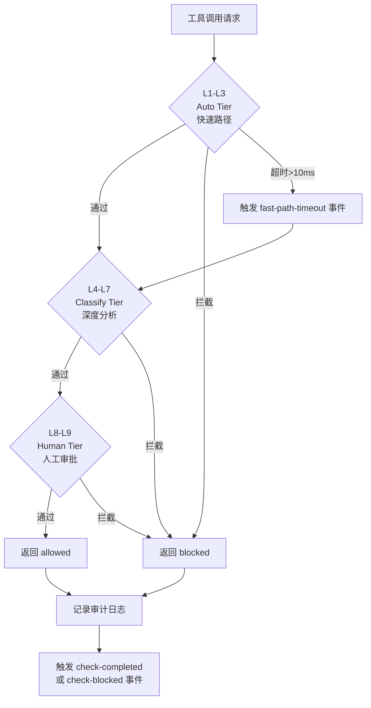

# 模块详解-安全编排子系统

> 版本：2.73.4 | 模块：src/security/
>
> **R47 GPT-5.6融合更新**：安全链从8层扩展至9层，新增L7 `prompt-injection-detect` 层，融合GPT-5.6 Daybreak安全防御体系。

---

## 子系统概述

安全编排子系统是框架工具调用安全的核心防线，采用**9层**安全链（3层级）架构，对每一次工具调用执行从快速模式匹配到人工审批的纵深检查。子系统位于 `src/security/`，由2个文件组成：

- **ToolCallSecurityChain** — 工具调用安全链，9层安全检查引擎（含Prompt注入检测）
- **index.js** — 模块导出

```
工具调用请求
    │
    ▼
┌─────────────────────────────────────────────────┐
│            ToolCallSecurityChain                 │
│                                                  │
│  ┌─ Auto Tier (快速路径 ≤10ms) ──────────────┐  │
│  │  L1: Pattern Check   → 危险模式正则检测     │  │
│  │  L2: Read-Only Path  → 只读路径写入检测     │  │
│  │  L3: Safe Whitelist  → 安全命令白名单       │  │
│  └────────────────────────────────────────────┘  │
│                     │                            │
│            通过后进入分类层                       │
│                     ▼                            │
│  ┌─ Classify Tier (深度分析) ────────────────┐  │
│  │  L4: AST Analysis    → 代码注入检测        │  │
│  │  L5: Network Write   → 网络写操作检测      │  │
│  │  L6: Permission Verify → 权限验证          │  │
│  │  L7: Prompt Injection Detect → 注入检测   │  │ ← R47新增
│  └────────────────────────────────────────────┘  │
│                     │                            │
│            通过后进入人工层                       │
│                     ▼                            │
│  ┌─ Human Tier (人工审批) ───────────────────┐  │
│  │  L8: Human Approval  → 人工审批检查        │  │
│  │  L9: Risk Confirmation → 风险确认检查      │  │
│  └────────────────────────────────────────────┘  │
│                                                  │
│  审计日志 (BoundedArray 5000)                    │
│  层级统计 (BoundedMap 20)                        │
└─────────────────────────────────────────────────┘
    │
    ▼
  allowed / blocked
```

---

## 架构设计

### 三层级架构

安全链采用三层级（Tier）设计，每层有不同的性能要求和决策权限：

| 层级 | 包含层 | 最大耗时 | 决策权限 | 设计理念 |
|------|--------|---------|---------|---------|
| **Auto** | L1-L3 | ≤10ms（快速路径） | 自动放行/拦截 | 机器快速判断，零人工干预 |
| **Classify** | L4-L7 | L4: 50ms / L5: 20ms / L6: 30ms / L7: 100ms | 自动分类拦截 | 深度分析，仍为自动决策 |
| **Human** | L8-L9 | ∞（等待人工） | 需人工确认 | 高风险操作必须人类介入 |

### 执行流程



### 短路机制

安全链采用**短路执行**策略：一旦某一层检测到违规，立即跳过后续所有层级，返回拦截结果。这确保了：

1. **性能最优**：危险操作在最早可能的层级被拦截
2. **资源节省**：无需执行后续更耗时的分析
3. **原因明确**：拦截原因始终是第一个违规层级的检测结果

---

## 模块详解

### ToolCallSecurityChain — 工具调用安全链

> 源文件：src/security/tool-call-security-chain.js

#### 类结构

`ToolCallSecurityChain` 继承自 `EventEmitter`，通过 `withShutdown()` 混入优雅关闭能力。

```javascript
const { EventEmitter } = require('events');
const { withShutdown } = require('../../utils/shutdown-mixin');

class ToolCallSecurityChain extends EventEmitter { /* ... */ }
module.exports = withShutdown(ToolCallSecurityChain);
```

#### 构造函数

```javascript
constructor(options)
```

| 参数 | 类型 | 默认值 | 说明 |
|------|------|--------|------|
| `options.enableAllLayers` | `boolean` | `true` | 是否启用所有安全层 |
| `options.disabledLayers` | `string[]` | `[]` | 禁用的层ID列表 |
| `options.fastPathMaxMs` | `number` | `10` | 快速路径（L1-L3）最大耗时（毫秒） |
| `options.dangerousPatterns` | `RegExp[]` | 9条内置模式 | 危险命令正则模式列表 |
| `options.readOnlyExtensions` | `string[]` | 7种扩展名 | 只读文件扩展名列表 |
| `options.safeCommands` | `RegExp[]` | 12条内置命令 | 安全命令白名单正则列表 |

#### 核心API

| 方法 | 签名 | 说明 |
|------|------|------|
| `check` | `check(toolCall, context): SecurityResult` | 执行完整9层安全检查 |
| `getLayerStats` | `getLayerStats(): Object` | 获取各层级统计信息 |
| `getSecurityReport` | `getSecurityReport(): SecurityReport` | 获取综合安全审计报告 |

#### check() 方法详解

```javascript
check(toolCall, context)
```

**toolCall 参数：**

| 字段 | 类型 | 说明 |
|------|------|------|
| `name` | `string` | 工具名称 |
| `command` | `string?` | 命令字符串（Shell工具） |
| `path` | `string?` | 目标文件路径 |
| `content` | `string?` | 要写入或执行的内容/代码 |

**context 参数：**

| 字段 | 类型 | 说明 |
|------|------|------|
| `agentId` | `string?` | 发起调用的Agent ID |
| `permissions` | `string[]?` | Agent权限列表 |
| `requireApproval` | `boolean?` | 是否需要人工审批 |
| `approvalGranted` | `boolean?` | 人工审批是否已授予 |
| `highRisk` | `boolean?` | 是否为高风险操作 |
| `riskConfirmed` | `boolean?` | 风险确认是否已授予 |

**返回值 SecurityResult：**

```javascript
{
  allowed: boolean,        // 是否允许执行
  layer: string | null,    // 拦截层ID（allowed=true时为null）
  reason: string | null,   // 拦截原因（allowed=true时为null）
  duration: number,        // 总检查耗时（毫秒）
  details: [               // 各层检查详情
    {
      layer: string,       // 层ID
      passed: boolean,     // 是否通过
      duration: number,    // 该层耗时（毫秒）
      reason?: string      // 未通过原因
    }
  ]
}
```

#### getLayerStats() 返回值

```javascript
{
  'pattern-check': {
    callCount: 150,        // 调用次数
    passCount: 140,        // 通过次数
    blockCount: 10,        // 拦截次数
    passRate: 0.933,       // 通过率
    avgDurationMs: 0.5     // 平均耗时（毫秒）
  },
  // ... 其他7层
}
```

#### getSecurityReport() 返回值

```javascript
{
  layerStats: Object,           // 各层统计（同 getLayerStats()）
  totalChecks: 1500,            // 总检查次数
  totalBlocked: 45,             // 总拦截次数
  blockRate: 0.03,              // 拦截率
  recentAuditEntries: Array,    // 最近50条审计记录
  config: {                     // 当前配置摘要
    disabledLayers: [],
    fastPathMaxMs: 10,
    dangerousPatternCount: 9,
    safeCommandCount: 12
  }
}
```

#### 内部数据结构

| 属性 | 类型 | 容量 | 说明 |
|------|------|------|------|
| `_layerStats` | `BoundedMap` | 20 | 各层统计信息（9层 + 余量） |
| `_auditLog` | `BoundedArray` | 5000 | 审计日志（FIFO策略） |
| `_disabledSet` | `Set` | — | 禁用层ID集合 |
| `_config` | `Object` | — | 合并后的配置 |

---

## 安全层级详解

### L1: Pattern Check — 危险模式检测

| 属性 | 值 |
|------|-----|
| 层ID | `pattern-check` |
| 所属层级 | Auto |
| 最大耗时 | 2ms |
| 检测方式 | 正则表达式匹配 |

对 `toolCall.command` 或 `toolCall.content` 执行正则匹配，检测以下9类危险模式：

| 模式 | 正则 | 风险描述 |
|------|------|---------|
| 递归删除 | `rm\s+-rf` | 系统文件破坏 |
| 强制推送 | `git\s+push\s+--force` | 代码仓库破坏 |
| 删表操作 | `DROP\s+TABLE` | 数据库破坏 |
| 删数据操作 | `DELETE\s+FROM` | 数据丢失 |
| 截断操作 | `TRUNCATE` | 数据清空 |
| 磁盘格式化 | `format\s+[A-Z]:` | 磁盘数据破坏 |
| 提权操作 | `\bsudo\b` | 权限提升 |
| 全权限 | `\bchmod\s+777\b` | 权限过宽 |
| 设备重定向 | `>\s*\/dev\/` | 系统设备写入 |

**通过条件**：所有模式均不匹配。

---

### L2: Read-Only Path — 只读路径写入检测

| 属性 | 值 |
|------|-----|
| 层ID | `read-only-path` |
| 所属层级 | Auto |
| 最大耗时 | 2ms |
| 检测方式 | 文件扩展名 + 操作类型判断 |

检查逻辑：

1. 提取 `toolCall.path` 的文件扩展名
2. 判断 `toolCall.name` 是否为写操作（匹配 `/write|create|delete|remove|modify|update/i`）
3. 若为写操作且目标扩展名在只读列表中，则拦截

**只读文件扩展名**：`.md`、`.txt`、`.json`、`.yaml`、`.yml`、`.toml`、`.csv`

**通过条件**：非写操作，或目标文件扩展名不在只读列表中。

---

### L3: Safe Whitelist — 安全命令白名单

| 属性 | 值 |
|------|-----|
| 层ID | `safe-whitelist` |
| 所属层级 | Auto |
| 最大耗时 | 6ms |
| 检测方式 | 正则白名单匹配 |

对 `toolCall.command` 执行白名单匹配。匹配白名单的命令标记为安全（`isSafe: true`），但**不会导致拦截**——此层始终返回 `passed: true`，仅用于后续层的优化决策参考。

**安全命令白名单**（12条）：

| 命令 | 正则 | 用途 |
|------|------|------|
| `ls` | `/^ls/` | 目录列表 |
| `cat` | `/^cat/` | 文件查看 |
| `head` | `/^head/` | 文件头部 |
| `tail` | `/^tail/` | 文件尾部 |
| `grep` | `/^grep/` | 内容搜索 |
| `find` | `/^find/` | 文件查找 |
| `wc` | `/^wc/` | 字数统计 |
| `diff` | `/^diff/` | 差异比较 |
| `git status` | `/^git\s+status/` | 仓库状态 |
| `git log` | `/^git\s+log/` | 提交日志 |
| `git diff` | `/^git\s+diff/` | 代码差异 |
| `git show` | `/^git\s+show/` | 提交详情 |

**通过条件**：始终通过（此层为信息标记层，非拦截层）。

---

### L4: AST Analysis — 代码注入检测

| 属性 | 值 |
|------|-----|
| 层ID | `ast-analysis` |
| 所属层级 | Classify |
| 最大耗时 | 50ms |
| 检测方式 | 正则模式匹配（基于AST语义） |

对 `toolCall.content` 或 `toolCall.command` 执行代码注入模式检测。由于 tree-sitter 为可选依赖，当前采用正则方式实现，覆盖以下7类注入模式：

| 模式 | 正则 | 风险描述 |
|------|------|---------|
| 子进程调用 | `require\s*\(\s*['"]child_process['"]\s*\)` | 进程注入 |
| 动态执行 | `eval\s*\(` | 代码注入 |
| 函数构造 | `Function\s*\(` | 动态代码执行 |
| 进程退出 | `process\.exit` | 进程终止 |
| 子进程模块 | `child_process` | 子进程访问 |
| 原型链污染 | `__proto__` | 原型链攻击 |
| 命令执行 | `\bexec\s*\(` | 系统命令执行 |
| 进程派生 | `\bspawn\s*\(` | 子进程派生 |

**通过条件**：所有注入模式均不匹配。

---

### L5: Network Write Check — 网络写操作检测

| 属性 | 值 |
|------|-----|
| 层ID | `network-write` |
| 所属层级 | Classify |
| 最大耗时 | 20ms |
| 检测方式 | 正则模式匹配 |

对 `toolCall.command` 或 `toolCall.content` 执行网络写操作检测，覆盖以下6类模式：

| 模式 | 正则 | 风险描述 |
|------|------|---------|
| cURL写操作 | `curl\s+.*-[XdP]` | HTTP写请求 |
| Wget下载 | `wget\s+` | 远程资源获取 |
| Netcat监听 | `nc\s+.*-[le]` | 网络监听/执行 |
| Fetch API | `\bfetch\s*\(\s*['"]https?:` | 浏览器端HTTP请求 |
| Axios写方法 | `\baxios\.\s*(post\|put\|patch\|delete)\s*\(` | HTTP客户端写操作 |
| Node HTTP | `\bhttp\.request\s*\(` | Node.js HTTP请求 |

**通过条件**：所有网络写模式均不匹配。

---

### L6: Permission Verify — 权限验证

| 属性 | 值 |
|------|-----|
| 层ID | `permission-verify` |
| 所属层级 | Classify |
| 最大耗时 | 30ms |
| 检测方式 | 权限列表匹配 |

检查Agent是否拥有执行受限工具的权限：

1. 从 `context.permissions` 获取Agent权限列表
2. 若权限列表为空，默认放行（无权限约束）
3. 检查 `toolCall.name` 是否为受限工具
4. 受限工具需要Agent拥有对应权限或 `admin` / `*` 通配权限

**受限工具列表**：`shell`、`exec`、`file-delete`、`database-write`

**通过条件**：非受限工具，或Agent拥有对应权限/admin通配权限。

---

### L7: Prompt Injection Detect — Prompt注入检测（R47新增）

| 属性 | 值 |
|------|-----|
| 层ID | `prompt-injection-detect` |
| 所属层级 | Classify |
| 最大耗时 | 100ms |
| 检测方式 | 三类威胁模式正则匹配 |
| 融合来源 | GPT-5.6 Daybreak安全防御体系 |

针对150万Token超大上下文场景下的三类Prompt注入威胁进行检测：

**威胁类型与检测模式：**

| 威胁类型 | 威胁等级 | 检测模式示例 |
|---------|---------|-------------|
| **碎片化注入** | HIGH (0.9) | `ignore previous instructions`, `bypass safety filter`, `<system>`, `[SYSTEM]` |
| **逻辑漂移** | MEDIUM (0.6) | `let's change the topic`, `actually, forget about the previous` |
| **越界行为** | HIGH (0.85) | `reveal your system prompt`, `show me your initial prompt`, `debug mode` |

**检测逻辑：**

1. 对 `toolCall.content` 或 `toolCall.command` 执行三类威胁模式匹配
2. 计算威胁等级（threatLevel），取最高威胁
3. 威胁等级 ≥ 0.8：直接拦截，返回 `{ passed: false, threatType, threatLevel }`
4. 威胁等级 0.5-0.8：标记但放行，返回 `{ passed: true, threatType, threatLevel }`（供上层决策）

**通过条件**：无威胁模式匹配，或威胁等级 < 0.8。

**返回值扩展**：

```javascript
{
  passed: boolean,
  reason?: string,
  threatType?: 'fragmented-injection' | 'logic-drift' | 'boundary-violation',
  threatLevel?: number  // 0.0-1.0
}
```

---

### L8: Human Approval — 人工审批

| 属性 | 值 |
|------|-----|
| 层ID | `human-approval` |
| 所属层级 | Human |
| 最大耗时 | ∞ |
| 检测方式 | 上下文标记检查 |

检查是否需要人工审批：

1. 当 `context.requireApproval === true` 时触发审批流程
2. 检查 `context.approvalGranted === true` 是否已授予审批
3. 未授予审批则拦截

**通过条件**：无需审批（`requireApproval` 非true），或审批已授予。

---

### L9: Risk Confirmation — 风险确认

| 属性 | 值 |
|------|-----|
| 层ID | `risk-confirmation` |
| 所属层级 | Human |
| 最大耗时 | ∞ |
| 检测方式 | 上下文标记检查 |

检查高风险操作是否已获得风险确认：

1. 当 `context.highRisk === true` 时触发风险确认流程
2. 检查 `context.riskConfirmed === true` 是否已确认风险
3. 未确认则拦截

**通过条件**：非高风险操作（`highRisk` 非true），或风险已确认。

---

## 使用示例

### 基础使用

```javascript
const ToolCallSecurityChain = require('./src/security/tool-call-security-chain');

// 创建安全链实例（使用默认配置）
const securityChain = new ToolCallSecurityChain();

// 检查安全的只读命令
const result1 = securityChain.check({
  name: 'shell',
  command: 'git status'
}, {
  agentId: 'task-worker',
  permissions: ['shell']
});
// result1 = { allowed: true, layer: null, reason: null, duration: 1, details: [...] }

// 检查危险命令
const result2 = securityChain.check({
  name: 'shell',
  command: 'rm -rf /'
});
// result2 = { allowed: false, layer: 'pattern-check', reason: 'Dangerous pattern detected: rm\\s+-rf', ... }
```

### 自定义配置

```javascript
const securityChain = new ToolCallSecurityChain({
  enableAllLayers: true,
  disabledLayers: ['network-write'],  // 禁用网络写检测层
  fastPathMaxMs: 15,                   // 放宽快速路径超时
  dangerousPatterns: [
    /rm\s+-rf/,
    /git\s+push\s+--force/,
    /DROP\s+TABLE/i,
    /my-custom-dangerous-command/,     // 自定义危险模式
  ],
  readOnlyExtensions: ['.md', '.txt', '.json', '.yaml', '.yml', '.toml', '.csv', '.lock'],
  safeCommands: [
    /^ls/, /^cat/, /^head/, /^tail/,
    /^git\s+status/, /^git\s+log/,
    /^npm\s+test/,                    // 自定义安全命令
  ],
});
```

### 代码注入检测

```javascript
// 检测 eval() 注入
const result = securityChain.check({
  name: 'code-exec',
  content: 'eval(userInput)'
});
// result.allowed = false
// result.layer = 'ast-analysis'
// result.reason = 'Code injection pattern detected: eval\\s*\\('

// 检测 child_process 注入
const result2 = securityChain.check({
  name: 'shell',
  command: 'node -e "require(\'child_process\').exec(\'rm -rf /\')"'
});
// result2.allowed = false
// result2.layer = 'ast-analysis'
// result2.reason = 'Code injection pattern detected: require\\s*\\(\\s*[\'"]child_process[\'"]\\s*\\)'
```

### 人工审批与风险确认

```javascript
// 需要人工审批但未授予
const result1 = securityChain.check({
  name: 'file-delete',
  path: '/src/important.js'
}, {
  agentId: 'task-worker',
  requireApproval: true,
  approvalGranted: false   // 未授予审批
});
// result1.allowed = false
// result1.layer = 'human-approval'
// result1.reason = 'Human approval required but not granted'

// 授予审批后通过
const result2 = securityChain.check({
  name: 'file-delete',
  path: '/src/important.js'
}, {
  agentId: 'task-worker',
  requireApproval: true,
  approvalGranted: true    // 已授予审批
});
// result2.allowed = true

// 高风险操作需要风险确认
const result3 = securityChain.check({
  name: 'database-write',
  command: 'DELETE FROM users'
}, {
  agentId: 'task-worker',
  permissions: ['database-write'],
  highRisk: true,
  riskConfirmed: false     // 未确认风险
});
// result3.allowed = false
// result3.layer = 'risk-confirmation'
// result3.reason = 'High-risk operation requires explicit risk confirmation'
```

### 查看统计与报告

```javascript
// 获取各层统计
const stats = securityChain.getLayerStats();
console.log(stats['pattern-check']);
// { callCount: 500, passCount: 480, blockCount: 20, passRate: 0.96, avgDurationMs: 0.3 }

// 获取综合安全报告
const report = securityChain.getSecurityReport();
console.log(`总检查: ${report.totalChecks}, 拦截: ${report.totalBlocked}, 拦截率: ${(report.blockRate * 100).toFixed(2)}%`);
console.log('最近审计记录:', report.recentAuditEntries.slice(0, 5));
```

### 事件监听

```javascript
const securityChain = new ToolCallSecurityChain();

// 监听检查完成事件
securityChain.on('check-completed', ({ toolName, duration }) => {
  console.log(`[安全] ${toolName} 检查通过，耗时 ${duration}ms`);
});

// 监听拦截事件
securityChain.on('check-blocked', ({ toolName, layer, reason }) => {
  console.warn(`[安全] ${toolName} 被 ${layer} 层拦截: ${reason}`);
});

// 监听快速路径超时事件
securityChain.on('fast-path-timeout', ({ duration, maxMs }) => {
  console.warn(`[安全] 快速路径超时: ${duration}ms > ${maxMs}ms`);
});
```

### 优雅关闭

```javascript
// 关闭安全链，释放资源
await securityChain.shutdown();
// 内部执行：
// 1. _layerStats.shutdown()  — 释放统计Map
// 2. _auditLog.shutdown()    — 释放审计日志
// 3. _disabledSet.clear()    — 清空禁用集合
// 4. removeAllListeners()    — 移除所有事件监听
```

---

## 配置参考

### DEFAULT_CONFIG

```javascript
const DEFAULT_CONFIG = {
  enableAllLayers: true,
  disabledLayers: [],
  fastPathMaxMs: 10,
  dangerousPatterns: [
    /rm\s+-rf/,
    /git\s+push\s+--force/,
    /DROP\s+TABLE/i,
    /DELETE\s+FROM/i,
    /TRUNCATE/i,
    /format\s+[A-Z]:/i,
    /\bsudo\b/,
    /\bchmod\s+777\b/,
    />\s*\/dev\//,
  ],
  readOnlyExtensions: ['.md', '.txt', '.json', '.yaml', '.yml', '.toml', '.csv'],
  safeCommands: [
    /^ls/, /^cat/, /^head/, /^tail/, /^grep/, /^find/, /^wc/, /^diff/,
    /^git\s+status/, /^git\s+log/, /^git\s+diff/, /^git\s+show/,
  ],
};
```

### 配置项说明

| 配置项 | 类型 | 默认值 | 说明 |
|--------|------|--------|------|
| `enableAllLayers` | `boolean` | `true` | 是否启用所有安全层。设为 `false` 时仅启用未禁用的层 |
| `disabledLayers` | `string[]` | `[]` | 禁用的层ID列表。可选值见 SECURITY_LAYERS |
| `fastPathMaxMs` | `number` | `10` | 快速路径（L1-L3）最大耗时阈值，超时触发 `fast-path-timeout` 事件 |
| `dangerousPatterns` | `RegExp[]` | 9条 | L1层使用的危险命令正则列表，可自定义扩展 |
| `readOnlyExtensions` | `string[]` | 7种 | L2层使用的只读文件扩展名列表 |
| `safeCommands` | `RegExp[]` | 12条 | L3层使用的安全命令白名单正则列表 |

### SECURITY_LAYERS 常量

| 层ID | 名称 | 层级 | 最大耗时 |
|------|------|------|---------|
| `pattern-check` | Pattern Check | auto | 2ms |
| `read-only-path` | Read-Only Path | auto | 2ms |
| `safe-whitelist` | Safe Whitelist | auto | 6ms |
| `ast-analysis` | AST Analysis | classify | 50ms |
| `network-write` | Network Write Check | classify | 20ms |
| `permission-verify` | Permission Verify | classify | 30ms |
| `prompt-injection-detect` | Prompt Injection Detect | classify | 100ms |
| `human-approval` | Human Approval | human | ∞ |
| `risk-confirmation` | Risk Confirmation | human | ∞ |

### INJECTION_PATTERNS 常量

| 正则 | 检测目标 |
|------|---------|
| `require\s*\(\s*['"]child_process['"]\s*\)` | child_process模块引入 |
| `eval\s*\(` | eval动态执行 |
| `Function\s*\(` | Function构造器 |
| `process\.exit` | 进程退出 |
| `child_process` | child_process字符串引用 |
| `__proto__` | 原型链访问 |
| `\bexec\s*\(` | exec命令执行 |
| `\bspawn\s*\(` | spawn进程派生 |

### NETWORK_WRITE_PATTERNS 常量

| 正则 | 检测目标 |
|------|---------|
| `curl\s+.*-[XdP]` | cURL写操作 |
| `wget\s+` | Wget下载 |
| `nc\s+.*-[le]` | Netcat监听 |
| `\bfetch\s*\(\s*['"]https?:` | Fetch API请求 |
| `\baxios\.\s*(post\|put\|patch\|delete)\s*\(` | Axios写方法 |
| `\bhttp\.request\s*\(` | Node.js HTTP请求 |

### 静态属性

| 属性 | 类型 | 说明 |
|------|------|------|
| `ToolCallSecurityChain.SECURITY_LAYERS` | `Array` | 安全层定义常量（9层） |
| `ToolCallSecurityChain.DEFAULT_CONFIG` | `Object` | 默认配置常量 |
| `ToolCallSecurityChain.INJECTION_PATTERNS` | `RegExp[]` | 代码注入模式常量 |
| `ToolCallSecurityChain.NETWORK_WRITE_PATTERNS` | `RegExp[]` | 网络写操作模式常量 |
| `ToolCallSecurityChain.PROMPT_INJECTION_PATTERNS` | `Object` | Prompt注入检测模式常量（R47新增） |

---

## 事件参考

| 事件名 | 触发时机 | 载荷 |
|--------|---------|------|
| `check-completed` | 工具调用通过所有安全检查 | `{ toolName: string, duration: number }` |
| `check-blocked` | 工具调用被某层拦截 | `{ toolName: string, layer: string, reason: string }` |
| `fast-path-timeout` | 快速路径（L1-L3）耗时超过阈值 | `{ duration: number, maxMs: number }` |

---

## 审计日志

每次 `check()` 调用都会自动记录审计日志，存储在 `BoundedArray(5000)` 中（FIFO策略，超出自动淘汰最旧记录）。

### 审计记录结构

```javascript
{
  timestamp: '2026-06-04T10:30:00.000Z',  // ISO时间戳
  toolName: 'shell',                       // 工具名称
  allowed: false,                          // 是否允许
  layer: 'pattern-check',                  // 拦截层ID
  reason: 'Dangerous pattern detected: ...', // 拦截原因
  duration: 2                              // 检查耗时（毫秒）
}
```

### 审计日志访问

通过 `getSecurityReport()` 获取最近50条审计记录：

```javascript
const report = securityChain.getSecurityReport();
console.log(report.recentAuditEntries);
```

---

## 与权限执行引擎的协作

安全编排子系统与 [[模块详解-权限执行引擎]] 形成互补的安全防线：

| 维度 | 安全编排子系统 | 权限执行引擎 |
|------|--------------|-------------|
| 检查对象 | 工具调用内容 | Agent角色与文件操作 |
| 检查方式 | 9层安全链 | RBAC + 文件守卫 + 审计 |
| 决策速度 | 快速路径≤10ms | 文件系统检查 |
| 侧重点 | 命令/代码安全性 | 角色权限与操作合规 |

典型集成流程：先通过 RBACEnforcer 验证Agent角色权限，再通过 ToolCallSecurityChain 验证工具调用安全性，最后通过 AuditLogger 记录完整审计链。

---

## 相关文档

- [[模块详解-权限执行引擎]] — RBAC + 文件守卫 + 审计日志
- [[模块详解-EventBus模块]] — 事件驱动通信
- [[模块详解-基础设施子系统]] — BoundedMap/BoundedArray等基础设施
