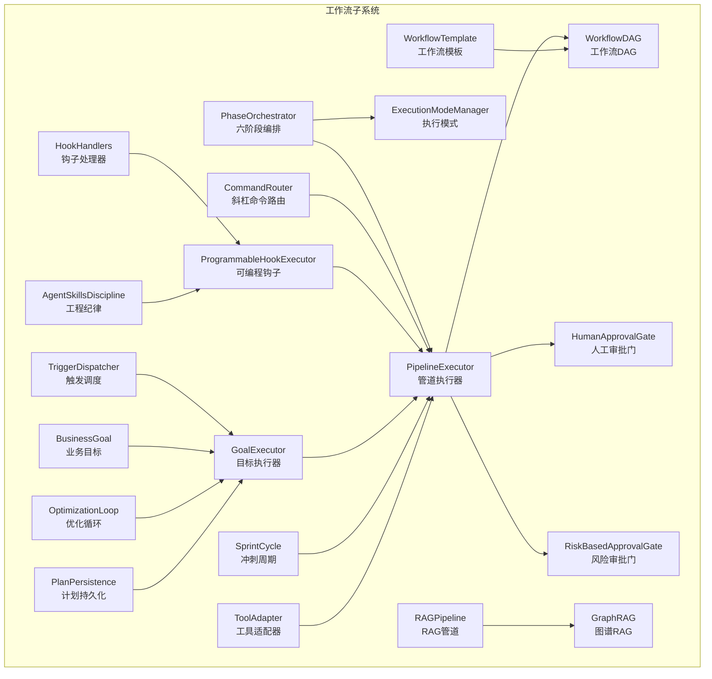
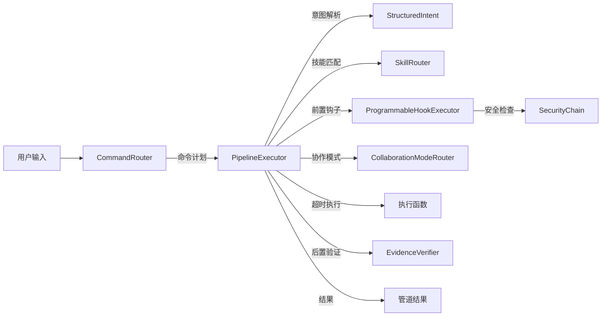
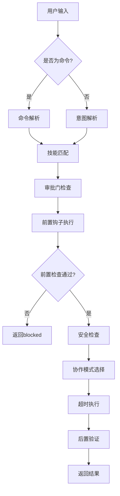
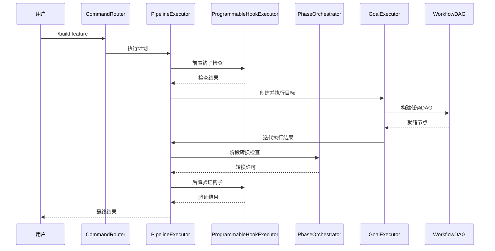
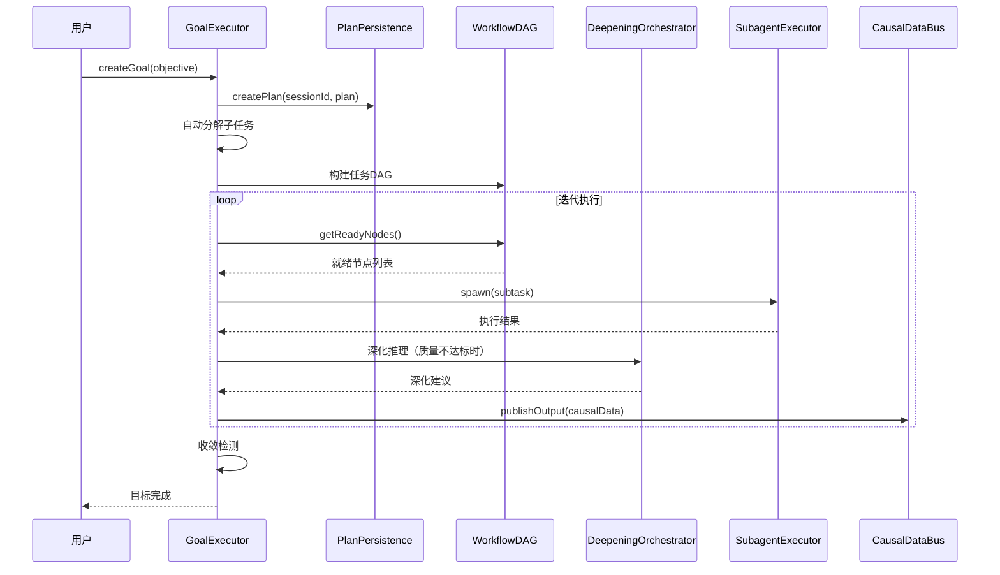
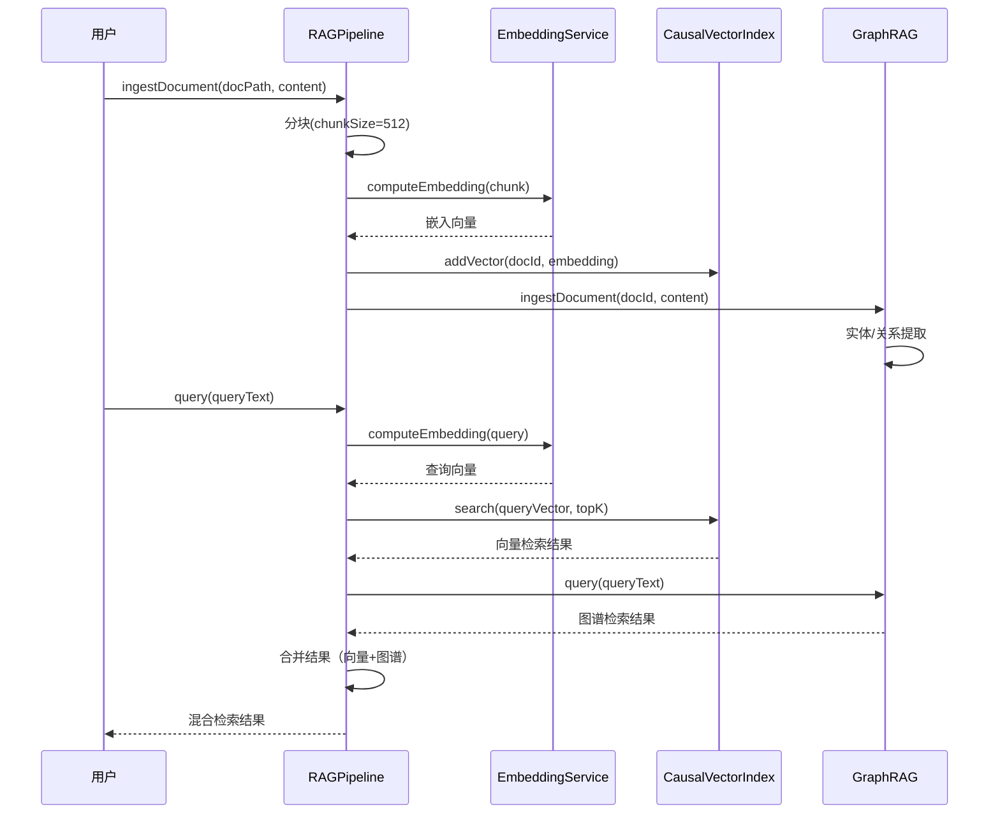

# 模块详解 — 工作流子系统（Workflow Subsystem）

> 源码路径：`src/runtime/workflow/`
> 文件数量：21个源文件
> 核心职责：六阶段流程编排、斜杠命令路由、可编程钩子执行、目标迭代收敛、管道执行、DAG依赖管理、模板复用、人工审批、计划持久化、RAG检索、优化循环、图谱RAG、业务目标、冲刺周期、工具适配、风险审批、执行模式、工程纪律、触发调度

---

## 目录

- [1. 架构总览](#1-架构总览)
- [2. PhaseOrchestrator — 六阶段流程编排器](#2-phaseorchestrator--六阶段流程编排器)
- [3. CommandRouter — 斜杠命令路由](#3-commandrouter--斜杠命令路由)
- [4. ProgrammableHookExecutor — 可编程钩子执行器](#4-programmablehookexecutor--可编程钩子执行器)
- [5. GoalExecutor — 目标执行器](#5-goalexecutor--目标执行器)
- [6. PipelineExecutor — 管道执行器](#6-pipelineexecutor--管道执行器)
- [7. WorkflowDAG — 工作流DAG](#7-workflowdag--工作流dag)
- [8. WorkflowTemplate — 工作流模板](#8-workflowtemplate--工作流模板)
- [9. HookHandlers — 钩子处理器集合](#9-hookhandlers--钩子处理器集合)
- [10. HumanApprovalGate — 人工审批门](#10-humanapprovalgate--人工审批门)
- [11. PlanPersistence — 计划持久化](#11-planpersistence--计划持久化)
- [12. RAGPipeline — RAG检索增强生成管道](#12-ragpipeline--rag检索增强生成管道)
- [13. OptimizationLoop — 优化循环求解器](#13-optimizationloop--优化循环求解器)
- [14. GraphRAG — 图谱RAG](#14-graphrag--图谱rag)
- [15. BusinessGoal — 业务目标](#15-businessgoal--业务目标)
- [16. SprintCycle — 冲刺周期](#16-sprintcycle--冲刺周期)
- [17. ToolAdapter — 工具适配器](#17-tooladapter--工具适配器)
- [18. RiskBasedApprovalGate — 风险审批门](#18-riskbasedapprovalgate--风险审批门)
- [19. ExecutionModeManager — 执行模式管理器](#19-executionmodemanager--执行模式管理器)
- [20. AgentSkillsDiscipline — 工程纪律插件](#20-agentskillsdiscipline--工程纪律插件)
- [21. TriggerDispatcher — 统一触发调度引擎](#21-triggerdispatcher--统一触发调度引擎)
- [22. 模块间协作关系](#22-模块间协作关系)

---

## 1. 架构总览

工作流子系统是Harness框架的执行引擎核心，负责从需求探索到部署上线的全生命周期编排。子系统包含21个模块，覆盖流程编排、命令路由、钩子执行、目标迭代、管道调度、依赖管理、模板复用、审批控制、计划持久化、知识检索、优化迭代、业务追踪等关键能力。

### 架构图



### 数据流



---

## 2. PhaseOrchestrator — 六阶段流程编排器

**源码**：`phase-orchestrator.js`

### 概述

PhaseOrchestrator管理六阶段执行流程的状态转换：需求探索→需求分析→架构设计→模块开发→集成测试→部署上线。强制阶段转换规则，支持因果数据就绪检查和AR上下文注入。

### 核心职责

- 定义六阶段序列和转换规则
- 检查阶段完成条件（技能完成、规格验证、因果输出）
- 强制TDD门禁和规格门禁
- 支持回滚验证和技能失效检测
- 注入自回归上下文

### 类定义

```javascript
class PhaseOrchestrator extends EventEmitter {
  constructor()
  attachCausalDataBus(causalDataBus)    // 附加因果数据总线
  attachExecutionModeManager(emm)       // 附加执行模式管理器
  getCurrentPhase()                     // 获取当前阶段
  setCurrentPhase(phase, reason)        // 设置当前阶段（异步）
  getPhaseHistory()                     // 获取阶段转换历史
  getARContext()                        // 获取自回归上下文
  canAdvanceToNext(completedSkills)     // 检查是否可推进到下一阶段
  getPhases()                           // 获取六阶段列表
  canTransition(from, to)              // 检查转换是否合法
  isForwardTransition(from, to)        // 是否前向转换
  isBackwardTransition(from, to)       // 是否回退转换
  validateRollback(fromPhase, toPhase, completedSkills) // 验证回滚
  getRequiredSkills(phase)             // 获取阶段必需技能
  isPhaseComplete(phase, completedSkills) // 检查阶段是否完成
  getCausalReadiness(phase, completedSkills) // 获取因果就绪状态
  getNextPhase(currentPhase)           // 获取下一阶段
  getPhaseIndex(phase)                 // 获取阶段索引
  registerSpecRequirement(phase, specId) // 注册规格要求
  markSpecVerified(phase, specId)      // 标记规格已验证
  getSpecGateState(phase)              // 获取规格门禁状态
}
```

### 配置选项

| 常量 | 值 | 说明 |
|------|-----|------|
| `STRICT_SKILLS` | tdd-implement, module-development等12个 | 严格验证技能集合 |
| `MAX_PHASE_HISTORY` | 100 | 最大阶段历史记录数 |
| `PHASE_HISTORY_KEEP` | 50 | 历史裁剪保留数 |

### 事件

| 事件名 | 触发时机 | 数据 |
|--------|----------|------|
| `phase-changed` | 阶段转换成功 | `{from, to, reason}` |
| `spec-gate-blocked` | 规格门禁阻止转换 | `{from, to, missing, gatePhase}` |
| `spec-verified` | 规格验证通过 | `{phase, specId}` |
| `phase-transition-denied` | 阶段转换被拒绝 | `{from, to, reason}` |
| `causal-check-error` | 因果检查出错 | `{phase, error}` |

### 使用示例

```javascript
const PhaseOrchestrator = require('./src/runtime/workflow/phase-orchestrator');

const po = new PhaseOrchestrator();
po.attachCausalDataBus(causalDataBus);
po.attachExecutionModeManager(executionModeManager);

// 注册规格门禁
po.registerSpecRequirement('development', 'requirement-spec');
po.registerSpecRequirement('development', 'architecture-doc');

// 设置初始阶段
await po.setCurrentPhase('exploration', 'initial');

// 检查是否可推进
const canAdvance = po.canAdvanceToNext(['brainstorming']);

// 验证回滚
const rollbackResult = po.validateRollback('development', 'exploration', completedSkills);
// { allowed: true, requiresApproval: true, phasesToRollback: [...], skillsToInvalidate: [...] }
```

---

## 3. CommandRouter — 斜杠命令路由

**源码**：`command-router.js`

### 概述

CommandRouter负责斜杠命令的自动发现、别名解析、模糊匹配和执行调度。从`.harness/commands/`目录加载Markdown格式的命令定义，支持中文命令和Tab补全。

### 核心职责

- 自动发现`.harness/commands/`目录下的命令定义
- 支持命令ID、别名和斜杠前缀匹配
- 模糊匹配（部分匹配、子序列匹配）
- 执行历史追踪（RingBuffer）
- 因果总线集成（发布命令输出）
- ANSI彩色帮助文本生成

### 类定义

```javascript
class CommandRouter extends EventEmitter {
  constructor(projectRoot, options)
  setCausalBus(bus)                     // 设置因果数据总线
  discover()                            // 同步发现命令
  discoverAsync()                       // 异步发现命令
  resolve(input)                        // 解析命令（ID/别名/斜杠前缀）
  getCommand(commandId)                 // 获取命令对象
  getExecutionPlan(commandId)           // 获取执行计划
  executeCommand(commandId, context)    // 执行命令
  getExecutionHistory(limit)            // 获取执行历史
  listCommands()                        // 列出所有命令
  getHelpText(useColor)                 // 生成帮助文本
  isCommand(input)                      // 判断是否为有效命令
  complete(partial)                     // Tab补全
  fuzzyMatch(input)                     // 模糊匹配
  getStats()                            // 获取统计信息
}
```

### 配置选项

| 常量 | 值 | 说明 |
|------|-----|------|
| `COMMANDS_DIR` | `commands` | 命令定义目录 |
| `MAX_EXECUTION_HISTORY` | 100 | 最大执行历史数 |
| `FUZZY_MATCH_ID_CONTAINS_SCORE` | 0.9 | ID包含匹配分数 |
| `FUZZY_MATCH_NAME_CONTAINS_SCORE` | 0.7 | 名称包含匹配分数 |
| `FUZZY_MATCH_MIN_THRESHOLD` | 0.5 | 最低模糊匹配阈值 |

### 事件

| 事件名 | 触发时机 | 数据 |
|--------|----------|------|
| `commands-discovered` | 命令发现完成 | `{count}` |
| `command-executed` | 命令执行完成 | 执行记录对象 |

### 使用示例

```javascript
const CommandRouter = require('./src/runtime/workflow/command-router');

const router = new CommandRouter('/project', { causalBus });
router.discover();

// 解析命令
const cmd = router.resolve('/plan');

// 模糊匹配
const matched = router.fuzzyMatch('dep');

// 执行命令
const plan = router.executeCommand('/build', { sessionId: 's-1' });

// Tab补全
const completions = router.complete('/dep');
```

---

## 4. ProgrammableHookExecutor — 可编程钩子执行器

**源码**：`programmable-hook-executor.js`

### 概述

ProgrammableHookExecutor提供可编程的钩子执行框架，支持10+内置处理器、顺序执行和阻塞中断语义。Shell钩子通过命令白名单和危险模式检测实现沙箱化执行。

### 核心职责

- 注册和执行三种类型钩子（builtin/function/shell）
- 顺序执行，遇失败阻塞中断
- Shell钩子沙箱化（命令白名单、危险模式检测、上下文变量替换）
- 监控子系统（执行延迟、成功率、慢钩子检测）
- 配置批量加载

### 类定义

```javascript
class ProgrammableHookExecutor extends EventEmitter {
  constructor(projectRoot)
  register(event, action)               // 注册钩子
  unregister(event, id)                 // 注销钩子
  execute(event, context)               // 执行事件钩子（异步）
  getRegisteredHooks(event)             // 获取已注册钩子
  loadFromConfig(config)                // 从配置批量加载
  isHealthy()                           // 健康检查（成功率>=70%）
  getStats()                            // 获取统计
  getHookMonitorData()                  // 获取监控数据
  getSlowHooks(limit)                   // 获取慢钩子
  getHookSuccessRates()                 // 获取成功率
  resetMonitorData()                    // 重置监控
}
```

### 钩子类型

| 类型 | 说明 | 安全机制 |
|------|------|----------|
| `builtin` | 内置处理器 | 直接调用 |
| `function` | 自定义函数 | 超时保护 |
| `shell` | Shell命令 | 命令白名单+危险模式检测+路径校验 |

### Shell钩子安全机制

- **命令白名单**：仅允许git、echo、cat、ls、mkdir等安全命令
- **危险模式检测**：正则匹配命令注入、管道重定向等
- **上下文替换**：`{{variable}}`占位符替换，值经过消毒处理
- **路径校验**：工作目录必须在项目根目录内
- **超时保护**：默认60秒超时

### 配置选项

| 常量 | 值 | 说明 |
|------|-----|------|
| `MAX_HOOKS_PER_EVENT` | 50 | 单事件最大钩子数 |
| `MAX_TOTAL_HOOKS` | 500 | 最大总钩子数 |
| `DEFAULT_HOOK_TIMEOUT_MS` | 120000 | 默认钩子超时 |
| `HEALTH_MIN_SUCCESS_RATE` | 0.7 | 健康检查最低成功率 |
| `SLOW_HOOK_THRESHOLD_MS` | 500 | 慢钩子阈值 |

### 事件

| 事件名 | 触发时机 |
|--------|----------|
| `hook-registered` | 钩子注册成功 |
| `hook-unregistered` | 钩子注销 |
| `hook-executed` | 钩子执行完成 |
| `hook-rejected` | 钩子注册被拒绝 |
| `hook-error` | 钩子执行错误 |
| `hook-late-rejection` | 钩子异步拒绝 |
| `slow-hook-detected` | 慢钩子检测 |

### 使用示例

```javascript
const ProgrammableHookExecutor = require('./src/runtime/workflow/programmable-hook-executor');

const executor = new ProgrammableHookExecutor('/project');

// 注册内置处理器
executor.register('pre_tool_call', { type: 'builtin', name: 'path_validation' });

// 注册函数钩子
executor.register('pre_tool_call', {
  id: 'my-check',
  type: 'function',
  handler: (ctx) => {
    if (ctx.file_path.includes('..')) {
      return { passed: false, reason: 'Path traversal detected' };
    }
    return { passed: true };
  }
});

// 执行钩子
const results = await executor.execute('pre_tool_call', {
  project_root: '/project',
  file_path: '/project/src/app.js',
  agent_id: 'task-worker'
});
```

---

## 5. GoalExecutor — 目标执行器

**源码**：`goal-executor.js`

### 概述

GoalExecutor管理目标的创建、分解、迭代执行和收敛检测。支持自动分解子任务、并行执行、质量评分、停滞检测和因果数据发布。

### 核心职责

- 目标生命周期管理（创建→分解→迭代执行→收敛/停滞→完成/失败）
- 自动分解子任务（支持依赖关系和并行执行）
- 迭代收敛检测（质量评分+停滞检测）
- OODA决策闭环集成
- 因果数据发布
- 持久化和恢复

### 类定义

```javascript
class GoalExecutor extends EventEmitter {
  constructor(options)
  createGoal(objective, options)         // 创建目标
  execute(goalId, executeFn, options)    // 执行目标（异步）
  pause(goalId)                          // 暂停目标
  resume(goalId, executeFn, options)     // 恢复目标
  cancel(goalId)                         // 取消目标
  getGoal(goalId)                        // 获取目标信息
  listGoals(statusFilter)               // 列出目标
  getProgress(goalId)                    // 获取进度
  getStats()                             // 获取统计
  isHealthy()                            // 健康检查
  // 附加依赖
  attachSessionManager(dep)
  attachPlanPersistence(dep)
  attachDeepeningOrchestrator(dep)
  attachSubagentExecutor(dep)
  attachThoughtRetrieverCycle(dep)
  attachCausalDataBus(dep)
  attachOodaLoop(dep)
}
```

### 目标状态

| 状态 | 说明 |
|------|------|
| `pending` | 待执行 |
| `decomposing` | 正在分解 |
| `executing` | 执行中 |
| `iterating` | 迭代中 |
| `paused` | 已暂停 |
| `completed` | 已完成 |
| `failed` | 已失败 |
| `cancelled` | 已取消 |
| `blocked` | 已阻塞 |
| `error` | 错误 |

### 配置选项

| 参数 | 默认值 | 说明 |
|------|--------|------|
| `maxIterations` | 10 | 最大迭代次数 |
| `convergenceThreshold` | 0.85 | 收敛阈值 |
| `maxSubtasks` | 20 | 最大子任务数 |
| `maxConcurrentGoals` | 5 | 最大并发目标数 |
| `autoDecompose` | true | 自动分解子任务 |
| `autoIterate` | true | 自动迭代 |
| `persistInterval` | 30000 | 持久化间隔（毫秒） |
| `goalTTL` | 7天 | 目标过期时间 |

### 事件

| 事件名 | 触发时机 |
|--------|----------|
| `goal-created` | 目标创建 |
| `goal-executing` | 开始执行 |
| `goal-decomposing` | 开始分解 |
| `goal-decomposed` | 分解完成 |
| `goal-iteration-start` | 迭代开始 |
| `goal-iteration-complete` | 迭代完成 |
| `goal-completed` | 目标完成 |
| `goal-failed` | 目标失败 |
| `goal-paused` | 目标暂停 |
| `goal-resumed` | 目标恢复 |
| `goal-cancelled` | 目标取消 |
| `circular-dependency-detected` | 检测到循环依赖 |

### 使用示例

```javascript
const GoalExecutor = require('./src/runtime/workflow/goal-executor');

const executor = new GoalExecutor({ projectRoot: '/project' });
await executor.ready;

// 创建目标
const { goalId } = executor.createGoal('Implement user authentication', {
  successCriteria: ['login works', 'token validation'],
  maxIterations: 5,
  convergenceThreshold: 0.9,
});

// 执行目标
const result = await executor.execute(goalId, async (ctx, opts) => {
  // 自定义执行逻辑
  return { success: true, qualityScore: 0.95 };
});

// 获取进度
const progress = executor.getProgress(goalId);
```

---

## 6. PipelineExecutor — 管道执行器

**源码**：`pipeline-executor.js`

### 概述

PipelineExecutor是多步骤管道执行器，负责技能调度与验证的完整执行流程编排。集成可编程钩子执行器、安全链和提示词构建器。

### 核心职责

- 完整管道流程：命令解析→意图解析→技能匹配→前置检查→协作模式选择→超时执行→后置验证
- 安全链集成（工具调用安全检查）
- 提示词构建器集成
- TDD门禁检查
- Think Before Coding检查
- 证据验证、目标验证、覆盖率验证

### 函数接口

```javascript
// 模块导出函数式接口
module.exports = {
  executePipeline(ctx, userMessage, options),  // 执行管道
  attachPromptBuilder(promptBuilder),           // 附加提示词构建器
  attachSecurityChain(securityChain),           // 附加安全链
};
```

### 管道执行流程



### 管道结果状态

| 状态 | 说明 |
|------|------|
| `success` | 执行成功 |
| `blocked` | 前置检查阻止 |
| `clarification_needed` | 需要澄清 |
| `thinking_required` | 需要先思考 |
| `tdd_violation` | TDD违规 |
| `security_blocked` | 安全检查阻止 |
| `timeout` | 执行超时 |
| `execution_error` | 执行错误 |
| `evidence_insufficient` | 证据不足 |
| `goal_not_achieved` | 目标未达成 |

### 使用示例

```javascript
const { executePipeline, attachPromptBuilder, attachSecurityChain } = require('./src/runtime/workflow/pipeline-executor');

attachPromptBuilder(promptBuilder);
attachSecurityChain(securityChain);

const result = await executePipeline(ctx, '/build my-feature', {
  agent: 'task-worker',
  executeFn: async (task, opts) => { /* ... */ },
  verifyFn: async (result) => { /* ... */ },
  timeout: 120000,
  evidence: { test_results: { total: 10, failed: 0 } },
});
```

---

## 7. WorkflowDAG — 工作流DAG

**源码**：`workflow-dag.js`

### 概述

WorkflowDAG实现有向无环图（DAG），用于工作流步骤的依赖编排。支持拓扑排序、就绪节点计算、深化推理节点注入和状态追踪。

### 核心职责

- DAG节点和依赖边管理
- 添加边时自动环检测
- 拓扑排序（Kahn算法）
- 就绪节点计算（并行执行支持）
- 深化推理节点注入（自动重连后继）
- 节点状态追踪（pending/running/completed/failed）

### 类定义

```javascript
class WorkflowDAG extends EventEmitter {
  constructor()
  addNode(id, config)                   // 添加节点
  addEdge(from, to)                     // 添加依赖边
  getReadyNodes()                       // 获取就绪节点
  markDependencyFailed(nodeIds)         // 标记依赖失败
  startNode(id)                         // 标记运行中
  completeNode(id, result)              // 标记完成
  failNode(id, error)                   // 标记失败
  isComplete()                          // 检查是否全部完成
  hasFailures()                         // 是否有失败
  getFailedNodes()                      // 获取失败节点
  topologicalSort()                     // 拓扑排序
  getNode(id)                           // 获取节点
  getAllNodes()                         // 获取所有节点
  getEdges()                            // 获取所有边
  getStats()                            // 获取统计
  addDeepeningNode(parentId, config)    // 添加深化节点
  getDeepeningNodes(parentId)           // 获取深化节点
  getDeepeningChain(parentId)           // 获取深化链
  getDeepeningStats()                   // 获取深化统计
  static fromWorkflowDef(definition)    // 从定义创建DAG
}
```

### 配置选项

| 常量 | 值 | 说明 |
|------|-----|------|
| `MAX_DAG_NODES` | 500 | 最大节点数 |
| `MAX_EDGES_PER_NODE` | 50 | 单节点最大边数 |

### 使用示例

```javascript
const WorkflowDAG = require('./src/runtime/workflow/workflow-dag');

// 从工作流定义创建
const dag = WorkflowDAG.fromWorkflowDef({
  steps: [
    { id: 'design', agent: 'analyst', phase: 'architecture-design' },
    { id: 'implement', agent: 'worker', needs: ['design'] },
    { id: 'review', agent: 'reviewer', needs: ['implement'] },
  ],
});

// 获取就绪节点
const { ready, dependencyFailed } = dag.getReadyNodes();

// 执行节点
dag.startNode('design');
dag.completeNode('design', { architectureDoc: '...' });

// 添加深化节点
const deepeningId = dag.addDeepeningNode('implement', {
  iteration: 2,
  qualityScore: 0.75,
});
```

---

## 8. WorkflowTemplate — 工作流模板

**源码**：`workflow-template.js`

### 概述

WorkflowTemplate管理工作流模板的创建、存储和实例化。支持变量插值（`{{variable}}`占位符），插入值经过消毒处理防止注入。

### 核心职责

- 创建和持久化工作流模板
- 变量插值实例化
- 插入值消毒（防止注入）
- 磁盘持久化（原子写入）

### 类定义

```javascript
class WorkflowTemplate extends EventEmitter {
  constructor(projectRoot)
  create(name, definition)              // 创建模板
  get(name)                             // 获取模板
  list()                                // 列出所有模板
  instantiate(name, variables)          // 实例化模板
  remove(name)                          // 删除模板
}
```

### 使用示例

```javascript
const WorkflowTemplate = require('./src/runtime/workflow/workflow-template');

const template = new WorkflowTemplate('/project');

template.create('feature-development', {
  description: '标准功能开发工作流',
  steps: [
    { goal: '实现{{feature_name}}功能', context: '模块: {{module}}' },
    { goal: '编写{{feature_name}}测试', context: '覆盖率目标: {{coverage_target}}' },
  ],
  variables: [
    { name: 'feature_name', description: '功能名称' },
    { name: 'module', description: '所属模块' },
    { name: 'coverage_target', default: '80%' },
  ],
});

const instance = template.instantiate('feature-development', {
  feature_name: '用户认证',
  module: 'auth',
  coverage_target: '90%',
});
```

---

## 9. HookHandlers — 钩子处理器集合

**源码**：`hook-handlers.js`

### 概述

HookHandlers提供20+内置钩子处理器实现，涵盖路径验证、内容安全、权限检查、参数校验、速率限制、交付物完整性、质量标准、Token预算、完成前验证、审计日志、简洁性检查、精准变更检查、核心身份注入、技能路由注入、阶段上下文加载、阶段错误回滚/重试/升级、YAGNI预检、输出格式检查、设计反模式检查、无障碍合规检查、AI服务安全检查等。

### 内置处理器列表

| 处理器名称 | 说明 | 关键检查项 |
|------------|------|-----------|
| `path_validation` | 路径验证 | 项目根目录内、受保护路径 |
| `content_safety` | 内容安全 | API密钥、密码、私钥检测 |
| `permission_check` | 权限检查 | 受限Agent只读、受限技能特权 |
| `parameter_validation` | 参数验证 | 必填参数、长度限制 |
| `rate_limit_check` | 速率限制 | 滑动窗口（60s/100次） |
| `backup_original` | 备份标记 | 写入/修改/删除前标记 |
| `deliverable_completeness` | 交付物完整性 | 技能必填字段 |
| `quality_standards` | 质量标准 | console.log、debugger、空catch |
| `token_budget_check` | Token预算 | 80%警告、95%危险、100%耗尽 |
| `token_auto_record` | Token自动记录 | 会话Token使用记录 |
| `verification_before_completion` | 完成前验证 | 严格技能测试+lint通过 |
| `audit_log_record` | 审计日志 | 操作审计条目 |
| `simplicity_check` | 简洁性检查 | YAGNI、过度实现、行数预算 |
| `surgical_change_check` | 精准变更检查 | 修改文件数、重构操作、孤立残留 |
| `inject_core_identity` | 核心身份注入 | 框架身份、原则、约束 |
| `inject_skill_router` | 技能路由注入 | 技能发现、斜杠命令映射 |
| `load_current_phase_context` | 阶段上下文加载 | 当前阶段、已完成技能 |
| `phase_error_rollback` | 阶段错误回滚 | 保留错误前状态 |
| `phase_error_retry` | 阶段错误重试 | 指数退避、根因假设 |
| `phase_error_escalate` | 阶段错误升级 | 升级到Team Lead |
| `yagni_pre_check` | YAGNI预检 | 新文件数、新抽象数 |
| `output_format_check` | 输出格式检查 | Emoji、过量标题 |
| `design_anti_pattern_check` | 设计反模式检查 | 纯黑、霓虹色、硬编码阴影 |
| `accessibility_compliance` | 无障碍合规 | alt属性、aria-label、对比度 |
| `ai_service_safety_check` | AI服务安全 | 硬编码密钥、无安全控制 |

### RateLimitManager

内置速率限制管理器，基于滑动窗口算法：

- **窗口时长**：60秒
- **最大调用**：100次/窗口
- **最大Agent**：200个
- **清理间隔**：5分钟

---

## 10. HumanApprovalGate — 人工审批门

**源码**：`human-approval-gate.js`

### 概述

HumanApprovalGate实现人工审批门，支持超时自动拒绝、有界待审批队列和优雅关闭。

### 核心职责

- 创建审批请求并等待结果
- 超时自动拒绝
- 有界待审批队列（溢出保护）
- 审批历史追踪（RingBuffer）
- 优雅关闭（拒绝所有待审批）

### 类定义

```javascript
class HumanApprovalGate extends EventEmitter {
  constructor(options)
  requestApproval(params)               // 请求审批（异步）
  resolveApproval(requestId, result)    // 解析审批
  approve(requestId, resolver, comment) // 批准
  reject(requestId, resolver, comment)  // 拒绝
  getPending()                          // 获取待审批列表
  getPendingCount()                     // 获取待审批数量
  getHistory(limit)                     // 获取审批历史
  requiresApproval(agentId, operation)  // 判断是否需要审批
  getStats()                            // 获取统计
  isHealthy()                           // 健康检查
}
```

### 使用示例

```javascript
const HumanApprovalGate = require('./src/runtime/workflow/human-approval-gate');

const gate = new HumanApprovalGate({ timeout: 60000 });

// 请求审批
const result = await gate.requestApproval({
  agentId: 'task-worker',
  operation: 'deploy:production',
  target: 'main-server',
  reason: 'Production deployment requires approval',
});

// 人工批准
gate.approve(requestId, 'team-lead', 'Approved after review');
```

---

## 11. PlanPersistence — 计划持久化

**源码**：`plan-persistence.js`

### 概述

PlanPersistence管理执行计划的创建、更新、加载和版本追踪。支持防漂移上下文注入，确保目标执行过程中的方向一致性。

### 核心职责

- 计划生命周期管理（创建、更新、加载）
- 版本快照（自动递增版本号）
- 防漂移上下文注入
- 磁盘持久化（`.harness/workspace/plans/`）
- 内存有界缓存（最老计划淘汰）

### 类定义

```javascript
class PlanPersistence extends EventEmitter {
  constructor(projectRoot, options)
  createPlan(sessionId, plan)            // 创建计划
  updatePlan(planId, updates)            // 更新计划
  updateTaskStatus(planId, taskIndex, status, result) // 更新任务状态
  loadPlan(planId)                       // 异步加载计划
  getActivePlan(sessionId)              // 获取活跃计划
  injectContext(sessionId, currentContext) // 注入防漂移上下文
  getPlanVersions(planId)               // 获取版本历史
  getStats()                             // 获取统计
}
```

### 使用示例

```javascript
const PlanPersistence = require('./src/runtime/workflow/plan-persistence');

const pp = new PlanPersistence('/project', { maxPlans: 50, maxVersions: 10 });

const plan = pp.createPlan('session-1', {
  objective: '实现用户认证系统',
  strategy: 'TDD驱动开发',
  tasks: ['设计认证接口', '实现JWT令牌', '编写集成测试'],
  constraints: ['不使用第三方认证服务'],
  successCriteria: ['登录功能正常', 'Token验证通过'],
});

// 注入防漂移上下文
const context = pp.injectContext('session-1', '当前任务：实现JWT');
```

---

## 12. RAGPipeline — RAG检索增强生成管道

**源码**：`rag-pipeline.js`

### 概述

RAGPipeline实现检索增强生成（RAG）管道，支持文档摄入、分块、嵌入和向量检索。集成GraphRAG用于合并知识图谱结果与向量搜索结果。

### 核心职责

- 文档摄入（分块、嵌入、索引）
- 目录级批量摄入（文件类型过滤）
- 向量检索（Top-K搜索）
- GraphRAG集成（图谱+向量混合检索）
- 串行摄入队列

### 类定义

```javascript
class RAGPipeline extends EventEmitter {
  constructor(projectRoot, options)
  attachGraphRAG(graphRAG)               // 附加GraphRAG
  ingestDocument(docPath, content, metadata) // 摄入文档（异步）
  ingestDirectory(dirPath, options)      // 摄入目录（异步）
  query(queryText, options)              // 查询（异步）
  removeDocument(docId)                  // 移除文档
  getStats()                             // 获取统计
}
```

### 配置选项

| 参数 | 默认值 | 说明 |
|------|--------|------|
| `chunkSize` | 512 | 文本分块大小（字符） |
| `chunkOverlap` | 64 | 分块重叠大小 |
| `topK` | 5 | 默认Top-K结果数 |

---

## 13. OptimizationLoop — 优化循环求解器

**源码**：`optimization-loop.js`

### 概述

OptimizationLoop实现无限循环迭代优化引擎，支持可量化指标追踪、收敛检测、策略自动切换（improving/plateau/degrading）、快照回滚和MD优化日志。

### 核心职责

- 迭代优化循环（可设最大迭代次数或无限）
- 6种内置度量类型（loss/roi/precision/recall/f1/custom）
- 收敛检测（集成ConvergenceDetector）
- 策略自动切换（improving→plateau→degrading）
- 快照创建和回滚
- MD格式优化日志
- 资源预算控制

### 类定义

```javascript
class OptimizationLoop extends EventEmitter {
  constructor(options)
  defineMetric(name, config)             // 定义度量
  start(objective, executeFn, constraints, options) // 启动优化（异步）
  pause()                                // 暂停
  resume()                               // 恢复
  stop()                                 // 停止
  createSnapshot(label)                  // 创建快照
  rollbackToSnapshot(snapshotId)         // 回滚到快照
  getJournal()                           // 获取优化日志
  getMetricsHistory()                    // 获取度量历史
  getBestResult()                        // 获取最佳结果
}
```

### 循环状态

| 状态 | 说明 |
|------|------|
| `idle` | 空闲 |
| `running` | 运行中 |
| `paused` | 已暂停 |
| `stopped` | 已停止 |
| `converged` | 已收敛 |
| `exhausted` | 已耗尽 |
| `failed` | 已失败 |

---

## 14. GraphRAG — 图谱RAG

**源码**：`graph-rag.js`

### 概述

GraphRAG实现知识图谱构建和查询引擎，支持实体提取（PERSON/ORG/TECH/CONCEPT）、关系推理（DEPENDS_ON/PART_OF/RELATED_TO）、聚类分析和多跳子图扩展。

### 核心职责

- 文档摄入和实体/关系提取（正则+共现分析）
- 实体聚类（连通分量检测）
- 多跳子图扩展查询
- 向量增强检索（集成EmbeddingService）
- GraphifyCompiler集成

### 类定义

```javascript
class GraphRAG extends EventEmitter {
  constructor(options)
  ingestDocument(docId, content, metadata) // 摄入文档
  query(queryText, options)              // 查询
  getEntity(entityId)                    // 获取实体
  getRelation(relationId)                // 获取关系
  getCluster(clusterId)                  // 获取聚类
  buildClusters()                        // 构建聚类
  getStats()                             // 获取统计
}
```

### 实体类型

| 类型 | 说明 | 匹配模式 |
|------|------|----------|
| `PERSON` | 人物 | Mr./Dr. + 姓名 |
| `ORG` | 组织 | 名称 + Inc/Corp/Ltd |
| `TECH` | 技术 | 驼峰命名、框架名 |
| `CONCEPT` | 概念 | 中文技术术语 |

---

## 15. BusinessGoal — 业务目标

**源码**：`business-goal.js`

### 概述

BusinessGoal管理业务KPI追踪、反馈源管理和目标达成率计算。暴露五个业务反思维度供自评估集成使用。

### 核心职责

- 定义和更新KPI指标
- 计算目标达成率
- 管理反馈源（可信度评分）
- 记录带来源归因的反馈
- 五维业务反思（影响/满意度/效率/合规/反馈质量）

### 类定义

```javascript
class BusinessGoal extends EventEmitter {
  constructor(config)
  defineKpi(kpiId, name, target, unit)   // 定义KPI
  updateKpi(kpiId, currentValue)         // 更新KPI
  measureGoalAchievement()               // 计算达成率
  registerFeedbackSource(sourceId, meta) // 注册反馈源
  recordFeedback(sourceId, content, metadata) // 记录反馈
  getReflectionDimensions()              // 获取反思维度
}
```

---

## 16. SprintCycle — 冲刺周期

**源码**：`sprint-cycle.js`

### 概述

SprintCycle实现迭代冲刺执行，每个冲刺包含code→test→review→integrate四个阶段。支持质量阈值、失败快速终止、审查通过要求和自动推进。

### 核心职责

- 四阶段冲刺执行（code→test→review→integrate）
- 质量阈值检测
- 失败快速终止
- 审查通过要求
- 自动/手动推进控制
- 暂停/恢复/中止

### 类定义

```javascript
class SprintCycle extends EventEmitter {
  constructor(options)
  run(executePhaseFn, context)           // 运行冲刺周期（异步）
  pause()                                // 暂停
  resume()                               // 恢复
  abort()                                // 中止
  get state                              // 当前状态
  get currentSprint                      // 当前冲刺序号
  get currentPhase                       // 当前阶段
}
```

### 冲刺阶段

| 阶段 | 说明 |
|------|------|
| `code` | 编码 |
| `test` | 测试 |
| `review` | 审查 |
| `integrate` | 集成 |

### 配置选项

| 参数 | 默认值 | 说明 |
|------|--------|------|
| `maxSprints` | 10 | 最大冲刺次数 |
| `qualityThreshold` | 0.85 | 质量达标阈值 |
| `failFastOnTest` | true | 测试失败快速终止 |
| `requireReviewPass` | true | 要求审查通过 |
| `autoAdvance` | true | 自动推进 |
| `sprintTimeoutMs` | 300000 | 冲刺超时 |

---

## 17. ToolAdapter — 工具适配器

**源码**：`tool-adapter.js`

### 概述

ToolAdapter适配Harness行为到不同AI编码工具（Claude Code、Codex CLI、Gemini CLI、通用），通过检测活跃工具环境暴露能力感知接口。

### 核心职责

- 自动检测工具环境（环境变量）
- 工具能力映射（钩子/沙箱/MCP/上下文窗口/审批模式）
- 运行时工具切换
- 每工具配置存储

### 工具类型

| 类型 | 上下文窗口 | 钩子 | 沙箱 | MCP | 审批模式 |
|------|-----------|------|------|-----|---------|
| `claude-code` | 1M | ✓ | ✗ | ✓ | suggest/auto-edit/full-auto |
| `codex-cli` | 400K | ✗ | ✓ | ✗ | untrusted/on-request/never |
| `gemini-cli` | 1M | ✗ | ✗ | ✗ | auto/suggest |
| `generic` | 128K | ✗ | ✗ | ✗ | auto |

---

## 18. RiskBasedApprovalGate — 风险审批门

**源码**：`risk-approval-gate.js`

### 概述

RiskBasedApprovalGate基于风险等级的审批门，将操作映射到风险等级（low/medium/high/critical），根据可配置的自动审批阈值决定是否需要人工审批。

### 核心职责

- 定义操作风险等级
- 基于阈值自动审批/拒绝
- critical级别始终需要审批
- 未知操作默认需要审批

### 类定义

```javascript
class RiskBasedApprovalGate extends EventEmitter {
  constructor(config)
  defineRiskLevel(operation, riskLevel, reason) // 定义风险等级
  requiresApproval(action)               // 判断是否需要审批
  setAutoApproveThreshold(threshold)     // 设置自动审批阈值
  listRiskRules()                        // 列出风险规则
}
```

### 使用示例

```javascript
const RiskBasedApprovalGate = require('./src/runtime/workflow/risk-approval-gate');

const gate = new RiskBasedApprovalGate({ autoApproveThreshold: 'low' });
gate.defineRiskLevel('deploy:production', 'critical', '生产环境部署高风险');
gate.defineRiskLevel('deploy:staging', 'medium', '预发布环境部署中等风险');

gate.requiresApproval({ operation: 'deploy:production' }); // true
gate.requiresApproval({ operation: 'deploy:staging' });    // true (medium > low)
```

---

## 19. ExecutionModeManager — 执行模式管理器

**源码**：`execution-mode-manager.js`

### 概述

ExecutionModeManager管理三种执行模式（autonomous/supervised/document-driven），支持环境变量检测、运行时模式切换和审批点管理。

### 核心职责

- 三种执行模式管理
- 环境变量检测（`HARNESS_EXECUTION_MODE`）
- 运行时模式切换
- 监督模式审批点管理
- 文档驱动模式规格路径配置
- 模式变更历史追踪

### 执行模式

| 模式 | 说明 | 审批要求 |
|------|------|----------|
| `autonomous` | 自主模式 | 无需审批 |
| `supervised` | 监督模式 | 指定节点需审批 |
| `document-driven` | 文档驱动 | 规格路径门禁 |

### 监督模式审批点

默认审批点：`phase-transition`、`goal-start`、`pipeline-pre-execution`、`sprint-review`

---

## 20. AgentSkillsDiscipline — 工程纪律插件

**源码**：`agent-skills-discipline.js`

### 概述

AgentSkillsDiscipline实现工程纪律强制插件，定义七阶段执行流程（spec→plan→design→build→test→review→ship），每阶段有验证器和执行器，支持回滚和阶段跳转。

### 核心职责

- 七阶段执行流程（spec→plan→design→build→test→review→ship）
- 每阶段验证器和执行器
- 阶段回滚规则
- 阶段跳转控制
- 斜杠命令映射

### 阶段定义

| 阶段 | 斜杠命令 | 验证要求 |
|------|----------|----------|
| `spec` | `/spec` | requirements或description |
| `plan` | `/plan` | spec引用 |
| `design` | `/design` | plan引用或modules |
| `build` | `/build` | design引用或implementation |
| `test` | `/test` | build引用或tests |
| `review` | `/review` | code/testResults/reviewTarget |
| `ship` | `/ship` | reviewPassed/approval/releaseReady |

### 回滚规则

| 从 | 可回滚到 |
|----|----------|
| review | build, test |
| test | build |
| build | design, plan |
| design | plan |
| plan | spec |

---

## 21. TriggerDispatcher — 统一触发调度引擎

**源码**：`trigger-dispatcher.js`

### 概述

TriggerDispatcher实现统一触发调度引擎，融合自Claude Managed Agents的四种触发模式。支持简化版Cron解析、间隔调度、Webhook路由和事件订阅。

### 核心职责

- 四种触发类型（event/schedule/webhook/fire-and-forget）
- 简化版Cron表达式解析
- 间隔调度
- Webhook路由
- 事件订阅
- 依赖注入（attachManagedHost/attachEventBus）

### 触发类型

| 类型 | 说明 |
|------|------|
| `event` | 事件触发 |
| `schedule` | 定时触发（Cron/间隔） |
| `webhook` | Webhook触发 |
| `fire-and-forget` | 即发即忘 |

### Cron解析

支持五种语法：
- `*` — 通配符（匹配所有值）
- `N` — 精确值
- `N-M` — 范围
- `N-M/S` — 范围步进
- `N,M,O` — 列表

字段：minute(0-59) hour(0-23) day(1-31) month(1-12) weekday(0-6)

---

## 22. 模块间协作关系

### 核心协作流



### 依赖关系矩阵

| 模块 | 依赖 |
|------|------|
| PipelineExecutor | CommandRouter, SkillRouter, ProgrammableHookExecutor, CollaborationModeRouter |
| GoalExecutor | PlanPersistence, CausalDataBus, DeepeningOrchestrator, SubagentExecutor, OodaLoop |
| PhaseOrchestrator | CausalDataBus, ExecutionModeManager |
| ProgrammableHookExecutor | HookHandlers |
| RAGPipeline | EmbeddingService, CausalVectorIndex, GraphRAG |
| OptimizationLoop | ConvergenceDetector |
| TriggerDispatcher | ManagedAgentHost, EventBus |

### 持久化路径

| 模块 | 路径 |
|------|------|
| PlanPersistence | `.harness/workspace/plans/` |
| WorkflowTemplate | `.harness/workflow-templates/templates.json` |
| GoalExecutor | `.harness/goals/` |
| CommandRouter | `.harness/commands/` |

---


### 目标执行器协作流



### RAG检索协作流



---

## 23. 附录

### 附录A：六阶段流程转换矩阵

| 从\到 | exploration | analysis | architecture | development | testing | deployment |
|-------|-------------|----------|-------------|-------------|---------|------------|
| exploration | - | ✓ | ✗ | ✗ | ✗ | ✗ |
| analysis | ✓ | - | ✓ | ✗ | ✗ | ✗ |
| architecture | ✗ | ✓ | - | ✓ | ✗ | ✗ |
| development | ✗ | ✗ | ✓ | - | ✓ | ✗ |
| testing | ✗ | ✗ | ✗ | ✓ | - | ✓ |
| deployment | ✗ | ✗ | ✗ | ✗ | ✓ | - |

说明：✓ 表示允许的转换，✗ 表示不允许的转换。前向转换需满足阶段完成条件，回退转换需通过回滚验证。

### 附录B：管道结果状态码参考

| 状态 | 数值码 | 说明 | 典型触发条件 |
|------|--------|------|-------------|
| `success` | 0 | 执行成功 | 所有步骤完成且验证通过 |
| `blocked` | 1 | 前置检查阻止 | 钩子返回`passed: false` |
| `clarification_needed` | 2 | 需要澄清 | StructuredIntent解析不完整 |
| `thinking_required` | 3 | 需要先思考 | Think Before Coding检查未通过 |
| `tdd_violation` | 4 | TDD违规 | TDD门禁检测到先写实现后写测试 |
| `security_blocked` | 5 | 安全检查阻止 | SecurityChain检测到安全风险 |
| `timeout` | 6 | 执行超时 | 超过配置的超时时间 |
| `execution_error` | 7 | 执行错误 | 执行函数抛出异常 |
| `evidence_insufficient` | 8 | 证据不足 | 后置验证证据不充分 |
| `goal_not_achieved` | 9 | 目标未达成 | 质量评分低于收敛阈值 |

### 附录C：容量限制参考

| 模块 | 限制项 | 值 | 说明 |
|------|--------|-----|------|
| PhaseOrchestrator | MAX_PHASE_HISTORY | 100 | 最大阶段历史记录数 |
| CommandRouter | MAX_EXECUTION_HISTORY | 100 | 最大命令执行历史数 |
| ProgrammableHookExecutor | MAX_HOOKS_PER_EVENT | 50 | 单事件最大钩子数 |
| ProgrammableHookExecutor | MAX_TOTAL_HOOKS | 500 | 最大总钩子数 |
| WorkflowDAG | MAX_DAG_NODES | 500 | 最大DAG节点数 |
| WorkflowDAG | MAX_EDGES_PER_NODE | 50 | 单节点最大边数 |
| WorkflowTemplate | MAX_TEMPLATES | 200 | 最大模板数 |
| HumanApprovalGate | MAX_PENDING | 200 | 最大待审批数 |
| HumanApprovalGate | MAX_HISTORY | 500 | 最大审批历史数 |
| PlanPersistence | MAX_PLANS | 50 | 最大计划数 |
| PlanPersistence | MAX_VERSIONS | 10 | 最大版本快照数 |
| PlanPersistence | MAX_PLAN_LOCKS | 200 | 最大计划锁数 |
| RAGPipeline | MAX_DOCUMENTS | 500 | 最大文档数 |
| RAGPipeline | MAX_CHUNKS | 50000 | 最大分块数 |
| GraphRAG | MAX_ENTITIES | 5000 | 最大实体数 |
| GraphRAG | MAX_RELATIONS | 10000 | 最大关系数 |
| GraphRAG | MAX_CLUSTERS | 100 | 最大聚类数 |
| OptimizationLoop | MAX_SNAPSHOTS | 100 | 最大快照数 |
| OptimizationLoop | MAX_METRICS_HISTORY | 200 | 最大度量历史数 |
| TriggerDispatcher | MAX_SCHEDULES | 200 | 最大调度数 |
| TriggerDispatcher | MAX_WEBHOOK_ROUTES | 100 | 最大Webhook路由数 |
| TriggerDispatcher | MAX_EVENT_SUBSCRIPTIONS | 500 | 最大事件订阅数 |
| RiskBasedApprovalGate | MAX_RISK_RULES | 100 | 最大风险规则数 |
| BusinessGoal | MAX_KPIS | 100 | 最大KPI数 |
| BusinessGoal | MAX_FEEDBACK_SOURCES | 50 | 最大反馈源数 |
| BusinessGoal | MAX_FEEDBACK_HISTORY | 500 | 最大反馈历史数 |
| ToolAdapter | MAX_TOOL_CONFIGS | 20 | 最大工具配置数 |

### 附录D：HookHandlers内置处理器分类

#### 安全类处理器

| 处理器 | 事件 | 检查项 | 失败行为 |
|--------|------|--------|----------|
| `path_validation` | pre_tool_call | 路径遍历、受保护路径 | 阻止操作 |
| `content_safety` | pre_tool_call | API密钥、密码、私钥 | 阻止操作 |
| `permission_check` | pre_tool_call | Agent权限、技能特权 | 阻止操作 |
| `ai_service_safety_check` | pre_tool_call | 硬编码密钥、无安全控制 | 阻止操作 |

#### 质量类处理器

| 处理器 | 事件 | 检查项 | 失败行为 |
|--------|------|--------|----------|
| `quality_standards` | post_execution | console.log、debugger、空catch | 警告 |
| `simplicity_check` | pre_execution | YAGNI、过度实现、行数预算 | 警告/阻止 |
| `surgical_change_check` | post_execution | 修改文件数、重构操作 | 警告 |
| `design_anti_pattern_check` | post_execution | 纯黑、霓虹色、硬编码阴影 | 警告 |
| `accessibility_compliance` | post_execution | alt属性、aria-label、对比度 | 警告 |
| `output_format_check` | post_execution | Emoji、过量标题 | 警告 |

#### 流程类处理器

| 处理器 | 事件 | 功能 | 行为 |
|--------|------|------|------|
| `inject_core_identity` | pre_execution | 注入框架身份、原则、约束 | 修改上下文 |
| `inject_skill_router` | pre_execution | 注入技能发现、斜杠命令映射 | 修改上下文 |
| `load_current_phase_context` | pre_execution | 加载当前阶段、已完成技能 | 修改上下文 |
| `verification_before_completion` | post_execution | 严格技能测试+lint通过 | 阻止完成 |
| `yagni_pre_check` | pre_execution | 新文件数、新抽象数 | 警告/阻止 |

#### 错误恢复类处理器

| 处理器 | 事件 | 功能 | 行为 |
|--------|------|------|------|
| `phase_error_rollback` | phase_error | 保留错误前状态 | 回滚 |
| `phase_error_retry` | phase_error | 指数退避、根因假设 | 重试 |
| `phase_error_escalate` | phase_error | 升级到Team Lead | 升级 |

#### 资源类处理器

| 处理器 | 事件 | 检查项 | 行为 |
|--------|------|--------|------|
| `token_budget_check` | pre_execution | 80%警告、95%危险、100%耗尽 | 警告/阻止 |
| `token_auto_record` | post_execution | 会话Token使用记录 | 记录 |
| `rate_limit_check` | pre_tool_call | 滑动窗口（60s/100次） | 阻止 |
| `parameter_validation` | pre_tool_call | 必填参数、长度限制 | 阻止 |

#### 审计类处理器

| 处理器 | 事件 | 功能 | 行为 |
|--------|------|------|------|
| `audit_log_record` | post_execution | 操作审计条目 | 记录 |
| `backup_original` | pre_file_write | 写入/修改/删除前标记 | 标记 |
| `deliverable_completeness` | post_execution | 技能必填字段 | 阻止完成 |

### 附录E：Cron表达式语法参考

TriggerDispatcher的简化版Cron解析器支持以下语法：

```
 minute (0-59)
  hour (0-23)
   day of month (1-31)
    month (1-12)
     day of week (0-6, 0=Sunday)
    
* * * * *
```

| 语法 | 示例 | 说明 |
|------|------|------|
| `*` | `* * * * *` | 每分钟 |
| `N` | `30 9 * * *` | 每天9:30 |
| `N-M` | `0 9-17 * * *` | 工作时间每小时 |
| `N-M/S` | `0-30/5 * * * *` | 前30分钟每5分钟 |
| `N,M,O` | `0 9,12,18 * * *` | 每天9/12/18点 |

**验证规则**：
- 所有数值必须在字段范围内（NaN检测）
- 范围下界必须小于上界
- 步进值必须为正整数
- 列表值不能重复

### 附录F：执行模式对比

| 特性 | autonomous | supervised | document-driven |
|------|-----------|------------|-----------------|
| 审批要求 | 无 | 指定节点 | 规格路径门禁 |
| 环境变量值 | `auto` / `autonomous` | `manual` / `supervised` | `doc` / `document` / `document-driven` |
| 阶段推进 | 自动 | 需审批 | 需规格验证 |
| 适用场景 | 信任AI自主执行 | 需人工监督 | 文档先行开发 |
| 默认审批点 | 无 | phase-transition, goal-start, pipeline-pre-execution, sprint-review | 规格路径检查 |
| 模式切换 | 运行时允许 | 运行时允许 | 运行时允许 |

---

> 文档版本：v2.7.173 | 最后更新：2026-06-07