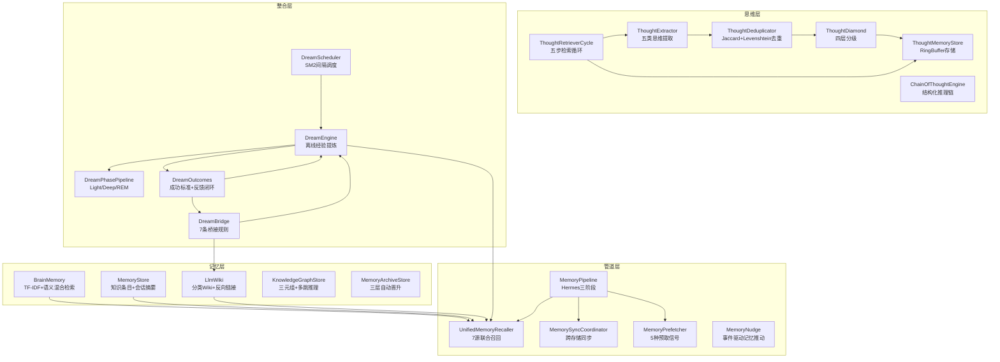
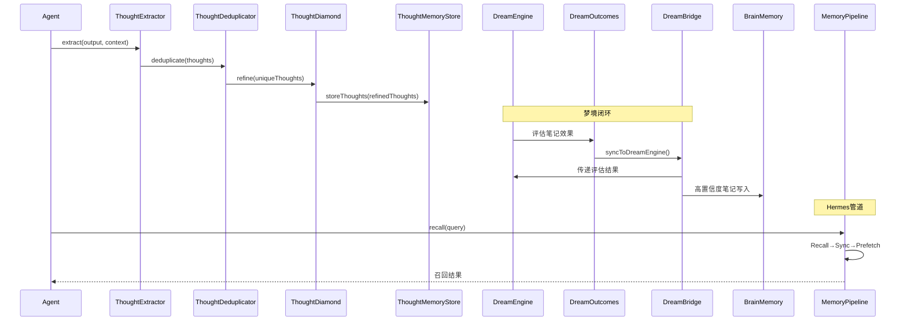

# 模块详解 — 思维子系统

> 源码路径：`src/runtime/thought/`
> 子系统定位：为框架运行时提供思维提取、去重、存储、检索、梦境整合、记忆推动、大脑记忆、Dreaming闭环、模块桥接、知识图谱、思维链推理、记忆归档、记忆管道和外部记忆提供商适配等认知能力，实现AI Agent的"思考-记忆-学习-反馈"完整闭环。

---

## 子系统概述

思维子系统（Thought Subsystem）是Harness多Agent架构的认知核心，负责管理AI Agent的思维链提取、记忆存储与检索、经验提炼（梦境）、跨存储同步和外部记忆提供商适配。该子系统包含22个核心模块（含7个Provider子模块），协同完成从思维提取到知识沉淀的完整认知生命周期。

思维子系统实现了四层认知架构：

1. **思维层**（ThoughtExtractor → ThoughtDeduplicator → ThoughtDiamond → ThoughtMemoryStore）：提取→去重→分级→存储的思维处理管道
2. **记忆层**（BrainMemory / MemoryStore / LlmWiki / KnowledgeGraphStore / MemoryArchiveStore）：多级记忆存储，从工作记忆到长期知识库
3. **整合层**（DreamEngine / DreamOutcomes / DreamBridge / DreamScheduler / DreamPhasePipeline）：离线经验提炼与闭环反馈
4. **管道层**（MemoryPipeline / UnifiedMemoryRecaller / MemorySyncCoordinator / MemoryPrefetcher）：Hermes三阶段管道统一接入

## 模块清单

| 模块 | 源文件 | 说明 |
|------|--------|------|
| ThoughtExtractor | thought-extractor.js | 思维提取器，标记模式匹配五类思维 |
| ThoughtDeduplicator | thought-deduplicator.js | 思维去重器，Jaccard+Levenshtein混合相似度 |
| ThoughtMemoryStore | thought-memory-store.js | 思维记忆存储，RingBuffer+多维度检索 |
| ThoughtRetrieverCycle | thought-retriever-cycle.js | 思维检索循环，五步RETRIEVE→STORE管道 |
| ThoughtDiamond | thought-diamond.js | 思维钻石，四层分级（RAW/CUT/POLISHED/DIAMOND） |
| MemoryNudge | memory-nudge.js | 记忆推动器，事件驱动的自动记忆保存 |
| MemoryStore | memory-store.js | 通用记忆存储，知识条目+会话摘要持久化 |
| DreamEngine | dream-engine.js | 梦境引擎，离线经验提炼与模式发现 |
| DreamScheduler | dream-scheduler.js | 梦境调度器，SM2间隔重复+定时/会话结束双触发 |
| DreamPhasePipeline | dream-phase-pipeline.js | 做梦阶段管道，Light/Deep/REM三阶段记忆巩固 |
| DreamOutcomes | dream-outcomes.js | 做梦结果闭环，成功标准定义+加权评分+反馈闭环 |
| DreamBridge | dream-bridge.js | 做梦模块桥接器，7条自动桥接规则+事件驱动 |
| BrainMemory | brain-memory.js | 大脑记忆，TF-IDF+语义混合检索+定期整合 |
| LlmWiki | llm-wiki.js | LLM知识库，分类Wiki+反向链接+语义搜索 |
| KnowledgeGraphStore | knowledge-graph-store.js | 知识图谱存储，三元组建模+多跳推理+传递推理 |
| ChainOfThoughtEngine | chain-of-thought.js | 思维链引擎，结构化步骤推理+回溯+收敛评分 |
| MemoryArchiveStore | memory-archive-store.js | 记忆归档存储，三层自动晋升（working→long_term→archive） |
| MemoryPrefetcher | memory-prefetcher.js | 记忆预取器，5种预取信号+8组件attach |
| UnifiedMemoryRecaller | unified-memory-recaller.js | 统一记忆召回器，7源跨存储联合召回+并行/顺序双模式 |
| MemorySyncCoordinator | memory-sync-coordinator.js | 记忆同步协调器，3种同步策略+3种冲突解决 |
| MemoryPipeline | memory-pipeline.js | 记忆管道，Hermes三阶段（Recall→Sync→Prefetch）统一接入 |
| Provider | provider/ | 外部记忆提供商（接口/注册表/适配器/健康检查） |

## 架构图



---

## 1. ThoughtExtractor — 思维提取器

### 概述

ThoughtExtractor从AI输出中提取关键思维链，支持5种思维类型（洞察/模式/决策/纠正/原则），通过标记模式匹配和隐式思维检测实现思维提取。

### 核心职责

- 5种思维类型提取（INSIGHT/PATTERN/DECISION/CORRECTION/PRINCIPLE）
- 标记模式匹配（5组标记集，权重0.85-0.95）
- 隐式思维检测（显著性标记）
- 置信度调整（基于类型和质量评分）

### 常量定义

#### THOUGHT_TYPES

| 类型 | 值 | 说明 |
|------|-----|------|
| INSIGHT | `'insight'` | 洞察：新发现或深层理解 |
| PATTERN | `'pattern'` | 模式：重复出现的规律 |
| DECISION | `'decision'` | 决策：明确的选择或判断 |
| CORRECTION | `'correction'` | 纠正：错误修正或方向调整 |
| PRINCIPLE | `'principle'` | 原则：可复用的规则或准则 |

### 关键方法详解

#### `extract(output, context)`
从AI输出中提取思维。返回思维数组，每项包含type、content、confidence、source。

```javascript
const thoughts = extractor.extract(aiOutput, { taskId: 'task-001' });
// [{ type: 'insight', content: '...', confidence: 0.9, source: 'task-001' }, ...]
```

#### `getStats()` / `isHealthy()`
获取统计信息 / 检查健康状态。

### 事件

| 事件名 | 触发条件 | 事件数据 |
|--------|----------|----------|
| `thoughts-extracted` | 思维提取完成 | `{ count, types, sourceTaskId }` |

### 使用示例

```javascript
const ThoughtExtractor = require('./src/runtime/thought/thought-extractor');
const ext = new ThoughtExtractor();

const thoughts = ext.extract('关键发现：数据库查询缺少索引导致性能瓶颈', {
  taskId: 'perf-analysis',
});
// thoughts[0].type === 'insight'
```

---

## 2. ThoughtDeduplicator — 思维去重器

### 概述

ThoughtDeduplicator使用Jaccard(0.6) + Levenshtein编辑距离(0.4)混合相似度检测重复思维，支持合并策略（高置信度优先）和容量限制（MAX_EXISTING_THOUGHTS=5000）。

### 核心职责

- 混合相似度计算（Jaccard 0.6 + Levenshtein 0.4）
- 重复思维合并（高置信度优先策略）
- 容量限制与基于置信度的修剪
- 已有思维加载

### 常量定义

| 常量 | 值 | 说明 |
|------|-----|------|
| `SIMILARITY_THRESHOLD` | `0.75` | 相似度阈值，超过此值视为重复 |
| `MERGE_STRATEGY_HIGHER_CONFIDENCE` | `'higher-confidence'` | 合并策略：保留高置信度 |
| `MERGE_STRATEGY_MERGE` | `'merge'` | 合并策略：合并内容 |
| `MAX_EXISTING_THOUGHTS` | `5000` | 最大已有思维数 |

### 关键方法详解

#### `loadExisting(thoughts)`
加载已有思维集合，用于后续去重比对。

```javascript
deduplicator.loadExisting(existingThoughts);
```

#### `deduplicate(newThoughts)`
对新思维进行去重处理。返回去重后的思维数组。

```javascript
const unique = deduplicator.deduplicate(newThoughts);
```

### 事件

| 事件名 | 触发条件 | 事件数据 |
|--------|----------|----------|
| `deduplication-complete` | 去重完成 | `{ inputCount, outputCount, mergedCount }` |
| `thoughts-trimmed` | 思维被修剪 | `{ trimmedCount, reason }` |

---

## 3. ThoughtMemoryStore — 思维记忆存储

### 概述

ThoughtMemoryStore使用RingBuffer存储思维，支持防抖JSON持久化和多维度检索（type/domain/tag/minConfidence/text/sourceTaskId/sortBy/limit），可选嵌入服务语义搜索。

### 关键方法详解

#### `storeThought(thought)` / `storeThoughts(thoughts)`
存储单条/多条思维。

```javascript
store.storeThought({ type: 'insight', content: '...', confidence: 0.9 });
```

#### `retrieveThoughts(query)`
多维度检索思维。支持type/domain/tag/minConfidence/text/sourceTaskId/sortBy(confidence/recent/semantic)/limit。

```javascript
const results = store.retrieveThoughts({
  type: 'insight',
  minConfidence: 0.7,
  sortBy: 'confidence',
  limit: 10,
});
```

#### `updateThought(id, updates)` / `removeThought(id)` / `getThought(id)`
更新/删除/获取单条思维。

#### `traceSource(id)`
追踪思维来源链。

#### `flush()`
强制刷写持久化缓冲。

### 事件

| 事件名 | 触发条件 |
|--------|----------|
| `thought-stored` | 思维存储完成 |
| `thoughts-restored` | 从持久化恢复完成 |
| `thought-updated` | 思维更新完成 |
| `thought-removed` | 思维删除完成 |

---

## 4. ThoughtRetrieverCycle — 思维检索循环

### 概述

ThoughtRetrieverCycle实现五步思维检索管道（RETRIEVE→GENERATE→DISTILL→DEDUPLICATE→STORE），支持三种检索模式（confidence/semantic/hybrid）和可选ThoughtDiamond精炼步骤。

### 常量定义

#### CYCLE_STEPS

| 步骤 | 值 | 说明 |
|------|-----|------|
| RETRIEVE | `'retrieve'` | 检索相关思维 |
| GENERATE | `'generate'` | 生成新思维 |
| DISTILL | `'distill'` | 精炼思维 |
| DEDUPLICATE | `'deduplicate'` | 去重 |
| STORE | `'store'` | 存储 |

### 关键方法详解

#### `execute(agentOutput, context)`
执行完整的五步检索循环。

```javascript
const result = await cycle.execute(agentOutput, { taskId: 'task-001' });
```

#### `retrieve(context)`
仅执行检索步骤。

---

## 5. ThoughtDiamond — 思维钻石

### 概述

ThoughtDiamond实现四层思维分级（RAW/CUT/POLISHED/DIAMOND），根据置信度自动分类，支持Jaccard去重和rootData溯源。

### 常量定义

#### DIAMOND_TIERS

| 层级 | 置信度范围 | 说明 |
|------|------------|------|
| RAW | 0 - 0.5 | 原始思维，未经验证 |
| CUT | 0.5 - 0.75 | 初步验证，基本可靠 |
| POLISHED | 0.75 - 0.9 | 充分验证，高度可靠 |
| DIAMOND | 0.9 - 1.0 | 顶级思维，经过实践验证 |

### 关键方法详解

#### `refine(thoughts, rootData)`
精炼思维，根据置信度分级并去重。

```javascript
const refined = diamond.refine(thoughts, { sessionId: 'session-001' });
```

#### `retrieveDiamonds(query)` / `getDiamond(id)` / `removeDiamond(id)`
检索/获取/删除钻石级思维。

#### `traceRootData(diamondId)`
追踪钻石思维的根数据来源。

#### `getTierStats()`
获取各层级统计。

### 事件

| 事件名 | 触发条件 |
|--------|----------|
| `diamond-created` | 钻石级思维创建 |
| `diamond-upgraded` | 思维层级提升 |
| `diamond-removed` | 钻石级思维删除 |

---

## 6. MemoryNudge — 记忆推动器

### 概述

MemoryNudge实现事件驱动的主动记忆提醒，包含7条内置规则（complex-task/error-recovery/user-correction/novel-approach/convention-discovered/performance-insight/code-change），集成EventBus自动触发记忆保存。

### 内置规则

| 规则 | 触发条件 | 说明 |
|------|----------|------|
| complex-task | 复杂任务完成 | 保存任务解决策略 |
| error-recovery | 错误恢复 | 保存错误恢复经验 |
| user-correction | 用户纠正 | 保存用户纠正内容 |
| novel-approach | 新方法发现 | 保存创新方法 |
| convention-discovered | 约定发现 | 保存新发现的约定 |
| performance-insight | 性能洞察 | 保存性能优化经验 |
| code-change | 代码变更 | 使受影响的记忆失效 |

### 关键方法详解

#### `attachSqliteStore(store)` / `attachEventBus(bus)`
注入SQLite存储 / EventBus实例。

#### `addRule(rule)`
添加自定义推动规则。

#### `startListening()`
开始监听EventBus事件。

#### `evaluate(context)`
评估上下文是否触发记忆推动。

#### `handleCodeChange(filePath, changeType)`
处理代码变更，使受影响的记忆失效。

#### `verifyStaleMemories(target)`
验证过期记忆是否仍然有效。

### 事件

| 事件名 | 触发条件 |
|--------|----------|
| `nudge-triggered` | 记忆推动触发 |
| `memory-saved` | 记忆保存完成 |
| `nudge-skipped` | 推动被跳过 |
| `memories-consolidated` | 记忆整合完成 |
| `memories-invalidated-by-code-change` | 代码变更导致记忆失效 |

---

## 7. MemoryStore — 通用记忆存储

### 概述

MemoryStore实现知识条目和会话摘要的持久化存储，支持Spec资产索引、语义查询和原子JSON持久化（防抖写入）。

### 关键方法详解

#### `addKnowledge(entry)`
添加知识条目。

```javascript
store.addKnowledge({
  category: 'architecture',
  content: '系统采用分层架构...',
  source: 'architecture-design',
  tags: ['architecture', 'layered'],
});
```

#### `queryKnowledge(filter)`
查询知识条目。支持文本匹配和语义搜索。

#### `saveSessionSummary(sessionId, summary)` / `getSessionSummary(sessionId)` / `querySummaries(filter)`
会话摘要的保存和查询。

#### `updateSpecLiveness(id, status, verifiedPaths)` / `getSpecAssetsByType(specType)`
Spec资产存活状态管理和按类型查询。

### 事件

| 事件名 | 触发条件 |
|--------|----------|
| `knowledge-added` | 知识条目添加 |
| `knowledge-removed` | 知识条目删除 |
| `summary-added` | 会话摘要添加 |
| `knowledge-updated` | 知识条目更新 |
| `spec-liveness-updated` | Spec存活状态更新 |

---

## 8. DreamEngine — 梦境引擎

### 概述

DreamEngine实现离线经验提炼和模式发现，支持3种笔记类别（ERROR_AVOIDANCE/BEST_PRACTICE/WORKFLOW_OPTIMIZATION）和3种模式类型（ERROR_PATTERNS/SUCCESS_PATTERNS/WORKFLOW_PATTERNS），可选3阶段管道（Light/Deep/REM）。

### 常量定义

#### NOTE_CATEGORIES

| 类别 | 值 | 说明 |
|------|-----|------|
| ERROR_AVOIDANCE | `'error-avoidance'` | 错误避免笔记 |
| BEST_PRACTICE | `'best-practice'` | 最佳实践笔记 |
| WORKFLOW_OPTIMIZATION | `'workflow-optimization'` | 工作流优化笔记 |

#### PATTERN_TYPES

| 类型 | 值 | 说明 |
|------|-----|------|
| ERROR_PATTERNS | `'error-patterns'` | 错误模式 |
| SUCCESS_PATTERNS | `'success-patterns'` | 成功模式 |
| WORKFLOW_PATTERNS | `'workflow-patterns'` | 工作流模式 |

### 关键方法详解

#### `startDreaming(sessionHistory)`
启动梦境处理，从会话历史中提炼经验。

```javascript
const result = await dreamEngine.startDreaming(sessionHistory);
// 返回: { notes, patterns, stats }
```

#### `startDreamingWithPhases(sessionHistory)`
启动带3阶段管道的梦境处理。

#### `getNotes(category, minConfidence)` / `getRelevantNotes(context)`
获取笔记 / 获取与上下文相关的笔记（关键词0.6 + 语义0.4混合评分）。

#### `syncNotesToStores(minConfidence)`
同步高置信度笔记到外部存储。

#### `attachSqliteStore(store)` / `attachThoughtMemoryStore(store)` / `attachEmbeddingService(service)` / `attachBrainMemory(bm)` / `attachMemoryStore(ms)` / `attachPhasePipeline(pipeline)`
依赖注入方法。

### 事件

| 事件名 | 触发条件 |
|--------|----------|
| `dream-started` | 梦境处理开始 |
| `dream-completed` | 梦境处理完成 |
| `note-created` | 笔记创建 |
| `note-merged` | 笔记合并 |
| `dream-complete` | 梦境完成（含3阶段） |
| `dream-with-phases-complete` | 带阶段管道的梦境完成 |
| `dream-error` | 梦境处理错误 |
| `notes-synced` | 笔记同步完成 |
| `semantic-score-error` | 语义评分错误 |

---

## 9. DreamScheduler — 梦境调度器

### 概述

DreamScheduler实现SM2间隔重复算法的梦境调度，支持定时触发（默认30分钟）和会话结束触发两种模式。

### 常量定义

| 常量 | 值 | 说明 |
|------|-----|------|
| `DEFAULT_INTERVAL_MS` | `1800000` | 默认调度间隔（30分钟） |
| `EASY_BONUS` | `1.3` | SM2简单奖励系数 |
| `HARD_MULTIPLIER` | `0.8` | SM2困难乘数 |
| `TARGET_RETENTION` | `0.9` | 目标保留率 |

### 关键方法详解

#### `start()` / `stop()` / `isRunning()`
启动/停止/查询调度器状态。

#### `onSessionEnd(sessionId, thoughts, context)`
会话结束时触发梦境处理。

#### `setSessionHistoryProvider(fn)`
设置会话历史提供者函数。

#### `recordDreamPerformance(performance)`
记录梦境性能，用于SM2间隔调整。

#### `getAdaptiveIntervalMs()`
获取SM2自适应间隔。

### 事件

| 事件名 | 触发条件 |
|--------|----------|
| `scheduler:started` | 调度器启动 |
| `scheduler:stopped` | 调度器停止 |
| `dream:session:end` | 会话结束触发梦境 |
| `sm2:interval-adjusted` | SM2间隔调整 |
| `review-error` | 回顾错误 |

---

## 10. DreamPhasePipeline — 做梦阶段管道

### 概述

DreamPhasePipeline借鉴OpenClaw 4.5的三阶段Dreaming架构，实现Light/Deep/REM三阶段记忆巩固流水线，通过6维加权评分和3个门控阈值实现记忆从短期到长期的晋升。

### 三阶段流程

| 阶段 | 功能 | 说明 |
|------|------|------|
| Light Sleep | 扫描标记候选记忆 | 从会话历史提取文本，分类标记 |
| Deep Sleep | 6维评分+3门控过滤 | 加权评分+门控阈值+冲突检测+合并 |
| REM Sleep | 提取主题和反思信号 | 关键词共现主题提取+反思信号生成 |

### 6维评分权重

| 维度 | 权重 | 说明 |
|------|------|------|
| frequency | 0.24 | 出现频率 |
| relevance | 0.30 | 相关性 |
| queryDiversity | 0.15 | 查询多样性 |
| recency | 0.15 | 新鲜度 |
| consolidation | 0.10 | 巩固度 |
| conceptualRichness | 0.06 | 概念丰富度 |

### 3个门控阈值

| 阈值 | 默认值 | 说明 |
|------|--------|------|
| minScore | 0.5 | 最低综合评分 |
| minRecallCount | 2 | 最低被召回次数 |
| minUniqueQueries | 1 | 最低不同查询数 |

### 关键方法详解

#### `executeLightPhase(sessionHistory)`
Light阶段：扫描近期会话，标记候选记忆。

#### `executeDeepPhase(candidates, existingNotes)`
Deep阶段：6维加权评分 + 3门控阈值过滤。

#### `executeRemPhase(promoted, allNotes)`
REM阶段：提取主题和反思信号。

#### `executePipeline(sessionHistory, existingNotes)`
执行完整流水线 Light → Deep → REM。

### 候选记忆类别

| 类别 | 说明 |
|------|------|
| preference | 偏好（标记词：prefer/喜欢/推荐） |
| fact | 事实（标记词：uses/使用/基于） |
| correction | 纠正（标记词：error/错误/修复） |
| workflow | 工作流（标记词：step/步骤/流程） |
| decision | 决策（标记词：decided/决定/选择） |
| noise | 噪音（无法归类时降级） |

---

## 11. DreamOutcomes — 做梦结果闭环

### 概述

DreamOutcomes为任务/会话定义成功标准、评估结果、反馈闭环至DreamEngine和SkillImprovementLoop，并追踪DreamEngine笔记的实际使用效果。

### 关键方法详解

#### `defineOutcome(taskId, criteria)`
为任务定义成功标准。

```javascript
outcomes.defineOutcome('task-001', {
  description: '性能优化目标',
  metrics: [
    { name: 'response_time', target: 200, weight: 0.6 },
    { name: 'error_rate', target: 0.01, weight: 0.4 },
  ],
  category: 'task',
});
```

#### `evaluateOutcome(taskId, actualResults)`
评估任务结果是否达成Outcomes。评分>=0.8视为达成。

```javascript
const evaluation = outcomes.evaluateOutcome('task-001', {
  metrics: [
    { name: 'response_time', actual: 180 },
    { name: 'error_rate', actual: 0.005 },
  ],
});
// evaluation.achieved === true, evaluation.score === 0.95
```

#### `syncToDreamEngine()` / `syncToSkillImprovementLoop()`
将评估结果同步到DreamEngine / SkillImprovementLoop。

#### `recordNoteUsage(noteId, context)` / `recordNoteOutcome(noteId, effective)`
记录笔记使用和效果。

#### `getNoteEffectiveness(noteId)` / `getLowEffectivenessNotes(threshold)`
获取笔记效果统计 / 获取低效果笔记列表。

### 事件

| 事件名 | 触发条件 |
|--------|----------|
| `outcome-defined` | 成功标准定义 |
| `outcome-evaluated` | 评估完成 |
| `outcome-achieved` | 目标达成（score >= 0.8） |
| `outcome-missed` | 目标未达成 |
| `note-usage-recorded` | 笔记使用记录 |
| `note-outcome-recorded` | 笔记效果记录 |
| `synced-to-dream-engine` | 同步到DreamEngine |
| `synced-to-improvement-loop` | 同步到SkillImprovementLoop |

---

## 12. DreamBridge — 做梦模块桥接器

### 概述

DreamBridge将相互隔离的Dreaming相关模块桥接起来，形成闭环。监听各模块事件，自动在QualityScorer、SelfReflection、DreamOutcomes、DreamEngine、SkillImprovementLoop、LlmWiki、ErrorPreventionGuard、IronRuleEngine之间传递数据。包含8条自动桥接规则，其中规则#8为Grader代理评估闭环，融合自"AI Agent Dreaming"的Outcomes核心概念。

### 8条自动桥接规则

| 规则 | 源模块 | 目标模块 | 触发事件 | 说明 |
|------|--------|----------|----------|------|
| 1 | QualityScorer | DreamOutcomes | `score-computed` | 质量评分→结果评估 |
| 2 | SelfReflection | DreamEngine | `reflection-completed` | 自省结果→梦境输入 |
| 3 | DreamOutcomes | DreamEngine | `outcome-evaluated` | 结果评估→梦境同步 |
| 4 | DreamOutcomes | SkillImprovementLoop | `outcome-evaluated` | 结果评估→技能改进 |
| 5 | DreamEngine | LlmWiki | `dream-complete` / `dream-error` | 高置信度笔记→知识库 |
| 6 | SelfReflection | ErrorPreventionGuard | `reflection-completed` | 自省→错误预防 |
| 7 | ErrorPreventionGuard | IronRuleEngine | `auto-registered-from-reflection` | 错误模式→铁律 |
| 8 | DreamOutcomes | DreamEngine | `grader-evaluated` | Grader评估→梦境学习 |
| 9 | CodeWikiOrchestrator | DreamEngine | `compile-completed` | CodeWiki编译→架构理解学习 |

### 关键方法详解

#### `attachDreamEngine(engine)` / `attachDreamOutcomes(outcomes)` / `attachQualityScorer(scorer)` / `attachSelfReflection(reflection)` / `attachSkillImprovementLoop(loop)` / `attachLlmWiki(wiki)` / `attachBrainMemory(bm)` / `attachErrorPreventionGuard(guard)` / `attachIronRuleEngine(engine)`
依赖注入方法。

#### `activate()` / `deactivate()` / `isActive()`
激活/停用/查询桥接状态。

#### `getBridgeStats()` / `getStats()`
获取桥接统计信息。

### 事件

| 事件名 | 触发条件 |
|--------|----------|
| `bridge-activated` | 桥接激活 |
| `bridge-deactivated` | 桥接停用 |
| `bridge-executed` | 桥接规则执行 |
| `bridge-failed` | 桥接执行失败 |

---

## 13. BrainMemory — 大脑记忆

### 概述

BrainMemory实现分层记忆架构，支持TF-IDF关键词(0.4) + 语义(0.6)混合检索、定期整合（移除过期/陈旧、合并相似、重建倒排索引）、LRU淘汰和TTL过期。

### 常量定义

#### DEFAULT_CONFIG

| 选项 | 默认值 | 说明 |
|------|--------|------|
| `maxMemories` | `2000` | 最大记忆条目数 |
| `defaultTTL` | `86400000` | 默认TTL（24小时） |
| `retrievalTimeout` | `100` | 检索超时（毫秒） |
| `consolidationInterval` | `3600000` | 整合间隔（1小时） |
| `similarityThreshold` | `0.8` | 相似度阈值 |
| `maxDocumentFreqTokens` | `50000` | 最大文档频率Token数 |

### 关键方法详解

#### `store(key, content, metadata)`
存储记忆条目。

```javascript
brainMemory.store('arch-decision', '采用分层架构...', {
  type: 'decision',
  confidence: 0.9,
});
```

#### `retrieve(query, options)`
混合检索记忆。TF-IDF关键词匹配(0.4) + 语义相似度(0.6)。

```javascript
const results = brainMemory.retrieve('架构设计', { limit: 5 });
```

#### `consolidate()`
手动触发整合：移除过期/陈旧条目、合并相似条目、重建倒排索引。

#### `invalidate(pattern)`
按模式使记忆失效。

#### `getHealthStatus()` / `getStatusBar()`
获取健康状态 / 状态条。

### 事件

| 事件名 | 触发条件 |
|--------|----------|
| `memory-stored` | 记忆存储 |
| `memory-retrieved` | 记忆检索 |
| `memory-expired` | 记忆过期 |
| `consolidation-complete` | 整合完成 |
| `memory-consolidated` | 记忆整合 |
| `memory-invalidated` | 记忆失效 |
| `embedding-error` | 嵌入错误 |
| `retrieval-error` | 检索错误 |

---

## 14. LlmWiki — LLM知识库

### 概述

LlmWiki实现结构化知识存储与检索，支持分类Wiki条目（concepts/decisions/patterns/api/troubleshooting）、Markdown文件持久化、frontmatter元数据、反向链接索引和可选语义搜索。

### 常量定义

#### DEFAULT_CONFIG

| 选项 | 默认值 | 说明 |
|------|--------|------|
| `categories` | `['concepts','decisions','patterns','api','troubleshooting']` | Wiki类别 |
| `maxEntriesPerCategory` | `200` | 每类最大条目数 |
| `autoIndex` | `true` | 自动索引 |

### 关键方法详解

#### `initialize(wikiRoot)`
初始化Wiki，创建目录结构和README模板，自动加载已有条目。

```javascript
wiki.initialize('/path/to/wiki');
```

#### `createEntry(category, title, content, metadata)`
创建Wiki条目，写入Markdown文件并更新索引。

```javascript
wiki.createEntry('patterns', '分层架构模式', '采用分层架构...', {
  tags: ['architecture', 'pattern'],
  confidence: 0.9,
});
```

#### `updateEntry(category, slug, updates)` / `deleteEntry(category, slug)` / `getEntry(category, slug)`
更新/删除/获取Wiki条目。

#### `search(query, options)`
搜索Wiki条目，支持标题、标签和全文匹配，按相关度评分排序，可选语义重排序。

```javascript
const results = wiki.search('架构设计', {
  categories: ['patterns', 'decisions'],
  tags: ['architecture'],
  fullText: true,
});
```

#### `getBacklinks(category, slug)`
获取指向指定条目的反向链接列表。

#### `suggestUpdates(context)`
根据上下文建议需要更新的条目（检查过期、低置信度和标题匹配）。

#### `listEntries(category)`
列出Wiki条目，可按类别过滤。

### 事件

| 事件名 | 触发条件 |
|--------|----------|
| `initialized` | Wiki初始化完成 |
| `entry-created` | 条目创建 |
| `entry-updated` | 条目更新 |
| `entry-deleted` | 条目删除 |

---

## 15. KnowledgeGraphStore — 知识图谱存储

### 概述

KnowledgeGraphStore基于三元组的知识图谱存储，支持8种关系类型、多跳BFS查询、双向BFS最短路径、传递推理（IS_A/DEPENDS_ON/PART_OF）、双向索引和容量限制。

### 关系类型

| 类型 | 值 | 说明 |
|------|-----|------|
| IS_A | `'is_a'` | 分类关系 |
| PART_OF | `'part_of'` | 组成关系 |
| DEPENDS_ON | `'depends_on'` | 依赖关系 |
| PRODUCES | `'produces'` | 产出关系 |
| USES | `'uses'` | 使用关系 |
| RELATES_TO | `'relates_to'` | 关联关系 |
| CONTRADICTS | `'contradicts'` | 矛盾关系 |
| SUPPORTS | `'supports'` | 支持关系 |

### 关键方法详解

#### `addEntity(name, type, attributes)` / `getEntity(entityId)` / `findEntitiesByName(name)` / `findEntitiesByType(type)`
实体的添加和查询。

#### `addRelation(subjectId, predicate, objectId, options)` / `addTriple(subjectName, predicate, objectName, options)`
添加关系/三元组。addTriple自动创建不存在的实体。

```javascript
kg.addTriple('Node.js', 'is_a', 'Runtime', { subjectType: 'technology' });
kg.addTriple('Express', 'depends_on', 'Node.js');
kg.addTriple('Harness', 'uses', 'Node.js');
```

#### `query(startEntityId, options)`
多跳图查询（BFS遍历），支持谓词过滤、方向控制、置信度过滤和深度限制。

```javascript
const result = kg.query('express-entity-id', {
  maxDepth: 2,
  direction: 'both',
  minConfidence: 0.5,
});
// { paths: [...], discoveredEntities: Set, totalPaths: 3 }
```

#### `findPath(fromEntityId, toEntityId, options)`
双向BFS最短路径查找。

#### `inferRelations(entityId)`
传递推理：沿IS_A/DEPENDS_ON/PART_OF链发现隐含关系（置信度×0.9衰减）。

#### `getSubgraph(entityIds)`
提取子图。

#### `exportAsTriples()` / `importFromTriples(triples)`
导出/导入三元组数据。

### 事件

| 事件名 | 触发条件 |
|--------|----------|
| `entity-added` | 实体添加 |
| `relation-added` | 关系添加 |
| `error` | 操作错误 |

---

## 16. ChainOfThoughtEngine — 思维链引擎

### 概述

ChainOfThoughtEngine实现结构化步骤化推理，支持6种步骤类型、4种推理深度、回溯机制、收敛评分和Markdown格式化输出。

### 步骤类型

| 类型 | 值 | 说明 |
|------|-----|------|
| OBSERVE | `'observe'` | 观察 |
| ANALYZE | `'analyze'` | 分析 |
| HYPOTHESIZE | `'hypothesize'` | 假设 |
| VERIFY | `'verify'` | 验证 |
| CONCLUDE | `'conclude'` | 结论 |
| REFLECT | `'reflect'` | 反思 |

### 推理深度

| 深度 | 最大步骤 | 说明 |
|------|----------|------|
| quick | 3 | 快速推理 |
| standard | 5 | 标准推理 |
| deep | 8 | 深度推理 |
| intensive | 12 | 强化推理 |

### 关键方法详解

#### `startChain(task, options)`
启动新的推理链。

```javascript
const { chainId } = await engine.startChain('分析系统瓶颈', { depth: 'deep' });
```

#### `addStep(chainId, stepData)`
添加推理步骤。

```javascript
await engine.addStep(chainId, {
  type: 'observe',
  content: 'CPU使用率95%',
  confidence: 0.9,
});
```

#### `backtrack(chainId, toStepIndex)`
回溯到指定步骤，移除后续步骤。

```javascript
await engine.backtrack(chainId, 2); // 回溯到步骤2
```

#### `concludeChain(chainId, conclusion)`
结束推理链，计算收敛评分并持久化经验。

```javascript
const result = await engine.concludeChain(chainId, '添加复合索引解决瓶颈');
// { chainId, convergenceScore: 0.85, steps: 5, conclusion: '...' }
```

#### `formatChainAsMarkdown(chainId)`
将推理链格式化为可读Markdown文档。

### 收敛评分公式

```
score = 有结论(0.3) + 平均置信度(0.4) + 类型覆盖率(0.3)
```

---

## 17. MemoryArchiveStore — 记忆归档存储

### 概述

MemoryArchiveStore实现三层记忆自动晋升存储（working→long_term→archive），融合OpenHuman三层记忆树架构。

### 三层架构

| 层级 | TTL | 容量 | 说明 |
|------|-----|------|------|
| working | 30分钟 | 500 | 当前会话活跃数据 |
| long_term | 30天 | 5000 | 跨会话持久数据 |
| archive | 永久 | 50000 | 历史数据压缩存储 |

### 晋升规则

| 规则 | 条件 | 说明 |
|------|------|------|
| working → long_term | accessCount >= 3 或 (存活过半且访问>=1) | 自动晋升 |
| long_term → archive | 存活过半且7天无访问 | 自动归档 |

### 关键方法详解

#### `store(key, value, options)`
存储记忆到指定层级（默认working）。

```javascript
store.store('config', { port: 3210 }, { tier: 'working' });
```

#### `retrieve(key)`
按优先级检索：working → long_term → archive。自动递增访问计数。

#### `promote(entryId)` / `archive(key)`
手动晋升/归档。

#### `startAutoPromotion()` / `stopAutoPromotion()`
启动/停止自动晋升定时器。

#### `getByTier(tier)` / `getTierStats(tier)` / `search(query, options)`
层级查询和搜索。

---

## 18. MemoryPrefetcher — 记忆预取器

### 概述

MemoryPrefetcher基于5种预取信号预测性加载可能需要的记忆，支持8组件attach、TTL淘汰和并发控制。

### 5种预取信号

| 信号 | 值 | 说明 |
|------|-----|------|
| PHASE_CHANGE | `'phase-change'` | 阶段变更 |
| HIGH_ENTROPY | `'high-entropy'` | 高熵意图 |
| TASK_AFFINITY | `'task-affinity'` | 任务亲和 |
| USER_PATTERN | `'user-pattern'` | 用户模式 |
| PERIODIC | `'periodic'` | 周期性 |

### 8组件attach

| 方法 | 组件 |
|------|------|
| `attachBrainMemory(bm)` | BrainMemory |
| `attachMemoryStore(ms)` | MemoryStore |
| `attachStructuredIntent(si)` | StructuredIntent |
| `attachAffinityLearner(al)` | AffinityLearner |
| `attachPhaseContextInjector(pci)` | PhaseContextInjector |
| `attachUserModelManager(umm)` | UserModelManager |
| `attachLlmWiki(wiki)` | LlmWiki |
| `attachDreamEngine(de)` | DreamEngine |

### 关键方法详解

#### `start()` / `stop()`
启动/停止周期性预取定时器。

#### `onPhaseChange(phaseInfo)` / `onIntentParsed(intentResult)` / `onTaskAssigned(taskInfo)` / `onUserInteraction(interactionInfo)`
信号触发方法。

#### `getPrefetched(query)` / `getPrefetchedForContext(context)`
获取预取数据。

---

## 19. UnifiedMemoryRecaller — 统一记忆召回器

### 概述

UnifiedMemoryRecaller实现7源跨存储联合召回，支持并行/顺序双模式、去重+置信度排序和查询缓存。

### 7种召回源

| 源 | 值 | 默认召回方法 |
|----|-----|-------------|
| BrainMemory | `'brain-memory'` | `retrieve(query, opts)` |
| MemoryStore | `'memory-store'` | `queryKnowledge(query)` |
| ThoughtStore | `'thought-store'` | `search(query, opts)` |
| LlmWiki | `'llm-wiki'` | `search(query)` |
| DreamEngine | `'dream-engine'` | `getRelevantNotes(query, opts)` |
| CausalStore | `'causal-store'` | `searchByCausalSimilarity(query, opts)` |
| Prefetcher | `'prefetcher'` | `getPrefetched(query)` |

### 关键方法详解

#### `attachSource(sourceName, sourceInstance, options)`
附加召回源，可指定priority和recallFn。

```javascript
recaller.attachSource('brain-memory', brainMemory, { priority: 2 });
recaller.attachSource('memory-store', memoryStore, { priority: 3 });
```

#### `recall(query, options)` / `recallSync(query, options)`
异步/同步召回。并行模式使用Promise.allSettled，顺序模式按优先级排序。

```javascript
const result = await recaller.recall('架构设计', { limit: 10, minConfidence: 0.5 });
// { results: [...], sources: {...}, meta: { totalRaw, afterDedup, returned } }
```

#### `enableSource(sourceName)` / `disableSource(sourceName)`
启用/禁用召回源。

---

## 20. MemorySyncCoordinator — 记忆同步协调器

### 概述

MemorySyncCoordinator实现跨存储一致性协调，支持3种同步策略（事件驱动/周期性/手动）和3种冲突解决策略（最新胜/置信度合并/源优先级）。

### 同步策略

| 策略 | 值 | 说明 |
|------|-----|------|
| ON_EVENT | `'on-event'` | 事件驱动同步 |
| PERIODIC | `'periodic'` | 周期性同步 |
| MANUAL | `'manual'` | 手动同步 |

### 冲突解决策略

| 策略 | 值 | 说明 |
|------|-----|------|
| LATEST_WINS | `'latest-wins'` | 时间戳最新者胜 |
| CONFIDENCE_MERGE | `'confidence-merge'` | 置信度合并（取最高置信度+合并标签） |
| SOURCE_PRIORITY | `'source-priority'` | 源优先级高者胜 |

### 关键方法详解

#### `registerStore(storeName, storeInstance, options)`
注册记忆存储实例。自动发现sync/write/query方法。

#### `enqueueSync(syncItem)`
将同步项加入队列。

#### `syncAll(options)` / `syncFromSource(sourceName, data, options)`
同步所有存储 / 从指定源同步。

#### `startPeriodicSync()` / `stopPeriodicSync()`
启动/停止周期性同步。

---

## 21. MemoryPipeline — 记忆管道

### 概述

MemoryPipeline实现Hermes三阶段管道（Recall→Sync→Prefetch）统一接入，自动布线8+外部组件，支持外部记忆提供商（mem0/Honcho/Hindsight），单入口API，级联shutdown。

### 三阶段管道

| 阶段 | 模块 | 功能 |
|------|------|------|
| Recall | UnifiedMemoryRecaller | 7源跨存储联合召回 |
| Sync | MemorySyncCoordinator | 跨存储一致性协调 |
| Prefetch | MemoryPrefetcher | 5种预取信号驱动预加载 |

### 关键方法详解

#### `attachComponent(name, instance)`
附加外部组件，供initialize()时自动布线。支持的组件名：brain-memory/memory-store/thought-store/llm-wiki/dream-engine/causal-store/structured-intent/affinity-learner/phase-context-injector/user-model-manager/embedding-service/sqlite-store。

#### `initialize()`
初始化管道，自动布线所有已附加的组件。

```javascript
const pipeline = new MemoryPipeline({ syncConfig: { syncIntervalMs: 60000 } });
pipeline.attachComponent('brain-memory', brainMemoryInstance);
pipeline.attachComponent('memory-store', memoryStoreInstance);
pipeline.initialize();
```

#### `recall(query, options)` / `syncAll(options)`
委托给Recaller/SyncCoordinator执行。

#### `attachExternalProvider(name, provider, options)` / `detachExternalProvider(name)`
附加/分离外部记忆提供商（自动注册到Recaller和SyncCoordinator）。

```javascript
pipeline.attachExternalProvider('mem0', mem0Adapter, { priority: 1 });
```

#### `onPhaseChange(phaseInfo)` / `onIntentParsed(intentResult)` / `onTaskAssigned(taskInfo)` / `onUserInteraction(interactionInfo)`
信号转发到Prefetcher。

---

## 22. Provider — 外部记忆提供商

### 概述

Provider子模块提供外部记忆提供商的统一抽象层，包含接口定义、注册表、适配器基类和3个具体适配器（mem0/Honcho/Hindsight）。

### 模块清单

| 模块 | 源文件 | 说明 |
|------|--------|------|
| MemoryProviderInterface | provider/memory-provider-interface.js | 提供者接口，connect/disconnect/healthCheck/recall/write/query/delete/sync |
| ProviderRegistry | provider/provider-registry.js | 提供者注册表，注册/注销/健康检查/连接管理 |
| ProviderAdapterBase | provider/provider-adapter-base.js | 适配器基类，重试/超时/限流/错误分类/指标追踪 |
| Mem0Adapter | provider/mem0-adapter.js | mem0适配器，云端/自托管记忆服务 |
| HonchoAdapter | provider/honcho-adapter.js | Honcho适配器，AI原生记忆平台 |
| HindsightAdapter | provider/hindsight-adapter.js | Hindsight适配器，本地部署记忆服务 |
| ProviderHealthChecker | provider/provider-health-checker.js | 提供者健康检查器，周期性探测+熔断器 |

### MemoryProviderInterface — 接口定义

```javascript
class MemoryProviderInterface extends EventEmitter {
  async connect() {}
  async disconnect() {}
  async healthCheck() {}    // → { healthy, latency, error }
  async recall(query, options) {}  // → Array
  async write(entry) {}     // → { success, id }
  async query(filter) {}    // → Array
  async delete(id) {}       // → boolean
  async sync(entries, direction) {} // → { pushed, pulled }
  getCapabilities() {}      // → { recall, write, sync, semanticSearch, userIsolation }
  getName() {}              // → string
  isConnected() {}          // → boolean
}
```

### ProviderAdapterBase — 适配器基类

在MemoryProviderInterface基础上增加：
- **重试机制**：指数退避重试（maxRetries=3, retryBaseDelayMs=1000）
- **速率限制**：每分钟最大请求数（maxRequestsPerMinute=100）
- **请求超时**：AbortController + Promise.race（requestTimeoutMs=10000）
- **错误分类**：NETWORK/AUTH/RATE_LIMIT/SERVER/UNKNOWN
- **指标追踪**：requestCount/errorCount/avgLatency/byErrorType
- **本地回退**：失败时可选回退到本地（fallbackToLocal=true）

### ProviderRegistry — 注册表

管理多个记忆提供者的注册、注销、连接、断开和健康检查，支持按名称查询和批量操作。

```javascript
const registry = new ProviderRegistry();
registry.register('mem0', mem0Adapter, { priority: 1 });
await registry.connectAll();
const healthResults = await registry.healthCheckAll();
```

---

## 模块间协作关系



## 最佳实践

### 思维提取与去重

1. 在AI输出处理管道中始终接入ThoughtExtractor
2. 配合ThoughtDeduplicator避免重复思维积累
3. 使用ThoughtDiamond分级，DIAMOND级思维优先用于决策
4. 定期清理RAW级低置信度思维

### 记忆管理

1. 使用BrainMemory管理工作记忆，设置合理的TTL
2. 定期触发consolidate()整合记忆
3. 重要知识存入LlmWiki，利用反向链接建立知识图谱
4. 使用KnowledgeGraphStore建模实体关系，支持多跳推理

### 梦境处理

1. 启动DreamScheduler实现定期梦境处理
2. 使用DreamPhasePipeline三阶段管道提高记忆质量
3. 通过DreamOutcomes定义成功标准，量化梦境效果
4. 激活DreamBridge实现模块间自动闭环

### 记忆管道

1. 使用MemoryPipeline统一接入，避免直接操作底层模块
2. 附加所有可用组件，充分利用自动布线
3. 按需接入外部记忆提供商（mem0/Honcho/Hindsight）
4. 监控管道统计，优化召回和同步性能

### 思维链推理

1. 对复杂问题使用ChainOfThoughtEngine进行步骤化推理
2. 选择合适的推理深度（quick/standard/deep/intensive）
3. 利用回溯机制纠正错误推理方向
4. 使用formatChainAsMarkdown生成可读推理文档
