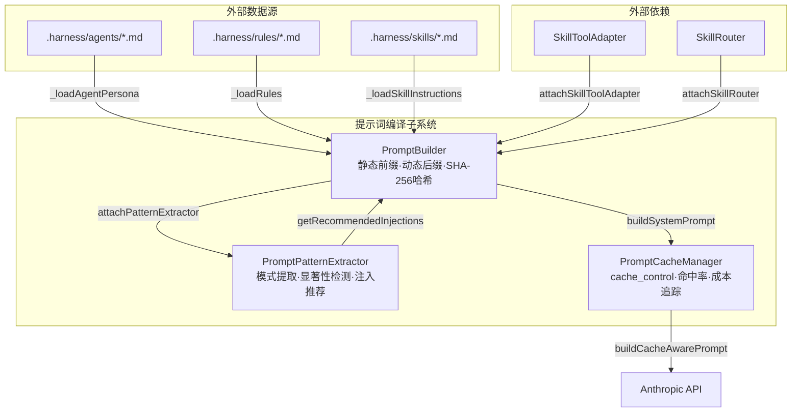
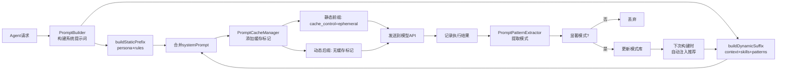
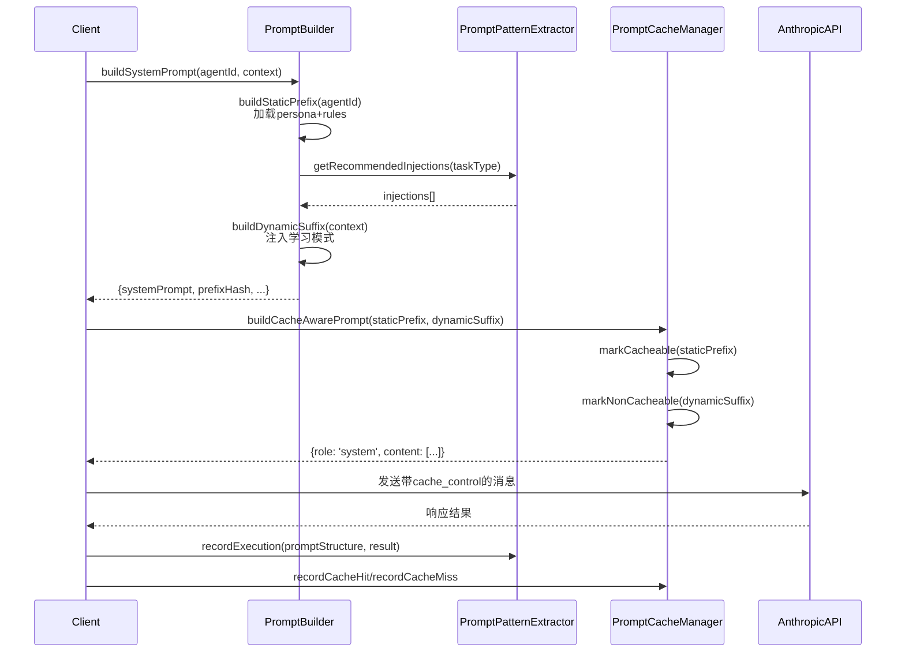

# 模块详解 — 提示词编译子系统

> 源码路径：`src/runtime/prompt/`
> 子系统定位：为框架运行时提供提示词构建、模式提取与缓存管理三大核心能力，实现Agent提示词的静态前缀+动态后缀分离构建、执行历史模式学习与自动注入、Anthropic缓存标记与Token节省追踪。

---

## 子系统概述

提示词编译子系统（Prompt Compilation Subsystem）是Harness多Agent架构的提示词工程核心，负责管理Agent系统提示词的构建、优化与缓存。该子系统包含3个核心模块，构成了从提示词构建到模式学习再到缓存加速的完整技术栈。

提示词编译子系统是Harness"成本控制"和"自学习闭环"原则的核心执行引擎，支撑了从提示词构建到缓存复用的全链路Token优化。它将Agent提示词从简单的字符串拼接升级为静态前缀+动态后缀分离架构（PromptBuilder SHA-256哈希缓存失效）、执行历史模式学习（PromptPatternExtractor 显著性检测+自动注入推荐）、Anthropic缓存标记（PromptCacheManager cache_control+命中率统计+成本节省追踪）的立体化管控体系，并通过attachPatternExtractor()实现PromptBuilder与PromptPatternExtractor的学习性闭环，通过buildCacheAwarePrompt()实现PromptBuilder与PromptCacheManager的缓存感知集成。

### 核心设计原则

1. **静态/动态分离**：PromptBuilder将系统提示词拆分为可缓存的静态前缀（persona+rules）和不可缓存的动态后缀（task context+environment+session state），最大化缓存命中率
2. **模式学习闭环**：PromptPatternExtractor从执行历史提取prompt→result显著模式，通过PromptBuilder自动注入高效提示词模式，实现"越用越聪明"的自学习效果
3. **缓存感知构建**：PromptCacheManager为Anthropic API提供cache_control标记，静态前缀标记为ephemeral缓存，动态后缀不缓存，配合SHA-256哈希实现精确的缓存失效管理
4. **Token预算管控**：静态前缀8000 Token上限、动态后缀4000 Token上限，超限自动截断，确保提示词不超出模型上下文窗口
5. **容量保护**：BoundedMap/BoundedArray限制缓存和记录容量，防止内存泄漏

## 模块清单

| 模块 | 源文件 | 说明 |
|------|--------|------|
| PromptBuilder | prompt-builder.js | 提示词构建器，静态前缀+动态后缀分离、Agent persona+rules+skills构建、SHA-256哈希缓存失效 |
| PromptPatternExtractor | prompt-pattern-extractor.js | 提示词模式提取器，执行历史模式学习、显著性检测、自动注入推荐 |
| PromptCacheManager | prompt-cache-manager.js | 提示词缓存管理器，Anthropic cache_control标记、命中率统计、Token节省追踪 |

## 架构图



### 数据流图



---

## 1. PromptBuilder — 提示词构建器

### 概述

PromptBuilder负责Agent系统提示词的构建，采用静态前缀+动态后缀分离架构。静态前缀由Agent persona（`.harness/agents/{agentId}.md`）和规则文件（`.harness/rules/*.md`）组成，可缓存复用；动态后缀由任务上下文、环境变量、会话状态和技能指令组成，每次请求重新生成。通过SHA-256哈希实现静态前缀的缓存失效检测，支持PromptPatternExtractor学习性注入。

### 核心职责

- 静态前缀构建（Agent persona + rules，可缓存）
- 动态后缀构建（task context + environment + session state + skills，不可缓存）
- SHA-256哈希缓存失效检测
- PromptPatternExtractor学习性注入
- SkillToolAdapter/SkillRouter技能集成
- Token预算管控与截断

### 类定义与接口

```javascript
const PromptBuilder = require('./src/runtime/prompt/prompt-builder');

class PromptBuilder extends EventEmitter {
  /**
   * @param {string} projectRoot - 项目根目录的绝对路径
   * @param {Object} [options] - 配置选项
   * @param {number} [options.maxStaticTokens=8000] - 静态前缀最大Token预算
   * @param {number} [options.maxDynamicTokens=4000] - 动态后缀最大Token预算
   * @param {boolean} [options.cacheStaticPrefix=true] - 是否启用静态前缀缓存
   * @param {boolean} [options.includeRules=true] - 是否包含.harness/rules/内容
   * @param {boolean} [options.includePersona=true] - 是否包含Agent persona
   * @param {boolean} [options.includeSkills=true] - 是否包含技能指令
   * @param {string} [options.rulesDir='rules'] - 规则文件目录名
   * @param {string} [options.agentsDir='agents'] - Agent文件目录名
   * @param {string} [options.skillsDir='skills'] - 技能文件目录名
   */
  constructor(projectRoot, options) { /* ... */ }
}
// withShutdown mixin 提供 guardShutdown(), shutdown() 方法
```

### 常量定义

#### STATIC_SECTIONS — 静态前缀章节

| 章节 | 说明 |
|------|------|
| `identity` | Agent身份标识 |
| `coding_standards` | 编码规范 |
| `tool_guidelines` | 工具使用指南 |
| `safety_rules` | 安全规则 |

#### DYNAMIC_SECTIONS — 动态后缀章节

| 章节 | 说明 |
|------|------|
| `task_context` | 当前任务上下文 |
| `environment` | 环境变量与状态 |
| `session_state` | 当前会话状态 |
| `recent_actions` | 近期操作描述 |

#### DEFAULT_CONFIG

| 选项 | 默认值 | 说明 |
|------|--------|------|
| `maxStaticTokens` | `8000` | 静态前缀最大Token预算 |
| `maxDynamicTokens` | `4000` | 动态后缀最大Token预算 |
| `cacheStaticPrefix` | `true` | 是否启用静态前缀缓存 |
| `includeRules` | `true` | 是否包含规则文件内容 |
| `includePersona` | `true` | 是否包含Agent persona |
| `includeSkills` | `true` | 是否包含技能指令 |
| `rulesDir` | `'rules'` | 规则文件目录名 |
| `agentsDir` | `'agents'` | Agent文件目录名 |
| `skillsDir` | `'skills'` | 技能文件目录名 |

### 关键方法详解

#### `buildSystemPrompt(agentId, context)`

构建完整的系统提示词，组合静态前缀和动态后缀。

- **参数**：
  - `agentId` {string} — Agent标识
  - `context` {Object} [可选] — 动态上下文
    - `taskContext` {string} — 当前任务描述
    - `environment` {Object} — 环境变量和状态
    - `sessionState` {Object} — 当前会话状态
    - `recentActions` {string[]} — 近期操作描述
    - `skillIds` {string[]} — 需要包含指令的技能ID列表
    - `taskType` {string} — 任务类型（用于模式推荐）
- **返回值**：

```javascript
{
  systemPrompt: string,       // 完整系统提示词（staticPrefix + '\n\n---\n\n' + dynamicSuffix）
  staticPrefix: string,       // 静态前缀内容
  dynamicSuffix: string,      // 动态后缀内容
  staticTokenCount: number,   // 静态前缀Token估算数
  dynamicTokenCount: number,  // 动态后缀Token估算数
  prefixHash: string,         // 静态前缀SHA-256哈希（前16位）
}
```

- **事件**：`prompt-built`

```javascript
const result = builder.buildSystemPrompt('team-lead', {
  taskContext: '实现用户认证模块',
  environment: { NODE_ENV: 'development' },
  sessionState: { phase: 'module-development' },
  recentActions: ['创建auth.js', '编写单元测试'],
  skillIds: ['tdd-implement', 'code-review'],
  taskType: 'coding',
});
// result.systemPrompt: 完整系统提示词
// result.prefixHash: 'a1b2c3d4e5f6g7h8'
```

#### `buildStaticPrefix(agentId)`

构建可缓存的静态前缀，从Agent persona + rules组合生成。启用缓存时，未失效的静态前缀直接从缓存返回。

- **参数**：`agentId` {string} — Agent标识
- **返回值**：{string} 静态前缀字符串
- **事件**：`static-prefix-rebuilt`（缓存未命中或已失效时触发）

**构建流程**：
1. 检查缓存：若agentId未失效且缓存存在，直接返回
2. 加载persona：读取`.harness/agents/{agentId}.md`
3. 加载rules：读取`.harness/rules/*.md`（60秒缓存）
4. 合并章节：persona + rules 用`\n\n`连接
5. Token截断：超过`maxStaticTokens`时截断
6. 更新缓存：写入`_staticPrefixCache`和`_staticPrefixHashes`

```javascript
const prefix = builder.buildStaticPrefix('team-lead');
// '## Agent Identity\n\nTeam Lead角色定义...\n\n## Rules\n\n### task-execution\n\n...'
```

#### `buildDynamicSuffix(context)`

构建不可缓存的动态后缀，从当前任务上下文+环境+会话状态+技能指令+学习模式组合生成。

- **参数**：`context` {Object} — 动态上下文（同`buildSystemPrompt`的context参数）
- **返回值**：{string} 动态后缀字符串

**构建流程**：
1. 添加Task Context章节（`context.taskContext`）
2. 添加Environment章节（`context.environment`键值对列表）
3. 添加Session State章节（`context.sessionState` JSON序列化）
4. 添加Recent Actions章节（`context.recentActions`编号列表）
5. 添加Skill Instructions章节（`context.skillIds`对应的技能指令）
6. 添加Learned Prompt Patterns章节（通过PromptPatternExtractor推荐注入）
7. Token截断：超过`maxDynamicTokens`时截断

```javascript
const suffix = builder.buildDynamicSuffix({
  taskContext: '实现用户认证模块',
  environment: { NODE_ENV: 'development' },
  recentActions: ['创建auth.js'],
  skillIds: ['tdd-implement'],
});
// '## Task Context\n\n实现用户认证模块\n\n## Environment\n\n- NODE_ENV: development\n\n...'
```

#### `getStaticPrefixHash(agentId)`

获取静态前缀的SHA-256哈希值，用于缓存失效检测。

- **参数**：`agentId` {string} — Agent标识
- **返回值**：{string} SHA-256哈希的前16位十六进制字符串；无缓存时返回空字符串

```javascript
const hash = builder.getStaticPrefixHash('team-lead');
// 'a1b2c3d4e5f6g7h8'
```

#### `invalidateStaticPrefix(agentId)`

标记指定Agent的静态前缀为失效，下次构建时重新生成。

- **参数**：`agentId` {string} — Agent标识
- **效果**：将agentId加入`_invalidatedAgents`集合，删除缓存和哈希

```javascript
builder.invalidateStaticPrefix('team-lead');
// 下次调用buildStaticPrefix('team-lead')将重新生成
```

#### `attachPatternExtractor(extractor)`

注入PromptPatternExtractor实例，用于在动态后缀中注入学习到的提示词模式。

- **参数**：`extractor` {PromptPatternExtractor} — 模式提取器实例
- **返回值**：{PromptBuilder} 当前实例，支持链式调用

```javascript
builder.attachPatternExtractor(patternExtractor);
// 构建动态后缀时自动调用 patternExtractor.getRecommendedInjections(taskType)
```

#### `attachSkillToolAdapter(adapter)`

注入SkillToolAdapter实例，用于技能指令的智能加载（核心技能全量加载，非核心技能仅加载摘要+延迟加载提示）。

- **参数**：`adapter` {SkillToolAdapter} — 技能工具适配器实例
- **返回值**：{PromptBuilder} 当前实例，支持链式调用

#### `attachSkillRouter(skillRouter)`

注入SkillRouter实例，用于获取技能的L1摘要信息。

- **参数**：`skillRouter` {SkillRouter} — 技能路由器实例
- **返回值**：{PromptBuilder} 当前实例，支持链式调用

### 内部方法

#### `_loadAgentPersona(agentId)`

读取Agent persona文件。从`.harness/agents/{agentId}.md`加载内容，添加`## Agent Identity`标题前缀。文件不存在时返回null。

#### `_loadRules()`

读取所有规则文件。从`.harness/rules/`目录加载所有`.md`文件，按文件名排序合并，每个文件添加`### {filename}`子标题。结果缓存60秒。

#### `_loadSkillInstructions(skillIds)`

读取技能指令。根据skillIds加载对应的`.harness/skills/{sid}.md`文件。当SkillToolAdapter和SkillRouter已注入时，非核心技能仅加载L1摘要和延迟加载提示。

**智能加载策略**：
- 核心技能（SkillToolAdapter.getCoreSkillIds()包含的）：全量加载`.md`文件
- 非核心技能：仅加载L1摘要（`[Skill: {name}] {summary} (Use load_skill_{sid} to load full instructions)`）

#### `_estimateTokens(text)`

Token估算，`chars / 4`向上取整。空文本或非字符串返回0。

#### `_truncateToBudget(text, budget)`

按Token预算截断文本。`maxChars = budget * 4`，超出时截断并添加`...`后缀。

#### `_computeHash(text)`

计算SHA-256哈希，返回前16位十六进制字符串。

### 配置选项

| 选项 | 默认值 | 说明 |
|------|--------|------|
| `maxStaticTokens` | `8000` | 静态前缀最大Token预算 |
| `maxDynamicTokens` | `4000` | 动态后缀最大Token预算 |
| `cacheStaticPrefix` | `true` | 是否启用静态前缀缓存 |
| `includeRules` | `true` | 是否包含规则文件 |
| `includePersona` | `true` | 是否包含Agent persona |
| `includeSkills` | `true` | 是否包含技能指令 |
| `rulesDir` | `'rules'` | 规则文件目录名 |
| `agentsDir` | `'agents'` | Agent文件目录名 |
| `skillsDir` | `'skills'` | 技能文件目录名 |

### 事件

| 事件名 | 触发条件 | 事件数据 |
|--------|----------|----------|
| `static-prefix-rebuilt` | 静态前缀重新构建（缓存未命中或已失效） | `{ agentId, hash, tokenCount }` |
| `prompt-built` | 完整系统提示词构建完成 | `{ agentId, staticTokenCount, dynamicTokenCount }` |

### 错误处理

- 文件读取失败（persona/rules/skills不存在）→ safeExecute捕获，返回null，不影响其他章节
- Session State序列化失败 → 显示`[Session state contains non-serializable data]`占位文本
- PromptPatternExtractor推荐失败 → safeExecute捕获，跳过Learned Prompt Patterns章节
- 关闭状态下调用 → guardShutdown()抛出异常
- BoundedMap(50)容量保护：静态前缀缓存和哈希映射各最多50个Agent

### 使用示例

```javascript
const PromptBuilder = require('./src/runtime/prompt/prompt-builder');
const PromptPatternExtractor = require('./src/runtime/prompt/prompt-pattern-extractor');

const builder = new PromptBuilder('/path/to/project', {
  maxStaticTokens: 8000,
  maxDynamicTokens: 4000,
  includeRules: true,
  includePersona: true,
  includeSkills: true,
});

// 注入模式提取器
const extractor = new PromptPatternExtractor();
builder.attachPatternExtractor(extractor);

// 监听构建事件
builder.on('static-prefix-rebuilt', ({ agentId, hash, tokenCount }) => {
  console.log(`Agent ${agentId} 静态前缀重建: hash=${hash}, tokens=${tokenCount}`);
});
builder.on('prompt-built', ({ agentId, staticTokenCount, dynamicTokenCount }) => {
  console.log(`Agent ${agentId} 提示词构建完成: static=${staticTokenCount}, dynamic=${dynamicTokenCount}`);
});

// 构建系统提示词
const result = builder.buildSystemPrompt('team-lead', {
  taskContext: '实现用户认证模块',
  environment: { NODE_ENV: 'development', VERSION: '2.12.0' },
  sessionState: { phase: 'module-development', iteration: 3 },
  recentActions: ['创建auth.js', '编写单元测试', '运行测试通过'],
  skillIds: ['tdd-implement', 'code-review'],
  taskType: 'coding',
});

console.log('完整提示词长度:', result.systemPrompt.length);
console.log('静态前缀哈希:', result.prefixHash);
console.log('Token估算:', result.staticTokenCount + result.dynamicTokenCount);

// 失效缓存（当规则文件更新时）
builder.invalidateStaticPrefix('team-lead');
```

---

## 2. PromptPatternExtractor — 提示词模式提取器

### 概述

PromptPatternExtractor从执行历史中提取prompt→result显著模式，推荐提示词注入策略。它记录每次提示词执行的结构特征（是否包含示例、约束、具体性级别、上下文丰富度、结构类型）和结果质量（质量评分、成功与否），通过统计显著性检测识别高效模式，并生成可读的推荐建议。与PromptBuilder集成后，构建动态后缀时自动注入学习到的高效模式。

### 核心职责

- 执行历史记录（promptStructure + result）
- 模式分类（5类：structure/specificity/examples/constraints/context）
- 显著性检测（效应量 >= significanceThreshold 且样本量 >= minSampleSize）
- 注入推荐生成（正向模式推荐包含、负向模式推荐避免）
- 模式频率统计与效果评分

### 类定义与接口

```javascript
const PromptPatternExtractor = require('./src/runtime/prompt/prompt-pattern-extractor');

class PromptPatternExtractor extends EventEmitter {
  /**
   * @param {Object} [options] - 配置选项
   * @param {number} [options.maxPatterns=200] - 最大模式数量
   * @param {number} [options.minSampleSize=5] - 模式显著性的最小样本量
   * @param {number} [options.significanceThreshold=0.15] - 模式显著性的最小效应量
   * @param {string[]} [options.patternCategories] - 模式分类列表
   */
  constructor(options) { /* ... */ }
}
// withShutdown mixin 提供 guardShutdown(), shutdown() 方法
```

### 常量定义

#### DEFAULT_CONFIG

| 选项 | 默认值 | 说明 |
|------|--------|------|
| `maxPatterns` | `200` | 最大模式数量（BoundedMap容量） |
| `minSampleSize` | `5` | 模式显著性的最小样本量 |
| `significanceThreshold` | `0.15` | 模式显著性的最小效应量（successRate与baselineRate的差值绝对值） |
| `patternCategories` | `['structure', 'specificity', 'examples', 'constraints', 'context']` | 模式分类列表 |

### 模式分类体系

| 分类 | 正向模式 | 负向模式 | 说明 |
|------|----------|----------|------|
| examples | `examples`（包含示例） | `no_examples`（不含示例） | 提示词中是否包含示例 |
| constraints | `constraints`（包含约束） | `no_constraints`（不含约束） | 提示词中是否包含约束条件 |
| specificity | `specificity_high` | `specificity_low` | 提示词具体性级别 |
| context | `context_high` | `context_low` | 上下文丰富度 |
| structure | `structure_structured`, `structure_template` | `structure_freeform` | 提示词结构类型 |

### 关键方法详解

#### `recordExecution(promptStructure, result)`

记录一次提示词执行的结果，实时更新模式库。

- **参数**：
  - `promptStructure` {Object} — 提示词结构描述
    - `has_examples` {boolean} [默认false] — 是否包含示例
    - `has_constraints` {boolean} [默认false] — 是否包含约束
    - `specificity_level` {string} [默认'medium'] — 具体性级别（low/medium/high）
    - `context_richness` {string} [默认'medium'] — 上下文丰富度（low/medium/high）
    - `structure_type` {string} [默认'freeform'] — 结构类型（freeform/structured/template）
    - `task_type` {string} [默认'general'] — 任务类型
  - `result` {Object} — 执行结果
    - `quality_score` {number} [默认0] — 质量评分（0-1，超出范围自动裁剪）
    - `success` {boolean} [默认false] — 是否成功
- **返回值**：void

**内部流程**：
1. 规范化record字段（默认值填充、quality_score裁剪到[0,1]）
2. 推入`_executionRecords`（BoundedArray(5000)容量保护）
3. 递增`_stats.recorded`计数
4. 调用`_updatePatternsForRecord()`实时更新模式

```javascript
extractor.recordExecution(
  {
    has_examples: true,
    has_constraints: true,
    specificity_level: 'high',
    context_richness: 'high',
    structure_type: 'structured',
    task_type: 'coding',
  },
  {
    quality_score: 0.92,
    success: true,
  }
);
```

#### `extractPatterns()`

分析累积记录并提取显著模式。全量扫描执行记录，生成模式候选，评估显著性。

- **返回值**：`Array<{id, category, description, sampleSize, successRate, baselineRate, effectSize, significant}>` 显著模式列表

**提取流程**：
1. 检查样本量：记录数 < minSampleSize时返回空数组
2. 计算基准成功率：`totalSuccess / totalRecords`
3. 生成模式候选：遍历所有记录，按分类维度生成唯一patternId
4. 评估每个候选：匹配记录数 >= minSampleSize 且 effectSize >= significanceThreshold
5. 更新模式库：新模式触发`pattern-discovered`事件，已有模式触发`pattern-updated`事件

```javascript
const patterns = extractor.extractPatterns();
// [
//   {
//     id: 'examples:coding',
//     category: 'examples',
//     description: 'Prompts with examples for coding tasks',
//     sampleSize: 25,
//     successRate: 0.88,
//     baselineRate: 0.65,
//     effectSize: 0.23,
//     significant: true,
//     ...
//   }
// ]
```

#### `getRecommendedInjections(taskType)`

根据已学习模式为给定任务类型推荐提示词注入策略。

- **参数**：`taskType` {string} [默认'general'] — 任务类型
- **返回值**：`{ injections: Array<{category, recommendation, confidence, evidence}>, taskType }`

**推荐逻辑**：
- 仅推荐显著模式（significant=true）
- 仅推荐与指定taskType匹配或通用（general）的模式
- 正向模式（examples/constraints/specificity_high/context_high/structure_structured/structure_template）且成功率高于基准 → 推荐"Include"
- 负向模式且成功率低于基准 → 推荐"Avoid"
- 负向模式但效应量不够大（< significanceThreshold * 2）→ 不推荐
- 按confidence降序排列

```javascript
const { injections } = extractor.getRecommendedInjections('coding');
// [
//   {
//     category: 'examples',
//     recommendation: 'Include examples — 35% higher success rate (n=25)',
//     confidence: 0.71,
//     evidence: 'successRate=0.88 vs baseline=0.65 (n=25)',
//   },
//   {
//     category: 'constraints',
//     recommendation: 'Include constraints — 20% higher success rate (n=18)',
//     confidence: 0.55,
//     evidence: 'successRate=0.78 vs baseline=0.65 (n=18)',
//   }
// ]
```

#### `getPatternStats()`

获取模式统计信息。

- **返回值**：

```javascript
{
  totalRecords: number,          // 总执行记录数
  totalPatterns: number,         // 总模式数（含非显著）
  significantPatterns: number,   // 显著模式数
  categoryBreakdown: Object,     // 按分类的模式数量分布
  stats: {
    recorded: number,            // 已记录的执行次数
    patternsFound: number,       // 发现的模式总数
    injectionsRecommended: number, // 推荐的注入次数
  },
}
```

```javascript
const stats = extractor.getPatternStats();
console.log('总记录:', stats.totalRecords);
console.log('显著模式:', stats.significantPatterns);
console.log('分类分布:', stats.categoryBreakdown);
// { examples: 12, constraints: 8, specificity_high: 5, ... }
```

### 内部方法

#### `_updatePatternsForRecord(record)`

实时更新模式库。将记录分类为多个维度，每个维度生成`category:task_type`格式的patternId，增量更新sampleSize、successCount、successRate、avgQualityScore和significant标志。

#### `_categorizePromptStructure(structure)`

将提示词结构分类为多个维度标签。例如`{has_examples: true, specificity_level: 'high'}` → `['examples', 'specificity_high', ...]`。

#### `_describePattern(category, record)`

生成模式的人类可读描述。内置13种描述模板，如`'Prompts with examples for coding tasks'`。

#### `_generatePatternCandidates(records)`

从执行记录中生成去重的模式候选列表。

#### `_evaluateCandidate(candidate, records, baselineRate)`

评估单个模式候选的显著性。计算匹配记录的成功率、平均质量评分和效应量，返回完整的模式对象。

#### `_calculateSignificance(pattern)`

计算模式显著性。效应量 = |successRate - baselineRate| >= significanceThreshold 且 sampleSize >= minSampleSize。

#### `_buildRecommendation(pattern)`

从模式生成推荐建议。正向模式推荐"Include"，负向模式推荐"Avoid"，效应量不足时不推荐。置信度公式：`min(1, effectSize * 2 + sampleSize / 100)`。

### 配置选项

| 选项 | 默认值 | 说明 |
|------|--------|------|
| `maxPatterns` | `200` | 最大模式数量 |
| `minSampleSize` | `5` | 最小样本量 |
| `significanceThreshold` | `0.15` | 最小效应量阈值 |
| `patternCategories` | `['structure', 'specificity', 'examples', 'constraints', 'context']` | 模式分类列表 |

### 事件

| 事件名 | 触发条件 | 事件数据 |
|--------|----------|----------|
| `pattern-discovered` | 新显著模式被发现 | `{ patternId, category }` |
| `pattern-updated` | 已有模式被更新 | `{ patternId, sampleSize }` |

### 错误处理

- promptStructure或result为null/undefined → recordExecution直接返回
- _updatePatternsForRecord内部异常 → safeExecute捕获，不影响主流程
- BoundedArray(5000)容量保护：执行记录最多5000条，超出后FIFO淘汰
- BoundedMap(maxPatterns)容量保护：模式数量最多200个，超出后LRU淘汰
- 关闭状态下调用 → guardShutdown()抛出异常

### 使用示例

```javascript
const PromptPatternExtractor = require('./src/runtime/prompt/prompt-pattern-extractor');

const extractor = new PromptPatternExtractor({
  maxPatterns: 200,
  minSampleSize: 5,
  significanceThreshold: 0.15,
});

// 监听模式发现事件
extractor.on('pattern-discovered', ({ patternId, category }) => {
  console.log(`发现新模式: ${patternId} (${category})`);
});
extractor.on('pattern-updated', ({ patternId, sampleSize }) => {
  console.log(`模式更新: ${patternId}, 样本量=${sampleSize}`);
});

// 记录执行历史（模拟多次执行）
const executions = [
  { prompt: { has_examples: true, has_constraints: true, specificity_level: 'high', context_richness: 'high', structure_type: 'structured', task_type: 'coding' }, result: { quality_score: 0.95, success: true } },
  { prompt: { has_examples: false, has_constraints: false, specificity_level: 'low', context_richness: 'low', structure_type: 'freeform', task_type: 'coding' }, result: { quality_score: 0.4, success: false } },
  // ... 更多记录
];
for (const { prompt, result } of executions) {
  extractor.recordExecution(prompt, result);
}

// 提取显著模式
const patterns = extractor.extractPatterns();
console.log('显著模式数:', patterns.length);

// 获取推荐注入
const { injections } = extractor.getRecommendedInjections('coding');
injections.forEach(inj => {
  console.log(`[${inj.category}] ${inj.recommendation} (置信度: ${inj.confidence.toFixed(2)})`);
});

// 查看统计
const stats = extractor.getPatternStats();
console.log('总记录:', stats.totalRecords);
console.log('显著模式:', stats.significantPatterns);
```

---

## 3. PromptCacheManager — 提示词缓存管理器

### 概述

PromptCacheManager为Anthropic API提供cache_control标记支持，实现提示词缓存感知构建。静态前缀标记为`cache_control: { type: 'ephemeral' }`可被Anthropic API缓存复用，动态后缀不标记缓存。通过命中率统计和Token节省追踪量化缓存效果，成本节省按`tokensSaved * 0.000003`计算。

### 核心职责

- Anthropic cache_control标记（ephemeral类型）
- 缓存感知提示词构建（buildCacheAwarePrompt）
- 命中率统计与Token节省追踪
- 缓存条目管理（注册、查询、失效）
- 成本节省计算

### 类定义与接口

```javascript
const PromptCacheManager = require('./src/runtime/prompt/prompt-cache-manager');

class PromptCacheManager extends EventEmitter {
  /**
   * @param {Object} [options] - 配置选项
   * @param {number} [options.maxCacheEntries=200] - 最大缓存条目数
   * @param {number} [options.cacheTtlMs=3600000] - 缓存条目TTL（毫秒），默认1小时
   * @param {number} [options.minPrefixTokens=500] - 缓存最低Token门槛
   * @param {boolean} [options.enableCacheBreakpoints=true] - 是否插入缓存断点
   * @param {boolean} [options.trackSavings=true] - 是否追踪Token/成本节省
   */
  constructor(options) { /* ... */ }
}
// withShutdown mixin 提供 guardShutdown(), shutdown() 方法
```

### 常量定义

#### DEFAULT_CONFIG

| 选项 | 默认值 | 说明 |
|------|--------|------|
| `maxCacheEntries` | `200` | 最大缓存条目数（BoundedMap容量） |
| `cacheTtlMs` | `3600000` | 缓存条目TTL（1小时） |
| `minPrefixTokens` | `500` | 缓存最低Token门槛，低于此值不值得缓存 |
| `enableCacheBreakpoints` | `true` | 是否插入cache_control断点标记 |
| `trackSavings` | `true` | 是否追踪Token和成本节省 |

### 关键方法详解

#### `markCacheable(text, metadata)`

标记文本段为可缓存，返回带cache_control标记的对象。

- **参数**：
  - `text` {string} — 要标记为可缓存的文本内容
  - `metadata` {Object} [可选] — 附加元数据
    - `prefixHash` {string} — 前缀哈希，用于缓存查找
    - `tokenCount` {number} — 文本的Token估算数，默认按`text.length / 4`估算
- **返回值**：`{ text: string, cache_control: { type: 'ephemeral' } }`

**内部行为**：当prefixHash存在且enableCacheBreakpoints为true时，在缓存条目中注册或更新该前缀的访问信息（tokenCount、createdAt、lastAccessedAt、accessCount）。

```javascript
const marked = cacheManager.markCacheable('静态前缀内容...', {
  prefixHash: 'a1b2c3d4e5f6g7h8',
  tokenCount: 6500,
});
// { text: '静态前缀内容...', cache_control: { type: 'ephemeral' } }
```

#### `markNonCacheable(text, metadata)`

标记文本段为不可缓存，返回不带cache_control的对象。

- **参数**：
  - `text` {string} — 要标记为不可缓存的文本内容
  - `metadata` {Object} [可选] — 附加元数据（当前未使用）
- **返回值**：`{ text: string }`

```javascript
const marked = cacheManager.markNonCacheable('动态后缀内容...');
// { text: '动态后缀内容...' }
```

#### `buildCacheAwarePrompt(staticPrefix, dynamicSuffix)`

组装带cache_control标记的提示词消息，用于Anthropic API调用。

- **参数**：
  - `staticPrefix` {string} — 静态前缀内容
  - `dynamicSuffix` {string} — 动态后缀内容
- **返回值**：

```javascript
{
  role: 'system',
  content: [
    {
      type: 'text',
      text: '静态前缀内容...',
      cache_control: { type: 'ephemeral' },  // 仅enableCacheBreakpoints=true时存在
    },
    {
      type: 'text',
      text: '动态后缀内容...',
      // 无cache_control标记
    },
  ],
}
```

```javascript
const message = cacheManager.buildCacheAwarePrompt(
  '## Agent Identity\n\nTeam Lead...',
  '## Task Context\n\n实现认证模块...'
);
// 可直接传给Anthropic API的messages参数
```

#### `recordCacheHit(prefixHash, tokensSaved)`

记录缓存命中并更新节省统计。

- **参数**：
  - `prefixHash` {string} — 缓存前缀的哈希值
  - `tokensSaved` {number} — 缓存命中节省的Token数
- **效果**：递增hits计数、累加tokensSaved、计算costSaved（`tokensSaved * 0.000003`）、更新条目访问信息
- **事件**：`cache-hit`

```javascript
cacheManager.recordCacheHit('a1b2c3d4e5f6g7h8', 6500);
// costSaved += 6500 * 0.000003 = 0.0195
```

#### `recordCacheMiss(prefixHash)`

记录缓存未命中。

- **参数**：`prefixHash` {string} — 未命中的前缀哈希值
- **效果**：递增misses计数
- **事件**：`cache-miss`

```javascript
cacheManager.recordCacheMiss('x9y8z7w6v5u4t3s2');
```

#### `getCacheStats()`

获取缓存统计信息。

- **返回值**：

```javascript
{
  hits: number,            // 缓存命中次数
  misses: number,          // 缓存未命中次数
  hitRate: number,         // 命中率 (0~1)
  tokensSaved: number,     // 节省的Token总数
  costSaved: number,       // 节省的成本（美元）
  entryCount: number,      // 当前缓存条目数
}
```

```javascript
const stats = cacheManager.getCacheStats();
console.log('命中率:', (stats.hitRate * 100).toFixed(1) + '%');
console.log('节省Token:', stats.tokensSaved);
console.log('节省成本: $' + stats.costSaved.toFixed(4));
```

#### `shouldUseCache(prefixHash)`

检查前缀是否值得缓存（满足最低Token门槛）。

- **参数**：`prefixHash` {string} — 前缀哈希值
- **返回值**：{boolean} 是否满足minPrefixTokens门槛；条目不存在时返回false

```javascript
const shouldCache = cacheManager.shouldUseCache('a1b2c3d4e5f6g7h8');
// true: 该前缀tokenCount >= minPrefixTokens(500)
```

#### `invalidateCache(prefixHash)`

使指定缓存条目失效。

- **参数**：`prefixHash` {string} — 要失效的缓存条目哈希
- **事件**：`cache-invalidated`（reason: 'manual'）

```javascript
cacheManager.invalidateCache('a1b2c3d4e5f6g7h8');
```

#### `invalidateAll()`

清除所有缓存条目并重置统计。

- **事件**：`cache-invalidated`（prefixHash: '*', reason: 'invalidate-all'）

```javascript
cacheManager.invalidateAll();
```

### 配置选项

| 选项 | 默认值 | 说明 |
|------|--------|------|
| `maxCacheEntries` | `200` | 最大缓存条目数 |
| `cacheTtlMs` | `3600000` | 缓存TTL（1小时） |
| `minPrefixTokens` | `500` | 缓存最低Token门槛 |
| `enableCacheBreakpoints` | `true` | 是否插入缓存断点 |
| `trackSavings` | `true` | 是否追踪节省 |

### 事件

| 事件名 | 触发条件 | 事件数据 |
|--------|----------|----------|
| `cache-hit` | 缓存命中 | `{ prefixHash, tokensSaved }` |
| `cache-miss` | 缓存未命中 | `{ prefixHash }` |
| `cache-invalidated` | 缓存条目失效 | `{ prefixHash, reason }` — reason: 'manual'/'evicted'/'invalidate-all' |

### 错误处理

- BoundedMap(maxCacheEntries)容量保护：缓存条目最多200个，超出后LRU淘汰，淘汰时触发`cache-invalidated`事件（reason: 'evicted'）
- tokensSaved非有限数时自动归零，不影响统计
- 关闭状态下调用 → guardShutdown()抛出异常
- onEvict回调：BoundedMap淘汰条目时自动触发`cache-invalidated`事件

### 使用示例

```javascript
const PromptCacheManager = require('./src/runtime/prompt/prompt-cache-manager');

const cacheManager = new PromptCacheManager({
  maxCacheEntries: 200,
  cacheTtlMs: 3600000,
  minPrefixTokens: 500,
  enableCacheBreakpoints: true,
});

// 监听缓存事件
cacheManager.on('cache-hit', ({ prefixHash, tokensSaved }) => {
  console.log(`缓存命中: ${prefixHash}, 节省${tokensSaved} Token`);
});
cacheManager.on('cache-miss', ({ prefixHash }) => {
  console.log(`缓存未命中: ${prefixHash}`);
});
cacheManager.on('cache-invalidated', ({ prefixHash, reason }) => {
  console.log(`缓存失效: ${prefixHash}, 原因: ${reason}`);
});

// 构建缓存感知提示词
const message = cacheManager.buildCacheAwarePrompt(
  '## Agent Identity\n\nTeam Lead角色定义...\n\n## Rules\n\n...',
  '## Task Context\n\n实现认证模块\n\n## Environment\n\n- NODE_ENV: development'
);

// 记录缓存命中/未命中
cacheManager.recordCacheHit('a1b2c3d4e5f6g7h8', 6500);
cacheManager.recordCacheMiss('x9y8z7w6v5u4t3s2');

// 查看统计
const stats = cacheManager.getCacheStats();
console.log('命中率:', (stats.hitRate * 100).toFixed(1) + '%');
console.log('节省成本: $' + stats.costSaved.toFixed(4));

// 检查是否值得缓存
if (cacheManager.shouldUseCache('a1b2c3d4e5f6g7h8')) {
  console.log('该前缀值得缓存');
}

// 失效缓存
cacheManager.invalidateCache('a1b2c3d4e5f6g7h8');
```

---

## 模块间协作关系



### 典型协作场景

#### 场景1：首次构建Agent提示词

```
1. PromptBuilder.buildSystemPrompt('team-lead', context)
2. buildStaticPrefix: 读取.harness/agents/team-lead.md + .harness/rules/*.md
3. buildDynamicSuffix: 组装task context + environment + session state + skills
4. PromptPatternExtractor尚未学习模式 → 无Learned Prompt Patterns章节
5. PromptCacheManager.buildCacheAwarePrompt: 静态前缀标记cache_control
6. 发送到Anthropic API → 记录执行结果到PromptPatternExtractor
```

#### 场景2：模式学习闭环

```
1. 多次执行后，PromptPatternExtractor积累了足够样本
2. extractPatterns()发现显著模式：coding任务包含examples时成功率+35%
3. 下次buildSystemPrompt时，PromptBuilder调用getRecommendedInjections('coding')
4. 动态后缀自动添加"Learned Prompt Patterns"章节
5. 提示词质量提升 → 更多成功记录 → 模式置信度持续增强
```

#### 场景3：缓存命中节省Token

```
1. 首次请求：PromptCacheManager.recordCacheMiss(prefixHash)
2. Anthropic API缓存静态前缀（cache_control: ephemeral）
3. 后续请求：静态前缀哈希相同 → PromptCacheManager.recordCacheHit(prefixHash, tokensSaved)
4. 累计节省Token → 成本降低
5. 规则文件更新 → invalidateStaticPrefix → 缓存失效 → 重新构建
```

---

## 配置参考

### PromptBuilder配置

| 选项 | 类型 | 默认值 | 说明 |
|------|------|--------|------|
| `maxStaticTokens` | number | `8000` | 静态前缀最大Token预算 |
| `maxDynamicTokens` | number | `4000` | 动态后缀最大Token预算 |
| `cacheStaticPrefix` | boolean | `true` | 是否启用静态前缀缓存 |
| `includeRules` | boolean | `true` | 是否包含规则文件 |
| `includePersona` | boolean | `true` | 是否包含Agent persona |
| `includeSkills` | boolean | `true` | 是否包含技能指令 |
| `rulesDir` | string | `'rules'` | 规则文件目录名（相对于.harness/） |
| `agentsDir` | string | `'agents'` | Agent文件目录名（相对于.harness/） |
| `skillsDir` | string | `'skills'` | 技能文件目录名（相对于.harness/） |

### PromptPatternExtractor配置

| 选项 | 类型 | 默认值 | 说明 |
|------|------|--------|------|
| `maxPatterns` | number | `200` | 最大模式数量 |
| `minSampleSize` | number | `5` | 最小样本量 |
| `significanceThreshold` | number | `0.15` | 最小效应量阈值 |
| `patternCategories` | string[] | `['structure', 'specificity', 'examples', 'constraints', 'context']` | 模式分类列表 |

### PromptCacheManager配置

| 选项 | 类型 | 默认值 | 说明 |
|------|------|--------|------|
| `maxCacheEntries` | number | `200` | 最大缓存条目数 |
| `cacheTtlMs` | number | `3600000` | 缓存TTL（毫秒） |
| `minPrefixTokens` | number | `500` | 缓存最低Token门槛 |
| `enableCacheBreakpoints` | boolean | `true` | 是否插入缓存断点 |
| `trackSavings` | boolean | `true` | 是否追踪节省 |

---

## 事件参考

### PromptBuilder事件

| 事件名 | 事件数据 | 说明 |
|--------|----------|------|
| `static-prefix-rebuilt` | `{ agentId: string, hash: string, tokenCount: number }` | 静态前缀重新构建 |
| `prompt-built` | `{ agentId: string, staticTokenCount: number, dynamicTokenCount: number }` | 完整提示词构建完成 |

### PromptPatternExtractor事件

| 事件名 | 事件数据 | 说明 |
|--------|----------|------|
| `pattern-discovered` | `{ patternId: string, category: string }` | 新显著模式被发现 |
| `pattern-updated` | `{ patternId: string, sampleSize: number }` | 已有模式被更新 |

### PromptCacheManager事件

| 事件名 | 事件数据 | 说明 |
|--------|----------|------|
| `cache-hit` | `{ prefixHash: string, tokensSaved: number }` | 缓存命中 |
| `cache-miss` | `{ prefixHash: string }` | 缓存未命中 |
| `cache-invalidated` | `{ prefixHash: string, reason: string }` | 缓存失效（reason: manual/evicted/invalidate-all） |

---

## 使用示例：三模块协同工作

```javascript
const PromptBuilder = require('./src/runtime/prompt/prompt-builder');
const PromptPatternExtractor = require('./src/runtime/prompt/prompt-pattern-extractor');
const PromptCacheManager = require('./src/runtime/prompt/prompt-cache-manager');

// 1. 初始化三个模块
const patternExtractor = new PromptPatternExtractor({
  maxPatterns: 200,
  minSampleSize: 5,
  significanceThreshold: 0.15,
});

const cacheManager = new PromptCacheManager({
  maxCacheEntries: 200,
  minPrefixTokens: 500,
  enableCacheBreakpoints: true,
});

const builder = new PromptBuilder('/path/to/project', {
  maxStaticTokens: 8000,
  maxDynamicTokens: 4000,
});

// 2. 建立模块间连接
builder.attachPatternExtractor(patternExtractor);

// 3. 监听事件
builder.on('prompt-built', ({ agentId, staticTokenCount, dynamicTokenCount }) => {
  console.log(`[${agentId}] 提示词构建: static=${staticTokenCount}, dynamic=${dynamicTokenCount}`);
});

patternExtractor.on('pattern-discovered', ({ patternId, category }) => {
  console.log(`新模式发现: ${patternId} (${category})`);
});

cacheManager.on('cache-hit', ({ prefixHash, tokensSaved }) => {
  console.log(`缓存命中: 节省${tokensSaved} Token`);
});

// 4. 构建提示词
const result = builder.buildSystemPrompt('team-lead', {
  taskContext: '实现用户认证模块',
  environment: { NODE_ENV: 'development' },
  sessionState: { phase: 'module-development' },
  recentActions: ['创建auth.js', '编写单元测试'],
  skillIds: ['tdd-implement'],
  taskType: 'coding',
});

// 5. 构建缓存感知消息
const message = cacheManager.buildCacheAwarePrompt(result.staticPrefix, result.dynamicSuffix);

// 6. 发送到Anthropic API（伪代码）
const apiResponse = await anthropicClient.messages.create({
  model: 'claude-3-sonnet',
  max_tokens: 4096,
  system: message.content,
  messages: [{ role: 'user', content: '请实现用户认证' }],
});

// 7. 记录执行结果到模式提取器
patternExtractor.recordExecution(
  {
    has_examples: true,
    has_constraints: true,
    specificity_level: 'high',
    context_richness: 'high',
    structure_type: 'structured',
    task_type: 'coding',
  },
  {
    quality_score: 0.92,
    success: true,
  }
);

// 8. 记录缓存结果
if (apiResponse.cacheHit) {
  cacheManager.recordCacheHit(result.prefixHash, result.staticTokenCount);
} else {
  cacheManager.recordCacheMiss(result.prefixHash);
}

// 9. 查看整体统计
const cacheStats = cacheManager.getCacheStats();
const patternStats = patternExtractor.getPatternStats();
console.log('缓存命中率:', (cacheStats.hitRate * 100).toFixed(1) + '%');
console.log('成本节省: $' + cacheStats.costSaved.toFixed(4));
console.log('显著模式数:', patternStats.significantPatterns);

// 10. 规则文件更新后失效缓存
builder.invalidateStaticPrefix('team-lead');
cacheManager.invalidateCache(result.prefixHash);
```

---

## 最佳实践

### 提示词构建

1. 始终通过`buildSystemPrompt`构建完整提示词，不要手动拼接静态前缀和动态后缀
2. 规则文件更新后调用`invalidateStaticPrefix`使缓存失效
3. 合理设置Token预算：静态前缀8000、动态后缀4000适合大多数场景
4. 利用`skillIds`参数按需加载技能指令，避免一次性加载所有技能
5. 注入SkillToolAdapter和SkillRouter后，非核心技能自动延迟加载，减少Token消耗

### 模式学习

1. 在应用启动时创建PromptPatternExtractor并注入PromptBuilder
2. 每次模型调用后都应调用`recordExecution`记录结果，积累样本
3. 样本量不足时（< minSampleSize）不会产生推荐，属于正常现象
4. 调低`significanceThreshold`可以发现更多模式，但可能增加噪声
5. 调高`minSampleSize`可以提高模式可靠性，但需要更多执行记录

### 缓存管理

1. 静态前缀Token数低于`minPrefixTokens`(500)时不值得缓存
2. 监听`cache-hit`/`cache-miss`事件量化缓存效果
3. 规则文件或Agent persona变更后，同时失效PromptBuilder和PromptCacheManager的缓存
4. 成本节省按`tokensSaved * $0.000003`计算，可根据实际模型定价调整
5. 定期检查`getCacheStats`中的hitRate，低于0.3时考虑优化静态前缀内容

### 整体集成

1. 按依赖顺序初始化：PromptPatternExtractor → PromptCacheManager → PromptBuilder
2. PromptBuilder应在最后初始化，因为它依赖前两个模块
3. 所有模块支持优雅关闭（withShutdown mixin），关闭时自动清理资源
4. BoundedMap/BoundedArray提供容量保护，无需担心内存泄漏
5. 三个模块的事件可统一监听，构建完整的提示词生命周期追踪
