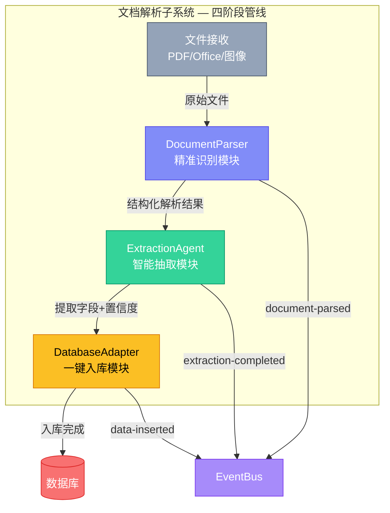
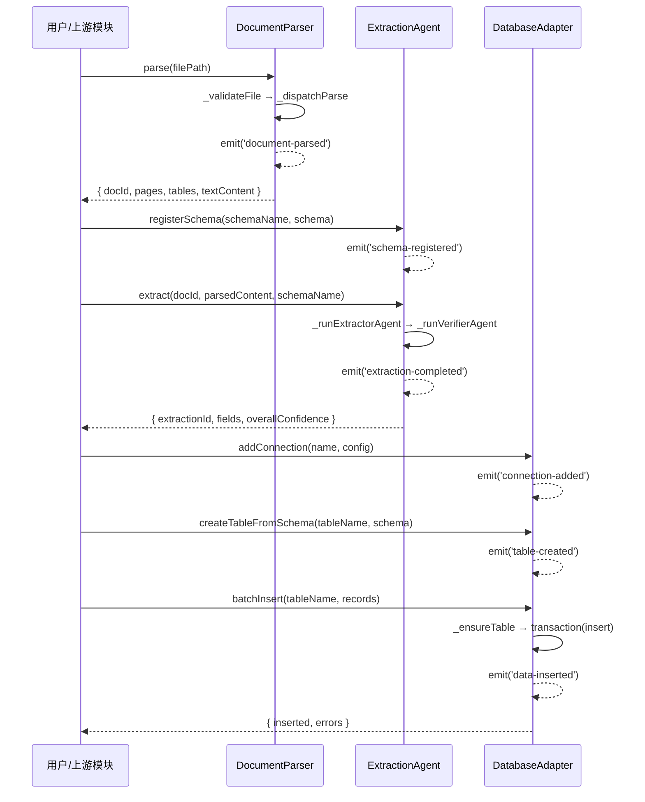
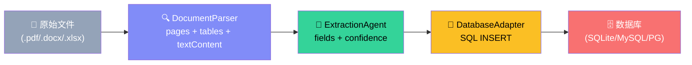
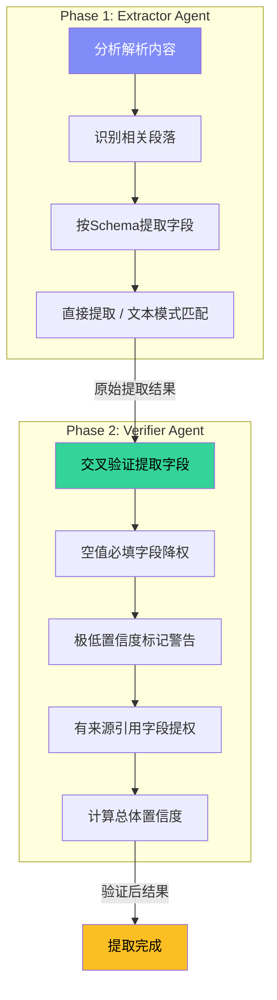
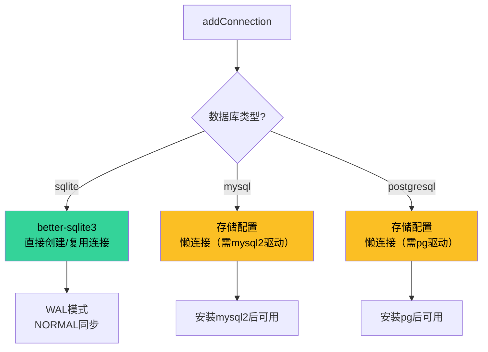
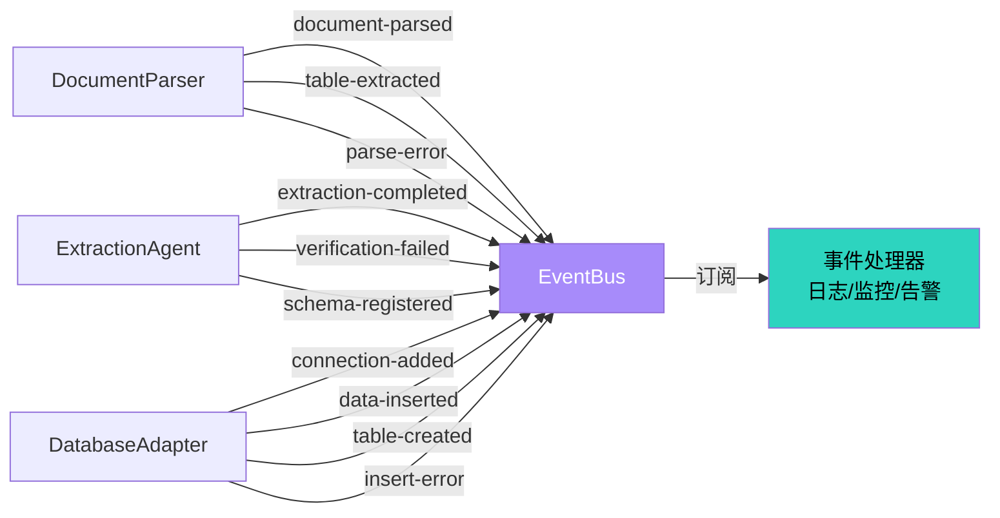
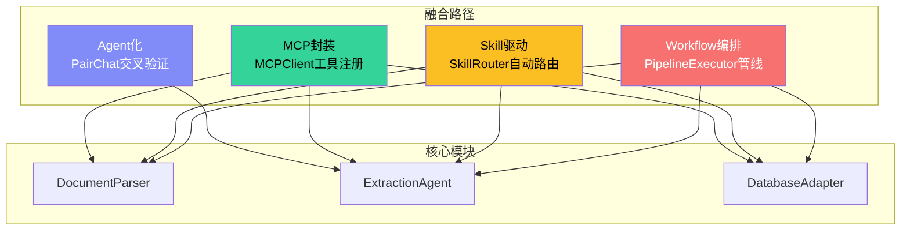

# 模块详解 — 文档解析子系统（DocParser）

> 源码路径：`src/runtime/doc-parser/` | 文件数：4 | 版本：2.73.4

---

## 目录

- [1. 子系统概述](#1-子系统概述)
- [2. 架构设计](#2-架构设计)
- [3. DocumentParser — 精准识别模块](#3-documentparser--精准识别模块)
  - [3.1 核心职责](#31-核心职责)
  - [3.2 类定义与接口](#32-类定义与接口)
  - [3.3 支持的文档类型](#33-支持的文档类型)
  - [3.4 关键方法详解](#34-关键方法详解)
  - [3.5 配置选项](#35-配置选项)
  - [3.6 事件](#36-事件)
  - [3.7 使用示例](#37-使用示例)
- [4. ExtractionAgent — 智能抽取模块](#4-extractionagent--智能抽取模块)
  - [4.1 核心职责](#41-核心职责)
  - [4.2 类定义与接口](#42-类定义与接口)
  - [4.3 双Agent架构详解](#43-双agent架构详解)
  - [4.4 Schema注册系统](#44-schema注册系统)
  - [4.5 关键方法详解](#45-关键方法详解)
  - [4.6 配置选项](#46-配置选项)
  - [4.7 事件](#47-事件)
  - [4.8 使用示例](#48-使用示例)
- [5. DatabaseAdapter — 一键入库模块](#5-databaseadapter--一键入库模块)
  - [5.1 核心职责](#51-核心职责)
  - [5.2 类定义与接口](#52-类定义与接口)
  - [5.3 多数据库适配策略](#53-多数据库适配策略)
  - [5.4 关键方法详解](#54-关键方法详解)
  - [5.5 配置选项](#55-配置选项)
  - [5.6 事件](#56-事件)
  - [5.7 使用示例](#57-使用示例)
- [6. index.js — 统一导出](#6-indexjs--统一导出)
- [7. API端点参考](#7-api端点参考)
- [8. 端到端使用示例](#8-端到端使用示例)
- [9. 配置参考](#9-配置参考)
- [10. 事件参考](#10-事件参考)
- [11. 融合路径说明](#11-融合路径说明)

---

## 1. 子系统概述

文档解析子系统（DocParser）是Harness Engineering框架中负责非结构化文档→结构化数据全链路转换的核心子系统。它通过四阶段管线实现从原始文件到数据库入库的完整闭环：

**文件接收 → 精准识别 → 智能抽取 → 一键入库**

### 核心能力

| 能力 | 实现方式 | 对应模块 |
|------|---------|---------|
| 多格式文档解析 | PDF/Office/图像文档解析引擎 | DocumentParser |
| 复杂表格提取 | 嵌套表头、跨行跨列支持 | DocumentParser |
| 定位溯源 | locateInDocument精确位置追踪 | DocumentParser |
| 语义理解字段提取 | 双Agent大模型架构（Extractor + Verifier） | ExtractionAgent |
| 置信度评分 | 0-1置信度 + 交叉验证 | ExtractionAgent |
| Schema注册 | 6种字段类型定义与验证 | ExtractionAgent |
| 多数据库适配 | SQLite/MySQL/PostgreSQL | DatabaseAdapter |
| Schema自动建表 | 字段类型→SQL类型映射 | DatabaseAdapter |
| 事务批量插入 | better-sqlite3事务保证原子性 | DatabaseAdapter |

### 设计原则

- **精准识别**：保留特殊符号、公式单位、小数点精度，不丢失原文信息
- **双Agent验证**：Extractor Agent提取 + Verifier Agent交叉验证，确保抽取质量
- **一键入库**：从解析到入库零代码配置，Schema驱动自动建表
- **容量控制**：BoundedMap/BoundedArray限制内存使用，防止OOM
- **优雅关闭**：withShutdown混入，确保资源正确释放

---

## 2. 架构设计

### 四阶段管线架构



### 模块协作时序图



### 数据流转示意



---

## 3. DocumentParser — 精准识别模块

**源文件**：`src/runtime/doc-parser/document-parser.js`

### 3.1 核心职责

DocumentParser是文档解析子系统的第一道关卡，负责将原始文件转化为结构化解析结果：

1. **多格式解析**：支持PDF、图片（OCR）、Word、Excel、PowerPoint等7种文件格式
2. **表格提取**：支持嵌套表头、跨行跨列的复杂表格提取
3. **定位溯源**：`locateInDocument(docId, searchTerm)` 精确定位搜索词在文档中的位置
4. **精度保持**：保留特殊符号、公式单位、小数点精度
5. **容量控制**：BoundedMap限制已解析文档缓存，防止内存膨胀

### 3.2 类定义与接口

```javascript
class DocumentParser extends EventEmitter {
  constructor(options)

  // 解析
  parse(filePath, options)
  extractTables(filePath, pageRange)
  locateInDocument(docId, searchTerm)

  // 查询
  getDocument(docId)
  getStats()
  listSupportedTypes()

  // 生命周期
  shutdown()
}
```

### 3.3 支持的文档类型

| 扩展名 | 类型标识 | 说明 |
|--------|---------|------|
| `.pdf` | `pdf` | PDF文档解析（待集成pdf-parse） |
| `.png` | `image` | 图片OCR识别（待集成tesseract） |
| `.jpg` / `.jpeg` | `image` | 图片OCR识别 |
| `.tiff` | `image` | TIFF图片OCR识别 |
| `.docx` | `word` | Word文档解析（待集成mammoth） |
| `.xlsx` | `excel` | Excel表格解析（待集成xlsx） |
| `.pptx` | `powerpoint` | PowerPoint解析 |

**常量定义**：

```javascript
const SUPPORTED_TYPES = {
  '.pdf': 'pdf',
  '.png': 'image',
  '.jpg': 'image',
  '.jpeg': 'image',
  '.tiff': 'image',
  '.docx': 'word',
  '.xlsx': 'excel',
  '.pptx': 'powerpoint',
};
```

### 3.4 关键方法详解

#### `parse(filePath, options)`

主解析方法——解析指定文件并返回结构化结果。

```javascript
const parser = new DocumentParser({ projectRoot: '/project/root' });

const result = parser.parse('docs/report.pdf', {
  extractTables: true,
  enableOcr: true,
  pageStart: 1,
  pageEnd: 10,
});

// 返回:
// {
//   docId: 'doc-1717564800000-1',
//   fileName: 'report.pdf',
//   fileType: 'pdf',
//   pages: [
//     { pageNumber: 1, width: 595, height: 842, rotation: 0 }
//   ],
//   tables: [
//     {
//       page: 1,
//       rows: 3,
//       cols: 4,
//       headers: ['名称', '数量', '单价', '金额'],
//       cells: [
//         [{ value: '...', rowSpan: 1, colSpan: 1, confidence: 0.9 }, ...],
//         ...
//       ],
//       confidence: 0.9
//     }
//   ],
//   textContent: [
//     {
//       page: 1,
//       text: '文档文本内容...',
//       position: { x: 0, y: 0, width: 595, height: 842 },
//       confidence: 1.0
//     }
//   ],
//   metadata: {
//     fileSize: 102400,
//     parsedAt: '2025-06-05T12:00:00.000Z',
//     ocrEnabled: true,
//     tableExtractionEnabled: true,
//   },
//   parseTime: 150,
// }
```

**执行流程**：

1. `_validateFile(filePath)` — 验证文件存在性、大小、类型
2. `_dispatchParse(filePath, fileType, options)` — 按类型分发解析
3. 生成唯一docId，缓存解析结果
4. 更新统计信息，触发事件

**文件验证规则**：
- 文件必须存在且为普通文件
- 文件大小不超过`maxFileSize`（默认50MB）
- 文件扩展名必须在`SUPPORTED_TYPES`中
- 扩展名必须在配置的`supportedTypes`列表中

#### `extractTables(filePath, pageRange)`

表格专用提取——从文档中提取表格数据，支持页码范围过滤。

```javascript
const tables = parser.extractTables('docs/financial.xlsx', {
  start: 1,
  end: 5,
});

// 返回:
// [
//   {
//     page: 1,
//     rows: 3,
//     cols: 4,
//     headers: ['科目', '借方', '贷方', '余额'],
//     cells: [
//       [{ value: '现金', rowSpan: 1, colSpan: 1, confidence: 1.0 }, ...],
//       ...
//     ],
//     confidence: 1.0
//   }
// ]
```

**表格数据结构**：

每个单元格包含：
- `value` — 单元格值（保留原始精度和格式）
- `rowSpan` — 跨行数
- `colSpan` — 跨列数
- `confidence` — 识别置信度（0-1）

#### `locateInDocument(docId, searchTerm)`

定位溯源——在已解析文档中搜索指定词，返回精确位置信息，用于PDF位置追踪和高亮。

```javascript
const locations = parser.locateInDocument('doc-1717564800000-1', '净利润');

// 返回:
// {
//   docId: 'doc-1717564800000-1',
//   locations: [
//     {
//       page: 3,
//       x: 120,
//       y: 450,
//       width: 595,
//       height: 20,
//       text: '本季度净利润为1,234.56万元',
//       confidence: 0.95
//     }
//   ]
// }
```

**搜索逻辑**：不区分大小写的子串匹配，遍历所有textContent块。

#### `getDocument(docId)`

获取已解析文档的防御性深拷贝。

```javascript
const doc = parser.getDocument('doc-1717564800000-1');
// 返回文档对象的深拷贝，不存在时返回null
```

#### `getStats()`

获取解析统计信息的防御性拷贝。

```javascript
const stats = parser.getStats();
// {
//   totalParsed: 15,
//   totalErrors: 1,
//   totalTablesExtracted: 8,
//   byType: {
//     pdf: { count: 10, totalTime: 1500 },
//     image: { count: 3, totalTime: 300 },
//     excel: { count: 2, totalTime: 100 },
//   }
// }
```

#### `listSupportedTypes()`

列出所有支持的文件类型。

```javascript
const types = parser.listSupportedTypes();
// [
//   { extension: '.pdf', type: 'pdf' },
//   { extension: '.png', type: 'image' },
//   { extension: '.jpg', type: 'image' },
//   ...
// ]
```

### 3.5 配置选项

```javascript
const DEFAULT_CONFIG = {
  maxFileSize: 50 * 1024 * 1024,   // 最大文件大小（50MB）
  ocrEnabled: true,                 // 是否启用OCR
  tableExtractionEnabled: true,     // 是否启用表格提取
  maxParsedDocs: 500,               // 已解析文档缓存容量
};
```

**构造函数参数**：

| 参数 | 类型 | 必填 | 默认值 | 说明 |
|------|------|------|--------|------|
| `projectRoot` | string | 是 | — | 项目根目录 |
| `maxFileSize` | number | 否 | 50MB | 最大文件大小（字节） |
| `supportedTypes` | string[] | 否 | Object.keys(SUPPORTED_TYPES) | 自定义支持的文件类型列表 |
| `ocrEnabled` | boolean | 否 | true | 是否启用OCR |
| `tableExtractionEnabled` | boolean | 否 | true | 是否启用表格提取 |

### 3.6 事件

| 事件名 | 触发时机 | 数据 |
|--------|---------|------|
| `document-parsed` | 文档解析完成 | `{ docId, fileName, fileType, parseTime }` |
| `table-extracted` | 表格提取完成 | `{ docId, page, rows, cols, confidence }` |
| `parse-error` | 解析出错 | `{ filePath, error }` |

### 3.7 使用示例

```javascript
const { DocumentParser } = require('./src/runtime/doc-parser');

const parser = new DocumentParser({
  projectRoot: '/data/documents',
  maxFileSize: 100 * 1024 * 1024,  // 100MB
  ocrEnabled: true,
  tableExtractionEnabled: true,
});

// 监听事件
parser.on('document-parsed', ({ docId, fileName, parseTime }) => {
  console.log(`解析完成: ${fileName}, docId=${docId}, 耗时=${parseTime}ms`);
});

parser.on('table-extracted', ({ page, rows, cols, confidence }) => {
  console.log(`表格提取: 第${page}页, ${rows}×${cols}, 置信度=${confidence}`);
});

parser.on('parse-error', ({ filePath, error }) => {
  console.error(`解析失败: ${filePath}, 原因: ${error}`);
});

// 1. 解析PDF文档
const pdfResult = parser.parse('reports/annual-2024.pdf');
console.log(`文档ID: ${pdfResult.docId}`);
console.log(`页数: ${pdfResult.pages.length}`);
console.log(`表格数: ${pdfResult.tables.length}`);

// 2. 专用表格提取
const tables = parser.extractTables('data/financial.xlsx', { start: 1, end: 5 });

// 3. 定位溯源
const locations = parser.locateInDocument(pdfResult.docId, '营业收入');
console.log(`找到${locations.locations.length}处匹配`);

// 4. 查看统计
const stats = parser.getStats();
console.log(`累计解析: ${stats.totalParsed}个文件`);

// 5. 查看支持的类型
const types = parser.listSupportedTypes();
console.log('支持格式:', types.map(t => t.extension).join(', '));
```

---

## 4. ExtractionAgent — 智能抽取模块

**源文件**：`src/runtime/doc-parser/extraction-agent.js`

### 4.1 核心职责

ExtractionAgent是文档解析子系统的智能核心，采用双Agent大模型架构实现语义理解字段提取：

1. **双Agent架构**：Extractor Agent（提取）+ Verifier Agent（验证），交叉验证确保质量
2. **语义理解提取**：基于Schema定义的字段，从解析内容中语义提取
3. **置信度评分**：每个字段0-1置信度，总体置信度低于阈值触发告警
4. **重试机制**：提取失败自动重试，最多`maxRetries`次
5. **Schema注册**：支持6种字段类型，字段定义可含描述和示例

### 4.2 类定义与接口

```javascript
class ExtractionAgent extends EventEmitter {
  constructor(options)

  // Schema管理
  registerSchema(schemaName, schema)

  // 提取
  extract(docId, parsedContent, schemaName, options)

  // 验证
  verifyExtraction(extractionId)

  // 查询
  getExtraction(extractionId)
  getExtractionsByDoc(docId)
  getStats()

  // 生命周期
  shutdown()
}
```

### 4.3 双Agent架构详解



#### Phase 1: Extractor Agent — 语义分析和字段提取

Extractor Agent模拟LLM驱动的提取过程，分两步策略提取字段：

1. **直接提取**（`_tryDirectExtraction`）：在结构化内容中递归查找匹配字段名的值，置信度0.85
2. **文本提取**（`_tryTextExtraction`）：基于字段描述和示例进行模式匹配，置信度0.6
3. **未找到**：必填字段返回null（置信度0.1），非必填返回undefined

#### Phase 2: Verifier Agent — 交叉验证和置信度计算

Verifier Agent对提取结果执行三条验证规则：

| 规则 | 条件 | 效果 |
|------|------|------|
| 空值降权 | 字段值为null/undefined/空字符串 | 置信度 × 0.3，标记警告 |
| 极低置信度告警 | 置信度 < 0.3 | 标记警告 |
| 来源提权 | 字段有source引用 | 置信度 × 1.1（上限1.0） |

### 4.4 Schema注册系统

Schema定义了提取目标的结构，包含字段名、类型、描述、是否必填和示例值。

**6种字段类型**：

| 类型 | 说明 | SQL映射 | 类型强制转换 |
|------|------|---------|-------------|
| `string` | 字符串 | TEXT | `String(value)` |
| `number` | 数值 | REAL | `Number(value)` |
| `date` | 日期 | TEXT | `new Date(value).toISOString()` |
| `boolean` | 布尔值 | INTEGER | true/1/yes → true, false/0/no → false |
| `array` | 数组 | TEXT | `Array.isArray ? value : [value]` |
| `object` | 对象 | TEXT | 对象原样，其他包装为`{ value }` |

**Schema定义示例**：

```javascript
const schema = {
  name: 'financial-report',
  version: '1.0.0',
  fields: [
    {
      name: 'companyName',
      type: 'string',
      description: '公司名称，全称',
      required: true,
      examples: ['华为技术有限公司', '腾讯控股有限公司'],
    },
    {
      name: 'revenue',
      type: 'number',
      description: '营业收入，单位万元',
      required: true,
      examples: [123456.78],
    },
    {
      name: 'reportDate',
      type: 'date',
      description: '报告期截止日期',
      required: true,
    },
    {
      name: 'isAudited',
      type: 'boolean',
      description: '是否经审计',
      required: false,
    },
    {
      name: 'subsidiaries',
      type: 'array',
      description: '子公司列表',
      required: false,
    },
    {
      name: 'financialSummary',
      type: 'object',
      description: '财务摘要',
      required: false,
    },
  ],
};
```

### 4.5 关键方法详解

#### `registerSchema(schemaName, schema)`

注册提取模式，验证字段定义的合法性。

```javascript
const agent = new ExtractionAgent({ confidenceThreshold: 0.7 });

agent.registerSchema('financial-report', {
  name: 'financial-report',
  version: '2.0.0',
  fields: [
    { name: 'companyName', type: 'string', required: true },
    { name: 'revenue', type: 'number', required: true },
    { name: 'reportDate', type: 'date', required: true },
  ],
});

// 触发 schema-registered 事件: { schemaName: 'financial-report', version: '2.0.0' }
```

**验证规则**：
- `schemaName`必须为非空字符串
- `schema`必须为非null对象
- `schema.name`必须为非空字符串
- `schema.fields`必须为非空数组
- 每个字段的`name`必须为非空字符串
- 每个字段的`type`必须在`VALID_FIELD_TYPES`中

#### `extract(docId, parsedContent, schemaName, options)`

执行双Agent提取流程，带重试机制。

```javascript
const result = agent.extract(
  'doc-1717564800000-1',          // 文档ID
  parsedDoc,                       // DocumentParser的解析结果
  'financial-report',              // Schema名称
  { retries: 2 }                   // 覆盖重试次数
);

// 返回:
// {
//   extractionId: 'ext-1717564800123-abc',
//   docId: 'doc-1717564800000-1',
//   schemaName: 'financial-report',
//   fields: [
//     { name: 'companyName', value: '华为技术有限公司', confidence: 0.85, source: 'textContent.0', verified: true },
//     { name: 'revenue', value: 123456.78, confidence: 0.6, source: 'text:42', verified: true },
//     { name: 'reportDate', value: '2024-12-31T00:00:00.000Z', confidence: 0.85, source: 'metadata.reportDate', verified: true },
//   ],
//   overallConfidence: 0.7667,
//   extractionTime: 120,
//   warnings: [],
//   timestamp: '2025-06-05T12:00:00.000Z',
// }
```

**重试机制**：提取失败时自动重试，最多`maxRetries`次（默认3次）。所有重试均失败后抛出`HarnessError`（错误码`PIPELINE_EXECUTION_ERROR`）。

#### `verifyExtraction(extractionId)`

重新验证已有提取结果——重新运行Verifier Agent，更新置信度评分。

```javascript
const updated = agent.verifyExtraction('ext-1717564800123-abc');
// 返回更新后的提取结果，不存在时返回null
```

**使用场景**：人工修正字段值后，重新验证以更新置信度。

#### `getExtraction(extractionId)`

获取提取结果的防御性深拷贝。

```javascript
const extraction = agent.getExtraction('ext-1717564800123-abc');
// 返回深拷贝，不存在时返回null
```

#### `getExtractionsByDoc(docId)`

获取指定文档的所有提取结果。

```javascript
const extractions = agent.getExtractionsByDoc('doc-1717564800000-1');
// 返回该文档所有提取结果的数组
```

#### `getStats()`

获取提取统计信息。

```javascript
const stats = agent.getStats();
// {
//   totalExtractions: 25,
//   successfulExtractions: 23,
//   failedExtractions: 2,
//   totalVerifications: 10,
//   verificationFailures: 1,
//   avgConfidence: 0.8234,
//   registeredSchemas: 3,
//   cachedExtractions: 20,
//   historySize: 25,
// }
```

### 4.6 配置选项

```javascript
const DEFAULT_MAX_RETRIES = 3;              // 默认最大重试次数
const DEFAULT_CONFIDENCE_THRESHOLD = 0.7;   // 默认置信度阈值
const EXTRACTION_CAPACITY = 1000;            // 提取结果缓存容量
const HISTORY_CAPACITY = 200;                // 历史记录容量
```

**构造函数参数**：

| 参数 | 类型 | 必填 | 默认值 | 说明 |
|------|------|------|--------|------|
| `llmClient` | Object | 否 | null | 注入的LLM客户端，用于实际大模型调用 |
| `maxRetries` | number | 否 | 3 | 最大重试次数 |
| `confidenceThreshold` | number | 否 | 0.7 | 置信度阈值（0-1），低于此值触发verification-failed事件 |

### 4.7 事件

| 事件名 | 触发时机 | 数据 |
|--------|---------|------|
| `extraction-completed` | 提取完成 | `{ extractionId, docId, schemaName, overallConfidence }` |
| `verification-failed` | 置信度低于阈值 | `{ extractionId, docId, reason }` |
| `schema-registered` | Schema注册成功 | `{ schemaName, version }` |

### 4.8 使用示例

```javascript
const { ExtractionAgent } = require('./src/runtime/doc-parser');

const agent = new ExtractionAgent({
  llmClient: myLlmClient,           // 可选LLM客户端
  maxRetries: 3,
  confidenceThreshold: 0.7,
});

// 监听事件
agent.on('extraction-completed', ({ extractionId, overallConfidence }) => {
  console.log(`提取完成: ${extractionId}, 置信度=${overallConfidence}`);
});

agent.on('verification-failed', ({ extractionId, reason }) => {
  console.warn(`验证失败: ${extractionId}, 原因: ${reason}`);
});

// 1. 注册Schema
agent.registerSchema('invoice', {
  name: 'invoice',
  version: '1.0.0',
  fields: [
    { name: 'invoiceNumber', type: 'string', description: '发票号码', required: true, examples: ['FP2024060001'] },
    { name: 'amount', type: 'number', description: '金额', required: true, examples: [12345.67] },
    { name: 'date', type: 'date', description: '开票日期', required: true },
    { name: 'items', type: 'array', description: '明细项目', required: false },
  ],
});

// 2. 执行提取
const result = agent.extract('doc-001', parsedContent, 'invoice');

// 3. 检查低置信度字段
result.fields
  .filter(f => f.confidence < 0.7)
  .forEach(f => console.warn(`低置信度: ${f.name}=${f.value}, confidence=${f.confidence}`));

// 4. 重新验证
const verified = agent.verifyExtraction(result.extractionId);

// 5. 查询文档所有提取
const allExtractions = agent.getExtractionsByDoc('doc-001');

// 6. 查看统计
console.log('提取统计:', agent.getStats());
```

---

## 5. DatabaseAdapter — 一键入库模块

**源文件**：`src/runtime/doc-parser/database-adapter.js`

### 5.1 核心职责

DatabaseAdapter是文档解析子系统的最后一道关卡，负责将提取的结构化数据持久化到数据库：

1. **多数据库适配**：SQLite（better-sqlite3）、MySQL、PostgreSQL
2. **Schema自动建表**：将ExtractionAgent的Schema映射为SQL表结构
3. **事务批量插入**：使用better-sqlite3事务保证原子性，失败整批回滚
4. **自动推断类型**：根据JavaScript值推断SQL列类型
5. **连接复用**：支持注入已有SqliteStore实例，复用数据库连接

### 5.2 类定义与接口

```javascript
class DatabaseAdapter extends EventEmitter {
  constructor(options)

  // 连接管理
  addConnection(name, config)
  getConnections()

  // 数据操作
  insert(tableName, data, connectionName)
  query(tableName, conditions, connectionName)
  batchInsert(tableName, records, connectionName)

  // Schema建表
  createTableFromSchema(tableName, schema, connectionName)

  // 统计
  getStats()

  // 生命周期
  shutdown()
}
```

### 5.3 多数据库适配策略



**字段类型→SQL类型映射**：

```javascript
const FIELD_TYPE_MAP = {
  string: 'TEXT',
  number: 'REAL',
  date: 'TEXT',
  boolean: 'INTEGER',
  array: 'TEXT',      // JSON.stringify序列化
  object: 'TEXT',     // JSON.stringify序列化
};
```

**JavaScript值→SQL值转换**：

| JavaScript类型 | SQL存储 | 转换方式 |
|---------------|---------|---------|
| `null`/`undefined` | `NULL` | 直接映射 |
| `boolean` | `INTEGER` | `true→1, false→0` |
| `Date` | `TEXT` | `toISOString()` |
| `Array`/`Object` | `TEXT` | `JSON.stringify()` |
| 其他 | 原样 | 直接存储 |

### 5.4 关键方法详解

#### `addConnection(name, config)`

添加数据库连接。SQLite类型直接创建连接，MySQL/PostgreSQL存储配置以支持懒连接。

```javascript
const adapter = new DatabaseAdapter({ defaultType: 'sqlite' });

// SQLite连接（内存数据库）
adapter.addConnection('main', {
  type: 'sqlite',
  filePath: ':memory:',
});

// SQLite连接（文件数据库）
adapter.addConnection('analytics', {
  type: 'sqlite',
  filePath: '/data/analytics.db',
});

// 复用已有SqliteStore
adapter.addConnection('shared', {
  type: 'sqlite',
  // 将使用构造函数注入的sqliteStore
});

// 返回: { connected: true, name: 'main' }
```

**SQLite连接优化**：
- 自动启用WAL模式（`journal_mode = WAL`）
- 同步模式设为NORMAL（`synchronous = NORMAL`）
- 支持复用注入的SqliteStore实例（避免重复打开同一数据库）

#### `createTableFromSchema(tableName, schema, connectionName)`

根据提取模式创建表——将Schema中的字段映射为SQL列，并自动添加元数据列。

```javascript
adapter.createTableFromSchema('financial_reports', {
  fields: {
    companyName: { type: 'string' },
    revenue: { type: 'number' },
    reportDate: { type: 'date' },
    isAudited: { type: 'boolean' },
    subsidiaries: { type: 'array' },
  },
});

// 自动创建的表结构:
// CREATE TABLE IF NOT EXISTS financial_reports (
//   id INTEGER PRIMARY KEY AUTOINCREMENT,
//   companyName TEXT,
//   revenue REAL,
//   reportDate TEXT,
//   isAudited INTEGER,
//   subsidiaries TEXT,
//   _doc_id TEXT,
//   _extraction_id TEXT,
//   _created_at TEXT,
//   _confidence REAL
// )
```

**自动添加的元数据列**：

| 列名 | 类型 | 说明 |
|------|------|------|
| `_doc_id` | TEXT | 关联的文档ID |
| `_extraction_id` | TEXT | 关联的提取结果ID |
| `_created_at` | TEXT | 创建时间 |
| `_confidence` | REAL | 置信度 |

#### `insert(tableName, data, connectionName)`

插入结构化数据——支持单条或批量插入，自动创建不存在的表。

```javascript
// 单条插入
const result = adapter.insert('financial_reports', {
  companyName: '华为技术有限公司',
  revenue: 123456.78,
  reportDate: '2024-12-31',
  isAudited: true,
  subsidiaries: ['华为终端', '华为云'],
  _doc_id: 'doc-001',
  _extraction_id: 'ext-001',
  _created_at: new Date().toISOString(),
  _confidence: 0.92,
});
// 返回: { inserted: 1, tableName: 'financial_reports' }

// 批量插入
const batchResult = adapter.insert('financial_reports', [
  { companyName: '公司A', revenue: 100000, ... },
  { companyName: '公司B', revenue: 200000, ... },
]);
// 返回: { inserted: 2, tableName: 'financial_reports' }
```

**自动建表**：若目标表不存在，根据第一条记录的键和值类型自动创建表。

#### `batchInsert(tableName, records, connectionName)`

批量插入数据——使用事务保证原子性，失败时整批回滚。

```javascript
const result = adapter.batchInsert('financial_reports', [
  { companyName: '公司A', revenue: 100000, _doc_id: 'doc-001', ... },
  { companyName: '公司B', revenue: 200000, _doc_id: 'doc-002', ... },
  { companyName: '公司C', revenue: 300000, _doc_id: 'doc-003', ... },
]);

// 返回: { inserted: 3, errors: 0 }
// 任何一条失败，整批回滚
```

#### `query(tableName, conditions, connectionName)`

查询数据——支持条件过滤、分页和排序。

```javascript
const result = adapter.query('financial_reports', {
  where: { companyName: '华为技术有限公司' },
  orderBy: 'revenue DESC',
  limit: 10,
  offset: 0,
});

// 返回: { rows: [...], total: 25 }
```

**查询条件**：

| 参数 | 类型 | 说明 |
|------|------|------|
| `where` | Object | WHERE条件键值对（AND连接） |
| `limit` | number | 返回条数上限 |
| `offset` | number | 偏移量 |
| `orderBy` | string | 排序字段（如`revenue DESC`） |

#### `getConnections()`

获取所有连接信息的防御性副本。

```javascript
const connections = adapter.getConnections();
// Map {
//   'main' => { type: 'sqlite', connected: true, config: {...} },
//   'analytics' => { type: 'sqlite', connected: true, config: {...} },
// }
```

#### `getStats()`

获取操作统计信息。

```javascript
const stats = adapter.getStats();
// {
//   inserts: 150,
//   queries: 45,
//   tablesCreated: 5,
//   errors: 2,
//   connectionCount: 2,
// }
```

### 5.5 配置选项

**构造函数参数**：

| 参数 | 类型 | 必填 | 默认值 | 说明 |
|------|------|------|--------|------|
| `defaultType` | string | 否 | `'sqlite'` | 默认数据库类型 |
| `sqliteStore` | Object | 否 | null | 已有SqliteStore实例，用于复用连接 |
| `connections` | Map | 否 | null | 命名连接的初始映射 |

### 5.6 事件

| 事件名 | 触发时机 | 数据 |
|--------|---------|------|
| `connection-added` | 连接添加成功 | `{ name, type, connected }` |
| `data-inserted` | 数据插入成功 | `{ tableName, inserted, batch? }` |
| `table-created` | 表创建成功 | `{ tableName }` |
| `insert-error` | 插入出错 | `{ tableName, error, batch? }` |

### 5.7 使用示例

```javascript
const { DatabaseAdapter } = require('./src/runtime/doc-parser');

const adapter = new DatabaseAdapter({
  defaultType: 'sqlite',
  sqliteStore: existingStore,  // 可选复用已有连接
});

// 监听事件
adapter.on('table-created', ({ tableName }) => {
  console.log(`表已创建: ${tableName}`);
});

adapter.on('data-inserted', ({ tableName, inserted }) => {
  console.log(`数据插入: ${tableName}, ${inserted}条`);
});

// 1. 添加连接
adapter.addConnection('main', { type: 'sqlite', filePath: ':memory:' });

// 2. Schema建表
adapter.createTableFromSchema('invoices', {
  fields: {
    invoiceNumber: { type: 'string' },
    amount: { type: 'number' },
    date: { type: 'date' },
    items: { type: 'array' },
  },
});

// 3. 单条插入
adapter.insert('invoices', {
  invoiceNumber: 'FP2024060001',
  amount: 12345.67,
  date: '2024-06-05',
  items: ['项目A', '项目B'],
  _doc_id: 'doc-001',
  _extraction_id: 'ext-001',
  _created_at: new Date().toISOString(),
  _confidence: 0.92,
});

// 4. 批量事务插入
adapter.batchInsert('invoices', [
  { invoiceNumber: 'FP001', amount: 1000, ... },
  { invoiceNumber: 'FP002', amount: 2000, ... },
  { invoiceNumber: 'FP003', amount: 3000, ... },
]);

// 5. 条件查询
const result = adapter.query('invoices', {
  where: { invoiceNumber: 'FP001' },
  limit: 10,
});
console.log(`查询结果: ${result.rows.length}条, 总计${result.total}条`);

// 6. 查看统计
console.log('数据库统计:', adapter.getStats());
```

---

## 6. index.js — 统一导出

**源文件**：`src/runtime/doc-parser/index.js`

统一导出模块，提供三大核心能力的单入口访问：

```javascript
/**
 * 智能文档解析子系统 — 统一导出模块
 *
 * 提供PDF/Office文档解析、双Agent智能提取、多数据库入库三大核心能力。
 * 融合路径：Agent化 + MCP封装 + Skill驱动 + Workflow编排
 *
 * @module doc-parser
 */

const DocumentParser = require('./document-parser');
const ExtractionAgent = require('./extraction-agent');
const DatabaseAdapter = require('./database-adapter');

module.exports = {
  DocumentParser,
  ExtractionAgent,
  DatabaseAdapter,
};
```

**使用方式**：

```javascript
// 统一导入
const { DocumentParser, ExtractionAgent, DatabaseAdapter } = require('./src/runtime/doc-parser');

// 或单独导入
const { DocumentParser } = require('./src/runtime/doc-parser/document-parser');
const ExtractionAgent = require('./src/runtime/doc-parser/extraction-agent');
const DatabaseAdapter = require('./src/runtime/doc-parser/database-adapter');
```

---

## 7. API端点参考

文档解析子系统通过Web仪表盘暴露以下API端点：

| 端点 | 方法 | 说明 | 对应模块 |
|------|------|------|---------|
| `/api/doc-parser/parse` | POST | 解析上传文档 | DocumentParser |
| `/api/doc-parser/tables` | POST | 提取文档表格 | DocumentParser |
| `/api/doc-parser/locate` | POST | 定位搜索词位置 | DocumentParser |
| `/api/doc-parser/document/:docId` | GET | 获取已解析文档 | DocumentParser |
| `/api/doc-parser/stats` | GET | 获取解析统计 | DocumentParser |
| `/api/doc-parser/schema` | POST | 注册提取模式 | ExtractionAgent |
| `/api/doc-parser/extract` | POST | 执行智能提取 | ExtractionAgent |
| `/api/doc-parser/extraction/:id` | GET | 获取提取结果 | ExtractionAgent |
| `/api/doc-parser/db/insert` | POST | 插入数据到数据库 | DatabaseAdapter |
| `/api/doc-parser/db/query` | POST | 查询数据库 | DatabaseAdapter |

### 端点详细说明

#### `POST /api/doc-parser/parse`

解析上传文档。

```javascript
// 请求
{
  "filePath": "docs/report.pdf",
  "options": {
    "extractTables": true,
    "enableOcr": true
  }
}

// 响应
{
  "docId": "doc-1717564800000-1",
  "fileName": "report.pdf",
  "fileType": "pdf",
  "pages": [...],
  "tables": [...],
  "textContent": [...],
  "metadata": {...},
  "parseTime": 150
}
```

#### `POST /api/doc-parser/extract`

执行智能提取。

```javascript
// 请求
{
  "docId": "doc-1717564800000-1",
  "schemaName": "financial-report",
  "options": { "retries": 2 }
}

// 响应
{
  "extractionId": "ext-1717564800123-abc",
  "docId": "doc-1717564800000-1",
  "schemaName": "financial-report",
  "fields": [...],
  "overallConfidence": 0.85,
  "extractionTime": 120,
  "warnings": []
}
```

#### `POST /api/doc-parser/db/insert`

插入数据到数据库。

```javascript
// 请求
{
  "tableName": "financial_reports",
  "data": { "companyName": "华为", "revenue": 123456.78 },
  "connectionName": "main"
}

// 响应
{
  "inserted": 1,
  "tableName": "financial_reports"
}
```

---

## 8. 端到端使用示例

以下示例展示从文件解析到数据库入库的完整管线：

```javascript
const { DocumentParser, ExtractionAgent, DatabaseAdapter } = require('./src/runtime/doc-parser');

// ─── 初始化三大模块 ────────────────────────────────
const parser = new DocumentParser({
  projectRoot: '/data/documents',
  ocrEnabled: true,
  tableExtractionEnabled: true,
});

const agent = new ExtractionAgent({
  confidenceThreshold: 0.7,
  maxRetries: 3,
});

const db = new DatabaseAdapter({ defaultType: 'sqlite' });

// ─── Step 1: 注册Schema ────────────────────────────
agent.registerSchema('contract', {
  name: 'contract',
  version: '1.0.0',
  fields: [
    { name: 'contractNumber', type: 'string', description: '合同编号', required: true, examples: ['HT-2024-001'] },
    { name: 'partyA', type: 'string', description: '甲方名称', required: true },
    { name: 'partyB', type: 'string', description: '乙方名称', required: true },
    { name: 'amount', type: 'number', description: '合同金额（元）', required: true },
    { name: 'signDate', type: 'date', description: '签订日期', required: true },
    { name: 'isFramework', type: 'boolean', description: '是否框架协议', required: false },
    { name: 'clauses', type: 'array', description: '条款列表', required: false },
  ],
});

// ─── Step 2: 添加数据库连接并建表 ──────────────────
db.addConnection('main', { type: 'sqlite', filePath: ':memory:' });

db.createTableFromSchema('contracts', {
  fields: {
    contractNumber: { type: 'string' },
    partyA: { type: 'string' },
    partyB: { type: 'string' },
    amount: { type: 'number' },
    signDate: { type: 'date' },
    isFramework: { type: 'boolean' },
    clauses: { type: 'array' },
  },
});

// ─── Step 3: 解析文档 ──────────────────────────────
const parsed = parser.parse('contracts/agreement-2024.pdf');
console.log(`解析完成: ${parsed.fileName}, ${parsed.pages.length}页, ${parsed.tables.length}个表格`);

// ─── Step 4: 智能提取 ──────────────────────────────
const extracted = agent.extract(parsed.docId, parsed, 'contract');
console.log(`提取完成: ${extracted.fields.length}个字段, 置信度=${extracted.overallConfidence}`);

// 检查低置信度字段
const lowConfidence = extracted.fields.filter(f => f.confidence < 0.7);
if (lowConfidence.length > 0) {
  console.warn('以下字段置信度较低，建议人工审核:');
  lowConfidence.forEach(f => console.warn(`  - ${f.name}: ${f.value} (置信度=${f.confidence})`));
}

// ─── Step 5: 一键入库 ──────────────────────────────
const record = {};
extracted.fields.forEach(f => { record[f.name] = f.value; });
record._doc_id = extracted.docId;
record._extraction_id = extracted.extractionId;
record._created_at = new Date().toISOString();
record._confidence = extracted.overallConfidence;

const insertResult = db.insert('contracts', record);
console.log(`入库完成: ${insertResult.inserted}条记录`);

// ─── Step 6: 查询验证 ──────────────────────────────
const queryResult = db.query('contracts', {
  where: { contractNumber: record.contractNumber },
  limit: 1,
});
console.log(`查询验证: 找到${queryResult.rows.length}条记录`);

// ─── Step 7: 定位溯源 ──────────────────────────────
const locations = parser.locateInDocument(parsed.docId, record.partyA);
console.log(`溯源定位: "${record.partyA}"出现在${locations.locations.length}处`);

// ─── 统计汇总 ──────────────────────────────────────
console.log('\n=== 统计汇总 ===');
console.log('解析统计:', parser.getStats());
console.log('提取统计:', agent.getStats());
console.log('数据库统计:', db.getStats());
```

---

## 9. 配置参考

### DocumentParser 配置

```javascript
{
  projectRoot: string,              // [必填] 项目根目录
  maxFileSize: number,              // [可选] 最大文件大小，默认 52428800 (50MB)
  supportedTypes: string[],         // [可选] 自定义支持的文件类型列表
  ocrEnabled: boolean,              // [可选] 是否启用OCR，默认 true
  tableExtractionEnabled: boolean,  // [可选] 是否启用表格提取，默认 true
}
```

### ExtractionAgent 配置

```javascript
{
  llmClient: Object,                // [可选] LLM客户端实例
  maxRetries: number,               // [可选] 最大重试次数，默认 3
  confidenceThreshold: number,      // [可选] 置信度阈值(0-1)，默认 0.7
}
```

### DatabaseAdapter 配置

```javascript
{
  defaultType: string,              // [可选] 默认数据库类型，默认 'sqlite'
  sqliteStore: Object,              // [可选] 已有SqliteStore实例
  connections: Map<string, Object>, // [可选] 初始连接映射
}
```

### 连接配置

```javascript
// SQLite
{
  type: 'sqlite',
  filePath: string,                 // 文件路径，':memory:' 为内存数据库
}

// MySQL（需安装mysql2）
{
  type: 'mysql',
  host: string,
  port: number,
  database: string,
  user: string,
  password: string,
}

// PostgreSQL（需安装pg）
{
  type: 'postgresql',
  host: string,
  port: number,
  database: string,
  user: string,
  password: string,
}
```

---

## 10. 事件参考

### 全部事件汇总

| 模块 | 事件名 | 触发时机 | 数据 |
|------|--------|---------|------|
| DocumentParser | `document-parsed` | 文档解析完成 | `{ docId, fileName, fileType, parseTime }` |
| DocumentParser | `table-extracted` | 表格提取完成 | `{ docId, page, rows, cols, confidence }` |
| DocumentParser | `parse-error` | 解析出错 | `{ filePath, error }` |
| ExtractionAgent | `extraction-completed` | 提取完成 | `{ extractionId, docId, schemaName, overallConfidence }` |
| ExtractionAgent | `verification-failed` | 置信度低于阈值 | `{ extractionId, docId, reason }` |
| ExtractionAgent | `schema-registered` | Schema注册成功 | `{ schemaName, version }` |
| DatabaseAdapter | `connection-added` | 连接添加成功 | `{ name, type, connected }` |
| DatabaseAdapter | `data-inserted` | 数据插入成功 | `{ tableName, inserted, batch? }` |
| DatabaseAdapter | `table-created` | 表创建成功 | `{ tableName }` |
| DatabaseAdapter | `insert-error` | 插入出错 | `{ tableName, error, batch? }` |

### 事件流转图



---

## 11. 融合路径说明

文档解析子系统的设计遵循Harness Engineering框架的融合路径，通过四个维度实现与框架的深度集成：

### Agent化

三个核心模块均继承`EventEmitter`，具备Agent化基础能力：

- **DocumentParser** → 可作为Task Worker Agent的感知模块，接收文件解析任务
- **ExtractionAgent** → 天然的双Agent架构（Extractor + Verifier），可直接映射为PairChat交叉验证模式
- **DatabaseAdapter** → 可作为DevOps Engineer Agent的执行模块，管理数据持久化

```javascript
// Agent化集成示例
const pairChat = new PairChat();
const { sessionId } = pairChat.startCrossValidation({
  agentA: 'extractor',   // ExtractionAgent的Extractor角色
  agentB: 'verifier',    // ExtractionAgent的Verifier角色
  artifact: 'doc-001',
  artifactType: 'extraction',
  mode: PairChat.CROSS_VALIDATION_MODES.BIDIRECTIONAL,
});
```

### MCP封装

通过MCPClient封装文档解析能力，暴露为MCP工具供外部调用：

```javascript
// MCP封装示例
const mcpClient = new MCPClient();
mcpClient.registerTool('doc-parser/parse', {
  description: '解析PDF/Office/图像文档',
  parameters: { filePath: { type: 'string' }, options: { type: 'object' } },
  handler: async (params) => parser.parse(params.filePath, params.options),
});

mcpClient.registerTool('doc-parser/extract', {
  description: '智能提取文档字段',
  parameters: { docId: { type: 'string' }, schemaName: { type: 'string' } },
  handler: async (params) => agent.extract(params.docId, null, params.schemaName),
});
```

### Skill驱动

将文档解析管线封装为Skill，通过SkillRouter自动路由：

```javascript
// Skill定义示例 (.harness/skills/doc-parsing.md)
// ---
// name: doc-parsing
// description: 文档解析全管线——解析→提取→入库
// triggers: [文档解析, PDF提取, 发票识别, 合同抽取]
// ---

// SkillRouter自动匹配
const router = new SkillRouter(projectRoot);
router.discover();
const matches = router.match({
  userMessage: '帮我提取这份PDF发票的信息',
  agent: 'task-worker',
});
// matches → ['doc-parsing']
```

### Workflow编排

通过PipelineExecutor编排四阶段管线，支持条件分支和并行扇出：

```javascript
// Workflow编排示例
const pipeline = new PipelineExecutor();

pipeline.addStep('parse', {
  handler: async (ctx) => {
    const result = parser.parse(ctx.filePath);
    return { parsedDoc: result };
  },
});

pipeline.addStep('extract', {
  handler: async (ctx) => {
    const result = agent.extract(ctx.parsedDoc.docId, ctx.parsedDoc, ctx.schemaName);
    return { extraction: result };
  },
  dependsOn: ['parse'],
});

pipeline.addStep('validate', {
  handler: async (ctx) => {
    if (ctx.extraction.overallConfidence < 0.7) {
      return { needsReview: true };
    }
    return { needsReview: false };
  },
  dependsOn: ['extract'],
});

pipeline.addStep('insert', {
  handler: async (ctx) => {
    if (!ctx.needsReview) {
      const record = {};
      ctx.extraction.fields.forEach(f => { record[f.name] = f.value; });
      return db.insert(ctx.tableName, record);
    }
    return { skipped: true, reason: '低置信度，等待人工审核' };
  },
  dependsOn: ['validate'],
});

const result = await pipeline.execute({
  filePath: 'contracts/agreement.pdf',
  schemaName: 'contract',
  tableName: 'contracts',
});
```

### 融合架构总览



---

> **相关文档**：
> - [[模块详解-EventBus模块]] — 事件总线，文档解析事件的发布/订阅基础设施
> - [[模块详解-MCPClient模块]] — MCP协议客户端，文档解析能力的MCP封装
> - [[模块详解-SkillRouter模块]] — Skill路由引擎，文档解析Skill的自动发现与匹配
> - [[模块详解-PipelineExecutor流水线执行器]] — 管线执行器，四阶段管线的Workflow编排
> - [[模块详解-PairChat链式对话]] — 配对对话，双Agent交叉验证的协作模式
> - [[模块详解-基础设施子系统]] — BoundedMap/BoundedArray等容量控制基础设施
