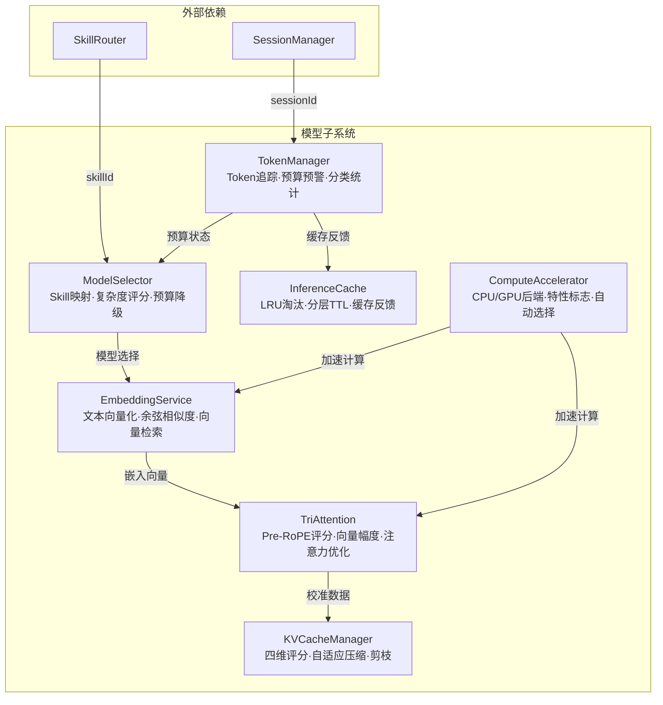
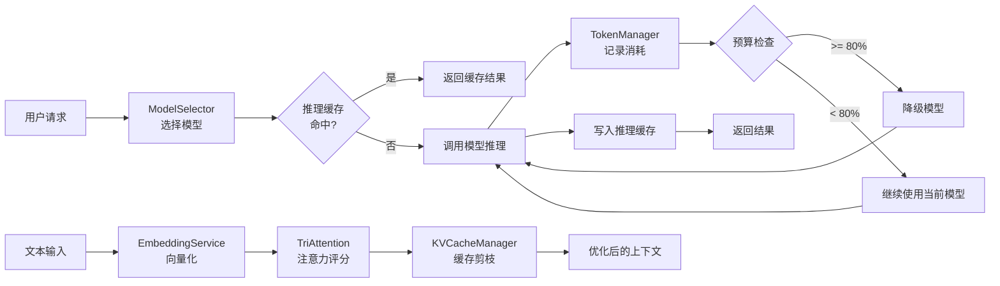
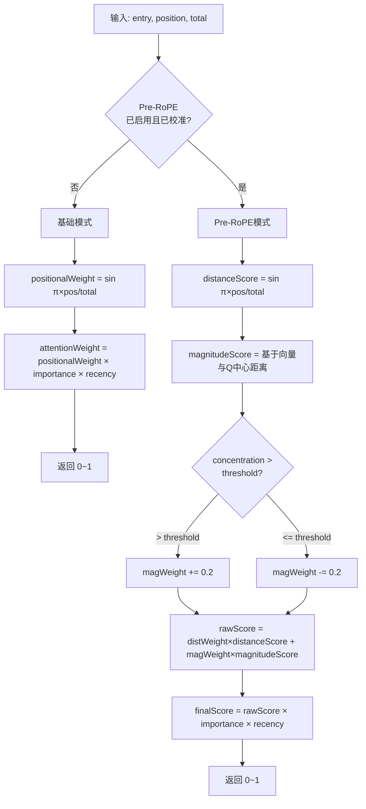
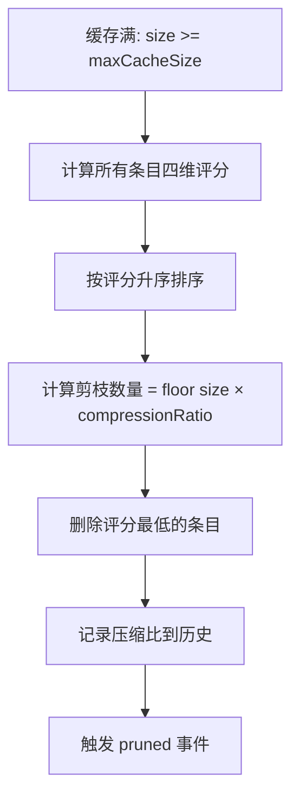
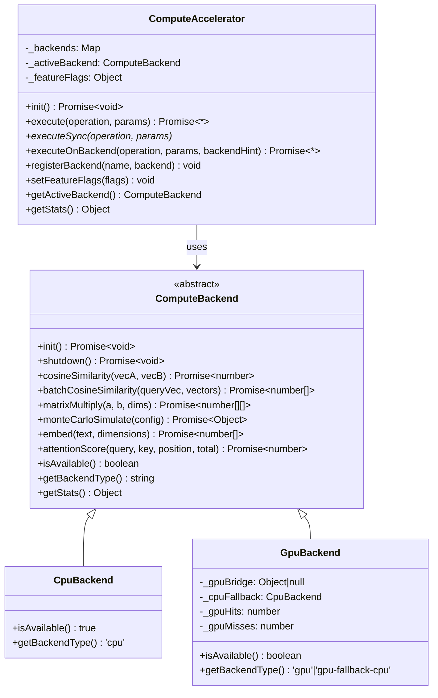
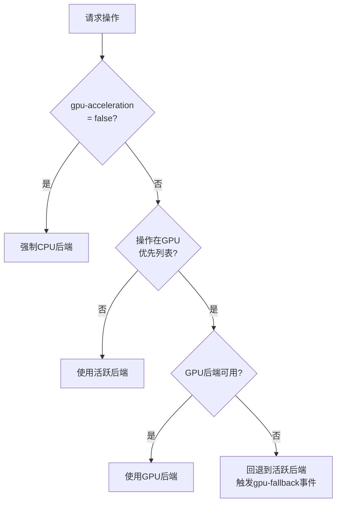
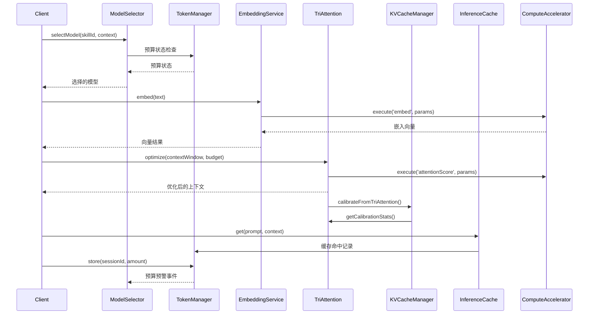

# 模块详解 — 模型子系统

> 源码路径：`src/runtime/model/`
> 子系统定位：为框架运行时提供Token预算管理、模型智能选择、文本向量化、三重注意力计算、KV缓存压缩、推理缓存和计算加速七大核心能力，实现AI模型交互的全链路成本管控与推理优化。

---

## 子系统概述

模型子系统（Model Subsystem）是Harness多Agent架构的模型交互核心，负责管理AI模型调用过程中的Token预算、模型路由、文本嵌入、注意力优化、KV缓存压缩、推理结果复用和计算加速。该子系统包含7个核心模块，构成了从成本控制到推理优化的完整技术栈。

模型子系统是Harness"成本控制"和"证据验证"原则的核心执行引擎，支撑了从Token预算管控到推理结果复用的全链路成本优化。它将模型交互从简单的API调用升级为预算感知（TokenManager三级预警）、智能路由（ModelSelector Skill映射+复杂度评分）、缓存加速（InferenceCache LRU+TTL）、注意力优化（TriAttention多维评分+KVCacheManager四维剪枝）的立体化管控体系，并通过EmbeddingService为语义匹配提供向量基础设施，ComputeAccelerator为计算密集型操作提供CPU/GPU后端抽象。

### 核心设计原则

1. **预算感知**：TokenManager三级预警（80%/95%/100%），ModelSelector预算降级策略
2. **智能路由**：Skill-to-Model映射 + 复杂度评分 + 成本优化，自动选择最优模型
3. **缓存加速**：InferenceCache分层TTL + LRU淘汰，推理结果复用降低Token消耗
4. **注意力优化**：TriAttention Pre-RoPE空间三角级数 + 向量幅度双引擎，KVCacheManager四维评分剪枝
5. **向量基础设施**：EmbeddingService本地哈希嵌入 + 余弦相似度 + 批量向量化
6. **计算加速**：ComputeAccelerator CPU/GPU后端抽象 + 特性标志控制 + 自动选择

## 模块清单

| 模块 | 源文件 | 说明 |
|------|--------|------|
| TokenManager | token-manager.js | Token管理器，多会话使用量追踪、预算检查与分类统计 |
| ModelSelector | model-selector.js | 模型选择器，Skill映射、复杂度评分、预算降级与成本追踪 |
| EmbeddingService | embedding-service.js | 嵌入服务，文本向量化、余弦相似度计算与向量检索 |
| TriAttention | tri-attention.js | 三重注意力，Pre-RoPE空间三角级数评分+向量幅度双引擎注意力计算 |
| KVCacheManager | kv-cache-manager.js | KV缓存管理器，四维评分剪枝与自适应权重压缩 |
| InferenceCache | inference-cache.js | 推理缓存，LRU淘汰+分层TTL的推理结果复用 |
| ComputeAccelerator | compute-accelerator.js | 计算加速器，CPU/GPU后端抽象、特性标志与自动选择 |

## 架构图



### 数据流图



---

## 1. TokenManager — Token管理器

### 概述

TokenManager负责多会话Token使用量追踪、预算检查与分类统计。它实现了三级预警机制（80%/95%/100%），当Token消耗达到阈值时自动触发事件通知，支持LRU会话淘汰和分类统计。TokenManager是模型子系统的成本控制核心，所有Token消耗均需通过TokenManager记录和验证。

### 核心职责

- 多会话Token使用量追踪与存储
- 三级预算预警（80%警告/95%危险/100%耗尽）
- 分类统计（按类别追踪Token消耗）
- LRU会话淘汰（maxSessions=1000）
- 全局预算设置与查询
- Token数量格式化与反解析

### 类定义与接口

```javascript
const TokenManager = require('./src/runtime/model/token-manager');

class TokenManager extends EventEmitter {
  /**
   * @param {Object} [options] - 配置选项
   * @param {number} [options.defaultBudget] - 全局Token预算上限，默认使用 DEFAULT_TOKEN_BUDGET (1B)
   * @param {number} [options.maxSessions=1000] - 最大会话数量，超出后LRU淘汰最旧会话
   */
  constructor(options) { /* ... */ }
}
// withShutdown mixin 提供 guardShutdown(), shutdown() 方法
```

### 常量定义

| 常量 | 值 | 说明 |
|------|-----|------|
| `TOKEN_UNITS` | `{K: 1e3, M: 1e6, B: 1e9}` | Token单位映射 |
| `DEFAULT_TOKEN_BUDGET` | `1000000000` | 默认Token预算（10亿） |
| `TOKEN_BUDGET_WARNING_RATIO` | `0.8` | 80%预警阈值 |
| `TOKEN_BUDGET_DANGER_RATIO` | `0.95` | 95%危险阈值 |

### 关键方法详解

#### `store(sessionId, amount)`

为指定会话累加Token使用量，超限时自动触发预警事件。

- **参数**：
  - `sessionId` {string} — 会话标识，必须为非空字符串
  - `amount` {number} — 累加的Token数量，必须为非负有限数
- **返回值**：{number} 累加后的会话Token总量
- **异常**：
  - `SessionError('INVALID_SESSION_ID')` — sessionId无效
  - `SessionError('INVALID_TOKEN_AMOUNT')` — amount无效
  - `SessionError('BUDGET_EXCEEDED')` — 预算已耗尽
- **事件**：`token-exhausted` / `token-warning-95` / `token-warning-80`

```javascript
tokenManager.store('session-001', 5000);
// 内部：累加到已有值，检查预算阈值
// 若当前已耗尽则抛出 SessionError('BUDGET_EXCEEDED')
```

#### `get(sessionId)`

获取指定会话的Token使用量。

- **参数**：`sessionId` {string} — 会话标识
- **返回值**：{number} 该会话已使用的Token数量，不存在时返回0
- **异常**：`SessionError('INVALID_SESSION_ID')` — sessionId无效

```javascript
const usage = tokenManager.get('session-001'); // 5000
```

#### `set(sessionId, amount)`

直接设置指定会话的Token使用量（覆盖而非累加）。

- **参数**：
  - `sessionId` {string} — 会话标识
  - `amount` {number} — 要设置的Token数量，必须为非负有限数
- **返回值**：{number} 设置后的Token数量
- **异常**：同 `store()`

```javascript
tokenManager.set('session-001', 10000);
```

#### `validate(sessionId, budget)`

验证指定会话的Token使用量是否超出预算阈值。

- **参数**：
  - `sessionId` {string} — 会话标识
  - `budget` {number} [可选] — 自定义预算值，不传则使用全局预算
- **返回值**：

```javascript
{
  sessionId: string,      // 会话标识
  tokensUsed: number,     // 已使用Token数
  budget: number,         // 预算值
  ratio: number,          // 使用比率 (0~1+)
  warning80: boolean,     // 是否达到80%预警
  warning95: boolean,     // 是否达到95%危险
  exhausted: boolean,     // 是否已耗尽(100%)
}
```

```javascript
const result = tokenManager.validate('session-001', 1000000);
// { sessionId: 'session-001', tokensUsed: 10000, budget: 1000000, ratio: 0.01, warning80: false, warning95: false, exhausted: false }
```

#### `addBreakdown(sessionId, category, amount)`

按类别记录Token消耗明细。支持按类别统计Token使用分布。

- **参数**：
  - `sessionId` {string} — 会话标识
  - `category` {string} — 消耗分类名称（如input/output/toolCall）
  - `amount` {number} — 该分类的Token消耗量
- **返回值**：{Object} 更新后的该会话分类明细对象
- **异常**：`SessionError` — 关机状态、无效sessionId/category/amount

```javascript
tokenManager.addBreakdown('session-001', 'input', 3000);
tokenManager.addBreakdown('session-001', 'output', 2000);
tokenManager.addBreakdown('session-001', 'toolCall', 500);
```

#### `getBreakdown(sessionId)`

获取指定会话的分类统计。

```javascript
const breakdown = tokenManager.getBreakdown('session-001');
// { input: 3000, output: 2000, toolCall: 500 }
```

#### `getAllBreakdowns(sessionId)`

获取所有会话或指定会话的分类Token消耗明细。传入sessionId时仅返回该会话明细，不传时返回全部会话明细映射。

```javascript
const all = tokenManager.getAllBreakdowns();
// { 'session-001': { input: 3000, output: 2000 }, 'session-002': { input: 1500 } }
const single = tokenManager.getAllBreakdowns('session-001');
// { input: 3000, output: 2000 }
```

#### `getTotal(budget)`

获取所有会话的Token总消耗和预算占比。

```javascript
const total = tokenManager.getTotal(1000000);
// { total: 10000, budget: 1000000, ratio: 0.01 }
```

#### `formatTokens(n)` / `parseFormatted(formatted)`

Token数量格式化与反解析。支持K/M/B单位。

```javascript
tokenManager.formatTokens(1500000);   // '1.5M'
tokenManager.formatTokens(500);       // '500'
tokenManager.formatTokens(2300000000); // '2.30B'
tokenManager.parseFormatted('1.5M');  // 1500000
tokenManager.parseFormatted('500K');  // 500000
tokenManager.parseFormatted('2B');    // 2000000000
tokenManager.parseFormatted('invalid'); // 0
```

#### `setGlobalBudget(budget)` / `getGlobalBudget()`

设置/获取全局Token预算。setGlobalBudget要求budget为正有限数，否则抛出`SessionError('INVALID_BUDGET')`。

#### `listSessions()`

列出所有已注册Token使用量的会话标识，返回字符串数组。

#### `getUsage(sessionId, budget)`

获取指定会话的Token使用详情。

```javascript
const usage = tokenManager.getUsage('session-001');
// { used: 10000, budget: 1000000000, remaining: 999990000, ratio: 0.00001 }
```

#### `getStats(budget)`

获取全局统计信息。

```javascript
const stats = tokenManager.getStats();
// { total: 10000, budget: 1000000000, ratio: 0.00001, maxSession: 10000, activeSessions: 1, totalSessions: 1 }
```

#### `clear(sessionId)` / `clearAll()`

清除指定会话或所有会话的Token使用量及分类明细。清除时触发`token-reset`事件。

### 配置选项

| 选项 | 默认值 | 说明 |
|------|--------|------|
| `defaultBudget` | `1000000000` | 全局Token预算上限 |
| `maxSessions` | `1000` | 最大会话数，超出后LRU淘汰 |

### 事件

| 事件名 | 触发条件 | 事件数据 |
|--------|----------|----------|
| `token-exhausted` | Token消耗达到100%预算 | `{ sessionId, tokensUsed, budget }` |
| `token-warning-95` | Token消耗达到95%预算 | `{ sessionId, tokensUsed, budget }` |
| `token-warning-80` | Token消耗达到80%预算 | `{ sessionId, tokensUsed, budget }` |
| `token-reset` | Token使用量被重置 | `{ sessionId }` (clearAll时sessionId为null) |

### 错误处理

| 错误码 | 触发条件 | 处理建议 |
|--------|----------|----------|
| `INVALID_SESSION_ID` | sessionId为空或非字符串 | 确保传入有效的会话标识 |
| `INVALID_TOKEN_AMOUNT` | amount为负数、NaN或Infinity | 确保传入非负有限数 |
| `INVALID_BUDGET` | budget为0、负数或Infinity | 确保传入正有限数 |
| `INVALID_BREAKDOWN_CATEGORY` | category为空或非字符串 | 确保传入有效的分类名称 |
| `BUDGET_EXCEEDED` | 预算已耗尽仍尝试store | 检查预算状态，考虑降级模型 |

- 会话数超过`maxSessions`时自动淘汰最久未访问的会话
- 所有方法内部使用`guardShutdown()`检查关闭状态，关闭后调用将抛出异常
- `formatTokens`/`parseFormatted`对非法输入返回安全默认值（'0'/0）
- `getStats`在关闭状态下返回空统计而非抛出异常

### 使用示例

```javascript
const TokenManager = require('./src/runtime/model/token-manager');

const tm = new TokenManager({ defaultBudget: 500000, maxSessions: 500 });

// 监听预算预警
tm.on('token-warning-80', ({ sessionId, tokensUsed, budget }) => {
  console.log(`会话 ${sessionId} Token使用率达80%: ${tm.formatTokens(tokensUsed)}/${tm.formatTokens(budget)}`);
});
tm.on('token-warning-95', ({ sessionId }) => {
  console.warn(`会话 ${sessionId} Token即将耗尽！`);
});
tm.on('token-exhausted', ({ sessionId }) => {
  console.error(`会话 ${sessionId} Token已耗尽！`);
});

// 记录Token消耗
tm.store('session-001', 5000);
tm.addBreakdown('session-001', 'input', 3000);
tm.addBreakdown('session-001', 'output', 2000);

// 查询统计
const stats = tm.getStats();
console.log('总消耗:', tm.formatTokens(stats.total));
console.log('分类明细:', tm.getBreakdown('session-001'));
console.log('使用详情:', tm.getUsage('session-001'));

// 验证预算
const validation = tm.validate('session-001');
if (validation.warning80) {
  console.warn('预算紧张，考虑降级模型');
}

// 列出所有会话
console.log('活跃会话:', tm.listSessions());
```

---

## 2. ModelSelector — 模型选择器

### 概述

ModelSelector负责根据Skill类型和上下文自动选择最优AI模型，实现Skill-to-Model映射、复杂度评分、预算降级和成本追踪。当Token预算紧张时自动降级到低成本模型，预算恢复后自动升级。

### 核心职责

- Skill-to-Model映射（22种预设映射）
- 复杂度评分（4维因子：推理深度/输出长度/错误敏感度/模式复杂度）
- 预算降级策略（constrained 80%/critical 95%/exhausted 100%）
- 上下文调整（重试升级/简单任务降级/会话成本控制）
- 模型使用统计与成本追踪
- 预算恢复检测

### 类定义与接口

```javascript
const ModelSelector = require('./src/runtime/model/model-selector');

class ModelSelector extends EventEmitter {
  /**
   * @param {Object} [options] - 配置选项
   * @param {Object} [options.skillModelMap] - 自定义Skill-Model映射
   * @param {Object} [options.modelTiers] - 自定义模型层级
   * @param {string} [options.defaultModel='gpt-4o'] - 默认模型
   * @param {string[]} [options.fallbackChain] - 降级链
   * @param {boolean} [options.enableAutoDowngrade=true] - 是否启用自动降级
   * @param {number} [options.costBudgetPerSession] - 每会话成本预算
   * @param {Object} [options.complexityThreshold] - 复杂度阈值
   */
  constructor(options) { /* ... */ }
}
```

### 常量定义

#### DEFAULT_SKILL_MODEL_MAP（22种Skill-Model映射）

```javascript
const DEFAULT_SKILL_MODEL_MAP = {
  'brainstorming':              { model: 'gpt-4o',       reason: '创意探索需要发散思维' },
  'requirement-analysis':       { model: 'gpt-4o-mini',  reason: '需求分析模式较固定' },
  'architecture-design':        { model: 'gpt-4o',       reason: '架构决策影响全局，需要顶级推理' },
  'tdd-implement':              { model: 'gpt-4o-mini',  reason: 'TDD模式固定，中等推理即可' },
  'module-development':         { model: 'gpt-4o-mini',  reason: '编码需要理解但不需要顶级推理' },
  'code-review':                { model: 'gpt-4o-mini',  reason: '审查需要理解但模式较固定' },
  'verification-before-completion': { model: 'gpt-4o-mini', reason: '验证检查模式固定' },
  'bug-fix':                    { model: 'gpt-4o',       reason: '调试需要深度推理' },
  'systematic-debugging':       { model: 'gpt-4o',       reason: '复杂调试需要深度推理' },
  'security-audit':             { model: 'gpt-4o',       reason: '安全审计需要深度推理' },
  'performance-optimization':   { model: 'gpt-4o',       reason: '性能优化需要深度分析' },
  'integration-testing':        { model: 'gpt-3.5-turbo', reason: '测试执行模式固定' },
  'deployment':                 { model: 'gpt-3.5-turbo', reason: '部署脚本模式固定' },
  'documentation':              { model: 'gpt-3.5-turbo', reason: '文档生成不需要强推理' },
  'refactor-code':              { model: 'gpt-4o-mini',  reason: '重构需要理解但模式较固定' },
  'iterative-deepening':        { model: 'gpt-4o',       reason: '深化推理需要顶级推理' },
  'multi-agent-fusion':         { model: 'gpt-4o',       reason: '多Agent融合需要顶级推理' },
  'pair-chat':                  { model: 'gpt-4o-mini',  reason: '对话审查中等推理即可' },
  'self-reflection':            { model: 'gpt-4o-mini',  reason: '自反思中等推理即可' },
  'auto-doc-generation':        { model: 'gpt-3.5-turbo', reason: '自动文档生成模式固定' },
  'dispatching-parallel':       { model: 'gpt-4o-mini',  reason: '任务调度模式固定' },
  'writing-skills':             { model: 'gpt-3.5-turbo', reason: '技能编写模式固定' },
};
```

#### DEFAULT_MODEL_TIERS（模型层级与成本系数）

| 层级 | 模型 | 成本系数 |
|------|------|----------|
| premium | gpt-4o, claude-3-opus, deepseek-v3 | 1.0 |
| standard | gpt-4o-mini, claude-3-sonnet | 0.15 |
| economy | gpt-3.5-turbo, deepseek-chat | 0.02 |

#### COMPLEXITY_FACTORS（复杂度因子）

| 因子 | 权重 | 信号词 |
|------|------|--------|
| reasoning_depth | 0.3 | architecture, design, brainstorm, debug, analyze |
| output_length | 0.2 | document, implement, develop, refactor |
| error_sensitivity | 0.25 | security, deploy, production, critical |
| pattern_complexity | 0.25 | test, format, lint, review |

#### DEFAULT_CONFIG

| 选项 | 默认值 | 说明 |
|------|--------|------|
| `defaultModel` | `'gpt-4o'` | 默认模型 |
| `fallbackChain` | `['gpt-4o', 'gpt-4o-mini', 'gpt-3.5-turbo']` | 降级链 |
| `enableAutoDowngrade` | `true` | 是否启用自动降级 |
| `costBudgetPerSession` | `null` | 每会话成本预算 |
| `complexityThreshold` | `{premium: 0.7, standard: 0.3}` | 复杂度阈值 |

### 关键方法详解

#### `selectModel(skillId, context)`

根据Skill ID和上下文选择最优模型。考虑Skill映射、复杂度评分和预算状态。

- **参数**：
  - `skillId` {string} — Skill标识
  - `context` {Object} [可选] — 选择上下文
    - `complexityScore` {number} — 任务复杂度评分
    - `isRetry` {boolean} — 是否为重试请求
    - `isSimpleTask` {boolean} — 是否为简单任务
    - `sessionId` {string} — 会话标识
- **返回值**：`{ model: string, reason: string, tier: string, source: string }`

**选择优先级**：
1. Skill映射查找 → 返回映射的模型
2. 预算降级检查 → 降级到低成本模型
3. 上下文调整 → 重试升级/简单任务降级
4. 复杂度评分 → 按评分选择层级
5. 默认模型 → 无映射时使用默认

```javascript
// Skill映射选择
const result1 = selector.selectModel('brainstorming');
// { model: 'gpt-4o', reason: '创意探索需要发散思维', tier: 'premium', source: 'skill-mapping' }

// 复杂度评分选择
const result2 = selector.selectModel('custom-skill', { complexityScore: 0.9 });
// { model: 'gpt-4o', reason: 'Selected by complexity score: 0.90', tier: 'premium', source: 'complexity-based' }

// 无效skillId回退默认
const result3 = selector.selectModel('');
// { model: 'gpt-4o', reason: 'Invalid skillId, using default', tier: 'premium', source: 'default' }
```

#### `recordUsage(skillId, model, tokens, cost, sessionId)`

记录模型使用情况，用于成本追踪和统计。使用统计上限500条，超出后LRU淘汰。

```javascript
selector.recordUsage('brainstorming', 'gpt-4o', 5000, 0.05, 'session-001');
```

#### `attachTokenManager(tokenManager)`

注入TokenManager实例，监听预算预警事件并自动调整模型选择策略。绑定后，TokenManager的预警事件将自动触发降级标志。

- 绑定`token-warning-80` → 设置`_budgetConstrained = true`
- 绑定`token-warning-95` → 设置`_budgetCritical = true`
- 绑定`token-exhausted` → 设置`_budgetExhausted = true`
- 绑定`token-reset` → 重置所有预算标志，触发`budget-recovered`事件

```javascript
selector.attachTokenManager(tokenManager);
```

#### `resetBudgetFlags()`

手动重置所有预算约束标志（constrained、critical、exhausted）。

#### `getCostEstimate(skillId)`

获取指定Skill的预估成本信息。

```javascript
const estimate = selector.getCostEstimate('brainstorming');
// { model: 'gpt-4o', tier: 'premium', costMultiplier: 1.0, estimatedCostPer1kTokens: 0.01 }
```

#### `getStats()`

获取模型选择统计信息，包含总Token消耗、总成本、按模型分类统计和相对全Premium的节省百分比。

```javascript
const stats = selector.getStats();
// { totalTokens: 50000, totalCost: 0.75, byModel: { 'gpt-4o': { count: 10, tokens: 30000, cost: 0.3 } }, savingsVsAllPremium: 85.5 }
```

#### `getTier(model)`

查询指定模型所属的层级（premium/standard/economy），未匹配时默认返回'standard'。

#### `isHealthy()`

检查模型选择器健康状态，当未关闭时为健康。

### 预算降级策略

| 预算状态 | 触发条件 | 降级行为 |
|----------|----------|----------|
| normal | < 80% | 使用Skill映射的默认模型 |
| constrained | >= 80% | premium降级到standard |
| critical | >= 95% | premium降级到economy，standard降级到economy |
| exhausted | >= 100% | 强制使用economy层级模型 |

### 上下文调整策略

| 场景 | 条件 | 调整行为 |
|------|------|----------|
| 重试升级 | `isRetry=true` 且当前economy | 升级到standard |
| 简单任务降级 | `isSimpleTask=true` 且当前premium | 降级到standard |
| 会话成本控制 | 会话成本 > 80%预算 且当前premium | 降级到standard |

### 事件

| 事件名 | 触发条件 | 事件数据 |
|--------|----------|----------|
| `model-downgraded` | 模型因预算或上下文降级 | `{ skillId, from, to, reason }` |
| `usage-recorded` | 使用记录已保存 | `{ skillId, model, tokens, cost }` |
| `budget-recovered` | 预算恢复正常 | `{ wasConstrained, wasCritical, wasExhausted }` |

### 错误处理

- 无效skillId不抛出异常，返回默认模型
- 使用统计超过500条自动LRU淘汰
- 会话成本追踪超过1000条自动LRU淘汰
- `getStats`在关闭状态下返回空统计

### 使用示例

```javascript
const ModelSelector = require('./src/runtime/model/model-selector');
const TokenManager = require('./src/runtime/model/token-manager');

const tm = new TokenManager();
const selector = new ModelSelector({
  enableAutoDowngrade: true,
  costBudgetPerSession: 1.0,
});
selector.attachTokenManager(tm);

// 监听降级事件
selector.on('model-downgraded', ({ skillId, from, to, reason }) => {
  console.warn(`Skill ${skillId} 模型降级: ${from} → ${to}, 原因: ${reason}`);
});

selector.on('budget-recovered', ({ wasConstrained, wasCritical, wasExhausted }) => {
  console.log(`预算恢复: constrained=${wasConstrained}, critical=${wasCritical}, exhausted=${wasExhausted}`);
});

// 选择模型
const result = selector.selectModel('architecture-design', {
  complexityScore: 0.9,
  sessionId: 'session-001',
});
console.log(`选择模型: ${result.model}, 层级: ${result.tier}, 原因: ${result.reason}`);

// 记录使用
selector.recordUsage('architecture-design', result.model, 8000, 0.08, 'session-001');

// 查看成本估算
const estimate = selector.getCostEstimate('brainstorming');
console.log('成本估算:', estimate);

// 查看统计
const stats = selector.getStats();
console.log('节省百分比:', stats.savingsVsAllPremium + '%');
```

---

## 3. EmbeddingService — 嵌入服务

### 概述

EmbeddingService负责文本向量化、余弦相似度计算和向量检索。支持三种Provider（LOCAL/OPENAI/PRECOMPUTED），其中OpenAI和Precomputed模式当前回退到本地实现。本地嵌入算法基于字符哈希种子 + 二元组特征 + L2归一化，生成128维确定性向量。

### 核心职责

- 文本向量化（本地哈希嵌入算法）
- 余弦相似度计算（同步/异步）
- 向量检索（findSimilar/findSimilarAsync）
- 批量嵌入（embedBatch）
- 嵌入缓存（LRU淘汰）
- ComputeAccelerator加速支持

### 类定义与接口

```javascript
const EmbeddingService = require('./src/runtime/model/embedding-service');

class EmbeddingService extends EventEmitter {
  /**
   * @param {Object} [options] - 配置选项
   * @param {string} [options.provider='local'] - 嵌入Provider
   * @param {number} [options.dimensions=128] - 向量维度
   * @param {number} [options.maxBatchSize=32] - 最大批量大小
   * @param {boolean} [options.cacheEnabled=true] - 是否启用缓存
   * @param {number} [options.cacheMaxSize=500] - 缓存最大条目数
   */
  constructor(options) { /* ... */ }
}
```

### 常量定义

| 常量 | 值 | 说明 |
|------|-----|------|
| `PROVIDERS.LOCAL` | `'local'` | 本地哈希嵌入 |
| `PROVIDERS.OPENAI` | `'openai'` | OpenAI嵌入（当前回退到本地） |
| `PROVIDERS.PRECOMPUTED` | `'precomputed'` | 预计算嵌入（当前回退到本地） |

#### DEFAULT_OPTIONS

| 选项 | 默认值 | 说明 |
|------|--------|------|
| `provider` | `'local'` | 嵌入Provider |
| `dimensions` | `128` | 向量维度 |
| `maxBatchSize` | `32` | 最大批量大小 |
| `cacheEnabled` | `true` | 是否启用缓存 |
| `cacheMaxSize` | `500` | 缓存最大条目数 |

### 关键方法详解

#### `embed(text)`

将文本转换为向量。本地算法流程：字符哈希种子生成 → 二元组特征提取 → L2归一化。

- **参数**：`text` {string} — 待向量化的文本
- **返回值**：{number[]} 嵌入向量数组；无效输入返回空数组
- **限制**：输入超过100000字符时返回空数组

```javascript
const vector = embeddingService.embed('Hello world');
// 返回: number[128] 归一化向量
```

#### `embedBatch(texts)`

批量嵌入，按maxBatchSize分批调用embed方法。

- **参数**：`texts` {string[]} — 待向量化的文本数组
- **返回值**：{number[][]} 嵌入向量数组的数组；无效输入返回空数组

```javascript
const vectors = embeddingService.embedBatch(['text1', 'text2', 'text3']);
// 返回: [number[128], number[128], number[128]]
```

#### `cosineSimilarity(a, b)`

计算两个向量的余弦相似度。向量长度不一致或为零时返回0。

- **参数**：`a` {number[]}, `b` {number[]} — 待比较的向量
- **返回值**：{number} 余弦相似度，范围 [-1, 1]

```javascript
const sim = embeddingService.cosineSimilarity(vecA, vecB);
// 返回: 0.0 ~ 1.0
```

#### `cosineSimilarityAsync(a, b)`

异步计算余弦相似度。优先使用ComputeAccelerator加速，失败时回退到同步计算。

#### `findSimilar(queryVector, candidateVectors, options)`

在候选向量中查找与查询向量最相似的Top-K结果。

- **参数**：
  - `queryVector` {number[]} — 查询向量
  - `candidateVectors` {Array<Object|number[]>} — 候选向量数组，元素可为向量数组或包含vector属性的对象
  - `options.topK` {number} — 返回的最大结果数，默认5
  - `options.minSimilarity` {number} — 最小相似度阈值，默认使用DEFAULT_CONFIDENCE
- **返回值**：`[{ index, similarity }]` 按相似度降序排列

```javascript
const results = embeddingService.findSimilar(queryVec, candidateVecs, {
  topK: 5,
  minSimilarity: 0.5,
});
// 返回: [{ index: 3, similarity: 0.92 }, { index: 7, similarity: 0.85 }, ...]
```

#### `findSimilarAsync(queryVector, candidateVectors, options)`

异步向量检索。优先使用ComputeAccelerator的batchCosineSimilarity加速，失败时回退到同步方法。

#### `attachComputeAccelerator(accelerator)`

注入ComputeAccelerator实例，用于加速余弦相似度等计算。支持ComputeAccelerator实例或任何具有execute方法的对象。

#### `clearCache()`

清除嵌入缓存。

#### `getStats()`

获取统计信息，包含嵌入次数、缓存命中率、平均耗时、缓存大小等。

```javascript
const stats = embeddingService.getStats();
// { totalEmbeddings: 100, cacheHits: 30, cacheMisses: 70, avgTimeMs: 2.5, cacheSize: 70, provider: 'local', dimensions: 128 }
```

### 本地嵌入算法详解

```
输入文本 → 预处理（小写化+去除特殊字符+保留中文）
        → 字符哈希种子生成（每个字符贡献哈希值，使用djb2算法）
        → 线性同余生成器填充向量（seed * 1103515245 + 12345）
        → 二元组特征提取（相邻字符对映射到向量维度，主索引+0.3，次索引+0.15）
        → L2归一化（确保向量长度为1）
        → 输出128维向量
```

**关键细节**：
- 预处理：`text.toLowerCase().replace(/[^\w\s\u4e00-\u9fff]/g, ' ').trim()`
- 种子算法：djb2 — `seed = ((seed << 5) - seed + charCode) | 0`
- 二元组上限：5000个（避免长文本过度计算）
- 二元组映射：主索引 `Math.abs(hash) % dims`，次索引 `Math.abs(hash * 31 + 7) % dims`

### 事件

| 事件名 | 触发条件 | 事件数据 |
|--------|----------|----------|
| `embedding-created` | 嵌入向量创建完成 | `{ textLength, dimensions, timeMs }` |

### 错误处理

- 空文本、非字符串输入、超过100000字符 → 返回空数组
- ComputeAccelerator加速失败 → 静默回退到本地计算
- 关闭状态下调用 → 抛出异常（guardShutdown）
- 缓存未命中时不影响正常嵌入

### 使用示例

```javascript
const EmbeddingService = require('./src/runtime/model/embedding-service');

const es = new EmbeddingService({
  provider: 'local',
  dimensions: 128,
  cacheEnabled: true,
  cacheMaxSize: 1000,
});

// 单文本嵌入
const vec = es.embed('Harness多Agent框架');

// 批量嵌入
const vecs = es.embedBatch(['文本1', '文本2', '文本3']);

// 相似度计算
const sim = es.cosineSimilarity(vecs[0], vecs[1]);
console.log('相似度:', sim.toFixed(4));

// 向量检索
const results = es.findSimilar(vec, candidateVectors, { topK: 3, minSimilarity: 0.6 });
results.forEach(r => console.log(`索引${r.index}: 相似度${r.similarity.toFixed(4)}`));

// 异步加速（需先attachComputeAccelerator）
const asyncSim = await es.cosineSimilarityAsync(vecA, vecB);
const asyncResults = await es.findSimilarAsync(vec, candidates, { topK: 5 });

// 统计
const stats = es.getStats();
console.log('缓存命中率:', (stats.cacheHits / (stats.cacheHits + stats.cacheMisses) * 100).toFixed(1) + '%');
```

---

## 4. TriAttention — 三重注意力

### 概述

TriAttention实现Pre-RoPE空间三角级数评分 + 向量幅度双引擎注意力计算。它通过多维评分机制优化上下文窗口中的注意力分配，支持离线校准Q/K聚类中心，实现关键信息聚焦。当启用Pre-RoPE评分且已校准时，使用双引擎模式；否则使用基础模式（位置×重要性×时效性）。

### 核心职责

- 上下文窗口注意力优化
- Pre-RoPE空间三角级数距离评分
- 向量幅度评分
- 自适应集中度调整
- Q/K聚类中心离线校准
- ComputeAccelerator加速支持

### 类定义与接口

```javascript
const TriAttention = require('./src/runtime/model/tri-attention');

class TriAttention extends EventEmitter {
  /**
   * @param {Object} [options] - 配置选项
   */
  constructor(options) { /* ... */ }
}
```

### 常量定义

#### DEFAULT_CONFIG

| 选项 | 默认值 | 说明 |
|------|--------|------|
| `attentionThreshold` | `0.3` | 注意力阈值，低于此值的条目被剪枝 |
| `maxContextEntries` | `500` | 最大上下文条目数 |
| `recencyDecay` | `0.95` | 时间衰减因子 |
| `enablePreRopeScoring` | `false` | 是否启用Pre-RoPE评分 |
| `calibrationCenter` | `null` | 初始校准中心 |
| `magnitudeWeight` | `0.5` | 向量幅度权重（0-1） |
| `concentrationThreshold` | `0.8` | 集中度阈值 |

### 关键方法详解

#### `optimize(contextWindow, budget)`

优化上下文窗口，根据预算和注意力评分选择最重要的条目。

- **参数**：
  - `contextWindow` {Object} — 上下文窗口对象，包含entries数组
  - `contextWindow.entries` {Array} — 上下文条目列表
  - `budget` {Object} — Token预算配置
  - `budget.maxTokens` {number} — 最大可用Token数
  - `budget.reservedTokens` {number} — 预留Token数
- **返回值**：`{ optimized: Array, pruned: Array, tokensSaved: number, compressionRatio: number }`
- **异常**：`DeepeningError('INVALID_INPUT')` — 输入无效

**优化流程**：
1. 对每个条目计算注意力评分
2. 按评分降序排序
3. 从高到低选择条目，直到Token预算用尽
4. 保证至少保留一个条目（评分最高的）
5. 按原始顺序排列保留的条目

```javascript
const result = triAttention.optimize(
  { entries: contextEntries },
  { maxTokens: 4000, reservedTokens: 500 }
);
// result: { optimized: [...], pruned: [...], tokensSaved: 2500, compressionRatio: 0.375 }
```

#### `estimateAttention(entry, position, total)`

估算单个条目的注意力评分。

- **参数**：
  - `entry` {Object} — 上下文条目，含importance和recency属性
  - `position` {number} — 条目在列表中的位置索引
  - `total` {number} — 条目总数
- **返回值**：{number} 注意力权重值，范围[0, 1]

**基础模式评分公式**：
```
positionalWeight = sin(π × position / total)
attentionWeight = positionalWeight × importance × recency
```

**Pre-RoPE模式评分公式**：
```
distanceScore = sin(π × position / total)
magnitudeScore = 基于向量与Q中心距离的评分
concentration > threshold 时: magWeight += 0.2
concentration <= threshold 时: magWeight -= 0.2
rawScore = distWeight × distanceScore + magWeight × magnitudeScore
finalScore = rawScore × importance × recency
```

```javascript
const score = triAttention.estimateAttention(
  { importance: 0.8, recency: 0.9, vector: [...] },
  5,
  20
);
// 返回: 0.0 ~ 1.0
```

#### `estimateAttentionAsync(entry, position, total)`

异步估算注意力评分。优先使用ComputeAccelerator加速，失败时回退到同步方法。

#### `calibrate(qVectors, kVectors)`

使用Q/K向量校准注意力参数。离线计算Q/K聚类中心，用于后续Pre-RoPE评分。

- **参数**：
  - `qVectors` {Array<number[]>} — Query向量集合，非空数组
  - `kVectors` {Array<number[]>} — Key向量集合，非空数组
- **返回值**：`{ qCenter, kCenter, qConcentration, kConcentration }`
- **异常**：`DeepeningError('INVALID_INPUT')` — 向量集合为空或非数组

**集中度计算**：`concentration = 1 - (avgDist / maxDist)`，值越高表示向量越集中。

```javascript
const calibration = triAttention.calibrate(queryVectors, keyVectors);
// { qCenter: [...], kCenter: [...], qConcentration: 0.85, kConcentration: 0.72 }
```

#### `attachComputeAccelerator(accelerator)`

注入ComputeAccelerator实例，用于加速注意力评分计算。

#### `getCalibrationStats()`

获取校准统计信息。

```javascript
const calStats = triAttention.getCalibrationStats();
// { qCenter: [...], kCenter: [...], qConcentration: 0.85, kConcentration: 0.72, isCalibrated: true }
```

#### `getStats()`

获取运行统计信息。

```javascript
const stats = triAttention.getStats();
// { optimizeCount: 10, totalPruned: 150, totalTokensSaved: 25000, config: {...} }
```

### Pre-RoPE评分算法流程



### 事件

| 事件名 | 触发条件 | 事件数据 |
|--------|----------|----------|
| `optimized` | 上下文优化完成 | `{ optimized, pruned, tokensSaved, compressionRatio }` |

### 错误处理

- 无效contextWindow或budget → `DeepeningError('INVALID_INPUT')`
- 无效entry对象 → 返回0
- ComputeAccelerator失败 → 静默回退到本地计算
- 可用预算为0 → 返回空优化结果
- 空entries → 返回空优化结果

### 使用示例

```javascript
const TriAttention = require('./src/runtime/model/tri-attention');

const ta = new TriAttention({
  attentionThreshold: 0.3,
  enablePreRopeScoring: true,
  magnitudeWeight: 0.5,
  concentrationThreshold: 0.8,
});

// 校准Q/K聚类中心
ta.calibrate(queryVectors, keyVectors);

// 优化上下文窗口
const entries = [
  { content: '重要上下文...', importance: 0.9, recency: 0.8, vector: [...] },
  { content: '次要上下文...', importance: 0.3, recency: 0.2, vector: [...] },
  // ...
];
const result = ta.optimize({ entries }, { maxTokens: 4000 });
console.log(`保留${result.optimized.length}条，裁剪${result.pruned.length}条`);
console.log(`节省${result.tokensSaved} Token，压缩比${(result.compressionRatio * 100).toFixed(1)}%`);

// 监听优化事件
ta.on('optimized', ({ tokensSaved, compressionRatio }) => {
  console.log(`优化完成: 节省${tokensSaved} Token`);
});
```

---

## 5. KVCacheManager — KV缓存管理器

### 概述

KVCacheManager基于TriAttention校准实现四维评分KV缓存压缩。通过三角级数距离偏好 + 向量幅度 + 时效性 + 访问频率四维评分进行剪枝，实现10倍+显存压缩。构造函数必须传入TriAttention实例用于校准。

### 核心职责

- KV缓存条目的存储与检索
- 四维评分剪枝（距离+幅度+时效性+访问频率）
- 自适应压缩权重
- 基于TriAttention校准的参数更新
- 批量剪枝

### 类定义与接口

```javascript
const KVCacheManager = require('./src/runtime/model/kv-cache-manager');

class KVCacheManager extends EventEmitter {
  /**
   * @param {Object} triAttention - TriAttention实例，用于校准权重（必需）
   * @param {Object} [options] - 配置选项
   */
  constructor(triAttention, options) { /* ... */ }
}
```

> **注意**：构造函数需要传入TriAttention实例，否则抛出`DeepeningError('INVALID_INPUT')`。

### 常量定义

#### DEFAULT_CONFIG

| 选项 | 默认值 | 说明 |
|------|--------|------|
| `maxCacheSize` | `10000` | 最大缓存条目数 |
| `compressionRatio` | `0.1` | 压缩比率（保留10%） |
| `enableAdaptiveCompression` | `true` | 是否启用自适应压缩 |
| `headConcentrationThreshold` | `0.8` | 头部集中度阈值 |
| `magnitudeWeight` | `0.5` | 向量幅度权重 |
| `pruningBatchSize` | `100` | 每批剪枝条目数 |

### 关键方法详解

#### `set(key, value, metadata)`

存储KV缓存条目。当缓存大小超过`maxCacheSize`时触发剪枝。

- **参数**：
  - `key` {string} — 缓存键，null/undefined时返回false
  - `value` {*} — 缓存值
  - `metadata` {Object} — 附加元数据
- **返回值**：{boolean} 写入成功返回true

```javascript
kvCache.set('key-001', cachedValue, {
  position: 5,
  total: 100,
  vector: embeddingVector,
});
```

#### `get(key)`

获取KV缓存条目，自动更新访问频率和最后访问时间。

- **参数**：`key` {string} — 缓存键
- **返回值**：{*|null} 缓存值，未命中返回null

```javascript
const value = kvCache.get('key-001');
```

#### `has(key)` / `delete(key)`

检查键是否存在 / 删除缓存条目。

#### `calibrateFromTriAttention()`

从TriAttention实例同步校准参数，更新压缩权重。当查询集中度超过阈值时增大幅度权重至0.7，否则降低至0.3。

```javascript
kvCache.calibrateFromTriAttention();
// 内部：读取 triAttention.getCalibrationStats()
//       如果 qConcentration > headConcentrationThreshold → magnitudeWeight = 0.7
//       否则 → magnitudeWeight = 0.3
```

#### `getStats()`

获取缓存统计信息。

```javascript
const stats = kvCache.getStats();
// { size: 8500, maxSize: 10000, totalEntries: 12000, prunedEntries: 3500, avgCompressionRatio: 0.72, config: {...} }
```

### 四维评分公式

```
score = adaptiveDistWeight × distanceScore    // 三角级数距离偏好: sin(π × position)
      + adaptiveMagWeight × magnitudeScore    // 向量幅度评分: min(1, vectorNorm / 10)
      + 0.1 × recencyScore                   // 时效性评分: max(0, 1 - (now - lastAccessed) / 3600000)
      + 0.1 × accessScore                    // 访问频率评分: min(1, accessCount / 10)

其中:
- adaptiveMagWeight 由TriAttention校准数据自适应调整（0.3 或 0.7）
- adaptiveDistWeight = 1 - adaptiveMagWeight
- 评分越低的条目越先被剪枝
```

### 剪枝流程



### 事件

| 事件名 | 触发条件 | 事件数据 |
|--------|----------|----------|
| `pruned` | 缓存剪枝完成 | `{ pruned: number, remaining: number, ratio: number }` |

### 错误处理

- triAttention参数缺失 → `DeepeningError('INVALID_INPUT')`
- key为null/undefined → set返回false
- 关闭状态下get返回null，set/delete抛出异常
- 压缩比历史记录上限100条，超出后FIFO淘汰

### 使用示例

```javascript
const TriAttention = require('./src/runtime/model/tri-attention');
const KVCacheManager = require('./src/runtime/model/kv-cache-manager');

const ta = new TriAttention();
const kvCache = new KVCacheManager(ta, {
  maxCacheSize: 5000,
  compressionRatio: 0.15,
  enableAdaptiveCompression: true,
});

// 存储缓存
kvCache.set('entry-1', { data: '...' }, { position: 0, total: 50 });
kvCache.set('entry-2', { data: '...' }, { position: 1, total: 50 });

// 检索缓存
const cached = kvCache.get('entry-1');

// 校准
ta.calibrate(qVectors, kVectors);
kvCache.calibrateFromTriAttention();

// 监听剪枝事件
kvCache.on('pruned', ({ pruned, remaining, ratio }) => {
  console.log(`剪枝${pruned}条，剩余${remaining}条，压缩比${ratio.toFixed(2)}`);
});
```

---

## 6. InferenceCache — 推理缓存

### 概述

InferenceCache实现LRU淘汰 + 分层TTL的推理结果复用机制。支持三层TTL策略（hot/warm/cold），缓存键规范化（空格归一化+引号统一+JSON键排序+SHA-256长键哈希），以及缓存-成本反馈循环。v2.10.1增强借鉴OpenClaw 4.5缓存优化思路。

### 核心职责

- 推理结果缓存与检索
- 分层TTL策略（hot 2x / warm 1x / cold 0.5x）
- LRU淘汰
- 缓存键规范化
- 缓存-成本反馈循环（通过TokenManager）
- 后台定时清理过期条目

### 类定义与接口

```javascript
const { InferenceCache } = require('./src/runtime/model/inference-cache');

class InferenceCache {
  /**
   * @param {Object} [options] - 缓存配置选项
   * @param {number} [options.maxSize=100] - 缓存最大条目数
   * @param {number} [options.ttlMs=1800000] - 缓存条目生存时间（毫秒），默认30分钟
   */
  constructor(options) { /* ... */ }
  // withShutdown mixin（不继承EventEmitter）
}
```

> **注意**：InferenceCache不继承EventEmitter，仅使用withShutdown混入。导出方式为`{ InferenceCache }`命名导出。

### 分层TTL策略

| 层级 | 条件 | TTL倍率 | 默认TTL | 说明 |
|------|------|---------|---------|------|
| hot | hitCount >= 5 | 2x | 60分钟 | 高频访问，延长缓存时间 |
| warm | hitCount >= 2 | 1x | 30分钟 | 中频访问，标准缓存时间 |
| cold | hitCount < 2 | 0.5x | 15分钟 | 低频访问，缩短缓存时间 |

### 关键方法详解

#### `get(prompt, context)`

根据prompt和context检索缓存结果。命中时自动递增hitCount并调整TTL层级。

- **参数**：
  - `prompt` {string|Object} — 提示词
  - `context` {Object} — 上下文信息
- **返回值**：`{ result, tokensSaved, hitCount }` 或 `null`

```javascript
const hit = cache.get('分析系统瓶颈', { skillId: 'brainstorming' });
// 命中: { result: {...}, tokensSaved: 3000, hitCount: 5 }
// 未命中: null
```

#### `set(prompt, result, context, tokenEstimate)`

存储推理结果到缓存。自动计算缓存键和TTL层级。

- **参数**：
  - `prompt` {string|Object} — 提示词
  - `result` {*} — 推理结果
  - `context` {Object} — 上下文信息
  - `tokenEstimate` {number} — 预估节省的Token数，默认按JSON长度/4估算

```javascript
cache.set(
  '分析系统瓶颈',
  { analysis: '...' },
  { skillId: 'brainstorming' },
  5000
);
```

#### `invalidate(prompt, context)`

使指定prompt和context的缓存失效。返回是否成功删除。

#### `clear()`

清除所有缓存并停止后台清理定时器。

#### `attachTokenManager(tokenManager)`

注入TokenManager，用于缓存-成本反馈循环。缓存命中时记录节省的Token数到`__inference_cache_savings`会话。

#### `getStats()`

获取缓存统计信息。

```javascript
const stats = cache.getStats();
// {
//   size: 45, maxSize: 100,
//   hits: 120, misses: 80, hitRate: 0.6,
//   evictions: 15,
//   tokensSaved: 150000, tokensSavedTotal: 200000,
//   costSavedEstimate: 2.0,
//   hitRateByTier: { hot: 0.85, warm: 0.6, cold: 0.2 },
//   keyNormalizationHits: 12
// }
```

### 缓存键规范化流程

```
1. Prompt标准化：
   - 字符串：空格归一化 + 引号统一（''"`→"）+ trim
   - 对象：JSON键排序后序列化
2. Context标准化：
   - 移除易变字段（timestamp/date/time/updatedAt/createdAt/requestId）
   - JSON键排序后序列化
3. 组合键：normalizedPrompt + '\x00' + normalizedContext
4. SHA-256哈希：键长度超过256时计算SHA-256摘要，前缀'h:'
```

### 淘汰策略

```
缓存满时(set):
1. 优先淘汰已过期的条目
2. 无过期条目时淘汰创建时间最早的条目

后台清理(定时):
- 间隔: ttlMs / 2
- 遍历所有条目，删除超过生效TTL的条目
- 定时器通过unref()避免阻塞进程退出
```

### 事件

InferenceCache不继承EventEmitter，不直接发出事件。通过TokenManager间接反馈缓存节省效果。

### 错误处理

- TokenManager反馈失败时静默忽略（不影响缓存正常工作）
- JSON序列化失败时使用String()回退
- 关闭状态下get返回null，set/invalidate/clear抛出异常
- getStats在关闭状态下返回空统计

### 使用示例

```javascript
const { InferenceCache } = require('./src/runtime/model/inference-cache');
const TokenManager = require('./src/runtime/model/token-manager');

const tm = new TokenManager();
const cache = new InferenceCache({ maxSize: 200, ttlMs: 1800000 });
cache.attachTokenManager(tm);

// 缓存推理结果
cache.set('分析性能瓶颈', { result: 'CPU密集型操作是瓶颈' }, { skillId: 'performance-optimization' }, 3000);

// 检索缓存
const cached = cache.get('分析性能瓶颈', { skillId: 'performance-optimization' });
if (cached) {
  console.log('缓存命中，节省', cached.tokensSaved, 'Token');
}

// 统计
const stats = cache.getStats();
console.log('命中率:', (stats.hitRate * 100).toFixed(1) + '%');
console.log('分层命中率:', stats.hitRateByTier);
console.log('节省成本估算: $' + stats.costSavedEstimate);

// 使缓存失效
cache.invalidate('分析性能瓶颈', { skillId: 'performance-optimization' });
```

---

## 7. ComputeAccelerator — 计算加速器

### 概述

ComputeAccelerator提供CPU/GPU后端抽象，支持特性标志控制和自动后端选择。为计算密集型操作（余弦相似度、矩阵乘法、蒙特卡洛模拟等）提供统一的加速接口。包含ComputeBackend抽象基类、CpuBackend纯JavaScript实现、GpuBackend GPU加速与回退机制。

### 核心职责

- CPU/GPU后端抽象与自动选择
- 特性标志控制（启用/禁用GPU操作）
- 6种计算操作支持
- 后端切换与降级
- 操作统计与错误追踪
- 自定义后端注册

### 类层次结构



### 类定义与接口

```javascript
const { ComputeAccelerator, CpuBackend, GpuBackend, ComputeBackend } = require('./src/runtime/model/compute-accelerator');

class ComputeAccelerator extends EventEmitter {
  /**
   * @param {Object} [options] - 配置选项
   * @param {string} [options.defaultBackend='auto'] - 默认后端 ('cpu'/'gpu'/'auto')
   * @param {Object|null} [options.gpuBridge=null] - 外部GPU桥接对象
   * @param {Object|null} [options.featureFlags=null] - 特性标志
   * @param {string[]} [options.gpuPriorityOps] - GPU优先操作列表
   * @param {number} [options.statsInterval=0] - 统计信息采集间隔
   */
  constructor(options) { /* ... */ }
}
```

### 支持的计算操作

| 操作 | 说明 | 参数 | GPU优先 |
|------|------|------|---------|
| `cosineSimilarity` | 余弦相似度计算 | `{vecA, vecB}` | 是 |
| `batchCosineSimilarity` | 批量余弦相似度 | `{queryVec, vectors}` | 是 |
| `matrixMultiply` | 矩阵乘法 | `{a, b, dims}` | 是 |
| `monteCarloSimulate` | 蒙特卡洛模拟 | `{config}` | 是 |
| `embed` | 文本嵌入 | `{text, dimensions}` | 否 |
| `attentionScore` | 注意力评分 | `{query, key, position, total}` | 否 |

### DEFAULT_CONFIG

| 选项 | 默认值 | 说明 |
|------|--------|------|
| `defaultBackend` | `'auto'` | 默认计算后端 |
| `gpuBridge` | `null` | 外部GPU桥接对象 |
| `featureFlags` | `null` | 特性标志 |
| `gpuPriorityOps` | `['cosineSimilarity', 'batchCosineSimilarity', 'matrixMultiply', 'monteCarloSimulate']` | GPU优先操作 |
| `statsInterval` | `0` | 统计信息采集间隔 |

### 关键方法详解

#### `init()`

初始化计算加速器，自动检测和选择最优后端。auto模式下检测GPU可用性。

```javascript
await accelerator.init();
// auto模式: GPU可用 → activeBackend='gpu'
// auto模式: GPU不可用 → activeBackend='cpu'
```

#### `execute(operation, params)`

异步执行计算操作。自动选择后端。

```javascript
const result = await accelerator.execute('cosineSimilarity', {
  vecA: [1, 0, 0],
  vecB: [0, 1, 0],
});
```

#### `executeSync(operation, params)`

同步执行计算操作。仅支持cosineSimilarity和attentionScore，其他操作返回null。

```javascript
const result = accelerator.executeSync('cosineSimilarity', {
  vecA: vecA,
  vecB: vecB,
});
```

#### `executeOnBackend(operation, params, backendHint)`

指定后端执行操作。

```javascript
const result = await accelerator.executeOnBackend('matrixMultiply', params, 'gpu');
```

#### `getActiveBackend()`

获取当前活跃的后端实例。

#### `registerBackend(name, backend)`

注册自定义计算后端。名称必须为非空字符串，后端必须为对象。

```javascript
accelerator.registerBackend('custom', new CustomBackend());
```

#### `setFeatureFlags(flags)`

设置特性标志，控制哪些操作使用GPU加速。

- `gpu-acceleration: false` → 强制切换到CPU后端
- `gpu-acceleration: true` → 如果GPU可用则切换到GPU后端

```javascript
accelerator.setFeatureFlags({
  'gpu-acceleration': true,
});
```

#### `getStats()`

获取聚合统计信息，包含全局统计和各后端统计。

```javascript
const stats = accelerator.getStats();
// {
//   activeBackend: 'gpu',
//   totalOperations: 500,
//   totalLatencyMs: 2500,
//   avgLatencyMs: 5,
//   operationsByType: { cosineSimilarity: { count: 300, totalLatencyMs: 1500, backends: { gpu: 280, cpu: 20 } } },
//   backendSwitches: 2,
//   featureFlags: { 'gpu-acceleration': true },
//   backends: { cpu: {...}, gpu: {...} }
// }
```

### 后端选择策略



### CpuBackend操作实现

| 操作 | 实现方式 |
|------|----------|
| `cosineSimilarity` | 标准点积与范数公式 |
| `batchCosineSimilarity` | 循环调用cosineSimilarity |
| `matrixMultiply` | 三重循环M×K×N |
| `monteCarloSimulate` | 串行迭代，计算均值和方差 |
| `embed` | 哈希嵌入算法（同EmbeddingService._embedLocal） |
| `attentionScore` | `sin(π*pos/total) * importance * recency` |

### GpuBackend回退机制

每个操作都遵循相同的回退模式：
1. 检查GPU桥接是否可用
2. 可用时尝试调用GPU桥接的对应方法
3. 不可用或方法不存在时回退到内部CpuBackend实例
4. 记录GPU命中/未命中统计

### 事件

| 事件名 | 触发条件 | 事件数据 |
|--------|----------|----------|
| `backend-switched` | 后端切换 | `{ from, to }` |
| `operation-completed` | 操作完成 | `{ operation, backend, latencyMs }` |
| `operation-failed` | 操作失败 | `{ operation, backend, error }` |
| `gpu-fallback` | GPU回退到CPU | `{ operation, reason }` |
| `stats` | 定时统计输出 | 统计信息对象 |

### 错误处理

- 未知操作类型 → `Error('Unknown operation: ...')`
- GPU桥接不可用 → 自动回退到CPU，触发`gpu-fallback`事件
- 后端方法抛出异常 → 传播到调用者，触发`operation-failed`事件
- 操作类型统计上限50种，超出后不再记录新类型
- 关闭时并行关闭所有后端，忽略单个后端关闭错误

### 使用示例

```javascript
const { ComputeAccelerator } = require('./src/runtime/model/compute-accelerator');

const accel = new ComputeAccelerator({
  defaultBackend: 'auto',
  gpuBridge: externalGpuAdapter, // 可选的外部GPU桥接
});
await accel.init();

// 设置特性标志
accel.setFeatureFlags({ 'gpu-acceleration': true });

// 异步执行计算
const similarity = await accel.execute('cosineSimilarity', {
  vecA: vecA,
  vecB: vecB,
});

// 同步执行（仅限cosineSimilarity和attentionScore）
const syncSim = accel.executeSync('cosineSimilarity', {
  vecA: vecA,
  vecB: vecB,
});

// 矩阵乘法
const matrixResult = await accel.execute('matrixMultiply', {
  a: [[1, 2], [3, 4]],
  b: [[5, 6], [7, 8]],
  dims: { m: 2, k: 2, n: 2 },
});

// 蒙特卡洛模拟
const simResult = await accel.execute('monteCarloSimulate', {
  config: {
    iterations: 10000,
    timeSteps: 100,
    variables: 3,
    simulateStep: (step, state) => state.map(v => v + Math.random() * 0.1),
  },
});

// 附加到EmbeddingService和TriAttention
embeddingService.attachComputeAccelerator(accel);
triAttention.attachComputeAccelerator(accel);

// 监听事件
accel.on('gpu-fallback', ({ operation, reason }) => {
  console.warn(`GPU回退: ${operation}, 原因: ${reason}`);
});
accel.on('backend-switched', ({ from, to }) => {
  console.log(`后端切换: ${from} → ${to}`);
});

// 统计
const stats = accel.getStats();
console.log('活跃后端:', stats.activeBackend);
console.log('总操作数:', stats.totalOperations);
```

---

## 模块间协作关系



### 典型协作场景

#### 场景1：Skill执行时的模型选择与Token管控

```
1. SkillRouter匹配skillId → ModelSelector.selectModel(skillId)
2. ModelSelector查询TokenManager预算状态
3. 预算正常 → 返回Skill映射的模型
4. 预算紧张 → 降级模型，触发model-downgraded事件
5. 执行推理 → TokenManager.store()记录消耗
6. TokenManager检查阈值 → 触发预警事件
```

#### 场景2：语义匹配与注意力优化

```
1. 输入文本 → EmbeddingService.embed()生成向量
2. 向量 → TriAttention.estimateAttention()计算注意力
3. TriAttention.optimize()优化上下文窗口
4. TriAttention.calibrate()校准Q/K中心
5. KVCacheManager.calibrateFromTriAttention()同步权重
6. KVCacheManager自动剪枝低评分缓存
```

#### 场景3：推理缓存与成本闭环

```
1. 推理请求 → InferenceCache.get()检查缓存
2. 缓存命中 → 返回结果，TokenManager记录节省
3. 缓存未命中 → 调用模型推理
4. 推理完成 → InferenceCache.set()写入缓存
5. TokenManager.store()记录实际消耗
6. 定期检查 → InferenceCache自动清理过期条目
```

---

## 最佳实践

### Token预算管理

1. 始终在应用启动时设置合理的全局预算（建议1B起步）
2. 监听三级预警事件，在80%时开始降级，95%时强制降级
3. 使用`addBreakdown`按类别追踪Token消耗，便于成本分析
4. 定期调用`getStats`检查Token使用趋势
5. 使用`formatTokens`/`parseFormatted`进行人类可读的Token数量展示
6. 设置`maxSessions`避免内存泄漏，默认1000足够大多数场景

### 模型选择

1. 根据Skill类型配置合理的Skill-Model映射
2. 利用复杂度评分动态调整模型选择
3. 在预算紧张时启用自动降级策略（`enableAutoDowngrade: true`）
4. 记录模型使用情况，优化成本分配
5. 设置`costBudgetPerSession`防止单会话成本失控
6. 监听`budget-recovered`事件，预算恢复后自动升级模型

### 缓存策略

1. 为高频查询启用InferenceCache，设置合理的TTL（建议30分钟）
2. 利用分层TTL策略，高频查询自动延长缓存时间
3. 通过TokenManager反馈循环量化缓存节省效果
4. 定期检查`getStats`中的`hitRateByTier`，优化缓存策略
5. 关注`keyNormalizationHits`指标，评估键规范化效果
6. 缓存容量建议设置为预期并发请求的2-3倍

### 注意力优化

1. 在上下文窗口较大时启用TriAttention优化
2. 定期校准Q/K聚类中心，保持评分准确性
3. 配合KVCacheManager实现KV缓存压缩
4. 根据任务特性调整magnitudeWeight和concentrationThreshold
5. 启用Pre-RoPE评分前确保已校准Q/K中心
6. 监控`compressionRatio`指标，评估优化效果

### 计算加速

1. 在支持GPU的环境中启用GPU加速特性标志
2. GPU不可用时自动回退到CPU后端（无需手动处理）
3. 对批量计算操作优先使用GPU后端
4. 监控操作统计，识别性能瓶颈
5. 使用`gpuPriorityOps`配置哪些操作优先使用GPU
6. 自定义后端需继承ComputeBackend并实现全部方法

### 整体集成

1. 按依赖顺序初始化：TokenManager → ModelSelector → EmbeddingService → TriAttention → KVCacheManager → InferenceCache → ComputeAccelerator
2. ComputeAccelerator应在EmbeddingService和TriAttention之前初始化
3. KVCacheManager必须在TriAttention校准后调用calibrateFromTriAttention()
4. InferenceCache应在TokenManager之后初始化，以启用成本闭环
5. 所有模块支持优雅关闭（withShutdown mixin），关闭时自动清理资源

---

## 常见问题与排查

### Token预算耗尽

**现象**：`SessionError('BUDGET_EXCEEDED')`

**排查步骤**：
1. 检查`getStats()`中的total和ratio
2. 查看`getBreakdown()`的分类消耗分布
3. 确认ModelSelector是否正确降级
4. 考虑增大全局预算或优化Token使用

### 模型降级频繁

**现象**：频繁触发`model-downgraded`事件

**排查步骤**：
1. 检查TokenManager预算是否设置过小
2. 查看`getStats()`中的savingsVsAllPremium
3. 确认是否有大量高成本Skill执行
4. 考虑调整Skill-Model映射，将部分Skill映射到standard层级

### 缓存命中率低

**现象**：InferenceCache的hitRate持续低于0.3

**排查步骤**：
1. 检查缓存容量是否足够（maxSize）
2. 查看TTL是否过短
3. 检查prompt标准化是否有效（keyNormalizationHits）
4. 确认是否有大量唯一性请求

### GPU回退频繁

**现象**：频繁触发`gpu-fallback`事件

**排查步骤**：
1. 检查gpuBridge是否正确传入
2. 确认GPU桥接对象的initialized属性
3. 检查featureFlags中gpu-acceleration是否为true
4. 查看GpuBackend.getStats()中的gpuHits/gpuMisses比例
