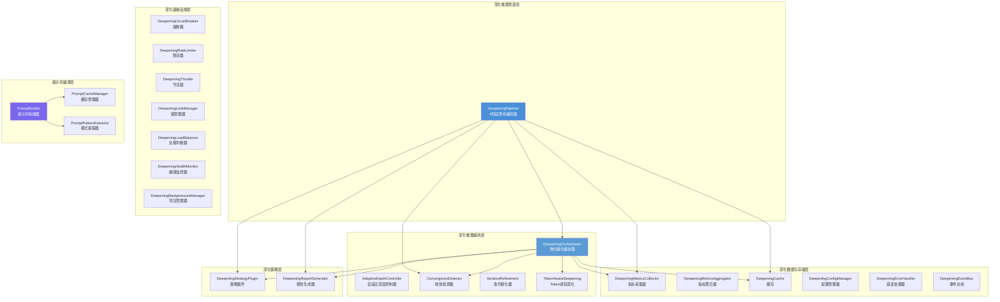
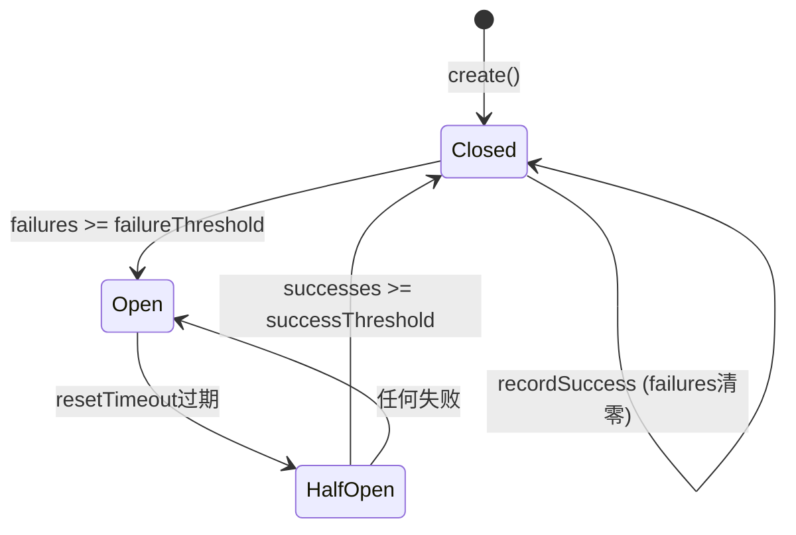
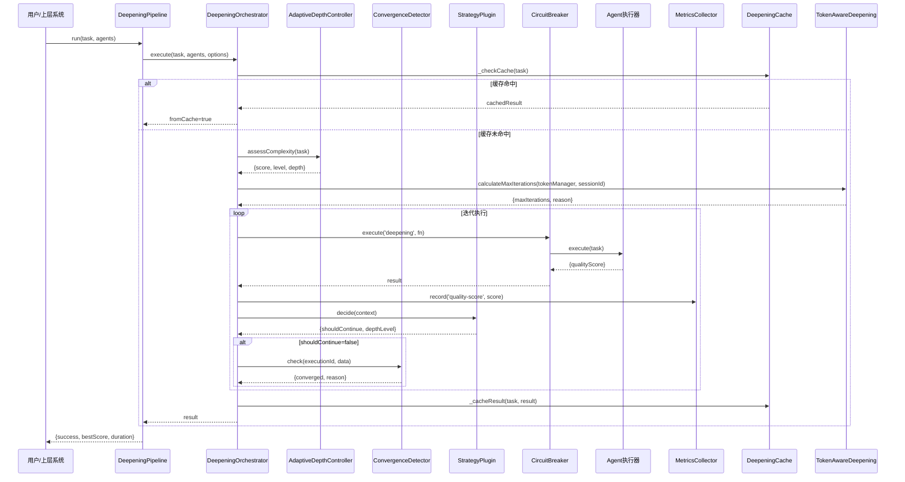

# 模块详解 — 深化推理子系统

> **版本**：2.73.4
> **路径**：`src/runtime/deepening/`（核心 50+ 文件）+ `src/runtime/prompt/`（提示词编译 3 文件）
> **核心职责**：通过多轮迭代精化提升AI输出质量，支持收敛检测、熔断容错、负载均衡、Token预算感知、自适应深度控制与提示词编译优化
> **组件数量**：深化推理 50+ 文件 + 提示词编译 4 文件

---

## 目录

- [第一部分：架构概览](#第一部分架构概览)
  - [概述](#概述)
  - [设计原则](#设计原则)
  - [模块清单](#模块清单)
  - [模块协作关系图](#模块协作关系图)
  - [关键依赖关系](#关键依赖关系)
- [第二部分：深化推理核心模块](#第二部分深化推理核心模块)
  - [1. DeepeningBase — 深化基类](#1-deepeningbase--深化基类)
  - [2. DeepeningPipeline — 深化管道](#2-deepeningpipeline--深化管道)
  - [3. DeepeningOrchestrator — 深化编排器](#3-deepeningorchestrator--深化编排器)
  - [4. AdaptiveDepthController — 自适应深度控制器](#4-adaptivedepthcontroller--自适应深度控制器)
  - [5. ConvergenceDetector — 收敛检测器](#5-convergencedetector--收敛检测器)
  - [6. IterativeRefinement — 迭代精化器](#6-iterativerefinement--迭代精化器)
  - [7. TokenAwareDeepening — Token感知深化](#7-tokenawaredeepening--token感知深化)
- [第三部分：深化基础设施模块](#第三部分深化基础设施模块)
  - [8. DeepeningCircuitBreaker — 熔断器](#8-deepeningcircuitbreaker--熔断器)
  - [9. DeepeningRateLimiter — 多维度限流器](#9-deepeningratelimiter--多维度限流器)
  - [10. DeepeningThrottle — 节流器](#10-deepeningthrottle--节流器)
  - [11. DeepeningLockManager — 锁管理器](#11-deepeninglockmanager--锁管理器)
  - [12. DeepeningLoadBalancer — 负载均衡器](#12-deepeningloadbalancer--负载均衡器)
  - [13. DeepeningHealthMonitor — 健康监控器](#13-deepeninghealthmonitor--健康监控器)
  - [14. DeepeningBackpressureManager — 背压管理器](#14-deepeningbackpressuremanager--背压管理器)
- [第四部分：深化数据与存储模块](#第四部分深化数据与存储模块)
  - [15. DeepeningMetricsCollector — 指标采集器](#15-deepeningmetricscollector--指标采集器)
  - [16. DeepeningMetricsAggregator — 指标聚合器](#16-deepeningmetricsaggregator--指标聚合器)
  - [17. DeepeningCache — 缓存](#17-deepeningcache--缓存)
  - [18. DeepeningConfigManager — 配置管理器](#18-deepeningconfigmanager--配置管理器)
  - [19. DeepeningErrorHandler — 错误处理器](#19-deepeningerrorhandler--错误处理器)
  - [20. DeepeningEventBus — 事件总线](#20-deepeningeventbus--事件总线)
- [第五部分：深化推理策略模块](#第五部分深化推理策略模块)
  - [21. DeepeningStrategyPlugin — 策略插件](#21-deepeningstrategyplugin--策略插件)
  - [22. DeepeningReportGenerator — 报告生成器](#22-deepeningreportgenerator--报告生成器)
- [第六部分：提示词编译子系统](#第六部分提示词编译子系统)
  - [23. PromptBuilder — 提示词构建器](#23-promptbuilder--提示词构建器)
  - [24. PromptCacheManager — 提示词缓存管理器](#24-promptcachemanager--提示词缓存管理器)
  - [25. PromptPatternExtractor — 提示词模式提取器](#25-promptpatternextractor--提示词模式提取器)
- [端到端使用示例](#端到端使用示例)
- [相关文档](#相关文档)

---

# 第一部分：架构概览

## 概述

深化推理子系统（Deepening Subsystem）是Harness Engineering框架中"迭代深化推理"能力的核心实现，位于`src/runtime/deepening/`目录下，包含50+核心模块。该子系统通过多轮迭代精化提升AI输出质量，涵盖管道编排、迭代执行、收敛检测、熔断容错、数据验证、负载均衡、健康监控、循环调度、Token预算感知、自适应深度控制、限流节流、锁管理、背压控制、指标采集聚合、配置管理、错误处理、事件总线、策略插件、报告生成等完整能力。

提示词编译子系统（Prompt Subsystem）位于`src/runtime/prompt/`目录下，包含3个核心模块，为深化推理提供提示词构建、缓存优化与模式学习能力。

核心设计理念：
- **迭代精化**：通过多轮Agent执行逐步提升输出质量，直至收敛或达到预算上限
- **容错自愈**：熔断器模式保护深化执行免受级联故障影响，错误处理器支持重试与降级
- **预算感知**：Token预算约束下动态调整深化深度和迭代次数
- **多维收敛**：质量阈值、改进率、稳定性方差、维度平衡、质量退化五维收敛检测
- **自适应深度**：根据任务复杂度关键词信号自动评估深度级别
- **提示词优化**：静态前缀+动态后缀分离，SHA-256哈希缓存失效，模式提取自动注入

## 设计原则

1. **DeepeningBase继承体系**：所有深化组件均继承`DeepeningBase`，统一获得依赖注入、健康检查、关闭生命周期管理能力
2. **EventEmitter事件驱动**：组件间通过事件解耦通信，支持发布/订阅模式
3. **防御性编码**：所有外部输入均经过校验，关键操作使用`safeExecute`/`safeCall`包装
4. **容量限制**：所有集合类使用`BoundedMap`/`BoundedArray`/`RingBuffer`，防止内存泄漏
5. **优雅关闭**：通过`ShutdownMixin`混入实现统一关闭协议，确保资源正确释放

## 模块清单

### 深化推理核心模块（7个）

| 模块 | 源文件 | 说明 |
|------|--------|------|
| DeepeningBase | deepening-base.js | 深化基类，依赖注入、健康检查、关闭生命周期，28个可挂载依赖定义 |
| DeepeningPipeline | deepening-pipeline.js | 深化管道主入口，4阶段管线（初始化→缓存检查→迭代执行→完成），串联7个子模块 |
| DeepeningOrchestrator | deepening-orchestrator.js | 深化推理编排器，迭代精化、质量评分、收敛检测，支持8种可挂载子模块 |
| AdaptiveDepthController | adaptive-depth-controller.js | 自适应深度控制器，关键词信号四维评估，映射到4个深度级别 |
| ConvergenceDetector | convergence-detector.js | 收敛检测器，质量阈值/稳定性/退化/维度平衡四维检测 |
| IterativeRefinement | iterative-refinement.js | 迭代精化器，执行-审查-反馈循环，支持单次重试 |
| TokenAwareDeepening | token-aware-deepening.js | Token预算感知深化策略，动态调整迭代次数和深度级别 |

### 深化基础设施模块（7个）

| 模块 | 源文件 | 说明 |
|------|--------|------|
| DeepeningCircuitBreaker | deepening-circuit-breaker.js | 熔断器，Closed→Open→Half-Open三态转换，命名熔断器管理 |
| DeepeningRateLimiter | deepening-rate-limiter.js | 多维度限流器，并发/时间窗口/令牌桶三维度限流 |
| DeepeningThrottle | deepening-throttle.js | 节流器，滑动窗口每键速率限制 |
| DeepeningLockManager | deepening-lock-manager.js | 锁管理器，可重入锁、TTL过期、自动回收 |
| DeepeningLoadBalancer | deepening-load-balancer.js | 负载均衡器，轮询/加权随机/最少连接/随机选择四种策略 |
| DeepeningHealthMonitor | deepening-health-monitor.js | 健康监控器（已废弃，推荐HealthChecker），聚合状态计算 |
| DeepeningBackpressureManager | deepening-backpressure-manager.js | 背压管理器，四级压力等级，高低水位线自动暂停/恢复 |

### 深化数据与存储模块（6个）

| 模块 | 源文件 | 说明 |
|------|--------|------|
| DeepeningMetricsCollector | deepening-metrics-collector.js | 时序指标采集器，质量分数/收敛率/迭代时长/Agent性能 |
| DeepeningMetricsAggregator | deepening-metrics-aggregator.js | 指标聚合器，sum/avg/p95/p99统计，环形缓冲区时序存储 |
| DeepeningCache | deepening-cache.js | 质量感知结果缓存，WeakMap键缓存，覆盖时保留高质量条目 |
| DeepeningConfigManager | deepening-config-manager.js | 配置管理器，类型化定义、不可变性、验证器、变更监听、JSON导入导出 |
| DeepeningErrorHandler | deepening-error-handler.js | 错误处理器，自动分类、重试策略、降级处理器 |
| DeepeningEventBus | deepening-event-bus.js | 事件总线（已废弃，推荐EventBus），通配符、优先级、拦截器、死信队列 |

### 深化推理策略模块（2个）

| 模块 | 源文件 | 说明 |
|------|--------|------|
| DeepeningStrategyPlugin | deepening-strategy-plugin.js | 可插拔策略决策引擎，5种策略类型 |
| DeepeningReportGenerator | deepening-report-generator.js | 报告生成器，6种报告类型 |

### 提示词编译模块（3+1个）

| 模块 | 源文件 | 说明 |
|------|--------|------|
| PromptBuilder | prompt-builder.js | 提示词构建器，静态前缀+动态后缀分离，SHA-256哈希缓存失效 |
| PromptCacheManager | prompt-cache-manager.js | 提示词缓存管理器，Anthropic cache_control标记，命中率统计 |
| PromptPatternExtractor | prompt-pattern-extractor.js | 提示词模式提取器，从执行历史提取高效模式，自动推荐注入 |
| index.js | index.js | 模块导出入口 |

## 模块协作关系图



## 关键依赖关系

```
DeepeningPipeline
  ├── DeepeningOrchestrator (委托执行)
  │     ├── DeepeningMetricsCollector (指标记录)
  │     ├── DeepeningCache (结果缓存)
  │     ├── DeepeningStrategyPlugin (策略决策)
  │     ├── DeepeningReportGenerator (报告生成)
  │     ├── ConvergenceDetector (收敛检测)
  │     ├── QualityScorer (质量评分)
  │     ├── EventStore (事件存储)
  │     └── OodaLoop (OODA决策闭环)
  ├── DeepeningMetricsCollector
  ├── DeepeningCache
  ├── DeepeningStrategyPlugin
  ├── DeepeningReportGenerator
  ├── ConvergenceDetector
  └── QualityScorer

PromptBuilder
  ├── PromptCacheManager (缓存标记)
  └── PromptPatternExtractor (模式注入)
```

---

# 第二部分：深化推理核心模块

## 1. DeepeningBase — 深化基类

**文件**：`deepening-base.js`

### 概述

DeepeningBase是深化推理子系统的抽象基类，所有深化组件均继承此类。提供依赖注入（attach方法）、健康检查、关闭生命周期管理和废弃警告工具。

### 核心职责

- 统一28个可挂载依赖的`attach*`方法自动生成
- 健康检查（`isHealthy()`）
- 关闭生命周期管理（`ShutdownMixin`混入）
- 废弃组件警告（同一类名仅警告一次）

### 类定义与接口

```javascript
class DeepeningBase extends EventEmitter {
  static _deprecationWarnedSet = new Set();
  static ATTACHABLE_DEPS = ATTACH_DEFS; // 28个可挂载依赖定义

  constructor(options);
  attach(name, dep);           // 通用依赖注入
  isHealthy();                 // 健康检查
  acquire(_key);               // 获取资源锁（基类默认true）
  release(_key);               // 释放资源锁（基类默认true）
  getAvailability();           // 获取可用性信息
  getStats();                  // 获取统计信息
  _onShutdown();               // 关闭清理回调
}
```

### 可挂载依赖列表（28个）

| attach方法 | 属性键 | 说明 |
|-----------|--------|------|
| `attachSqliteStore` | `_sqliteStore` | SQLite存储 |
| `attachSignalPersistence` | `_signalPersistence` | 信号持久化 |
| `attachPatchApproval` | `_patchApproval` | 补丁审批 |
| `attachSessionManager` | `_sessionManager` | 会话管理器 |
| `attachPlanPersistence` | `_planPersistence` | 计划持久化 |
| `attachDeepeningOrchestrator` | `_deepeningOrchestrator` | 深化编排器 |
| `attachSubagentExecutor` | `_subagentExecutor` | 子Agent执行器 |
| `attachThoughtRetrieverCycle` | `_thoughtRetrieverCycle` | 思维检索循环 |
| `attachCausalDataBus` | `_causalDataBus` | 因果数据总线 |
| `attachModelSelector` | `_modelSelector` | 模型选择器 |
| `attachRBACEnforcer` | `_rbacEnforcer` | RBAC执行器 |
| `attachContextManager` | `_contextManager` | 上下文管理器 |
| `attachQualityScorer` | `_qualityScorer` | 质量评分器 |
| `attachConvergenceDetector` | `_convergenceDetector` | 收敛检测器 |
| `attachScheduler` | `_scheduler` | 调度器 |
| `attachVectorIndex` | `_vectorIndex` | 向量索引 |
| `attachConfigCausalValidator` | `_configCausalValidator` | 因果配置验证器 |
| `attachCausalBufferManager` | `_causalBufferManager` | 因果缓冲管理器 |
| `attachSkillRouter` | `_skillRouter` | 技能路由器 |
| `attachPhaseContextInjector` | `_phaseContextInjector` | 阶段上下文注入器 |
| `attachHealthChecker` | `_healthChecker` | 健康检查器 |
| `attachMetricsCollector` | `_metricsCollector` | 指标采集器 |
| `attachCache` | `_cache` | 缓存 |
| `attachStrategyPlugin` | `_strategyPlugin` | 策略插件 |
| `attachReportGenerator` | `_reportGenerator` | 报告生成器 |
| `attachEventStore` | `_eventStore` | 事件存储 |
| `attachGeneratorVerifier` | `_generatorVerifier` | 生成器验证器 |
| `attachOodaLoop` | `_oodaLoop` | OODA决策闭环 |

### 使用示例

```javascript
const DeepeningBase = require('./deepening-base');

class MyComponent extends DeepeningBase {
  constructor(options) {
    super(options);
    // 自动获得所有attach*方法
  }
}

const comp = new MyComponent();
comp.attach('sqliteStore', sqliteStoreInstance);
comp.attachSqliteStore(sqliteStoreInstance); // 等效写法
```

---

## 2. DeepeningPipeline — 深化管道

**文件**：`deepening-pipeline.js`

### 概述

DeepeningPipeline是深化推理的主入口管道，串联7个子模块，实现从初始化到缓存检查到迭代执行到完成的完整深化推理流水线。支持自动初始化和手动初始化两种模式。

### 核心职责

- 4阶段管线编排：INIT → CACHE_CHECK → ITERATIVE_EXECUTION → COMPLETE
- 自动创建并挂载7个子模块（编排器、指标采集器、缓存、策略插件、报告生成器、收敛检测器、质量评分器）
- 将任务和Agent委托给内部编排器执行
- 管道运行统计与报告生成

### 类定义与接口

```javascript
class DeepeningPipeline extends DeepeningBase {
  static PIPELINE_STAGES = {
    INIT: 'init',
    CACHE_CHECK: 'cache-check',
    ITERATIVE_EXECUTION: 'iterative-execution',
    COMPLETE: 'complete'
  };

  constructor(config);           // autoInitialize默认true
  initialize();                  // 初始化管道，创建并挂载所有子模块
  run(task, agents);             // 运行深化推理管道
  getModule(name);               // 按名称获取子模块实例
  generateReport(type);          // 生成指定类型报告
  getStats();                    // 获取管道统计信息
  _onShutdown();                 // 关闭时依次关闭所有子模块
}
```

### 关键方法详解

#### `constructor(config)`

| 参数 | 类型 | 默认值 | 说明 |
|------|------|--------|------|
| `config.autoInitialize` | boolean | `true` | 是否自动初始化 |
| `config.maxIterations` | number | `4` | 最大迭代次数 |

#### `run(task, agents)`

运行深化推理管道，将任务和Agent委托给内部编排器执行。

**参数**：
- `task` — 任务对象
- `agents` — Agent列表或映射对象

**返回值**：
```javascript
{
  success: boolean,
  pipelineId: string,      // 时间戳ID
  duration: number,        // 执行时长（毫秒）
  depthLevel: string,      // 深化深度级别
  agentsUsed: string[],    // 使用的Agent列表
  totalAgentCalls: number, // 总Agent调用次数
  qualityHistory: number[],// 质量历史
  bestScore: number,       // 最佳分数
  fromCache: boolean,      // 是否来自缓存
  error: string            // 错误信息
}
```

### 事件

| 事件名 | 触发时机 | 数据 |
|--------|---------|------|
| `pipeline-initialized` | 管道初始化完成 | 无 |
| `pipeline-start` | 管道运行开始 | `{task}` |
| `pipeline-complete` | 管道运行完成 | 完整结果对象 |

### 使用示例

```javascript
const DeepeningPipeline = require('./deepening-pipeline');

const pipeline = new DeepeningPipeline({ maxIterations: 10 });
// 自动初始化

const result = await pipeline.run(
  { id: 'task-1', description: '优化算法' },
  [{ id: 'agent-1', execute: async (t) => ({ qualityScore: 0.9 }) }]
);

console.log(result.success, result.bestScore, result.duration);
```

---

## 3. DeepeningOrchestrator — 深化编排器

**文件**：`deepening-orchestrator.js`

### 概述

DeepeningOrchestrator是深化推理的核心编排器，负责迭代精化、质量评分与收敛检测。支持8种可挂载子模块，多Agent并行/串行执行、缓存命中、策略决策早停、收敛检测终止和思维检索循环。

### 核心职责

- 多Agent路由与并行/串行执行
- 缓存命中检查（质量分数≥收敛阈值时直接返回）
- 迭代执行与早停决策（策略插件→收敛检测器→收敛阈值三层判断）
- OODA决策闭环集成（威胁等级>0.8时中断迭代）
- 思维检索循环（ThoughtRetrieverCycle）
- 执行日志管理与统计

### 类定义与接口

```javascript
class DeepeningOrchestrator extends DeepeningBase {
  constructor(options);
  execute(task, agents, options);        // 执行深化推理任务
  attachMetricsCollector(mc);            // 挂载指标采集器
  attachCache(c);                        // 挂载缓存
  attachStrategyPlugin(sp);              // 挂载策略插件
  attachReportGenerator(rg);             // 挂载报告生成器
  attachConvergenceDetector(cd);         // 挂载收敛检测器
  attachQualityScorer(qs);               // 挂载质量评分器
  attachEventStore(es);                  // 挂载事件存储
  attachOodaLoop(oodaLoop);              // 挂载OODA闭环
  generateReport(type, data);            // 生成报告
  getExecutionLog();                     // 获取执行日志
  getStats();                            // 获取统计信息
  _onShutdown();                         // 关闭清理
}
```

### 关键方法详解

#### `execute(task, agents, options)`

执行深化推理任务，支持缓存命中、多Agent路由、迭代执行、思维检索循环。

**参数**：
- `task` — 任务对象，需包含`id`属性
- `agents` — Agent列表或映射对象，每个Agent需实现`execute`方法
- `options.depthLevel` — 深化深度级别（quick/standard/deep/intensive）
- `options.multiAgentRouter` — 多Agent路由器实例

**返回值**：
```javascript
{
  success: boolean,
  depthLevel: string,
  agentsUsed: string[],
  totalAgentCalls: number,
  qualityHistory: number[],
  bestScore: number,
  fromCache: boolean,
  thoughtCycle: {
    distilled: number,
    stored: number,
    cycleComplete: boolean,
    quality: number
  },
  error: string
}
```

**执行流程**：
1. 检查关闭状态
2. 发出`execution-start`事件
3. 检查缓存命中
4. 多Agent路由筛选
5. 迭代执行（含OODA中断检查）
6. 思维检索循环
7. 缓存结果、记录指标、生成报告
8. 发出`execution-complete`事件

#### `_shouldStopIterating(iteration, result, task)`

三层早停判断：
1. **策略插件**：`strategyPlugin.decide()` 返回 `shouldContinue: false`
2. **收敛检测器**：`convergenceDetector.check()` 返回 `converged: true`
3. **收敛阈值**：最新质量分数 ≥ `convergenceThreshold`

### 配置选项

| 配置 | 类型 | 默认值 | 说明 |
|------|------|--------|------|
| `defaultDepthLevel` | string | `'standard'` | 默认深化深度级别 |
| `maxIterations` | number | 按深度级别 | 最大迭代次数（quick=1, standard=2, intensive=4） |
| `convergenceThreshold` | number | `0.85` | 收敛阈值 |
| `parallelAgentExecution` | boolean | `false` | 是否并行执行Agent |

### 事件

| 事件名 | 触发时机 | 数据 |
|--------|---------|------|
| `execution-start` | 深化执行开始 | `{depthLevel}` |
| `execution-complete` | 深化执行完成 | `{depthLevel, fromCache?}` |
| `execution-error` | 深化执行出错 | `{error, task}` |
| `agent-error` | Agent执行出错 | `{agentId, error}` |
| `route-fallback` | 多Agent路由失败回退 | `{reason}` |

---

## 4. AdaptiveDepthController — 自适应深度控制器

**文件**：`adaptive-depth-controller.js`

### 概述

AdaptiveDepthController通过关键词信号在范围、风险、推理、依赖深度四个维度评估任务复杂度，将复杂度分数映射到四个深度级别，控制深化推理的迭代次数。

### 核心职责

- 四维复杂度评估：范围(scope)、风险(risk)、推理(reasoning)、依赖深度(dependencyDepth)
- 关键词信号检测（中英文双语支持）
- 复杂度分数到深度级别的映射

### 类定义与接口

```javascript
class AdaptiveDepthController extends DeepeningBase {
  static DEPTH_LEVELS = { QUICK: 1, STANDARD: 2, DEEP: 3, INTENSIVE: 4 };

  assessComplexity(task);       // 评估任务复杂度
  getRecommendedDepth(task);    // 获取推荐深度数值（1-4）
  getRecommendedLevel(task);    // 获取推荐深度级别名称
  getStats();                   // 获取统计信息
}
```

### 关键方法详解

#### `assessComplexity(task)`

**参数**：
- `task.description` / `task.prompt` — 任务描述文本
- `task.depends_on` — 依赖任务列表

**返回值**：
```javascript
{
  score: number,           // 复杂度分数（0-1）
  level: string,           // 深度级别名称
  depth: number,           // 深度数值（1-4）
  signals: {
    scope: number,         // 范围信号（0-1）
    risk: number,          // 风险信号（0-1）
    reasoning: number,     // 推理信号（0-1）
    dependencyDepth: number // 依赖深度信号（0-1）
  }
}
```

**复杂度计算公式**：
```
score = scope × 0.35 + risk × 0.35 + reasoning × 0.2 + dependencyDepth × 0.1
```

**深度级别映射**：

| 分数范围 | 级别 | 深度 |
|---------|------|------|
| [0, 0.25) | quick | 1 |
| [0.25, 0.5) | standard | 2 |
| [0.5, 0.75) | deep | 3 |
| [0.75, 1] | intensive | 4 |

### 关键词列表

| 维度 | 中文关键词 | 英文关键词 |
|------|-----------|-----------|
| 范围 | 构建、系统、平台、架构、重构、全栈 | design, system, platform, refactor |
| 风险 | 安全、关键、生产、合规 | security, critical, production, compliance |
| 推理 | 推理、分析、优化、决策 | reasoning, analysis, optimize, decision |

### 事件

| 事件名 | 触发时机 | 数据 |
|--------|---------|------|
| `complexity-assessed` | 复杂度评估完成 | `{score}` |

---

## 5. ConvergenceDetector — 收敛检测器

**文件**：`convergence-detector.js`

### 概述

ConvergenceDetector通过评估质量分数、改进率、稳定性方差、维度平衡和质量退化来判断迭代深化过程是否已收敛，向编排器发出收敛信号和建议。

### 核心职责

- 质量阈值判定
- 最大迭代次数检测
- 稳定性检测（窗口内方差分析）
- 质量退化检测
- 维度平衡检测

### 类定义与接口

```javascript
class ConvergenceDetector extends DeepeningBase {
  static SIGNAL_TYPES = {
    QUALITY_SCORE: 'quality-score',
    IMPROVEMENT_RATE: 'improvement-rate',
    STABILITY: 'stability'
  };

  static DEFAULT_CONFIG = {
    qualityThreshold: 0.85,
    maxIterations: 10,
    minImprovementRate: 0.01,
    stabilityVariance: 0.01,
    stabilityWindow: 3,
    coverageThreshold: 0.8,
    dimensionBalanceThreshold: 0.3,
    qualityDegradationThreshold: 0.1
  };

  check(executionId, data);     // 执行收敛检测
  reset(executionId);           // 重置指定执行的历史记录
  getStats();                   // 获取统计信息
}
```

### 关键方法详解

#### `check(executionId, data)`

**参数**：
- `executionId` — 执行ID
- `data.qualityScore` — 当前质量分数
- `data.dimensions` — 维度评分对象（可选）

**返回值**：
```javascript
{
  converged: boolean,      // 是否已收敛
  reason: string,          // 收敛原因
  signals: Object,         // 信号对象
  recommendation: string   // 建议（sufficient/increase-depth/decrease-depth/increase-depth-or-abort）
}
```

**检测流程**：
1. 质量阈值判定：`qualityScore >= qualityThreshold` → `quality-threshold-met`
2. 最大迭代检测：`history.length >= maxIterations` → `max-iterations-reached`
3. 稳定性检测：窗口内方差 < `stabilityVariance`
   - 平均质量 ≥ 阈值×0.9 → `stable-and-sufficient`
   - 平均质量 < 阈值×0.9 → `plateau-detected`（建议增加深度）
4. 质量退化检测：当前分数 < 上次分数 - `qualityDegradationThreshold` → `quality-degrading`（建议降低深度）
5. 未收敛 → `not-converged`

### 配置选项

| 配置 | 默认值 | 说明 |
|------|--------|------|
| `qualityThreshold` | 0.85 | 质量收敛阈值 |
| `maxIterations` | 10 | 最大迭代次数 |
| `stabilityVariance` | 0.01 | 稳定性方差阈值 |
| `stabilityWindow` | 3 | 稳定性检测窗口大小 |
| `dimensionBalanceThreshold` | 0.3 | 维度平衡阈值 |
| `qualityDegradationThreshold` | 0.1 | 质量退化阈值 |
| `maxHistoryExecutions` | 100 | 最大历史执行记录数 |

### 事件

| 事件名 | 触发时机 | 数据 |
|--------|---------|------|
| `convergence-checked` | 收敛检测完成 | `{signals}` |

---

## 6. IterativeRefinement — 迭代精化器

**文件**：`iterative-refinement.js`

### 概述

IterativeRefinement通过多轮执行-审查-反馈循环逐步提升输出质量。每轮调用执行器执行任务，由审查器评估输出质量，不达标时将反馈注入任务上下文继续下一轮，直到质量阈值满足或最大精化轮次耗尽。

### 核心职责

- 执行-审查-反馈循环
- 单次重试支持（执行失败时自动重试一次）
- 审查反馈注入任务上下文
- 健康检查与关闭中断

### 类定义与接口

```javascript
class IterativeRefinement extends DeepeningBase {
  static DEFAULT_MAX_REFINEMENTS = 5;
  static DEFAULT_QUALITY_THRESHOLD = 0.8;

  refine(executor, task, reviewer);  // 执行迭代精化流程
  getStats();                        // 获取统计信息
}
```

### 关键方法详解

#### `refine(executor, task, reviewer)`

**参数**：
- `executor` — 执行器实例，需实现`execute`方法
- `task` — 任务对象
- `reviewer` — 审查器函数，签名 `(result, task) => {approved, qualityScore, feedback}`

**返回值**：
```javascript
{
  success: boolean,       // 是否成功
  rounds: number,         // 实际执行轮次
  converged: boolean,     // 是否收敛（审查器批准）
  result: Object,         // 最终执行结果
  error: string           // 错误信息
}
```

**退出原因**：
| 原因 | 说明 |
|------|------|
| `approved` | 审查器批准 |
| `no_reviewer` | 无审查器，执行一轮后退出 |
| `max_refinements` | 达到最大精化轮次 |
| `unhealthy` | 组件不健康 |
| `shutdown` | 正在关闭 |
| `review_error` | 审查器出错 |

### 事件

| 事件名 | 触发时机 | 数据 |
|--------|---------|------|
| `refinement-round` | 每轮精化完成 | `{round}` |
| `review-error` | 审查器异常 | `{round, error}` |

---

## 7. TokenAwareDeepening — Token感知深化

**文件**：`token-aware-deepening.js`

### 概述

TokenAwareDeepening根据剩余Token预算计算最大迭代次数，跟踪每轮迭代的Token消耗和质量效率，并根据任务复杂度和预算可用性推荐深化深度级别。

### 核心职责

- Token预算计算最大迭代次数
- 迭代Token消耗与效率追踪
- 预算可支付性检查
- 深度级别推荐

### 类定义与接口

```javascript
class TokenAwareDeepening extends DeepeningBase {
  static DEFAULT_BUDGET_RATIO = 0.7;
  static DEFAULT_MIN_BUDGET_REMAINING = 1000;

  calculateMaxIterations(tokenManager, sessionId);  // 计算最大迭代次数
  canAffordIteration(tokenManager, sessionId, tokenCost); // 检查预算可支付性
  recordIterationCost(sessionId, iteration, tokensUsed, qualityScore); // 记录迭代消耗
  getEfficiencyReport(sessionId);                   // 获取效率报告
  recommendDepth(tokenManager, sessionId, complexity); // 推荐深度级别
  getStats();                                        // 获取统计信息
}
```

### 关键方法详解

#### `calculateMaxIterations(tokenManager, sessionId)`

根据Token预算计算最大迭代次数。预算不足时返回1次迭代。

**计算逻辑**：
1. 获取`tokenManager.getUsage(sessionId)`获取剩余预算
2. 若`minBudgetRemaining`为比例（0-1），检查剩余比例
3. 若`minBudgetRemaining`为绝对值，检查剩余量 < 最低值×0.1
4. 预算充足时：`maxIterations = min(remaining / 2000, maxIterationCap)`

#### `recommendDepth(tokenManager, sessionId, complexity)`

**返回值**：
```javascript
{
  recommendedLevel: string,  // quick/standard/deep/intensive
  maxIterations: number      // 最大迭代次数
}
```

**复杂度到级别映射**：
| 复杂度 | 推荐级别 |
|--------|---------|
| < 0.25 | quick |
| [0.25, 0.5] | standard |
| (0.5, 0.7] | deep |
| > 0.7 | intensive |

### 事件

| 事件名 | 触发时机 | 数据 |
|--------|---------|------|
| `iteration-cost-recorded` | 记录迭代消耗 | `{sessionId, tokensUsed, efficiency}` |

---

# 第三部分：深化基础设施模块

## 8. DeepeningCircuitBreaker — 熔断器

**文件**：`deepening-circuit-breaker.js`

### 概述

DeepeningCircuitBreaker实现熔断器模式，为深化执行提供容错保护。管理命名熔断器的Closed→Open→Half-Open状态转换，支持自动恢复、强制状态覆盖和安全异步执行包装。

### 核心职责

- 命名熔断器创建与管理
- 三态转换：Closed（正常）→ Open（熔断）→ Half-Open（试探）
- 基于失败/成功阈值的自动状态转换
- 安全异步执行包装（`execute`方法）
- 强制状态覆盖

### 类定义与接口

```javascript
class DeepeningCircuitBreaker extends DeepeningBase {
  static CIRCUIT_STATES = { CLOSED: 'closed', OPEN: 'open', HALF_OPEN: 'half_open' };

  create(name, options);          // 创建命名熔断器
  createCircuit(name, options);   // 别名方法
  remove(name);                   // 移除熔断器
  getState(name);                 // 获取当前状态
  tryRecover(name);               // 尝试恢复（Open→Half-Open）
  getCircuitInfo(name);           // 获取详细信息
  getCircuitNames();              // 获取所有名称
  getByState(state);              // 按状态获取列表
  recordSuccess(name);            // 记录成功
  recordFailure(name);            // 记录失败
  execute(name, fn);              // 安全异步执行
  forceOpen(name);                // 强制打开
  forceClose(name);               // 强制关闭
  forceHalfOpen(name);            // 强制半开
  reset(name);                    // 重置指定熔断器
  resetAll();                     // 重置所有
  getStats();                     // 获取统计信息
}
```

### 状态转换图



### 配置选项

| 配置 | 默认值 | 说明 |
|------|--------|------|
| `maxCircuits` | 100 | 最大熔断器数量 |
| `failureThreshold` | 5 | 触发熔断的连续失败次数 |
| `successThreshold` | 3 | 半开恢复到关闭的连续成功次数 |
| `resetTimeout` | 30000 | Open→Half-Open超时（毫秒） |
| `maxHalfOpenCalls` | 1 | 半开状态最大试探调用数 |

### 事件

| 事件名 | 触发时机 | 数据 |
|--------|---------|------|
| `created` | 熔断器创建 | `{name, state}` |
| `removed` | 熔断器移除 | `{name}` |
| `stateChanged` | 状态变更 | `{from, to}` |
| `circuit-state-change` | 状态变更 | `{name, from, to}` |
| `success` | 记录成功 | `{name}` |
| `failure` | 记录失败 | `{name, failureCount}` |
| `rejected` | 请求被拒绝 | `{name}` |

### 使用示例

```javascript
const breaker = new DeepeningCircuitBreaker({
  failureThreshold: 5,
  resetTimeout: 30000
});

breaker.create('api-calls', { failureThreshold: 3 });

try {
  const result = await breaker.execute('api-calls', async () => {
    return await riskyOperation();
  });
} catch (err) {
  // 熔断器打开或半开容量已满
  console.log('Circuit is open:', err.message);
}
```

---

## 9. DeepeningRateLimiter — 多维度限流器

**文件**：`deepening-rate-limiter.js`

### 概述

DeepeningRateLimiter为深化操作提供并发、时间窗口和令牌桶三维度限流能力。强制执行并发执行上限、每分钟和每小时的Agent速率窗口、以及可配置填充间隔的令牌桶节流。

### 核心职责

- 并发执行数限制
- 每分钟/每小时时间窗口限流
- 令牌桶限流（可配置填充速率和容量）
- 按Agent自定义限制

### 类定义与接口

```javascript
class DeepeningRateLimiter extends DeepeningBase {
  createBucket(name, options);      // 创建命名令牌桶
  removeBucket(name);               // 移除令牌桶
  getBucketNames();                 // 获取所有桶名称
  getBucket(name);                  // 获取桶状态
  tryConsume(name, count);          // 消费令牌
  resetBucket(name);                // 重置桶
  updateRate(name, rate);           // 更新填充速率
  acquire(executionId, agentId);    // 获取执行许可
  release(executionId);             // 释放执行许可
  setAgentLimit(agentId, limits);   // 设置Agent自定义限制
  removeAgentLimit(agentId);        // 移除Agent限制
  getAvailability();                // 获取可用性信息
  getStats();                       // 获取统计信息
}
```

### 配置选项

| 配置 | 默认值 | 说明 |
|------|--------|------|
| `maxConcurrent` | 10 | 最大并发执行数 |
| `maxPerMinute` | 60 | 每分钟最大请求数 |
| `maxPerHour` | 1000 | 每小时最大请求数 |
| `maxAgentLimits` | 200 | 最大Agent自定义限制数 |
| `defaultRate` | 10 | 令牌桶默认填充速率 |
| `defaultCapacity` | 10 | 令牌桶默认容量 |
| `refillInterval` | 1000 | 令牌桶填充间隔（毫秒） |
| `maxBuckets` | 100 | 最大令牌桶数量 |

### 事件

| 事件名 | 触发时机 | 数据 |
|--------|---------|------|
| `bucketCreated` | 令牌桶创建 | `{name, rate, capacity}` |
| `bucketRemoved` | 令牌桶移除 | `{name}` |
| `allowed` | 请求被允许 | `{name, tokensRemaining}` |
| `denied` | 请求被拒绝 | `{name, retryAfter}` |
| `bucketReset` | 令牌桶重置 | `{name}` |
| `rateUpdated` | 速率更新 | `{name, newRate}` |

---

## 10. DeepeningThrottle — 节流器

**文件**：`deepening-throttle.js`

### 概述

DeepeningThrottle使用滑动窗口计数器强制执行可配置的每键速率限制，自动过期陈旧条目，维护获取和限流的聚合统计。

### 类定义与接口

```javascript
class DeepeningThrottle extends DeepeningBase {
  acquire(key);           // 获取限流许可
  release(key);           // 释放限流许可
  getCount(key);          // 获取当前计数
  getRemaining(key);      // 获取剩余可用次数
  isThrottled(key);       // 检查是否被限流
  resetKey(key);          // 重置指定键
  resetAll();             // 重置所有键
  reset(key);             // 重置（指定键或全部）
  getStats();             // 获取统计信息
  isHealthy();            // 健康检查
}
```

### 配置选项

| 配置 | 默认值 | 说明 |
|------|--------|------|
| `limit` | 10 | 每键速率限制 |
| `interval` | 10000 | 限流间隔（毫秒） |

### 事件

| 事件名 | 触发时机 | 数据 |
|--------|---------|------|
| `throttled` | 请求被限流 | `{key}` |
| `acquired` | 成功获取许可 | `{key}` |
| `released` | 许可释放 | `{key}` |

---

## 11. DeepeningLockManager — 锁管理器

**文件**：`deepening-lock-manager.js`

### 概述

DeepeningLockManager提供基于所有者的可重入锁获取/释放语义、可配置的逐锁超时、自动过期锁回收及强制释放能力。

### 类定义与接口

```javascript
class DeepeningLockManager extends DeepeningBase {
  acquire(resourceId, ownerId, options);  // 获取资源锁（可重入）
  release(resourceId, ownerId);           // 释放资源锁
  forceRelease(resourceId);               // 强制释放
  isLocked(resourceId);                   // 检查是否被锁定
  getLock(resourceId);                    // 获取锁信息
  getLocksByOwner(ownerId);              // 按所有者获取锁列表
  getExpiredLocks();                      // 获取过期锁列表
  releaseExpiredLocks();                  // 释放所有过期锁
  getStats();                             // 获取统计信息
}
```

### 配置选项

| 配置 | 默认值 | 说明 |
|------|--------|------|
| `defaultTimeout` | DEFAULT_PIPELINE_TIMEOUT_MS | 默认锁超时时间 |
| `maxLocks` | 1000 | 最大锁数量 |

### 事件

| 事件名 | 触发时机 | 数据 |
|--------|---------|------|
| `acquired` | 锁获取成功 | `{resourceId, ownerId, reentrant?}` |
| `denied` | 锁获取被拒绝 | `{resourceId, ownerId}` |
| `released` | 锁释放 | `{resourceId, ownerId, forced?}` |
| `expired` | 锁超时过期 | `{resourceId}` |

### 使用示例

```javascript
const lockManager = new DeepeningLockManager({ defaultTimeout: 60000 });

// 获取锁
if (lockManager.acquire('resource-1', 'agent-A', { timeout: 30000 })) {
  try {
    // 可重入获取
    lockManager.acquire('resource-1', 'agent-A'); // 返回true
    // 执行操作...
  } finally {
    lockManager.release('resource-1', 'agent-A');
    lockManager.release('resource-1', 'agent-A'); // 需要释放两次
  }
}
```

---

## 12. DeepeningLoadBalancer — 负载均衡器

**文件**：`deepening-load-balancer.js`

### 概述

DeepeningLoadBalancer使用四种策略在命名实例池中分配工作负载，追踪实例健康状态和活跃连接数，支持动态实例增删及不健康实例自动排除。

### 类定义与接口

```javascript
class DeepeningLoadBalancer extends DeepeningBase {
  static STRATEGIES = {
    ROUND_ROBIN: 'round_robin',
    WEIGHTED: 'weighted',
    LEAST_CONNECTIONS: 'least_connections',
    RANDOM: 'random'
  };

  createPool(name, options);        // 创建命名实例池
  getPoolNames();                   // 获取所有池名称
  addInstance(poolName, instanceId, options); // 添加实例
  select(poolName);                 // 选择实例
  release(poolName, instanceId);    // 释放连接
  markUnhealthy(poolName, instanceId); // 标记不健康
  markHealthy(poolName, instanceId);   // 标记健康
  removeInstance(poolName, instanceId); // 移除实例
  removePool(name);                 // 移除池
  getPoolInfo(name);                // 获取池信息
  getStats();                       // 获取统计信息
}
```

### 策略说明

| 策略 | 说明 |
|------|------|
| `round_robin` | 轮询策略，依次选择健康实例 |
| `weighted` | 加权随机策略，按权重随机选择 |
| `least_connections` | 最少连接策略，选择活跃连接最少的实例 |
| `random` | 随机选择策略 |

### 事件

| 事件名 | 触发时机 | 数据 |
|--------|---------|------|
| `poolCreated` | 池创建 | `{name, strategy}` |
| `instanceAdded` | 实例添加 | `{instance, weight}` |
| `selected` | 实例被选中 | `{pool, instance}` |
| `noHealthyInstance` | 无健康实例 | `{pool}` |
| `instanceHealthChanged` | 健康状态变更 | `{instance, healthy}` |
| `instanceRemoved` | 实例移除 | `{instance}` |
| `poolRemoved` | 池移除 | `{name}` |

---

## 13. DeepeningHealthMonitor — 健康监控器

**文件**：`deepening-health-monitor.js`

> ⚠️ **已废弃**：请使用 `runtime/infrastructure/health-checker` 中的 `HealthChecker` 替代

### 概述

DeepeningHealthMonitor注册命名健康检查函数，以超时保护方式运行，并基于各项检查结果和关键检查标记计算聚合状态。

### 类定义与接口

```javascript
class DeepeningHealthMonitor extends DeepeningBase {
  register(name, checkFn, options);     // 注册健康检查
  registerCheck(name, checkFn, options); // 严格模式注册
  unregister(name);                      // 注销检查
  check();                               // 执行所有检查
  runCheck(name);                        // 执行单项检查
  runAllChecks();                        // 执行所有检查（别名）
  getResult(name);                       // 获取最近结果
  getHistory(limit);                     // 获取历史报告
  getLastReport();                       // 获取最近报告
  start();                               // 启动周期性检查
  startPeriodicCheck(interval);          // 启动（可指定间隔）
  stop();                                // 停止周期性检查
  getModuleNames();                      // 获取检查项名称
  getStats();                            // 获取统计信息
}
```

### 聚合状态

| 状态 | 条件 |
|------|------|
| `healthy` | 所有检查项健康 |
| `degraded` | 部分检查项不健康 |
| `unhealthy` | 所有检查项不健康，或超过半数不健康 |
| `critical` | 关键检查项不健康 |

### 事件

| 事件名 | 触发时机 | 数据 |
|--------|---------|------|
| `check-registered` | 检查注册 | `{name}` |
| `check` | 检查完成 | 完整报告 |
| `report` | 报告生成 | 完整报告 |
| `health-checked` | 检查完成 | 完整报告 |
| `health-degraded` | 状态非healthy | 完整报告 |

---

## 14. DeepeningBackpressureManager — 背压管理器

**文件**：`deepening-backpressure-manager.js`

### 概述

DeepeningBackpressureManager管理每流缓冲区压力，支持可配置高/低水位线，四级压力等级，缓冲区超过高水位线时自动暂停流，低于低水位线时自动恢复。

### 类定义与接口

```javascript
class DeepeningBackpressureManager extends DeepeningBase {
  static PRESSURE_LEVELS = { LOW: 'low', MEDIUM: 'medium', HIGH: 'high', CRITICAL: 'critical' };

  registerStream(name, options);   // 注册流
  getStreamNames();                // 获取所有流名称
  push(name, amount);              // 推送数据
  ack(name, amount);               // 确认处理
  getPressure(name);               // 获取压力状态
  isPaused(name);                  // 检查是否暂停
  forcePause(name);                // 强制暂停
  forceResume(name);               // 强制恢复
  resetStream(name);               // 重置流
  unregisterStream(name);          // 注销流
  getStats();                      // 获取统计信息
}
```

### 配置选项

| 配置 | 默认值 | 说明 |
|------|--------|------|
| `maxStreams` | 50 | 最大流数量 |
| `defaultHighWatermark` | 100 | 默认高水位线 |
| `defaultLowWatermark` | 20 | 默认低水位线 |
| `maxBufferSize` | 1000 | 最大缓冲区大小 |

### 压力等级计算

```
bufferSize >= highWatermark           → critical
bufferSize >= lowWatermark + (highWatermark - lowWatermark) / 2 → high
bufferSize >= lowWatermark            → medium
bufferSize < lowWatermark             → low
```

### 事件

| 事件名 | 触发时机 | 数据 |
|--------|---------|------|
| `streamRegistered` | 流注册 | `{name, highWatermark}` |
| `dropped` | 数据溢出丢弃 | `{count}` |
| `pressureChanged` | 压力等级变化 | `{from, to}` |
| `paused` | 流暂停 | `{name}` |
| `streamReset` | 流重置 | `{name}` |
| `streamUnregistered` | 流注销 | `{name}` |

---

# 第四部分：深化数据与存储模块

## 15. DeepeningMetricsCollector — 指标采集器

**文件**：`deepening-metrics-collector.js`

### 概述

DeepeningMetricsCollector记录质量分数、收敛率、迭代时长、Agent性能和Token使用量，支持按类型的有界存储、标签过滤的时序查询、统计聚合、直方图生成及仪表盘摘要。

### 类定义与接口

```javascript
class DeepeningMetricsCollector extends DeepeningBase {
  static METRIC_TYPES = {
    QUALITY_SCORE: 'quality-score',
    CONVERGENCE_RATE: 'convergence-rate',
    ITERATION_DURATION: 'iteration-duration',
    AGENT_PERFORMANCE: 'agent-performance'
  };

  record(type, value, tags);              // 记录指标
  recordIteration(execId, data);          // 记录迭代指标
  recordConvergence(execId, data);        // 记录收敛指标
  recordAgentPerformance(agentId, data);  // 记录Agent性能
  getTimeSeries(type, options);           // 获取时序数据
  getAggregates(type);                    // 获取聚合统计
  getHistogram(type);                     // 获取直方图
  getDashboard();                         // 获取仪表盘摘要
  reset();                                // 重置所有指标
  flush();                                // 刷新并返回快照
  getStats();                             // 获取统计信息
}
```

### 配置选项

| 配置 | 默认值 | 说明 |
|------|--------|------|
| `maxPointsPerType` | 1000 | 每种类型的最大数据点数 |

### 事件

| 事件名 | 触发时机 | 数据 |
|--------|---------|------|
| `flushed` | 指标刷新 | `{totalMetrics}` |

---

## 16. DeepeningMetricsAggregator — 指标聚合器

**文件**：`deepening-metrics-aggregator.js`

### 概述

DeepeningMetricsAggregator注册、记录并聚合数值指标，支持四种聚合类型（sum/avg/p95/p99），基于环形缓冲区的时序存储，可配置间隔的自动刷新，批量记录及仪表盘快照生成。

### 类定义与接口

```javascript
class DeepeningMetricsAggregator extends DeepeningBase {
  static AGGREGATION_TYPES = { SUM: 'sum', AVG: 'avg', P95: 'p95', P99: 'p99' };

  register(name, options);         // 注册命名指标
  getNames();                      // 获取所有指标名称
  record(name, value, labels);     // 记录指标值
  recordBatch(entries);            // 批量记录
  getMetric(name);                 // 获取聚合统计
  getSeries(name, filters);        // 获取时序数据
  unregister(name);                // 注销指标
  flush(name);                     // 刷新指标
  startAutoFlush();                // 启动自动刷新
  stopAutoFlush();                 // 停止自动刷新
  getDashboard();                  // 获取仪表盘摘要
  getStats();                      // 获取统计信息
}
```

### 配置选项

| 配置 | 默认值 | 说明 |
|------|--------|------|
| `maxMetrics` | 200 | 最大指标数量 |
| `maxSeriesLength` | 1000 | 每个指标的时序最大长度 |
| `flushInterval` | DEFAULT_METRICS_FLUSH_MS | 自动刷新间隔 |

### 事件

| 事件名 | 触发时机 | 数据 |
|--------|---------|------|
| `registered` | 指标注册 | `{name, type}` |
| `recorded` | 指标记录 | `{name, value}` |
| `unregistered` | 指标注销 | `{name}` |
| `flushed` | 指标刷新 | `{name}` |

---

## 17. DeepeningCache — 缓存

**文件**：`deepening-cache.js`

### 概述

DeepeningCache是基于质量感知的结果缓存，以序列化任务描述符为键存储任务结果，容量满时淘汰条目，覆盖时优先保留高质量评分的条目。

### 类定义与接口

```javascript
class DeepeningCache extends DeepeningBase {
  store(task, result, metadata);        // 存储结果
  retrieve(task);                       // 检索结果
  invalidate(task);                     // 使缓存失效
  invalidateByPattern(pattern);         // 按模式批量失效
  getEntries();                         // 获取所有条目（按质量降序）
  clear();                              // 清空缓存
  getStats();                           // 获取统计信息
}
```

### 关键方法详解

#### `store(task, result, metadata)`

存储任务结果到缓存。若已有相同键且新条目质量评分不高于已有条目，则保留已有条目。

**参数**：
- `task` — 任务描述符，用作缓存键
- `result` — 任务执行结果
- `metadata.qualityScore` — 质量评分（默认0），用于覆盖决策
- `metadata.agentId` — 产生结果的Agent标识

#### `invalidateByPattern(pattern)`

按模式批量使缓存条目失效。当前支持按`agentId`过滤。

### 配置选项

| 配置 | 默认值 | 说明 |
|------|--------|------|
| `maxSize` | 1000 | 缓存最大条目数 |

### 统计信息

```javascript
{
  hits: number,        // 命中次数
  misses: number,      // 未命中次数
  hitRate: number,     // 命中率（0-1）
  size: number,        // 当前条目数
  evictions: number    // 淘汰次数
}
```

---

## 18. DeepeningConfigManager — 配置管理器

**文件**：`deepening-config-manager.js`

### 概述

DeepeningConfigManager提供类型化配置定义与不可变性控制、自定义验证器、带取消回调的变更监听器、变更历史记录、批量更新、基于模式的验证及JSON导入导出。

### 类定义与接口

```javascript
class DeepeningConfigManager extends DeepeningBase {
  define(key, value, options);         // 定义配置项
  get(key, defaultValue);             // 获取配置值
  set(key, value);                    // 设置配置值
  delete(key);                        // 删除配置项
  reset(key);                         // 重置为默认值
  resetAll();                         // 重置所有
  remove(key);                        // 移除配置项
  has(key);                           // 检查是否存在
  watch(key, callback);               // 注册变更监听器
  getConfigInfo(key);                 // 获取配置定义信息
  getKeys();                          // 获取所有键名
  getByType(type);                    // 按类型获取键名
  getAll();                           // 获取所有键值对
  getHistory(filter);                 // 获取变更历史
  batchUpdate(obj);                   // 批量更新
  validate(_key, value, schema);      // 基于模式验证
  setWithValidation(key, value, schema); // 带验证的设置
  export();                           // 导出为JSON
  import(json);                       // 从JSON导入
  exportData();                       // 导出为对象
  importData(json);                   // 从对象导入
  getStats();                         // 获取统计信息
}
```

### 配置项定义选项

| 选项 | 类型 | 默认值 | 说明 |
|------|------|--------|------|
| `mutable` | boolean | `true` | 是否允许修改 |
| `validator` | Function | — | 自定义验证函数 |
| `description` | string | — | 配置项描述 |
| `env` | string | — | 对应的环境变量名 |

### 事件

| 事件名 | 触发时机 | 数据 |
|--------|---------|------|
| `defined` | 配置项定义 | `{key, value}` |
| `changed` | 配置值变更 | `{key, oldValue, newValue}` |
| `removed` | 配置项移除 | `{key}` |
| `watcher-error` | 监听器异常 | 错误信息 |

---

## 19. DeepeningErrorHandler — 错误处理器

**文件**：`deepening-error-handler.js`

### 概述

DeepeningErrorHandler是深化管道的集中式错误处理，按类型分类错误（超时、收敛、验证、资源、Agent），对可重试类别应用带可配置限制的重试策略，重试耗尽时委托给已注册的降级处理器。

### 类定义与接口

```javascript
class DeepeningErrorHandler extends DeepeningBase {
  handleError(error, context);         // 处理错误
  registerFallback(category, handler); // 注册降级处理器
  getErrorLog(filters);                // 获取错误日志
  getStats();                          // 获取统计信息
}
```

### 错误分类

| 分类 | 触发条件 | 可重试 |
|------|---------|--------|
| `agent-error` | context.type='agent' | ✅ |
| `timeout-error` | 消息含'timeout'/'ETIMEDOUT' | ✅ |
| `convergence-error` | 消息含'convergence'/'converge' | ❌ |
| `validation-error` | 消息含'invalid'/'validat' | ❌ |
| `resource-error` | 消息含'resource'/'memory'/'CPU'/'limit exceeded' | ❌ |
| `unknown-error` | 未匹配任何模式 | ❌ |

### 处理策略

1. **retry**：可重试错误且未达最大重试次数
2. **fallback**：重试耗尽，调用降级处理器
3. **skip**：可重试错误重试耗尽且无降级处理器

### 配置选项

| 配置 | 默认值 | 说明 |
|------|--------|------|
| `maxRetries` | 3 | 最大重试次数 |
| `retryDelay` | 100 | 重试间隔（毫秒） |
| `maxErrorLogSize` | 500 | 错误日志最大记录数 |

---

## 20. DeepeningEventBus — 事件总线

**文件**：`deepening-event-bus.js`

> ⚠️ **已废弃**：请使用 `runtime/infrastructure/event-bus` 中的 `EventBus` 替代

### 概述

DeepeningEventBus是深化子系统的发布/订阅事件总线，支持基于主题的订阅与通配符模式、优先级排序投递、发布前拦截器过滤、失败处理器的死信收集。

### 类定义与接口

```javascript
class DeepeningEventBus extends DeepeningBase {
  subscribe(topic, handler, options);   // 订阅主题
  subscribeOnce(topic, handler);        // 一次性订阅
  unsubscribe(subId);                   // 取消订阅
  publish(topic, data);                 // 发布事件
  getSubscriberCount(topic);            // 获取订阅者数量
  getDeadLetters();                     // 获取死信队列
  clearDeadLetters();                   // 清空死信队列
  addInterceptor(fn);                   // 添加拦截器
  removeInterceptor(fn);                // 移除拦截器
  getTopicNames();                      // 获取所有主题名称
  getStats();                           // 获取统计信息
}
```

### 通配符模式

| 模式 | 说明 |
|------|------|
| `*` | 匹配所有主题 |
| `prefix.*` | 匹配以`prefix.`开头的主题 |
| 精确主题名 | 精确匹配 |

### 配置选项

| 配置 | 默认值 | 说明 |
|------|--------|------|
| `maxDeadLetters` | 100 | 死信队列最大容量 |
| `maxInterceptors` | 50 | 最大拦截器数量 |
| `maxSubscriptions` | 500 | 最大订阅数量 |

### 事件

| 事件名 | 触发时机 | 数据 |
|--------|---------|------|
| `subscribed` | 新订阅创建 | `{id, topic}` |
| `published` | 事件发布完成 | `{topic, delivered}` |
| `interceptor-error` | 拦截器异常 | 错误信息 |
| `handler-error` | 处理器异常 | 错误信息 |

---

# 第五部分：深化推理策略模块

## 21. DeepeningStrategyPlugin — 策略插件

**文件**：`deepening-strategy-plugin.js`

### 概述

DeepeningStrategyPlugin是可插拔策略决策引擎，实现五种策略类型，根据迭代次数、质量评分、收敛状态和Token预算等执行上下文决定是否继续深化及深度级别。

### 类定义与接口

```javascript
class DeepeningStrategyPlugin extends DeepeningBase {
  static STRATEGY_TYPES = {
    FIXED_DEPTH: 'fixed-depth',
    ADAPTIVE: 'adaptive',
    CONVERGENCE_DRIVEN: 'convergence-driven',
    BUDGET_AWARE: 'budget-aware',
    QUALITY_OPTIMIZED: 'quality-optimized'
  };

  decide(context);  // 做出深化决策
  getStats();       // 获取统计信息
}
```

### 策略类型详解

#### 固定深度策略（fixed-depth）

在达到最大迭代次数前持续深化，不关心质量评分。

```javascript
// 决策逻辑
shouldContinue = iteration < maxIterations
depthLevel = config.depthLevel ?? 'standard'
```

#### 自适应策略（adaptive）

根据质量评分和改进率动态调整深度级别。

```javascript
// 决策逻辑
if (quality >= threshold && improvement < 0.05) → 停止
depthLevel = quality < 0.5 ? 'intensive' : quality < threshold ? 'deep' : 'standard'
```

#### 收敛驱动策略（convergence-driven）

根据收敛状态决定是否继续深化。

```javascript
// 决策逻辑
if (convergenceStatus.converged) → 停止
```

#### 预算感知策略（budget-aware）

根据Token预算剩余比例决定是否继续深化。

```javascript
// 决策逻辑
if (remaining / budget < 0.1) → 停止
depthLevel = remaining / budget > 0.5 ? 'deep' : 'standard'
```

#### 质量优化策略（quality-optimized）

持续深化直到达到更高的质量阈值（默认0.9），使用强化深度级别。

```javascript
// 决策逻辑
if (quality >= 0.9) → 停止
depthLevel = 'intensive'
```

### 事件

| 事件名 | 触发时机 | 数据 |
|--------|---------|------|
| `invalid-strategy` | 策略类型无效 | `{type, fallback}` |

---

## 22. DeepeningReportGenerator — 报告生成器

**文件**：`deepening-report-generator.js`

### 概述

DeepeningReportGenerator生成六种类型的结构化报告：执行摘要、质量趋势、收敛分析、Agent性能、Token效率和完整综合报告。

### 类定义与接口

```javascript
class DeepeningReportGenerator extends DeepeningBase {
  static REPORT_TYPES = {
    EXECUTION_SUMMARY: 'execution-summary',
    QUALITY_TREND: 'quality-trend',
    CONVERGENCE_ANALYSIS: 'convergence-analysis',
    AGENT_PERFORMANCE: 'agent-performance',
    TOKEN_EFFICIENCY: 'token-efficiency',
    FULL_REPORT: 'full-report'
  };

  generate(reportType, data);     // 生成报告
  getReportHistory();             // 获取报告历史
  getStats();                     // 获取统计信息
}
```

### 报告类型详解

| 报告类型 | 输入数据 | 输出字段 |
|---------|---------|---------|
| `execution-summary` | `executions[]` | totalExecutions, successfulExecutions, averageScore |
| `quality-trend` | `qualityScores[]` | dataPoints, improvement, peakScore |
| `convergence-analysis` | `convergenceResults[]` | totalChecks, convergedCount, convergenceRate |
| `agent-performance` | `agentResults[]` | agentCount, agents{averageScore, totalDuration, executionCount} |
| `token-efficiency` | `tokenUsages[]`, `totalBudget` | totalTokensUsed, budgetUtilization |
| `full-report` | 所有数据 | 包含以上所有子报告 |

### 事件

| 事件名 | 触发时机 | 数据 |
|--------|---------|------|
| `report-generated` | 报告生成 | 报告对象 |

---

# 第六部分：提示词编译子系统

## 23. PromptBuilder — 提示词构建器

**文件**：`prompt-builder.js`

### 概述

PromptBuilder将系统提示词分离为静态前缀和动态后缀，用于Prompt Cache优化。静态前缀包含Agent身份、规则和核心技能指令，可被LLM Provider缓存；动态后缀包含任务上下文、环境和会话状态，每次请求不同。

### 核心职责

- 静态前缀构建与缓存（Agent身份 + 规则 + 技能指令）
- 动态后缀构建（任务上下文 + 环境 + 会话状态 + 最近操作 + 学习模式注入）
- SHA-256哈希缓存失效检测
- Token预算截断
- PromptPatternExtractor集成

### 类定义与接口

```javascript
class PromptBuilder extends EventEmitter {
  static STATIC_SECTIONS = ['identity', 'coding_standards', 'tool_guidelines', 'safety_rules'];
  static DYNAMIC_SECTIONS = ['task_context', 'environment', 'session_state', 'recent_actions'];
  static DEFAULT_CONFIG = { /* ... */ };

  constructor(projectRoot, options);
  buildSystemPrompt(agentId, context);    // 构建完整系统提示词
  buildStaticPrefix(agentId);             // 构建静态前缀
  buildDynamicSuffix(context);            // 构建动态后缀
  getStaticPrefixHash(agentId);           // 获取静态前缀哈希
  invalidateStaticPrefix(agentId);        // 标记静态前缀需要重建
  attachPatternExtractor(extractor);      // 挂载模式提取器
}
```

### 关键方法详解

#### `buildSystemPrompt(agentId, context)`

构建完整系统提示词，组合静态前缀和动态后缀。

**参数**：
- `agentId` — Agent标识
- `context.taskContext` — 当前任务描述
- `context.environment` — 环境变量和状态
- `context.sessionState` — 当前会话状态
- `context.recentActions` — 最近操作描述列表
- `context.skillIds` — 要包含指令的技能ID列表
- `context.taskType` — 任务类型（用于模式推荐）

**返回值**：
```javascript
{
  systemPrompt: string,       // 完整系统提示词
  staticPrefix: string,       // 静态前缀
  dynamicSuffix: string,      // 动态后缀
  staticTokenCount: number,   // 静态部分Token数
  dynamicTokenCount: number,  // 动态部分Token数
  prefixHash: string          // 静态前缀SHA-256哈希
}
```

#### `buildStaticPrefix(agentId)`

构建可缓存的静态前缀。若缓存有效且未失效则直接返回缓存结果。

**构建流程**：
1. 加载Agent身份（`.harness/agents/{agentId}.md`）
2. 加载规则文件（`.harness/rules/*.md`，60秒缓存）
3. 截断到`maxStaticTokens`预算
4. 计算SHA-256哈希并缓存

#### `buildDynamicSuffix(context)`

构建不可缓存的动态后缀。

**构建流程**：
1. 添加任务上下文
2. 添加环境信息
3. 添加会话状态
4. 添加最近操作
5. 添加技能指令（`.harness/skills/{skillId}.md`）
6. 注入学习到的提示词模式（通过PromptPatternExtractor）
7. 截断到`maxDynamicTokens`预算

### 配置选项

| 配置 | 默认值 | 说明 |
|------|--------|------|
| `maxStaticTokens` | 8000 | 静态前缀最大Token预算 |
| `maxDynamicTokens` | 4000 | 动态后缀最大Token预算 |
| `cacheStaticPrefix` | true | 是否启用静态前缀缓存 |
| `includeRules` | true | 是否包含规则内容 |
| `includePersona` | true | 是否包含Agent身份 |
| `includeSkills` | true | 是否包含技能指令 |
| `rulesDir` | 'rules' | 规则目录名 |
| `agentsDir` | 'agents' | Agent目录名 |
| `skillsDir` | 'skills' | 技能目录名 |

### 事件

| 事件名 | 触发时机 | 数据 |
|--------|---------|------|
| `static-prefix-rebuilt` | 静态前缀重建 | `{agentId, hash, tokenCount}` |
| `prompt-built` | 提示词构建完成 | `{agentId, staticTokenCount, dynamicTokenCount}` |

### 使用示例

```javascript
const PromptBuilder = require('./prompt-builder');

const builder = new PromptBuilder('/path/to/project', {
  maxStaticTokens: 8000,
  maxDynamicTokens: 4000
});

// 挂载模式提取器
builder.attachPatternExtractor(patternExtractor);

const result = builder.buildSystemPrompt('team-lead', {
  taskContext: '优化算法性能',
  environment: { nodeVersion: '18.0.0' },
  sessionState: { phase: 'module-development' },
  recentActions: ['分析代码结构', '识别瓶颈'],
  skillIds: ['tdd-implement', 'module-development']
});

console.log(result.systemPrompt);
console.log('Static hash:', result.prefixHash);
```

---

## 24. PromptCacheManager — 提示词缓存管理器

**文件**：`prompt-cache-manager.js`

### 概述

PromptCacheManager与LLM Provider的Prompt Cache API配合工作，管理可缓存和不可缓存的文本段，组装带有`cache_control`标记的提示词用于Anthropic API，并追踪缓存命中/未命中统计。

### 核心职责

- 标记可缓存/不可缓存文本段
- 组装带`cache_control`标记的Anthropic API消息
- 缓存命中/未命中记录与Token节省统计
- 缓存条目管理与失效

### 类定义与接口

```javascript
class PromptCacheManager extends EventEmitter {
  static DEFAULT_CONFIG = { /* ... */ };

  markCacheable(text, metadata);              // 标记为可缓存
  markNonCacheable(text, _metadata);          // 标记为不可缓存
  buildCacheAwarePrompt(staticPrefix, dynamicSuffix); // 组装缓存感知提示词
  recordCacheHit(prefixHash, tokensSaved);    // 记录缓存命中
  recordCacheMiss(prefixHash);                // 记录缓存未命中
  getCacheStats();                            // 获取缓存统计
  shouldUseCache(prefixHash);                 // 检查是否值得缓存
  invalidateCache(prefixHash);                // 使缓存失效
  invalidateAll();                            // 清空所有缓存
}
```

### 关键方法详解

#### `buildCacheAwarePrompt(staticPrefix, dynamicSuffix)`

组装带`cache_control`标记的Anthropic API消息格式。

**返回值**：
```javascript
{
  role: 'system',
  content: [
    {
      type: 'text',
      text: '...static prefix...',
      cache_control: { type: 'ephemeral' }  // 可缓存标记
    },
    {
      type: 'text',
      text: '...dynamic suffix...'           // 无cache_control
    }
  ]
}
```

#### `getCacheStats()`

**返回值**：
```javascript
{
  hits: number,
  misses: number,
  hitRate: number,        // 命中率（0-1）
  tokensSaved: number,    // 节省的Token数
  costSaved: number,      // 节省的成本（tokensSaved × 0.000003）
  entryCount: number      // 缓存条目数
}
```

### 配置选项

| 配置 | 默认值 | 说明 |
|------|--------|------|
| `maxCacheEntries` | 200 | 最大缓存条目数 |
| `cacheTtlMs` | 3600000 | 缓存TTL（毫秒） |
| `minPrefixTokens` | 500 | 缓存最低Token阈值 |
| `enableCacheBreakpoints` | true | 是否插入缓存断点 |
| `trackSavings` | true | 是否追踪节省统计 |

### 事件

| 事件名 | 触发时机 | 数据 |
|--------|---------|------|
| `cache-hit` | 缓存命中 | `{prefixHash, tokensSaved}` |
| `cache-miss` | 缓存未命中 | `{prefixHash}` |
| `cache-invalidated` | 缓存失效 | `{prefixHash, reason}` |

### 使用示例

```javascript
const PromptCacheManager = require('./prompt-cache-manager');
const PromptBuilder = require('./prompt-builder');

const cacheManager = new PromptCacheManager({ minPrefixTokens: 500 });
const builder = new PromptBuilder('/project');

const { staticPrefix, dynamicSuffix, prefixHash } = builder.buildSystemPrompt('agent-1', ctx);

// 组装Anthropic API消息
const message = cacheManager.buildCacheAwarePrompt(staticPrefix, dynamicSuffix);

// 检查是否值得缓存
if (cacheManager.shouldUseCache(prefixHash)) {
  cacheManager.recordCacheHit(prefixHash, 2000);
} else {
  cacheManager.recordCacheMiss(prefixHash);
}
```

---

## 25. PromptPatternExtractor — 提示词模式提取器

**文件**：`prompt-pattern-extractor.js`

### 概述

PromptPatternExtractor从执行历史中提取提示词模式，分析不同提示词结构与结果质量之间的关联。记录prompt→result对，提取统计显著模式，并为给定任务类型推荐提示词注入策略。

### 核心职责

- 记录提示词执行结果
- 提取统计显著模式（效应量≥阈值且样本量≥最小值）
- 按任务类型推荐提示词注入策略
- 模式分类管理（5个类别）

### 类定义与接口

```javascript
class PromptPatternExtractor extends EventEmitter {
  static DEFAULT_CONFIG = {
    maxPatterns: 200,
    minSampleSize: 5,
    significanceThreshold: 0.15,
    patternCategories: ['structure', 'specificity', 'examples', 'constraints', 'context']
  };

  recordExecution(promptStructure, result);     // 记录执行结果
  extractPatterns();                            // 提取显著模式
  getRecommendedInjections(taskType);           // 获取推荐注入
  getPatternStats();                            // 获取模式统计
}
```

### 关键方法详解

#### `recordExecution(promptStructure, result)`

记录一次提示词执行的结果。

**参数**：
- `promptStructure.has_examples` — 是否包含示例
- `promptStructure.has_constraints` — 是否包含约束
- `promptStructure.specificity_level` — 具体性级别（low/medium/high）
- `promptStructure.context_richness` — 上下文丰富度（low/medium/high）
- `promptStructure.structure_type` — 结构类型（freeform/structured/template）
- `promptStructure.task_type` — 任务类型
- `result.quality_score` — 质量评分（0-1）
- `result.success` — 是否成功

#### `extractPatterns()`

分析累积记录并提取统计显著模式。

**返回值**：
```javascript
[{
  id: string,              // 模式ID（category:task_type）
  category: string,        // 模式类别
  description: string,     // 模式描述
  sampleSize: number,      // 样本量
  successRate: number,     // 成功率
  baselineRate: number,    // 基线成功率
  effectSize: number,      // 效应量
  significant: boolean     // 是否显著
}]
```

**显著性判断**：`effectSize >= significanceThreshold && sampleSize >= minSampleSize`

#### `getRecommendedInjections(taskType)`

根据已学习模式为给定任务类型推荐提示词注入策略。

**返回值**：
```javascript
{
  injections: [{
    category: string,        // 模式类别
    recommendation: string,  // 推荐描述
    confidence: number,      // 置信度（0-1）
    evidence: string         // 证据描述
  }],
  taskType: string
}
```

### 模式分类

| 类别 | 说明 | 正向/负向 |
|------|------|----------|
| `examples` | 包含示例 | 正向 |
| `no_examples` | 不包含示例 | 负向 |
| `constraints` | 包含约束 | 正向 |
| `no_constraints` | 不包含约束 | 负向 |
| `specificity_high` | 高具体性 | 正向 |
| `specificity_medium` | 中具体性 | 中性 |
| `specificity_low` | 低具体性 | 负向 |
| `context_high` | 高上下文丰富度 | 正向 |
| `context_medium` | 中上下文丰富度 | 中性 |
| `context_low` | 低上下文丰富度 | 负向 |
| `structure_structured` | 结构化提示词 | 正向 |
| `structure_template` | 模板化提示词 | 正向 |
| `structure_freeform` | 自由格式 | 负向 |

### 配置选项

| 配置 | 默认值 | 说明 |
|------|--------|------|
| `maxPatterns` | 200 | 最大模式数量 |
| `minSampleSize` | 5 | 显著性最小样本量 |
| `significanceThreshold` | 0.15 | 显著性最小效应量 |
| `patternCategories` | 5个类别 | 模式分类列表 |

### 事件

| 事件名 | 触发时机 | 数据 |
|--------|---------|------|
| `pattern-discovered` | 新模式发现 | `{patternId, category}` |
| `pattern-updated` | 模式更新 | `{patternId, sampleSize}` |

### 使用示例

```javascript
const PromptPatternExtractor = require('./prompt-pattern-extractor');

const extractor = new PromptPatternExtractor({
  minSampleSize: 5,
  significanceThreshold: 0.15
});

// 记录执行结果
extractor.recordExecution(
  {
    has_examples: true,
    has_constraints: true,
    specificity_level: 'high',
    context_richness: 'high',
    structure_type: 'structured',
    task_type: 'code-generation'
  },
  { quality_score: 0.92, success: true }
);

// 提取模式
const patterns = extractor.extractPatterns();

// 获取推荐注入
const { injections } = extractor.getRecommendedInjections('code-generation');
// injections: [{ category: 'examples', recommendation: 'Include examples — 30% higher success rate (n=15)', confidence: 0.85 }]
```

---

# 端到端使用示例

## 完整深化推理管道

```javascript
const DeepeningPipeline = require('./src/runtime/deepening/deepening-pipeline');
const AdaptiveDepthController = require('./src/runtime/deepening/adaptive-depth-controller');
const TokenAwareDeepening = require('./src/runtime/deepening/token-aware-deepening');
const IterativeRefinement = require('./src/runtime/deepening/iterative-refinement');
const DeepeningCircuitBreaker = require('./src/runtime/deepening/deepening-circuit-breaker');
const DeepeningRateLimiter = require('./src/runtime/deepening/deepening-rate-limiter');

// 1. 创建管道（自动初始化7个子模块）
const pipeline = new DeepeningPipeline({ maxIterations: 6 });

// 2. 自适应深度评估
const depthController = new AdaptiveDepthController();
const complexity = depthController.assessComplexity({
  description: '构建安全合规的生产级全栈平台架构',
  depends_on: ['auth', 'api', 'database']
});
console.log('复杂度:', complexity.score, '深度级别:', complexity.level);

// 3. Token预算感知
const tokenAware = new TokenAwareDeepening({ minBudgetRemaining: 1000 });
const { maxIterations } = tokenAware.calculateMaxIterations(tokenManager, sessionId);
const { recommendedLevel } = tokenAware.recommendDepth(tokenManager, sessionId, complexity.score);

// 4. 运行管道
const agents = [
  { id: 'analyst', execute: async (task) => ({ qualityScore: 0.7 }) },
  { id: 'worker', execute: async (task) => ({ qualityScore: 0.85 }) },
  { id: 'reviewer', execute: async (task) => ({ qualityScore: 0.92 }) },
];

const result = await pipeline.run(
  { id: 'task-build-platform', description: '构建生产级平台' },
  agents
);

console.log('成功:', result.success);
console.log('最佳分数:', result.bestScore);
console.log('执行时长:', result.duration + 'ms');
```

## 熔断器保护的深化执行

```javascript
const DeepeningCircuitBreaker = require('./src/runtime/deepening/deepening-circuit-breaker');

const breaker = new DeepeningCircuitBreaker({
  failureThreshold: 3,
  successThreshold: 2,
  resetTimeout: 15000
});

breaker.create('deepening-exec');

// 安全执行深化操作
try {
  const result = await breaker.execute('deepening-exec', async () => {
    return await performDeepeningOperation(task);
  });
  console.log('执行成功:', result);
} catch (err) {
  console.log('熔断器打开:', err.message);
  // 执行降级逻辑
}

// 检查熔断器状态
console.log('状态:', breaker.getState('deepening-exec'));
console.log('信息:', breaker.getCircuitInfo('deepening-exec'));
```

## 提示词编译与缓存优化

```javascript
const PromptBuilder = require('./src/runtime/prompt/prompt-builder');
const PromptCacheManager = require('./src/runtime/prompt/prompt-cache-manager');
const PromptPatternExtractor = require('./src/runtime/prompt/prompt-pattern-extractor');

// 1. 创建组件
const builder = new PromptBuilder('/project/root', {
  maxStaticTokens: 8000,
  maxDynamicTokens: 4000
});
const cacheManager = new PromptCacheManager({ minPrefixTokens: 500 });
const patternExtractor = new PromptPatternExtractor({ minSampleSize: 3 });

// 2. 挂载模式提取器
builder.attachPatternExtractor(patternExtractor);

// 3. 记录执行结果（持续学习）
patternExtractor.recordExecution(
  { has_examples: true, specificity_level: 'high', structure_type: 'structured', task_type: 'refactoring' },
  { quality_score: 0.95, success: true }
);

// 4. 构建提示词
const prompt = builder.buildSystemPrompt('team-lead', {
  taskContext: '重构用户认证模块',
  environment: { phase: 'module-development' },
  skillIds: ['tdd-implement', 'refactor-code']
});

// 5. 组装缓存感知消息
const message = cacheManager.buildCacheAwarePrompt(prompt.staticPrefix, prompt.dynamicSuffix);

// 6. 记录缓存结果
if (cacheManager.shouldUseCache(prompt.prefixHash)) {
  cacheManager.recordCacheHit(prompt.prefixHash, prompt.staticTokenCount);
} else {
  cacheManager.recordCacheMiss(prompt.prefixHash);
}

// 7. 获取模式推荐
const { injections } = patternExtractor.getRecommendedInjections('refactoring');
console.log('推荐注入:', injections);

// 8. 查看缓存统计
console.log('缓存统计:', cacheManager.getCacheStats());
```

## 迭代精化流程

```javascript
const IterativeRefinement = require('./src/runtime/deepening/iterative-refinement');

const refiner = new IterativeRefinement({
  maxRefinements: 5,
  qualityThreshold: 0.85
});

// 定义执行器
const executor = {
  execute: async (task) => {
    // 执行任务逻辑
    return { code: 'function optimize() { ... }', quality: 0.7 };
  }
};

// 定义审查器
const reviewer = async (result, task) => {
  const quality = assessQuality(result);
  return {
    approved: quality >= 0.85,
    qualityScore: quality,
    feedback: quality < 0.85 ? '需要增加错误处理和边界检查' : null
  };
};

// 执行迭代精化
const result = await refiner.refine(executor, task, reviewer);
console.log('成功:', result.success);
console.log('轮次:', result.rounds);
console.log('收敛:', result.converged);
```

## 负载均衡与限流

```javascript
const DeepeningLoadBalancer = require('./src/runtime/deepening/deepening-load-balancer');
const DeepeningRateLimiter = require('./src/runtime/deepening/deepening-rate-limiter');

// 负载均衡
const lb = new DeepeningLoadBalancer();
lb.createPool('agent-pool', { strategy: 'least_connections' });
lb.addInstance('agent-pool', 'agent-1', { weight: 3 });
lb.addInstance('agent-pool', 'agent-2', { weight: 2 });
lb.addInstance('agent-pool', 'agent-3', { weight: 1 });

const selected = lb.select('agent-pool');
console.log('选中实例:', selected.id);

// 限流
const limiter = new DeepeningRateLimiter({
  maxConcurrent: 5,
  maxPerMinute: 30
});
limiter.createBucket('deepening-ops', { rate: 5, capacity: 10 });

const allowed = await limiter.acquire('exec-1', 'agent-1');
if (allowed) {
  try {
    await performOperation();
  } finally {
    limiter.release('exec-1');
  }
}
```

---

# 相关文档

- [[模块详解-深化调度与执行模块群]] — 深化调度与执行模块群详解
- [[模块详解-深化数据与存储模块群]] — 深化数据与存储模块群详解
- [[模块详解-深化推理策略模块群]] — 深化推理策略模块群详解
- [[模块详解-深化推理策略模块群补充]] — 深化推理策略模块群补充
- [[模块详解-深化基础设施模块群]] — 深化基础设施模块群详解
- [[模块详解-DeepeningOrchestrator模块]] — 编排器模块详解
- [[模块详解-DeepeningPipeline模块]] — 管道模块详解
- [[模块详解-DeepeningBase深化基类]] — 基类模块详解
- [[模块详解-Deepening错误处理策略]] — 错误处理策略详解
- [[模块详解-质量子系统]] — QualityScorer质量评分器
- [[模块详解-思维子系统]] — ThoughtRetrieverCycle思维检索循环
- [[模块详解-基础设施子系统]] — HealthChecker、EventBus替代组件
- [[模块详解-模型子系统]] — TokenManager Token管理器
- [[模块详解-OODA决策闭环]] — OodaLoop OODA闭环
- [[核心功能-深化推理流程]] — 深化推理流程核心功能文档

---

# 附录A：深化子系统完整文件清单

| 序号 | 文件名 | 模块名 | 分类 |
|------|--------|--------|------|
| 1 | deepening-base.js | DeepeningBase | 核心 |
| 2 | deepening-pipeline.js | DeepeningPipeline | 核心 |
| 3 | deepening-orchestrator.js | DeepeningOrchestrator | 核心 |
| 4 | adaptive-depth-controller.js | AdaptiveDepthController | 核心 |
| 5 | convergence-detector.js | ConvergenceDetector | 核心 |
| 6 | iterative-refinement.js | IterativeRefinement | 核心 |
| 7 | token-aware-deepening.js | TokenAwareDeepening | 核心 |
| 8 | deepening-circuit-breaker.js | DeepeningCircuitBreaker | 基础设施 |
| 9 | deepening-rate-limiter.js | DeepeningRateLimiter | 基础设施 |
| 10 | deepening-throttle.js | DeepeningThrottle | 基础设施 |
| 11 | deepening-lock-manager.js | DeepeningLockManager | 基础设施 |
| 12 | deepening-load-balancer.js | DeepeningLoadBalancer | 基础设施 |
| 13 | deepening-health-monitor.js | DeepeningHealthMonitor | 基础设施（已废弃） |
| 14 | deepening-backpressure-manager.js | DeepeningBackpressureManager | 基础设施 |
| 15 | deepening-metrics-collector.js | DeepeningMetricsCollector | 数据与存储 |
| 16 | deepening-metrics-aggregator.js | DeepeningMetricsAggregator | 数据与存储 |
| 17 | deepening-cache.js | DeepeningCache | 数据与存储 |
| 18 | deepening-config-manager.js | DeepeningConfigManager | 数据与存储 |
| 19 | deepening-error-handler.js | DeepeningErrorHandler | 数据与存储 |
| 20 | deepening-event-bus.js | DeepeningEventBus | 数据与存储（已废弃） |
| 21 | deepening-strategy-plugin.js | DeepeningStrategyPlugin | 策略 |
| 22 | deepening-report-generator.js | DeepeningReportGenerator | 策略 |
| 23 | deepening-audit-trail.js | DeepeningAuditTrail | 扩展 |
| 24 | deepening-benchmark.js | DeepeningBenchmark | 扩展 |
| 25 | deepening-connection-pool.js | DeepeningConnectionPool | 扩展 |
| 26 | deepening-data-pipeline.js | DeepeningDataPipeline | 扩展 |
| 27 | deepening-dependency-resolver.js | DeepeningDependencyResolver | 扩展 |
| 28 | deepening-deployment.js | DeepeningDeployment | 扩展 |
| 29 | deepening-event-replay.js | DeepeningEventReplay | 扩展 |
| 30 | deepening-event-store.js | DeepeningEventStore | 扩展 |
| 31 | deepening-feature-flags.js | DeepeningFeatureFlags | 扩展 |
| 32 | deepening-graceful-shutdown.js | DeepeningGracefulShutdown | 扩展 |
| 33 | deepening-module-registry.js | DeepeningModuleRegistry | 扩展 |
| 34 | deepening-notifier.js | DeepeningNotifier | 扩展 |
| 35 | deepening-plugin-system.js | DeepeningPluginSystem | 扩展 |
| 36 | deepening-priority-queue.js | DeepeningPriorityQueue | 扩展 |
| 37 | deepening-resource-manager.js | DeepeningResourceManager | 扩展 |
| 38 | deepening-retry-policy.js | DeepeningRetryPolicy | 扩展 |
| 39 | deepening-security-guard.js | DeepeningSecurityGuard | 扩展 |
| 40 | deepening-service-registry.js | DeepeningServiceRegistry | 扩展 |
| 41 | deepening-snapshot-store.js | DeepeningSnapshotStore | 扩展 |
| 42 | deepening-snapshot.js | DeepeningSnapshot | 扩展 |
| 43 | deepening-state-machine.js | DeepeningStateMachine | 扩展 |
| 44 | deepening-state-manager.js | DeepeningStateManager | 扩展 |
| 45 | deepening-task-queue.js | DeepeningTaskQueue | 扩展 |
| 46 | deepening-task-scheduler.js | DeepeningTaskScheduler | 扩展 |
| 47 | deepening-timeout-manager.js | DeepeningTimeoutManager | 扩展 |
| 48 | deepening-validator.js | DeepeningValidator | 扩展 |
| 49 | deepening-visualizer.js | DeepeningVisualizer | 扩展 |
| 50 | deepening-workflow-template.js | DeepeningWorkflowTemplate | 扩展 |
| 51 | ooda-loop.js | OodaLoop | 核心 |
| 52 | progressive-deepening.js | ProgressiveDeepening | 核心 |
| 53 | recurrent-deepening-scheduler.js | RecurrentDeepeningScheduler | 核心 |

---

# 附录B：提示词编译子系统文件清单

| 序号 | 文件名 | 模块名 | 说明 |
|------|--------|--------|------|
| 1 | prompt-builder.js | PromptBuilder | 提示词构建器，静态前缀+动态后缀分离 |
| 2 | prompt-cache-manager.js | PromptCacheManager | 提示词缓存管理器，Anthropic cache_control标记 |
| 3 | prompt-pattern-extractor.js | PromptPatternExtractor | 提示词模式提取器，从执行历史提取高效模式 |
| 4 | index.js | — | 模块导出入口 |

---

# 附录C：深化推理数据流图



---

# 附录D：错误分类与处理策略速查表

| 错误分类 | 触发条件 | 可重试 | 降级策略建议 |
|---------|---------|--------|------------|
| `agent-error` | context.type='agent' | ✅ | 切换备用Agent或降低深度级别 |
| `timeout-error` | 消息含'timeout'/'ETIMEDOUT' | ✅ | 减少迭代次数或降低并发数 |
| `convergence-error` | 消息含'convergence'/'converge' | ❌ | 调整收敛阈值或增加迭代次数 |
| `validation-error` | 消息含'invalid'/'validat' | ❌ | 修正输入数据或调整验证规则 |
| `resource-error` | 消息含'resource'/'memory'/'CPU' | ❌ | 释放资源或降低并发数 |
| `unknown-error` | 未匹配任何模式 | ❌ | 记录日志并人工排查 |

---

# 附录E：配置项速查表

### DeepeningPipeline 配置

| 配置 | 默认值 | 说明 |
|------|--------|------|
| `autoInitialize` | true | 是否自动初始化 |
| `maxIterations` | 4 | 最大迭代次数 |

### DeepeningOrchestrator 配置

| 配置 | 默认值 | 说明 |
|------|--------|------|
| `defaultDepthLevel` | 'standard' | 默认深化深度级别 |
| `maxIterations` | 按深度级别 | 最大迭代次数 |
| `convergenceThreshold` | 0.85 | 收敛阈值 |
| `parallelAgentExecution` | false | 是否并行执行Agent |

### ConvergenceDetector 配置

| 配置 | 默认值 | 说明 |
|------|--------|------|
| `qualityThreshold` | 0.85 | 质量收敛阈值 |
| `maxIterations` | 10 | 最大迭代次数 |
| `stabilityVariance` | 0.01 | 稳定性方差阈值 |
| `stabilityWindow` | 3 | 稳定性检测窗口 |
| `dimensionBalanceThreshold` | 0.3 | 维度平衡阈值 |
| `qualityDegradationThreshold` | 0.1 | 质量退化阈值 |

### DeepeningCircuitBreaker 配置

| 配置 | 默认值 | 说明 |
|------|--------|------|
| `maxCircuits` | 100 | 最大熔断器数量 |
| `failureThreshold` | 5 | 触发熔断的失败次数 |
| `successThreshold` | 3 | 半开恢复的成功次数 |
| `resetTimeout` | 30000 | Open→Half-Open超时(ms) |

### DeepeningRateLimiter 配置

| 配置 | 默认值 | 说明 |
|------|--------|------|
| `maxConcurrent` | 10 | 最大并发执行数 |
| `maxPerMinute` | 60 | 每分钟最大请求数 |
| `maxPerHour` | 1000 | 每小时最大请求数 |
| `defaultRate` | 10 | 令牌桶默认填充速率 |
| `defaultCapacity` | 10 | 令牌桶默认容量 |
| `refillInterval` | 1000 | 令牌桶填充间隔(ms) |

### DeepeningThrottle 配置

| 配置 | 默认值 | 说明 |
|------|--------|------|
| `limit` | 10 | 每键速率限制 |
| `interval` | 10000 | 限流间隔(ms) |

### DeepeningLockManager 配置

| 配置 | 默认值 | 说明 |
|------|--------|------|
| `defaultTimeout` | DEFAULT_PIPELINE_TIMEOUT_MS | 默认锁超时(ms) |
| `maxLocks` | 1000 | 最大锁数量 |

### DeepeningBackpressureManager 配置

| 配置 | 默认值 | 说明 |
|------|--------|------|
| `maxStreams` | 50 | 最大流数量 |
| `defaultHighWatermark` | 100 | 默认高水位线 |
| `defaultLowWatermark` | 20 | 默认低水位线 |

### TokenAwareDeepening 配置

| 配置 | 默认值 | 说明 |
|------|--------|------|
| `minBudgetRemaining` | 1000 | 最低剩余Token数 |
| `maxIterationCap` | 10 | 最大迭代次数上限 |

### IterativeRefinement 配置

| 配置 | 默认值 | 说明 |
|------|--------|------|
| `maxRefinements` | 5 | 最大精化轮次 |
| `qualityThreshold` | 0.8 | 质量阈值 |

### PromptBuilder 配置

| 配置 | 默认值 | 说明 |
|------|--------|------|
| `maxStaticTokens` | 8000 | 静态前缀最大Token预算 |
| `maxDynamicTokens` | 4000 | 动态后缀最大Token预算 |
| `cacheStaticPrefix` | true | 是否启用静态前缀缓存 |
| `includeRules` | true | 是否包含规则内容 |
| `includePersona` | true | 是否包含Agent身份 |
| `includeSkills` | true | 是否包含技能指令 |

### PromptCacheManager 配置

| 配置 | 默认值 | 说明 |
|------|--------|------|
| `maxCacheEntries` | 200 | 最大缓存条目数 |
| `cacheTtlMs` | 3600000 | 缓存TTL(ms) |
| `minPrefixTokens` | 500 | 缓存最低Token阈值 |
| `enableCacheBreakpoints` | true | 是否插入缓存断点 |

### PromptPatternExtractor 配置

| 配置 | 默认值 | 说明 |
|------|--------|------|
| `maxPatterns` | 200 | 最大模式数量 |
| `minSampleSize` | 5 | 显著性最小样本量 |
| `significanceThreshold` | 0.15 | 显著性最小效应量 |

---

# 附录F：事件速查表

### DeepeningOrchestrator 事件

| 事件 | 数据 | 说明 |
|------|------|------|
| `execution-start` | `{depthLevel}` | 深化执行开始 |
| `execution-complete` | `{depthLevel, fromCache?}` | 深化执行完成 |
| `execution-error` | `{error, task}` | 深化执行出错 |
| `agent-error` | `{agentId, error}` | Agent执行出错 |
| `route-fallback` | `{reason}` | 多Agent路由失败回退 |

### DeepeningCircuitBreaker 事件

| 事件 | 数据 | 说明 |
|------|------|------|
| `created` | `{name, state}` | 熔断器创建 |
| `stateChanged` | `{from, to}` | 状态变更 |
| `circuit-state-change` | `{name, from, to}` | 状态变更（含名称） |
| `success` | `{name}` | 记录成功 |
| `failure` | `{name, failureCount}` | 记录失败 |
| `rejected` | `{name}` | 请求被拒绝 |

### DeepeningRateLimiter 事件

| 事件 | 数据 | 说明 |
|------|------|------|
| `bucketCreated` | `{name, rate, capacity}` | 令牌桶创建 |
| `allowed` | `{name, tokensRemaining}` | 请求被允许 |
| `denied` | `{name, retryAfter}` | 请求被拒绝 |
| `rateUpdated` | `{name, newRate}` | 速率更新 |

### DeepeningLockManager 事件

| 事件 | 数据 | 说明 |
|------|------|------|
| `acquired` | `{resourceId, ownerId, reentrant?}` | 锁获取成功 |
| `denied` | `{resourceId, ownerId}` | 锁获取被拒绝 |
| `released` | `{resourceId, ownerId, forced?}` | 锁释放 |
| `expired` | `{resourceId}` | 锁超时过期 |

### DeepeningLoadBalancer 事件

| 事件 | 数据 | 说明 |
|------|------|------|
| `poolCreated` | `{name, strategy}` | 池创建 |
| `selected` | `{pool, instance}` | 实例被选中 |
| `noHealthyInstance` | `{pool}` | 无健康实例 |
| `instanceHealthChanged` | `{instance, healthy}` | 健康状态变更 |

### DeepeningBackpressureManager 事件

| 事件 | 数据 | 说明 |
|------|------|------|
| `streamRegistered` | `{name, highWatermark}` | 流注册 |
| `dropped` | `{count}` | 数据溢出丢弃 |
| `pressureChanged` | `{from, to}` | 压力等级变化 |
| `paused` | `{name}` | 流暂停 |

### ConvergenceDetector 事件

| 事件 | 数据 | 说明 |
|------|------|------|
| `convergence-checked` | `{signals}` | 收敛检测完成 |

### TokenAwareDeepening 事件

| 事件 | 数据 | 说明 |
|------|------|------|
| `iteration-cost-recorded` | `{sessionId, tokensUsed, efficiency}` | 迭代消耗记录 |

### AdaptiveDepthController 事件

| 事件 | 数据 | 说明 |
|------|------|------|
| `complexity-assessed` | `{score}` | 复杂度评估完成 |

### PromptBuilder 事件

| 事件 | 数据 | 说明 |
|------|------|------|
| `static-prefix-rebuilt` | `{agentId, hash, tokenCount}` | 静态前缀重建 |
| `prompt-built` | `{agentId, staticTokenCount, dynamicTokenCount}` | 提示词构建完成 |

### PromptCacheManager 事件

| 事件 | 数据 | 说明 |
|------|------|------|
| `cache-hit` | `{prefixHash, tokensSaved}` | 缓存命中 |
| `cache-miss` | `{prefixHash}` | 缓存未命中 |
| `cache-invalidated` | `{prefixHash, reason}` | 缓存失效 |

### PromptPatternExtractor 事件

| 事件 | 数据 | 说明 |
|------|------|------|
| `pattern-discovered` | `{patternId, category}` | 新模式发现 |
| `pattern-updated` | `{patternId, sampleSize}` | 模式更新 |

---

## 补充摘要：深化推理子系统架构总揽

深化推理子系统（Deepening Subsystem）是 Harness 框架中负责"迭代深化推理"能力的核心实现，由 50+ 个运行时模块和 4 个提示词编译模块组成，分为五大功能层：**核心层**（DeepeningPipeline 管线编排、DeepeningOrchestrator 迭代精化、AdaptiveDepthController 自适应深度、ConvergenceDetector 收敛检测、IterativeRefinement 迭代精化、TokenAwareDeepening 预算感知）提供推理执行和收敛控制；**基础设施层**（CircuitBreaker 熔断器、RateLimiter 限流器、Throttle 节流器、LockManager 锁管理、LoadBalancer 负载均衡、BackpressureManager 背压控制）提供运行时保护；**数据与存储层**（MetricsCollector 指标采集、MetricsAggregator 指标聚合、Cache 结果缓存、ConfigManager 配置管理、ErrorHandler 错误处理）提供数据基础设施；**策略层**（StrategyPlugin 策略决策、ReportGenerator 报告生成）提供可插拔策略支持；**提示词编译层**（PromptBuilder 提示词构建、PromptCacheManager 缓存优化、PromptPatternExtractor 模式学习）提供提示词编译优化。

子系统遵循 DeepeningBase 继承体系，所有组件统一获得依赖注入（28 个可挂载依赖）、健康检查和优雅关闭能力。组件间通过 EventEmitter 事件驱动通信，集合类使用 BoundedMap/BoundedArray 防止内存泄漏。核心入口为 DeepeningPipeline（4 阶段管线），委托 DeepeningOrchestrator 执行迭代精化，对外暴露统一的 `run(task, agents)` 接口。

源文件：`src/runtime/deepening/`（50+ 核心文件）、`src/runtime/prompt/`（4 提示词编译文件）。
