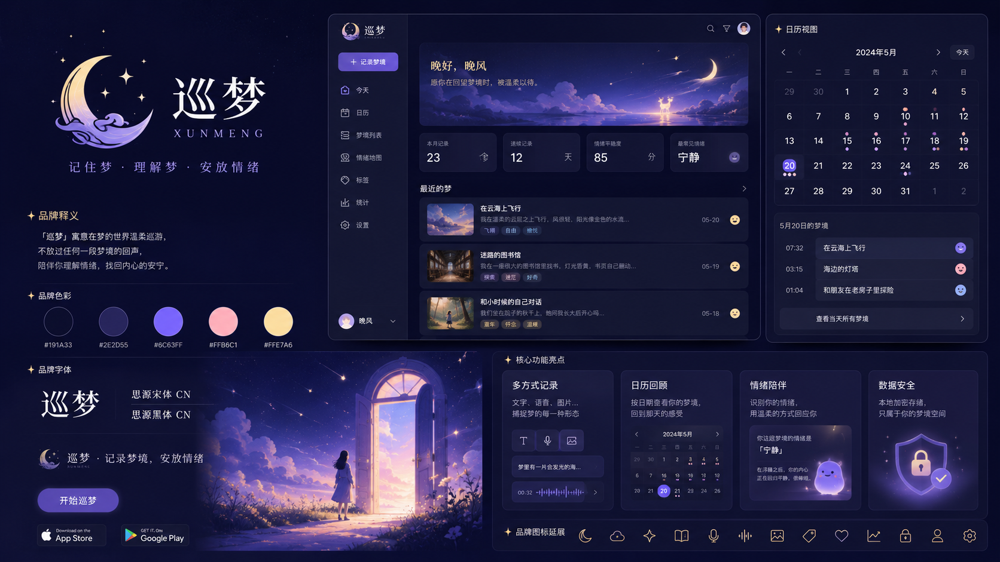

# DreamPatrol — 巡梦 (Dreamwave)

<div align="center">


**🌙 记录梦境 · 洞察情绪**

[](Dreamwave/LICENSE)

</div>

---

## 品牌标识

| 浅色版 Logo | 深色版 Logo | 品牌主视觉 |
|:---:|:---:|:---:|
|  |  |  |

> **品牌主题**：梦境 · 情绪 · 星空。Logo 以"月相 + 梦境波纹"为视觉主体，呼应 Dreamwave（梦境之波）的产品名。

---

## 项目简介

**巡梦（Dreamwave）** 是一款轻量级梦境记录 Web 应用，帮助用户：

- 📝 **记录梦境**：文本录入 + 语音录入（Web Speech API）
- 💭 **标记情绪**：6 种情绪维度（喜悦 / 平静 / 悲伤 / 恐惧 / 奇妙 / 怀念）
- 📅 **日历视图**：月历 + 情绪标记点
- 📊 **情绪洞察**：统计报表 + AI 叙事生成
- 🎵 **沉浸氛围**：白噪音播放 + 情绪主题切换

> 第二期灵治擂台赛参赛作品

---

## 项目结构

```
DreamPatrol/
└── Dreamwave/                # 梦境记录 Web 应用
    ├── docs/                 # 开发文档（计划、进度、资源清单）
    ├── server/               # 后端服务 (Express + sql.js + JWT)
    │   ├── src/
    │   │   ├── db/           # 数据库（sql.js + 版本化迁移）
    │   │   ├── middleware/   # 中间件（认证/审计/错误处理/Token黑名单）
    │   │   ├── routes/       # 路由（auth/dreams/tags/ai/admin）
    │   │   ├── utils/        # 工具（情绪映射/叙事生成）
    │   │   └── __tests__/    # 测试（单元+集成+API测试）
    │   └── data/             # SQLite数据文件
    ├── web/                  # 用户前端 (React + TypeScript + Vite)
    │   ├── src/
    │   │   ├── pages/        # 页面（Home/NewDream/Detail/Calendar/Stats/Settings/Roaming）
    │   │   ├── components/   # 组件（DreamCard/EmotionPicker/TagPicker/SearchBar/WhiteNoise等）
    │   │   ├── hooks/        # Hooks（useEmotionTheme/useFireflyParticles/useMeteors/useStarTrail）
    │   │   └── services/     # API封装
    │   └── public/assets/    # 资源（18张情绪背景图/6种情绪图标/3种白噪音）
    ├── admin/                # 后台管理 (React + Ant Design + Vite)
    │   └── src/
    │       ├── pages/        # 页面（Dashboard/DreamManage/UserManage/AIConfig/AICallLogs/OperationLogs）
    │       └── components/   # 组件（Layout）
    ├── 参考页面/             # 早期静态参考页面与设计稿
    ├── docker-compose.yml
    ├── LICENSE
    └── README.md
```

---

## 快速启动

### 方式一：本地开发

```bash
# 1. 启动后端
cd Dreamwave/server
npm install
cp .env.example .env
npm run dev
# 服务运行在 http://localhost:3100

# 2. 启动用户前端
cd ../web
npm install
npm run dev
# 前端运行在 http://localhost:5173

# 3. 启动后台管理
cd ../admin
npm install
npm run dev
# 管理端运行在 http://localhost:5174
```

默认管理员账户：`admin` / `admin123`

### 方式二：Docker Compose 一键部署

```bash
cd Dreamwave
docker compose up -d
```

服务端口：

| 服务 | 端口 | 访问地址 |
|------|------|----------|
| 用户端 | 80 | http://localhost |
| 管理端 | 5174 | http://localhost:5174 |
| API | 3100 | http://localhost:3100 |

### 服务状态

| 服务 | 名称 | 端口 | 状态 |
|------|------|------|------|
| server (后端API) | dreamwave-server | 3100 | healthy |
| web (用户前端) | dreamwave-web | 8080 | running |
| admin (管理后台) | dreamwave-admin | 5174 | running |

### 远程测试地址

| 服务 | 地址 |
|------|------|
| 用户前端 | `http://114.55.129.88:8080` |
| 管理后台 | `http://114.55.129.88:5174` |
| API 健康检查 | `http://114.55.129.88:3100/api/health` |

### 测试账号密码

| 类型 | 用户名 | 密码 |
|------|--------|------|
| 管理员 | `admin` | `admin123` |

> 默认管理员账户：`admin` / `admin123`

---

## 功能清单

### 用户前端（web/）

- 📝 **梦境记录**：文本录入 + 语音录入（Web Speech API）
- 💭 **情绪标记**：6 种情绪维度（喜悦 / 平静 / 悲伤 / 恐惧 / 奇妙 / 怀念）
- 🗂️ **标签系统**：自定义标签 + 梦境关联 + 标签筛选
- 🔍 **搜索功能**：关键字搜索 + 情绪/标签/收藏组合筛选
- 📅 **日历视图**：月历 + 情绪标记点 + 日期筛选
- 📊 **情绪统计**：个人情绪趋势图 + 梦境频率统计 + 标签统计
- 🔖 **收藏功能**：收藏/取消收藏重要梦境
- 📤 **导出功能**：梦境导出为 Markdown/TXT/JSON
- 🎵 **沉浸氛围**：白噪音播放（雨声 / 夏夜 / 林风）+ 情绪主题背景
- ✨ **沉浸式动效**：流星 / 星空 / 萤火虫 / 星云动画
- 🌙 **暗色模式**：亮/暗主题切换
- 🔄 **梦境关联**：基于情绪/标签的相关梦境推荐
- 🔐 **用户管理**：注册 / 登录 / 修改密码 / Token 刷新

### 后台管理（admin/）

- 📈 **数据概览**：梦境数 / 用户数 / 情绪分布统计 + 趋势图表
- 💭 **梦境管理**：查看所有梦境 + 搜索 + 删除 + 详情弹窗
- 👥 **用户管理**：用户列表 + 分页搜索 + 启用/禁用
- 🤖 **AI 配置**：AI 模型参数配置
- 📋 **AI 调用日志**：AI 解读调用记录与统计
- 📝 **操作日志审计**：管理员操作记录
- ⚙️ **系统设置**：基础配置管理

---

## 技术栈

| 层次 | 技术 |
|------|------|
| 后端 | Node.js + Express + TypeScript + sql.js + JWT + Zod |
| 用户前端 | React 18 + TypeScript + Vite + CSS Modules |
| 管理前端 | React 18 + Ant Design 5 + Vite + Ant Design Charts |
| 数据库 | SQLite（sql.js 纯 JS 实现） |
| 鉴权 | JWT + bcryptjs + Token 黑名单 |
| 安全 | Helmet + express-rate-limit + CORS |
| 部署 | Docker + Docker Compose + Nginx |
| 测试 | Vitest + Testing Library |

---

## 情绪主题色

| 喜悦 😊 | 平静 🌊 | 悲伤 🌧 | 恐惧 ⚡ | 奇妙 ✨ | 怀念 🍂 |
|:---:|:---:|:---:|:---:|:---:|:---:|
| `bg_joy` | `bg_calm` | `bg_sadness` | `bg_fear` | `bg_wonder` | `bg_nostalgia` |

6 种情绪主题对应 3 张备选背景图（共 18 张），按用户情绪自动切换主视觉，营造沉浸式梦境记录体验。

---

## API 概览

| 路径 | 方法 | 说明 | 鉴权 |
|------|------|------|------|
| `/api/auth/register` | POST | 用户注册 | 否 |
| `/api/auth/login` | POST | 用户登录 | 否 |
| `/api/auth/logout` | POST | 用户登出（Token 加入黑名单） | 是 |
| `/api/dreams` | GET | 梦境列表（分页 / 筛选） | 是 |
| `/api/dreams` | POST | 创建梦境 | 是 |
| `/api/dreams/:id` | GET | 梦境详情 | 是 |
| `/api/dreams/:id` | PUT | 更新梦境 | 是 |
| `/api/dreams/:id` | DELETE | 删除梦境 | 是 |
| `/api/tags` | GET | 标签列表 | 是 |
| `/api/ai/interpret` | POST | AI 梦境解读 | 是 |
| `/api/admin/stats` | GET | 管理统计 | 管理员 |
| `/api/admin/users` | GET | 用户列表 | 管理员 |
| `/api/admin/dreams` | GET | 全部梦境 | 管理员 |
| `/api/admin/ai-config` | GET / PUT | AI 配置 | 管理员 |
| `/api/admin/ai-logs` | GET | AI 调用日志 | 管理员 |
| `/api/admin/operation-logs` | GET | 操作日志 | 管理员 |
| `/api/health` | GET | 健康检查 | 否 |

---

## 设计思路

### 产品理念

**巡梦（Dreamwave）** 的核心命题是：**帮助用户记录、管理梦境，并沉浸式承接用户的情绪。**

梦境是人类潜意识的窗口，记录梦境不仅是留住记忆，更是自我探索的过程。我们希望通过以下设计理念，打造一个温暖、沉浸式的梦境记录体验：

- **情绪优先**：梦境本身带有强烈的情绪色彩，6种情绪维度（喜悦、平静、悲伤、恐惧、奇妙、怀念）帮助用户标记和追溯情绪变化
- **沉浸式体验**：白噪音、星空动效、情绪主题背景，营造适合记录梦境的氛围
- **AI赋能**：基于梦境内容生成连贯叙事短文，帮助用户更好地理解和表达梦境
- **隐私保护**：本地数据库存储，用户数据完全自主可控

### 架构设计

采用 **前后端分离 + 微服务化** 架构，三个独立服务协同工作：

```
┌─────────────────────────────────────────────────────────────┐
│                        用户端 (Web)                         │
│  React 18 + TypeScript + Vite + CSS Modules                │
│  - 梦境记录/查看/编辑                                       │
│  - 情绪标记/主题切换                                        │
│  - 日历视图/统计报表                                        │
│  - 白噪音/沉浸式动效                                        │
└───────────────────────────┬─────────────────────────────────┘
                            │ HTTP (REST API)
┌───────────────────────────▼─────────────────────────────────┐
│                       后端服务 (Server)                     │
│  Node.js + Express + TypeScript + sql.js + JWT + Zod       │
│  - 用户认证 (JWT)                                           │
│  - 梦境CRUD + 搜索 + 统计                                   │
│  - AI叙事生成                                               │
│  - 数据持久化 (SQLite)                                      │
│  - 安全加固 (Helmet + Rate Limit + CORS)                    │
└───────────────────────────┬─────────────────────────────────┘
                            │ HTTP (REST API)
┌───────────────────────────▼─────────────────────────────────┐
│                      管理后台 (Admin)                       │
│  React 18 + Ant Design 5 + Vite + Ant Design Charts        │
│  - 数据概览/趋势图表                                        │
│  - 梦境管理/用户管理                                        │
│  - AI配置/操作日志                                          │
└─────────────────────────────────────────────────────────────┘
```

### 技术选型理由

| 技术 | 选型理由 |
|------|---------|
| **sql.js** | 纯JS实现的SQLite，零配置嵌入式数据库，单文件部署，无需native编译 |
| **JWT + bcryptjs** | 无状态认证，安全密码哈希，Token黑名单机制实现登出 |
| **Zod** | 运行时类型校验，前后端类型共享，统一错误处理 |
| **React + TypeScript** | 生态成熟，类型安全，AI生成代码质量高 |
| **Vite** | 秒级HMR，快速构建，现代前端工具链 |
| **CSS Modules** | 零运行时，作用域隔离，配合CSS变量实现主题系统 |
| **Ant Design** | 企业级后台组件丰富，数据可视化能力强 |

### 数据库设计

```
┌──────────────┐       ┌──────────────────┐       ┌──────────────┐
│    users     │       │     dreams       │       │    tags      │
├──────────────┤       ├──────────────────┤       ├──────────────┤
│ id (PK)      │──1:N──│ id (PK)          │──N:M──│ id (PK)      │
│ username     │       │ user_id (FK)     │       │ user_id (FK) │
│ password_hash│       │ title            │       │ name         │
│ created_at   │       │ content          │       │ color        │
│ updated_at   │       │ emotion          │       │ created_at   │
│ is_active    │       │ narrative        │       └──────────────┘
└──────────────┘       │ recorded_date    │              │
                       │ is_favorite      │              │
                       │ created_at       │       ┌──────────────────┐
                       │ updated_at       │       │  dream_tags      │
                       └──────────────────┘       ├──────────────────┤
                                                   │ dream_id (FK)    │
                                                   │ tag_id (FK)      │
                                                   └──────────────────┘
```

核心设计要点：
- **用户数据隔离**：所有梦境查询都通过 `user_id` 过滤，确保数据隐私
- **情绪索引**：`emotion` 字段建立索引，支持快速情绪筛选
- **日期索引**：`recorded_date` 字段建立索引，支持日历视图高效查询
- **软删除设计**：通过 `is_active` 字段实现用户禁用，保留审计线索

### 情绪系统设计

6种情绪维度的设计来源于心理学情绪理论，覆盖人类梦境中常见的情绪体验：

| 情绪 | 英文 | 主色 | 视觉氛围 | 关键词示例 |
|------|------|------|---------|-----------|
| 喜悦 | joy | #F0A050 | 暖橙渐变 | 开心、快乐、兴奋、幸福 |
| 平静 | calm | #7EB8DA | 月蓝渐变 | 宁静、安详、平和、放松 |
| 悲伤 | sadness | #7B6FDE | 紫灰渐变 | 难过、失落、沮丧、哭泣 |
| 恐惧 | fear | #7A7A8C | 灰雾渐变 | 害怕、恐惧、紧张、焦虑 |
| 奇妙 | wonder | #D070E0 | 紫粉渐变 | 神奇、奇幻、惊喜、不可思议 |
| 怀念 | nostalgia | #F09070 | 暖红渐变 | 回忆、思念、感伤、温馨 |

**设计细节**：
- 每种情绪对应 **3张备选背景图**（共18张），按用户情绪自动切换主视觉
- CSS Design Tokens 体系：47个CSS变量涵盖色彩、间距、字体、动画等
- 情绪主题联动：选择情绪后，页面整体色调、背景、动效同步变化

### 用户体验设计

**沉浸式动效系统**：
- 🌠 **流星动效**：首页背景随机流星划过
- 🌟 **星空背景**：动态星星闪烁
- ✨ **萤火虫**：详情页漂浮光点
- 🎵 **白噪音**：雨声 / 夏夜 / 林风三种环境音

**交互设计原则**：
- 语音录入：支持 Web Speech API，快速记录梦境
- 即时反馈：操作成功/失败给出明确的视觉反馈
- 渐进式加载：列表、详情采用骨架屏过渡
- 响应式设计：适配桌面端和移动端

---

## 资源版权

所有图片、音频资源版权说明见 [Dreamwave/web/public/assets/资源清单与版权说明.md](Dreamwave/web/public/assets/资源清单与版权说明.md)

---

## 许可证

MIT License — 详见 [Dreamwave/LICENSE](Dreamwave/LICENSE)

---

## 致谢

- 第二期灵治擂台赛参赛作品
- 灵感来源于梦境记录与情绪健康追踪
